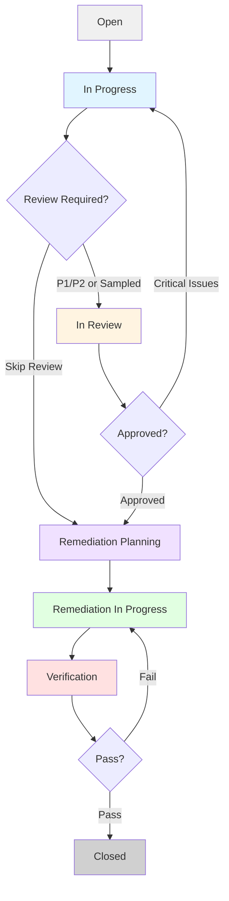

# BMAD-1898 JIRA Workflow Standards

## Overview

This document defines the JIRA workflow configuration required for BMAD-1898 Engineering expansion pack vulnerability lifecycle management. These standards ensure consistent vulnerability tracking from detection through closure.

## Required JIRA Statuses

The following JIRA statuses must be configured in your JIRA project to support the complete vulnerability lifecycle workflow (Epic 3, Story 3.3).

| Status Name              | Stage              | Description                                         | SLA Tracking |
| ------------------------ | ------------------ | --------------------------------------------------- | ------------ |
| Open                     | Detection          | Initial vulnerability alert from scanner or feed    | Start        |
| In Progress              | Enrichment         | Security Analyst performing enrichment              | Yes          |
| In Review                | Quality Assurance  | Security Reviewer performing peer review            | Yes          |
| Remediation Planning     | Planning           | DevOps team planning patch deployment               | Yes          |
| Remediation In Progress  | Execution          | Patches/workarounds being deployed                  | Yes          |
| Verification             | Verification       | Verifying vulnerability successfully remediated     | Yes          |
| Closed                   | Closure            | Vulnerability lifecycle complete                    | End          |

## Status Transition Rules

The following status transitions define the vulnerability lifecycle workflow. All transitions must be configured in JIRA to enable proper workflow execution.

### Forward Transitions

| From Status              | To Status                | Trigger                                             | Automation |
| ------------------------ | ------------------------ | --------------------------------------------------- | ---------- |
| Open                     | In Progress              | Analyst starts enrichment                           | Manual     |
| In Progress              | In Review                | Enrichment complete, P1/P2 or sampled P3/P4/P5      | Automated  |
| In Progress              | Remediation Planning     | Enrichment complete, P3/P4/P5 review not required   | Automated  |
| In Review                | Remediation Planning     | Review approved                                     | Manual     |
| Remediation Planning     | Remediation In Progress  | Remediation plan approved, execution starts         | Manual     |
| Remediation In Progress  | Verification             | Remediation deployment complete                     | Manual     |
| Verification             | Closed                   | Vulnerability verified remediated                   | Manual     |

### Reverse Transitions (Rework Loops)

| From Status              | To Status                | Trigger                                             | Automation |
| ------------------------ | ------------------------ | --------------------------------------------------- | ---------- |
| In Review                | In Progress              | Review identifies Critical Issues                   | Manual     |
| Verification             | Remediation In Progress  | Verification failed, vulnerability still exploitable| Manual     |

## Required Custom Fields

The following custom fields must be created in JIRA to support enrichment data capture and reporting.

| Field Name         | Type          | Description                                  | Required | Source        |
| ------------------ | ------------- | -------------------------------------------- | -------- | ------------- |
| CVE ID             | Text          | CVE identifier (e.g., CVE-2024-1234)         | Yes      | User input    |
| CVSS Score         | Number        | CVSS base score (0.0-10.0)                   | Yes      | AI research   |
| CVSS Vector        | Text          | CVSS vector string                           | No       | AI research   |
| EPSS Score         | Number        | EPSS exploitation probability (0.0-1.0)      | Yes      | AI research   |
| KEV Status         | Single Select | CISA KEV status (Yes/No)                     | Yes      | AI research   |
| Priority Level     | Single Select | Priority (P1/P2/P3/P4/P5)                    | Yes      | Priority calc |
| Affected Systems   | Labels/Text   | List of affected systems                     | Yes      | User input    |
| ACR Rating         | Single Select | Asset Criticality (Critical/High/Medium/Low) | Yes      | Config        |
| System Exposure    | Single Select | Exposure (Internet/Internal/Isolated)        | No       | User input    |
| Review Status      | Single Select | Review status (Pending/Approved/Needs Revision) | No    | Review agent  |
| Quality Score      | Number        | Review quality score (0-100)                 | No       | Review agent  |
| Enrichment Date    | Date          | Date enrichment completed                    | No       | Automation    |
| SLA Deadline       | Date          | Remediation deadline based on priority       | No       | Priority calc |

### Custom Field Configuration Notes

1. **Single Select Fields**: Create with exact values specified above (case-sensitive)
2. **Number Fields**: Configure with appropriate decimal precision (CVSS: 1 decimal, EPSS: 3 decimals)
3. **Labels vs. Text**: Use Labels for Affected Systems if multi-value selection needed, Text if comma-separated string acceptable
4. **Field IDs**: Document custom field IDs in `config.yaml` for MCP integration

## JIRA Status Mapping to Lifecycle Stages

The vulnerability lifecycle workflow (Story 3.3) maps to JIRA statuses as follows:

```yaml
lifecycle_stages:
  stage1_detection:
    jira_status: 'Open'
    description: 'Vulnerability scanner or feed alerts security team'

  stage2_enrichment:
    jira_status: 'In Progress'
    description: 'Security Analyst enriches ticket with comprehensive analysis'
    workflow: 'security-alert-enrichment-workflow.yaml (Story 3.1)'

  stage3_review:
    jira_status: 'In Review'
    description: 'Peer review validates enrichment quality'
    workflow: 'security-analysis-review-workflow.yaml (Story 3.2)'
    optional: 'Mandatory for P1/P2, sampling for P3/P4/P5 (Story 3.4)'

  stage4_remediation_planning:
    jira_status: 'Remediation Planning'
    description: 'DevOps/Engineering team plans patch deployment'

  stage5_remediation_execution:
    jira_status: 'Remediation In Progress'
    description: 'Deploy patches/workarounds to affected systems'

  stage6_verification:
    jira_status: 'Verification'
    description: 'Verify vulnerability successfully remediated'

  stage7_closure:
    jira_status: 'Closed'
    description: 'Close ticket and capture lessons learned'
```

## Metrics Captured per Stage

The following metrics are captured at each lifecycle stage and logged to `metrics/enrichment-metrics.csv`.

### Detection Stage Metrics
- `detection_timestamp` - When vulnerability first detected

### Enrichment Stage Metrics
- `enrichment_start_timestamp` - Analyst begins enrichment
- `enrichment_completion_timestamp` - Enrichment posted to JIRA
- `enrichment_duration_minutes` - Time spent on enrichment
- `enrichment_quality_score` - Self-assessed quality (optional)

### Review Stage Metrics (if review performed)
- `review_start_timestamp` - Reviewer begins review
- `review_completion_timestamp` - Review report posted
- `review_duration_minutes` - Time spent on review
- `review_quality_score` - Overall quality score (0-100)
- `gaps_found_critical` - Count of Critical gaps
- `gaps_found_significant` - Count of Significant gaps
- `gaps_found_minor` - Count of Minor gaps
- `review_decision` - Approved/Needs Revision

### Remediation Planning Metrics
- `remediation_planning_start` - Planning begins
- `remediation_planning_completion` - Plan approved

### Remediation Execution Metrics
- `remediation_execution_start` - Deployment begins
- `remediation_execution_completion` - Deployment complete

### Verification Metrics
- `verification_timestamp` - Verification performed
- `verification_status` - Pass/Fail

### Closure Metrics
- `closure_timestamp` - Ticket closed
- `total_lifecycle_duration_hours` - Detection to Closure
- `mttr_hours` - Mean Time To Remediate (Detection to Remediation Complete)

## Audit Trail Requirements

All vulnerability lifecycle activities must maintain complete audit trail:

1. **JIRA Comments Preserved**: All enrichment, review, and status change comments retained
2. **Enrichment Artifacts**: Saved to `expansion-packs/bmad-1898-engineering/enrichments/{ticket-id}-enrichment.md`
3. **Review Reports**: Saved to `expansion-packs/bmad-1898-engineering/reviews/{ticket-id}-review.md`
4. **Metrics Logging**: All stage metrics logged to `metrics/enrichment-metrics.csv`
5. **Timestamps**: All stage transitions timestamped in JIRA history
6. **Attribution**: Analyst/reviewer names recorded in JIRA assignee/comments
7. **Sampling Decisions**: Review sampling decisions logged to `metrics/review-decisions.csv`

## SLA Definitions

Priority-based SLAs drive remediation timelines:

| Priority | Severity | EPSS    | KEV | SLA Remediation Deadline |
| -------- | -------- | ------- | --- | ------------------------ |
| P1       | Critical | High    | Yes | 24 hours                 |
| P2       | High     | Medium+ | Any | 72 hours (3 days)        |
| P3       | Medium   | Any     | No  | 7 days                   |
| P4       | Low      | Low     | No  | 30 days                  |
| P5       | Info     | Very Low| No  | 90 days                  |

**Source:** Epic 1 Story 1.7 Multi-Factor Priority Assessment

## JIRA Workflow Diagram



## Integration with Atlassian MCP

BMAD-1898 uses Atlassian MCP server to interact with JIRA. Configure the following in your environment:

### Required MCP Tools
- `mcp__atlassian__getJiraIssue` - Read ticket data
- `mcp__atlassian__addCommentToJiraIssue` - Post enrichment/review comments
- `mcp__atlassian__updateJiraIssue` - Update custom fields
- `mcp__atlassian__transitionJiraIssue` - Change status

### Configuration in config.yaml

```yaml
jira:
  cloud_id: "your-cloud-id-here"
  project_key: "SEC"  # Or your security project key

  custom_fields:
    cve_id: "customfield_10001"
    cvss_score: "customfield_10002"
    epss_score: "customfield_10003"
    kev_status: "customfield_10004"
    priority_level: "customfield_10005"
    affected_systems: "customfield_10006"
    acr_rating: "customfield_10007"
    review_status: "customfield_10008"
    quality_score: "customfield_10009"

  workflow_statuses:
    open: "Open"
    in_progress: "In Progress"
    in_review: "In Review"
    remediation_planning: "Remediation Planning"
    remediation_in_progress: "Remediation In Progress"
    verification: "Verification"
    closed: "Closed"
```

## Validation Checklist

Before deploying BMAD-1898 workflows, validate JIRA configuration:

- [ ] All 7 required statuses exist in JIRA project
- [ ] All status transitions configured (9 forward + 2 reverse)
- [ ] All required custom fields created
- [ ] Custom field IDs documented in config.yaml
- [ ] JIRA Cloud ID configured in config.yaml
- [ ] Atlassian MCP server installed and authenticated
- [ ] Test ticket created and workflow executed end-to-end
- [ ] Metrics directory exists: `expansion-packs/bmad-1898-engineering/metrics/`
- [ ] Enrichment directory exists: `expansion-packs/bmad-1898-engineering/enrichments/`
- [ ] Review directory exists: `expansion-packs/bmad-1898-engineering/reviews/`

## References

- Epic 3: Workflow Integration and Orchestration (parent epic for workflow standards)
- Story 3.3: Vulnerability Lifecycle Workflow (implements these JIRA workflow standards)
- Story 3.1: Security Alert Enrichment Workflow (Enrichment stage)
- Story 3.2: Security Analysis Review Workflow (Review stage)
- Story 3.4: Priority-Based Review Triggering (Review decision logic)
- Epic 1 Story 1.7: Multi-Factor Priority Assessment (SLA definitions)

## Change Log

| Date       | Version | Description                                  | Author     |
| ---------- | ------- | -------------------------------------------- | ---------- |
| 2025-11-08 | 1.0     | Initial JIRA workflow standards document     | Sarah (PO) |
