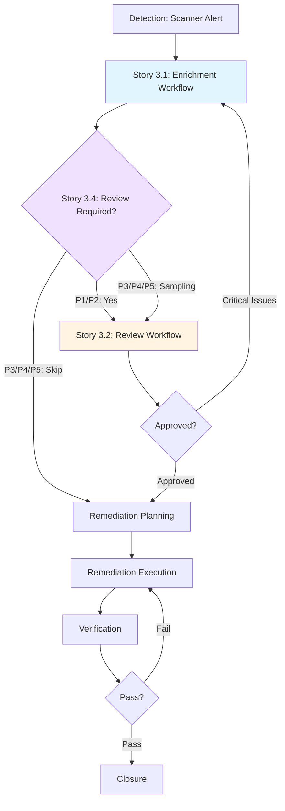

# Epic 3: Workflow Integration and Orchestration

## Epic Goal

Create comprehensive workflow orchestration that integrates Security Analyst enrichment (Epic 1) and Security Reviewer QA (Epic 2) into seamless, end-to-end processes with priority-based automation, complete lifecycle tracking, and metrics capture for continuous improvement.

## Background

BMAD-1898 Engineering expansion pack provides AI-assisted security vulnerability management through specialized agents (Security Analyst from Epic 1, Security Reviewer from Epic 2). While these agents provide powerful capabilities, they require workflow orchestration to:

1. **End-to-End Enrichment Workflow** - Systematic 8-stage enrichment process (Triage → Research → Business Context → Remediation → ATT&CK → Priority → Documentation → JIRA Update) completing in 10-15 minutes
2. **Systematic Review Workflow** - 7-stage peer review process (Preparation → Evaluation → Gap Identification → Bias Detection → Fact Verification → Documentation → Feedback Loop) completing in 15-20 minutes
3. **Complete Lifecycle Management** - Full vulnerability lifecycle tracking from Detection through Closure with metrics capture and audit trails
4. **Intelligent Review Triggering** - Priority-based automation (100% mandatory review for P1/P2, statistical sampling for P3/P4/P5) optimizing QA resource allocation

These orchestrated workflows enable:

- 90% faster enrichment (10-15 min vs. 90-120 min manual)
- 70% faster review (15-20 min vs. 30-45 min manual)
- 100% coverage for critical vulnerabilities with optimized sampling for lower priorities
- Complete audit trails and metrics for process improvement
- Seamless integration with existing JIRA workflows

## Integration Context

**Security Analyst Agent** (Epic 1) integrated via:

- Story 3.1 orchestrates all Epic 1 capabilities into 8-stage enrichment workflow
- Story 3.3 embeds enrichment as Stage 2 of complete vulnerability lifecycle
- Multi-factor priority assessment (Story 1.7) drives review triggering logic (Story 3.4)

**Security Reviewer Agent** (Epic 2) integrated via:

- Story 3.2 orchestrates all Epic 2 capabilities into 7-stage review workflow
- Story 3.3 embeds review as Stage 3 of complete vulnerability lifecycle
- Story 3.4 implements priority-based triggering of review workflows

**Knowledge Base** (Epic 4) supports workflows via:

- Vulnerability management frameworks inform enrichment and review standards
- Cognitive bias patterns guide review workflow bias detection stage
- MITRE ATT&CK mapping guide supports enrichment workflow Stage 5

**External System Integration:**

- **JIRA Cloud (Atlassian MCP)**: Ticket retrieval, status transitions, comment posting, custom field updates
- **Perplexity MCP**: CVE research (enrichment), fact verification (review)
- **Local File System**: Enrichment/review artifact storage, metrics logging, audit trails

## Stories

### Story 3.1: Security Alert Enrichment Workflow

**As a** security operations team,
**I want** a complete end-to-end enrichment workflow,
**so that** enrichment is consistent and comprehensive.

**Acceptance Criteria:**

1. Workflow includes all stages: Triage → Research → Business Context → Remediation → ATT&CK → Priority → Documentation → Validation
2. Each stage has clear inputs/outputs
3. Workflow takes 10-15 minutes with AI assistance
4. Workflow produces enriched JIRA ticket

**Integration Requirements:**

- Security Analyst agent executes workflow
- Perplexity MCP for CVE research (Stage 2)
- Atlassian MCP for JIRA operations (Stages 1, 8)
- security-enrichment-tmpl.yaml for documentation (Stage 7)
- Multi-factor priority assessment from Story 1.7 (Stage 6)

**Status:** Draft

---

### Story 3.2: Security Analysis Review Workflow

**As a** security operations team,
**I want** a systematic peer review workflow,
**so that** quality assurance is thorough and consistent.

**Acceptance Criteria:**

1. Workflow includes: Preparation → Evaluation → Gap Identification → Bias Detection → (Optional) Fact Verification → Documentation → Feedback Loop
2. Workflow takes 15-20 minutes
3. Workflow produces review report in JIRA
4. Workflow triggers analyst improvements

**Integration Requirements:**

- Security Reviewer agent executes workflow
- 8 quality dimension checklists (Story 2.2) for evaluation stage
- Perplexity MCP for optional fact verification (Stage 5)
- Atlassian MCP for review posting (Stage 7)
- security-review-report-tmpl.yaml for documentation (Stage 6)
- Priority-based triggering from Story 3.4

**Status:** Draft

---

### Story 3.3: Vulnerability Lifecycle Workflow

**As a** security operations team,
**I want** complete lifecycle tracking from alert to closure,
**so that** vulnerabilities are systematically managed.

**Acceptance Criteria:**

1. Workflow stages: Detection → Enrichment → Review → Remediation Planning → Execution → Verification → Closure
2. Integration with existing ticketing workflows
3. Metrics captured at each stage
4. Audit trail maintained

**Integration Requirements:**

- Embeds Story 3.1 workflow (Enrichment stage)
- Embeds Story 3.2 workflow (Review stage)
- Uses Story 3.4 triggering logic (Review decision)
- JIRA status transitions mapped to workflow stages
- Metrics logging and audit trail capture

**Status:** Draft

---

### Story 3.4: Priority-Based Review Triggering

**As a** security operations team,
**I want** mandatory review for Critical/High vulnerabilities and sampling for Medium/Low,
**so that** QA resources focus on highest-risk tickets.

**Acceptance Criteria:**

1. P1/P2 vulnerabilities trigger mandatory review
2. P3 vulnerabilities: 25% sampling review
3. P4 vulnerabilities: 10% sampling review
4. P5 vulnerabilities: 5% sampling review
5. Review assignment configurable

**Integration Requirements:**

- Triggered after Story 3.1 enrichment completes
- Determines whether Story 3.2 review workflow executes
- Integrated into Story 3.3 lifecycle workflow (Stage 2 → Stage 3 decision)
- Reviewer assignment rules configured in config.yaml
- Sampling statistics tracked for process improvement

**Status:** Draft

---

## Success Criteria

1. **Workflow Efficiency:**
   - Enrichment workflow completes in <15 minutes (90% of cases)
   - Review workflow completes in <20 minutes (90% of cases)
   - Total time from alert to enrichment+review: <35 minutes for P1/P2

2. **Quality Assurance Coverage:**
   - 100% of P1 (Critical) tickets reviewed
   - 100% of P2 (High) tickets reviewed
   - P3/P4/P5 sampling rates meet targets (±5%)

3. **Process Completeness:**
   - 100% of enrichments include all 12 required sections
   - 100% of reviews evaluate all 8 quality dimensions
   - 100% of tickets have complete audit trails

4. **Integration Reliability:**
   - 95%+ success rate for JIRA operations (ticket read/update)
   - 90%+ success rate for Perplexity research queries
   - <1% data loss on artifact storage

5. **Metrics and Improvement:**
   - All workflow stages capture duration metrics
   - Quality scores tracked for trending analysis
   - Review findings drive analyst training and process improvements

## Technical Implementation

### File Locations

**Workflows:**

- `expansion-packs/bmad-1898-engineering/workflows/security-alert-enrichment-workflow.yaml` (Story 3.1)
- `expansion-packs/bmad-1898-engineering/workflows/security-analysis-review-workflow.yaml` (Story 3.2)
- `expansion-packs/bmad-1898-engineering/workflows/vulnerability-lifecycle-workflow.yaml` (Story 3.3)

**Tasks:**

- `expansion-packs/bmad-1898-engineering/tasks/enrich-security-ticket.md` (Story 3.1 orchestration)
- `expansion-packs/bmad-1898-engineering/tasks/review-security-enrichment.md` (Story 3.2 orchestration)

**Configuration:**

- `expansion-packs/bmad-1898-engineering/config.yaml` (Story 3.4 review triggering rules, reviewer assignment)

**Metrics and Audit:**

- `expansion-packs/bmad-1898-engineering/metrics/enrichment-metrics.csv` (workflow duration, quality scores)
- `expansion-packs/bmad-1898-engineering/metrics/review-decisions.csv` (Story 3.4 sampling statistics)
- `expansion-packs/bmad-1898-engineering/artifacts/` (enrichment/review document storage)

### Testing Standards

**Test Location:** `expansion-packs/bmad-1898-engineering/tests/workflows/`

**Integration Testing:**

- End-to-end enrichment workflow (Story 3.1) with real JIRA ticket
- End-to-end review workflow (Story 3.2) with real enrichment
- Complete lifecycle workflow (Story 3.3) from Detection to Closure
- Priority-based triggering (Story 3.4) with statistical validation

**Performance Testing:**

- Enrichment workflow completes in 10-15 minutes (95th percentile)
- Review workflow completes in 15-20 minutes (95th percentile)
- No workflow stage failures due to timeout or resource constraints

**Quality Testing:**

- All enrichments pass template completeness validation
- All reviews execute all 8 quality dimension checklists
- Sampling rates match configured targets (±5% tolerance)

### MCP Dependencies

**Atlassian MCP Server** (Required for Stories 3.1, 3.2, 3.3):

- Purpose: JIRA ticket operations (read, update, comment, status transitions)
- Configuration: Must be enabled in Claude Code MCP settings
- Error Handling: Workflow halts if unavailable, prompts user to configure

**Perplexity MCP Server** (Required for Story 3.1, Optional for Story 3.2):

- Purpose: CVE research (enrichment), fact verification (review)
- Configuration: Must be enabled in Claude Code MCP settings
- Error Handling: Story 3.1 falls back to manual research, Story 3.2 skips fact verification

## Workflow Architecture

### High-Level Integration

### Story Dependencies

**Linear Dependencies:**
- Story 3.1 → Story 3.4 → Story 3.2 → Story 3.3

**Rationale:**
1. **Story 3.1 first**: Defines enrichment workflow that produces the artifact to be reviewed
2. **Story 3.4 second**: Defines triggering logic that determines when Story 3.2 executes
3. **Story 3.2 third**: Defines review workflow triggered by Story 3.4
4. **Story 3.3 last**: Integrates all previous stories into complete lifecycle

**Parallel Development Possible:**
- Stories 3.1 and 3.2 can be developed in parallel (different agents, workflows)
- Story 3.4 can be developed in parallel with 3.1/3.2 (configuration-focused)
- Story 3.3 requires completion of 3.1, 3.2, 3.4 for full integration

## Change Log

| Date       | Version | Description                                     | Author     |
| ---------- | ------- | ----------------------------------------------- | ---------- |
| 2025-11-08 | 1.0     | Initial Epic 3 creation based on Stories 3.1-3.4 | Sarah (PO) |

## References

- Epic 1: Security Analyst Enrichment System (provides enrichment capabilities orchestrated by Story 3.1)
- Epic 2: Security Review Quality Assurance System (provides review capabilities orchestrated by Story 3.2)
- Epic 4: Knowledge Base Integration (provides reference materials for workflows)
- Story 1.7: Multi-Factor Priority Assessment (priority calculation drives Story 3.4 triggering logic)
- Story 2.2: Systematic Quality Evaluation (8 checklists executed in Story 3.2 workflow)
