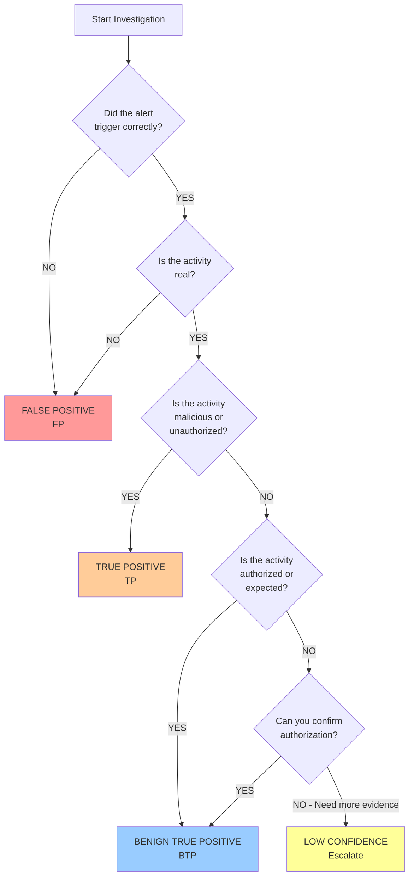
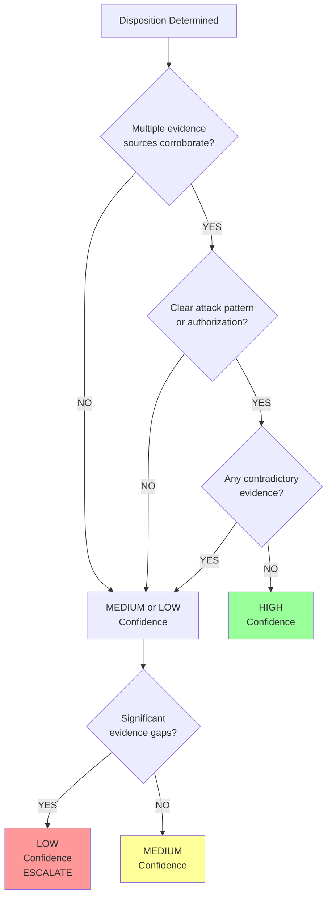

# Disposition Decision Tree
**Visual Guide for Determining TP / FP / BTP**

---

## Primary Decision Tree



---

## Detailed Decision Path

### Path 1: FALSE POSITIVE (FP)

```
Question 1: Did the alert trigger correctly?
├─ NO → Check:
   ├─ Is alert signature accurate? (NO → FP)
   ├─ Does traffic match signature? (NO → FP)
   ├─ Is detection logic correct? (NO → FP)
   └─ Is alert context complete? (NO → FP)
```

**Evidence Required for FP:**
- PCAP shows traffic does NOT match signature
- Alert signature contains errors or misconfigurations
- Detection rule misconfigured
- Traffic is benign and doesn't match threat pattern

**Examples:**
- Alert: "SQL Injection" but traffic is legitimate database query
- Alert: "Malware C2" but DNS query is to legitimate CDN
- Alert: "Port Scan" but traffic is single connection attempt

**Actions:**
- Document root cause (signature error, misconfiguration)
- Recommend tuning (update signature, adjust threshold)
- Close ticket (no escalation)

---

### Path 2: TRUE POSITIVE (TP)

```
Question 1: Did alert trigger correctly?
├─ YES → Continue
   └─ Question 2: Is activity real?
      └─ YES → Continue
         └─ Question 3: Is activity malicious/unauthorized?
            └─ YES → TRUE POSITIVE (TP)
```

**Evidence Required for TP:**
- Attack signatures match known threat patterns
- Unauthorized access or policy violations confirmed
- Malicious intent indicators present:
  - Persistence mechanisms (scheduled tasks, registry keys)
  - Lateral movement attempts
  - Data exfiltration patterns
  - Credential theft indicators
- No authorization or business justification exists

**Examples:**
- Successful SSH brute force from external IP (unauthorized)
- Malware execution confirmed in host logs
- Unauthorized database access with data exfiltration
- Exploit attempt with successful command execution

**Actions:**
- Escalate to Incident Response team (CRITICAL)
- Containment measures:
  - Isolate affected asset
  - Block source IPs at firewall
  - Disable compromised accounts
- Preserve forensic evidence
- Notify stakeholders (CISO, asset owner, management)

---

### Path 3: BENIGN TRUE POSITIVE (BTP)

```
Question 1: Did alert trigger correctly?
├─ YES → Continue
   └─ Question 2: Is activity real?
      └─ YES → Continue
         └─ Question 3: Is activity malicious/unauthorized?
            └─ NO → Continue
               └─ Question 4: Is activity authorized/expected?
                  └─ YES → BENIGN TRUE POSITIVE (BTP)
```

**Evidence Required for BTP:**
- Real activity occurred (not alert error)
- Activity is legitimate business process
- Authorization documented:
  - Change management ticket
  - Vendor access approval
  - Scheduled maintenance window
  - Business owner approval
- Activity matches authorized parameters (time, source, scope)

**Examples:**
- Vulnerability scan from authorized security team
- Vendor remote access during change window (CHG-1234)
- Automated backup process triggering data transfer alert
- Penetration test activity with documented approval

**Actions:**
- Create detection exception:
  - Whitelist authorized source IP
  - Exclude authorized time windows
  - Document authorization reference
- No containment required
- Close ticket after exception created

---

## Confidence Level Decision Tree



---

## Common Scenarios

### Scenario 1: Claroty ICS Alert - Unauthorized Modbus Write

```
Alert: "Unauthorized Modbus Write to PLC"
Source: 192.168.10.50 (Engineering Workstation)
Destination: 10.0.1.10 (PLC-REACTOR-01)

Decision Path:
1. Did alert trigger correctly? → YES (Modbus write observed)
2. Is activity real? → YES (PCAP confirms Modbus function code 0x10)
3. Is activity malicious/unauthorized? → CHECK AUTHORIZATION
   - Change ticket exists? → NO
   - Asset owner approval? → NO
   - Scheduled maintenance? → NO
4. Is activity authorized? → NO

Disposition: TRUE POSITIVE (TP)
Confidence: HIGH
Evidence: No authorization, safety-critical asset, unusual source
Action: ESCALATE IMMEDIATELY (safety concern)
```

### Scenario 2: Snort IDS Alert - SQL Injection Attempt

```
Alert: "ET WEB_SPECIFIC_APPS SQL Injection Attempt"
Source: 203.0.113.45 (External)
Destination: 192.168.50.10 (WEB-APP-01)

Decision Path:
1. Did alert trigger correctly? → CHECK PCAP
   - PCAP analysis: URL contains "SELECT * FROM users WHERE id=1"
   - Context: Legitimate query parameter, not injection syntax
2. Alert signature too broad? → YES

Disposition: FALSE POSITIVE (FP)
Confidence: HIGH
Evidence: PCAP shows benign query, no SQL injection syntax
Action: Recommend signature tuning
```

### Scenario 3: Splunk SIEM Alert - Multiple Failed Logins

```
Alert: "Multiple Failed Login Attempts - Brute Force"
User: svc_backup
Source: 10.20.30.40 (BACKUP-SERVER-01)
Destination: 192.168.100.50 (FILE-SERVER-01)

Decision Path:
1. Did alert trigger correctly? → YES (15 failed logins in 5 min)
2. Is activity real? → YES (Windows Security Event 4625)
3. Is activity malicious/unauthorized? → CHECK CONTEXT
   - User account: Service account (legitimate)
   - Source: Authorized backup server
   - Timeline: Matches scheduled backup (2:00 AM daily)
   - Investigation: Password expired, needs reset
4. Is activity authorized? → YES (legitimate service account)

Disposition: BENIGN TRUE POSITIVE (BTP)
Confidence: MEDIUM (need to verify password issue)
Evidence: Scheduled backup, service account, password expiry
Action: Reset password, create exception for service account
```

---

## Red Flags (Escalate Immediately)

| Red Flag | Why It Matters | Action |
|----------|----------------|--------|
| **Successful exploitation evidence** | Command execution, file creation, persistence | TP → Escalate to IR |
| **Safety-critical ICS asset** | Potential physical harm, environmental damage | TP/BTP → Escalate to OT team |
| **Data exfiltration indicators** | Large outbound transfers, unauthorized database access | TP → Escalate to IR + Legal |
| **Lateral movement** | Compromised system accessing other systems | TP → Escalate to IR (active breach) |
| **Credential theft** | Pass-the-hash, mimikatz, credential dumping | TP → Escalate to IR (critical) |
| **LOW confidence with TP** | Unclear if attack successful | Escalate to Senior Analyst |

---

## Common Mistakes

| Mistake | Correct Approach |
|---------|------------------|
| **Assuming FP because alert is frequent** | Verify each instance independently |
| **Assuming TP because severity is High** | Verify with evidence, not alert metadata |
| **Assuming BTP without verifying authorization** | Always validate change tickets/approvals |
| **Not considering all evidence sources** | Collect from multiple sources before concluding |
| **Rushing to disposition** | Follow decision tree systematically |

---

## Disposition Summary Table

| Disposition | Alert Correct? | Activity Real? | Activity Malicious? | Evidence Required | Actions |
|-------------|----------------|----------------|---------------------|-------------------|---------|
| **FP** | ❌ NO | N/A | N/A | Signature error, PCAP mismatch | Tuning, no escalation |
| **TP** | ✅ YES | ✅ YES | ✅ YES | Attack indicators, no authorization | Escalate, containment |
| **BTP** | ✅ YES | ✅ YES | ❌ NO | Authorization documented | Exception, no containment |

---

**Need Help?** See: `docs/troubleshooting-faq-best-practices.md`
**Training:** See: `docs/training/event-investigation-training.md`
**Deep Dive:** See: `docs/workflows/event-investigation-workflow-deep-dive.md`
