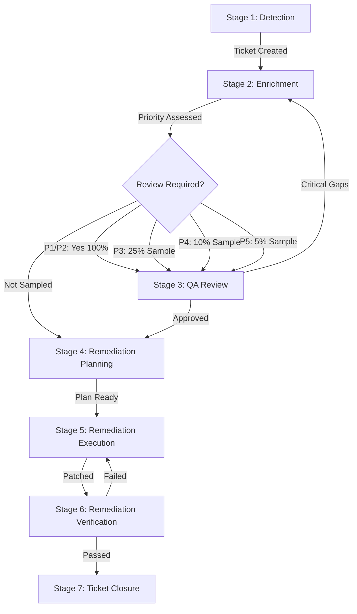

# Story 5.6: Complete Vulnerability Lifecycle Guide

## Status

Draft

## Story

**As a** security operations manager or team member,
**I want** comprehensive documentation of the complete vulnerability lifecycle,
**so that** I understand end-to-end vulnerability management from detection through closure, including all handoffs, workflows, and team responsibilities.

## Acceptance Criteria

1. Documentation covers all 7 lifecycle stages from Detection to Closure
2. JIRA status transitions mapped to lifecycle stages with workflow rules
3. Role responsibilities defined per stage (Analyst, Reviewer, DevOps, Manager)
4. Handoff procedures between teams documented
5. SLA tracking and escalation procedures explained
6. Metrics capture and audit trail requirements documented
7. Complete lifecycle example walkthrough with timing and artifacts

## Tasks / Subtasks

- [ ] Create vulnerability lifecycle guide (AC: 1)
  - [ ] Create `docs/user-guide/vulnerability-lifecycle-guide.md`
  - [ ] Document lifecycle overview with Mermaid diagram
  - [ ] Detail all 7 lifecycle stages
- [ ] Document Stage 1: Detection (AC: 1, 3)
  - [ ] JIRA Status: Open
  - [ ] Trigger: Vulnerability scanner, security feed, manual report
  - [ ] Actions: Create JIRA ticket, assign to security analyst
  - [ ] Responsible: Vulnerability Management Platform or Security Team Lead
  - [ ] Duration: Immediate (automated)
  - [ ] Outputs: JIRA ticket created
- [ ] Document Stage 2: Enrichment (AC: 1, 3)
  - [ ] JIRA Status: In Progress
  - [ ] Trigger: Ticket assigned to analyst
  - [ ] Actions: Run enrichment workflow (Story 3.1 / 5.4)
  - [ ] Responsible: Security Analyst
  - [ ] Duration: 10-15 minutes
  - [ ] Outputs: Enriched ticket, JIRA comment, custom fields, priority assigned
  - [ ] SLA Start: Detection timestamp
- [ ] Document Stage 3: Quality Assurance Review (AC: 1, 3, 4)
  - [ ] JIRA Status: In Review
  - [ ] Trigger: Enrichment complete + review required (P1/P2 100%, P3-P5 sampling)
  - [ ] Actions: Run review workflow (Story 3.2 / 5.5)
  - [ ] Responsible: Security Reviewer
  - [ ] Duration: 15-20 minutes
  - [ ] Outputs: Review report, quality score, approval or return to enrichment
  - [ ] Handoff: Analyst → Reviewer → Analyst (if critical gaps) or Remediation Team (if approved)
- [ ] Document Stage 4: Remediation Planning (AC: 1, 3, 4)
  - [ ] JIRA Status: Remediation Planning
  - [ ] Trigger: Enrichment approved (quality review passed or sampling skip)
  - [ ] Actions: DevOps reviews remediation guidance, plans patch deployment, schedules maintenance
  - [ ] Responsible: DevOps / System Administration / Engineering Team
  - [ ] Duration: Varies (hours to days based on priority and complexity)
  - [ ] Outputs: Remediation plan, maintenance window scheduled, change request (if required)
  - [ ] Handoff: Security → DevOps/Engineering
- [ ] Document Stage 5: Remediation Execution (AC: 1, 3)
  - [ ] JIRA Status: Remediation In Progress
  - [ ] Trigger: Remediation plan approved, maintenance window reached
  - [ ] Actions: Deploy patches/workarounds, apply compensating controls, document execution
  - [ ] Responsible: DevOps / System Administration
  - [ ] Duration: Varies (based on priority SLA - P1: 24hr, P2: 7d, P3: 30d, P4: 90d, P5: Best effort)
  - [ ] Outputs: Systems patched, configuration changes applied, execution notes
- [ ] Document Stage 6: Remediation Verification (AC: 1, 3, 4)
  - [ ] JIRA Status: Verification
  - [ ] Trigger: Remediation execution complete
  - [ ] Actions: Re-scan systems, verify vulnerability remediated, test functionality
  - [ ] Responsible: Security Analyst or DevOps (cross-verification)
  - [ ] Duration: Hours to days
  - [ ] Outputs: Verification scan results, functional testing results
  - [ ] Decision: Pass → Closure, Fail → Return to Remediation Execution
  - [ ] Handoff: DevOps → Security (verification), back to DevOps if failed
- [ ] Document Stage 7: Ticket Closure (AC: 1, 3, 6)
  - [ ] JIRA Status: Closed
  - [ ] Trigger: Verification passed
  - [ ] Actions: Close JIRA ticket, archive artifacts, log final metrics, capture lessons learned
  - [ ] Responsible: Security Analyst or automated workflow
  - [ ] Duration: Minutes
  - [ ] Outputs: Closed ticket, archived enrichment/review files, complete metrics, lessons learned (optional)
  - [ ] Metrics Captured: MTTR, total lifecycle duration, all timestamps
- [ ] Document JIRA status transitions (AC: 2)
  - [ ] Open → In Progress (analyst starts enrichment)
  - [ ] In Progress → In Review (if P1/P2) OR Remediation Planning (if P3/P4/P5 no review)
  - [ ] In Review → In Progress (if critical issues found) OR Remediation Planning (if approved)
  - [ ] Remediation Planning → Remediation In Progress (plan approved)
  - [ ] Remediation In Progress → Verification (remediation complete)
  - [ ] Verification → Remediation In Progress (if failed) OR Closed (if passed)
  - [ ] Workflow rules and permissions
- [ ] Create role responsibility matrix (AC: 3)
  - [ ] Security Analyst: Detection triage, enrichment, verification
  - [ ] Security Reviewer: Quality assurance review, feedback
  - [ ] DevOps/SysAdmin: Remediation planning, execution
  - [ ] Security Manager: SLA monitoring, escalations, approvals
  - [ ] RACI matrix per stage
- [ ] Document handoff procedures (AC: 4)
  - [ ] Security Analyst → Security Reviewer (enrichment complete)
  - [ ] Security Reviewer → Security Analyst (critical gaps found)
  - [ ] Security Reviewer → DevOps (enrichment approved)
  - [ ] DevOps → Security (verification request)
  - [ ] Handoff checklist and requirements
- [ ] Create SLA tracking guide (AC: 5)
  - [ ] SLA deadlines: P1: 24hr, P2: 7d, P3: 30d, P4: 90d, P5: Best effort
  - [ ] SLA start time: Detection timestamp
  - [ ] SLA pause conditions: Waiting on vendor, maintenance window constraints
  - [ ] SLA breach escalation: Manager notification, daily stand-up inclusion
  - [ ] SLA reporting dashboards
- [ ] Document metrics and audit trail (AC: 6)
  - [ ] Timestamps: Detection, enrichment start/end, review start/end, remediation start/end, verification, closure
  - [ ] Durations: Per stage and total lifecycle
  - [ ] Quality metrics: Enrichment quality score, review outcomes
  - [ ] Artifacts: Enrichment files, review reports, scan results
  - [ ] JIRA audit trail: All transitions, comments, field updates
- [ ] Create complete lifecycle example (AC: 7)
  - [ ] Example: CVE-2024-XXXX Apache Struts RCE P1 vulnerability
  - [ ] Timeline: Detection → Closure over 36 hours
  - [ ] All stages with actual timestamps and durations
  - [ ] All artifacts generated
  - [ ] All handoffs documented

## Dev Notes

### Epic Context

**Parent Epic:** Epic 5: User Documentation & Usage Guide
**This Story (5.6) Purpose:** Provide comprehensive end-to-end lifecycle documentation enabling teams to understand complete vulnerability management process, hand-offs, responsibilities, and SLA expectations.

**Dependencies:**
- Story 5.1: Installation & Initial Setup Guide
- Story 5.4: Security Alert Enrichment Workflow Deep Dive (Stage 2 details)
- Story 5.5: Security Analysis Review Workflow Deep Dive (Stage 3 details)
- Story 3.3: Vulnerability Lifecycle Workflow (implementation reference)

**Related Stories:**
- Story 5.7: Priority-Based Review Triggering Reference (Stage 3 decision logic)
- Story 5.9: Metrics, Reporting & Continuous Improvement (metrics details)

### Source Workflow Definition

**Workflow File:** `expansion-packs/bmad-1898-engineering/workflows/vulnerability-lifecycle-workflow.yaml`
**Orchestration Scripts:** `workflows/lifecycle_workflow.py`, `workflows/review_trigger.py`

### 7-Stage Vulnerability Lifecycle

**Lifecycle Overview:**


**Typical Durations by Priority:**
- **P1 (Critical):** 18-30 hours total (24hr SLA)
  - Detection: Immediate
  - Enrichment: 15 min
  - Review: 20 min (100% reviewed)
  - Remediation Planning: 1-2 hours
  - Remediation Execution: 2-12 hours (emergency change)
  - Verification: 1-4 hours
  - Closure: 5 min

- **P2 (High):** 3-7 days total (7d SLA)
  - Detection: Immediate
  - Enrichment: 12 min
  - Review: 18 min (100% reviewed)
  - Remediation Planning: 4-8 hours
  - Remediation Execution: 2-5 days (scheduled maintenance)
  - Verification: 4-12 hours
  - Closure: 5 min

- **P3 (Medium):** 15-30 days total (30d SLA)
  - Similar stages, more time for planning and scheduling

- **P4 (Low):** 60-90 days total (90d SLA)
  - Longer planning cycles, batch remediation

- **P5 (Trivial):** Best effort (no SLA)
  - May be resolved in next major upgrade cycle

---

**Stage 1: Detection**
- **JIRA Status:** Open
- **Trigger Events:**
  - Vulnerability scanner alert (Qualys, Nessus, Rapid7, etc.)
  - Security feed notification (CISA, vendor advisory)
  - Manual security assessment finding
  - Penetration test result
  - Bug bounty report
- **Entry Criteria:**
  - Vulnerability identified
  - Basic details available (CVE ID or description)
- **Actions:**
  1. Automated or manual JIRA ticket creation
  2. Populate ticket with initial details:
     - Summary: CVE ID + product + vulnerability type
     - Description: Initial finding details
     - Reporter: Scanner name or analyst name
     - Project: Vulnerability management project (e.g., AOD, SEC)
  3. Assign to Security Analyst (round-robin or least-loaded)
  4. Set initial priority (if scanner provides severity)
  5. Log detection timestamp (SLA start)
- **Responsible Roles:**
  - Primary: Vulnerability Management Platform (automated) or Security Team Lead (manual)
  - Fallback: Any security team member
- **Duration:** Immediate (automated), <15 minutes (manual)
- **Exit Criteria:**
  - JIRA ticket created with minimum fields populated
  - Ticket assigned to Security Analyst
  - Detection timestamp logged
- **Outputs:**
  - JIRA ticket (Open status)
  - Detection timestamp
  - Initial assignment
- **Common Issues:**
  - Duplicate detection (same CVE, multiple scanners) → De-duplicate, link related tickets
  - CVE ID missing from scanner → Analyst must research during enrichment
  - False positive from scanner → Triage and close if confirmed false positive

---

**Stage 2: Enrichment**
- **JIRA Status:** In Progress
- **Trigger:** Ticket assigned to Security Analyst
- **Entry Criteria:**
  - JIRA ticket exists in Open status
  - Analyst available to perform enrichment
- **Actions:**
  1. Security Analyst activates Security Analyst agent: `/bmad-1898:agents:security-analyst`
  2. Run enrichment workflow: `*enrich-ticket {ticket-id}`
  3. Execute 8-stage enrichment workflow (see Story 5.4 for details):
     - Stage 1: Triage & Context Extraction
     - Stage 2: AI-Assisted CVE Research
     - Stage 3: Business Context Assessment
     - Stage 4: Remediation Planning
     - Stage 5: MITRE ATT&CK Mapping
     - Stage 6: Multi-Factor Priority Assessment
     - Stage 7: Structured Documentation
     - Stage 8: JIRA Update & Validation
  4. Post enrichment as JIRA comment
  5. Update JIRA custom fields (CVSS, EPSS, KEV, Priority, ACR, Exposure, etc.)
  6. Save local enrichment file: `enrichments/{ticket-id}-enrichment.md`
  7. Log enrichment metrics
- **Responsible Roles:**
  - Primary: Security Analyst
  - Support: Security Reviewer (if questions during enrichment)
- **Duration:** 10-15 minutes (target), varies by complexity and priority
- **Exit Criteria:**
  - Enrichment complete (all 8 stages)
  - JIRA comment posted
  - Custom fields updated
  - Priority assigned (P1-P5)
  - Quality score ≥75% (self-assessment)
- **Outputs:**
  - JIRA enrichment comment (12 sections)
  - JIRA custom fields updated (8 fields)
  - Local enrichment file
  - Enrichment metrics entry
  - Priority assigned
- **Post-Enrichment Workflow:**
  - Automatic: `lifecycle_workflow.py` determines if review required
  - If P1/P2: Transition to "In Review", assign reviewer
  - If P3: 25% random sample → "In Review" or "Remediation Planning"
  - If P4: 10% random sample → "In Review" or "Remediation Planning"
  - If P5: 5% random sample → "In Review" or "Remediation Planning"
- **Common Issues:**
  - Enrichment exceeds 15 minutes → Complete anyway, note in analyst notes
  - Low quality score (<75%) → Self-review and improve before posting
  - JIRA update fails → Save locally, manual JIRA update

---

**Stage 3: Quality Assurance Review**
- **JIRA Status:** In Review
- **Trigger:** Priority-based review triggering (see Story 5.7)
  - P1/P2: 100% mandatory, blocking
  - P3: 25% sampling, non-blocking
  - P4: 10% sampling, non-blocking
  - P5: 5% sampling, non-blocking
- **Entry Criteria:**
  - Enrichment complete
  - Review required (mandatory or sampled)
  - Reviewer available
- **Actions:**
  1. Reviewer assigned automatically (least-loaded for P1/P2, round-robin for P3-P5)
  2. JIRA comment posted: "Quality review required for [ticket-id]"
  3. Security Reviewer activates Security Reviewer agent: `/bmad-1898:agents:security-reviewer`
  4. Run review workflow: `*review-enrichment {ticket-id}`
  5. Execute 7-stage review workflow (see Story 5.5 for details):
     - Stage 1: Review Preparation
     - Stage 2: Systematic Quality Evaluation (8 dimensions)
     - Stage 3: Gap Identification & Categorization
     - Stage 4: Cognitive Bias Detection
     - Stage 5: Fact Verification (P1/P2 mandatory, P3-P5 optional)
     - Stage 6: Review Report Documentation
     - Stage 7: Feedback & Improvement Loop
  6. Post review report as JIRA comment
  7. Save local review file: `reviews/{ticket-id}-review.md`
  8. Log review metrics
- **Responsible Roles:**
  - Primary: Security Reviewer
  - Escalation: Senior Reviewer (for P1/P2 if first reviewer finds critical issues)
- **Duration:** 15-20 minutes (target)
- **Exit Criteria:**
  - Review complete (all 7 stages)
  - Quality score calculated
  - Review report posted to JIRA
  - Approval decision made
- **Outputs:**
  - JIRA review comment (12 sections)
  - Quality score and classification
  - Gap findings (Critical/Significant/Minor)
  - Approval status (Approved / Return to Analyst)
  - Local review file
  - Review metrics entry
- **Post-Review Workflow:**
  - If Critical gaps found: Transition to "In Progress", assign to original analyst
  - If Approved (no Critical, quality ≥60%): Transition to "Remediation Planning"
  - If multiple iterations: Track re-review count, escalate after 2 returns
- **Handoff Procedures:**
  - **Analyst → Reviewer:**
    - Analyst completes enrichment
    - Automatic JIRA assignment to reviewer
    - JIRA notification to reviewer
    - Reviewer expected to review within 24 hours (P1/P2) or 3 days (P3-P5)
  - **Reviewer → Analyst (if critical gaps):**
    - Review report posted
    - JIRA re-assigned to analyst
    - Analyst expected to address gaps within SLA timeline
    - Analyst posts update comment addressing each gap
  - **Reviewer → DevOps (if approved):**
    - Review report posted with approval
    - JIRA transitioned to "Remediation Planning"
    - Optionally assigned to DevOps team or team lead
    - DevOps expected to review remediation guidance and plan execution
- **Common Issues:**
  - Reviewer unavailable → Fallback to next available reviewer in pool
  - Analyst disagrees with review finding → Conversation starters used, escalate to manager if unresolved
  - Review takes >20 minutes → Complete anyway, note complexity in review report

---

**Stage 4: Remediation Planning**
- **JIRA Status:** Remediation Planning
- **Trigger:** Enrichment approved (review passed or sampling skipped)
- **Entry Criteria:**
  - Enrichment complete with priority assigned
  - Quality review passed (if applicable)
  - Remediation guidance provided in enrichment
- **Actions:**
  1. DevOps/SysAdmin team reviews enrichment (JIRA comment)
  2. Review remediation guidance:
     - Patch version and installation method
     - Workarounds if patch delayed
     - Compensating controls
     - Verification steps
  3. Assess remediation approach:
     - Patch immediately (P1 emergency change)
     - Schedule maintenance window (P2/P3 standard change)
     - Batch with other updates (P4/P5)
  4. Create remediation plan:
     - Systems to patch (from affected systems list)
     - Patch method (manual, automation, orchestration tool)
     - Testing requirements (dev/staging before production)
     - Rollback plan
     - Estimated downtime
  5. Schedule maintenance window (if required):
     - Coordinate with business stakeholders
     - Create change request (if change management required)
     - Update JIRA with planned execution date
  6. Post remediation plan as JIRA comment
- **Responsible Roles:**
  - Primary: DevOps Team, System Administration, Engineering Team
  - Support: Security Analyst (clarify remediation guidance if questions)
  - Approval: Change Management (for production changes)
- **Duration:** 1-2 hours (P1), 4-8 hours (P2), days (P3/P4/P5)
- **Exit Criteria:**
  - Remediation plan documented
  - Maintenance window scheduled (if required)
  - Change request approved (if required)
  - Ready to execute
- **Outputs:**
  - Remediation plan (JIRA comment)
  - Maintenance window scheduled
  - Change request ticket (linked)
  - Execution readiness confirmed
- **Handoff Procedures:**
  - **Security → DevOps:**
    - Security posts enrichment with remediation guidance
    - JIRA assigned to DevOps team or specific engineer
    - DevOps acknowledges receipt (JIRA comment or assignment acceptance)
    - DevOps expected to review within SLA: P1: 2 hours, P2: 24 hours, P3: 3 days
    - DevOps questions posted as JIRA comments, security analyst responds
- **Common Issues:**
  - Remediation guidance unclear → DevOps requests clarification from analyst
  - Patch not compatible with production environment → DevOps proposes alternative approach
  - Maintenance window unavailable within SLA → Escalate to management, assess compensating controls
  - Change freeze (holiday blackout period) → Apply compensating controls, schedule post-freeze

---

**Stage 5: Remediation Execution**
- **JIRA Status:** Remediation In Progress
- **Trigger:** Remediation plan approved, maintenance window reached
- **Entry Criteria:**
  - Remediation plan complete
  - Maintenance window approved
  - Necessary access and resources available
- **Actions:**
  1. Execute remediation per plan:
     - Deploy patches to affected systems
     - Apply configuration changes
     - Implement workarounds (if patch delayed)
     - Deploy compensating controls
  2. Document execution:
     - Systems patched (with timestamps)
     - Patch versions applied
     - Issues encountered and resolution
     - Execution notes
  3. Test functionality post-remediation:
     - Application smoke tests
     - Service health checks
     - Performance validation
  4. Update JIRA with execution status:
     - Post execution summary as comment
     - Update custom field: "Remediation Date"
     - Link to change request ticket
- **Responsible Roles:**
  - Primary: DevOps Team, System Administration
  - Support: Application Teams (functionality testing)
  - Oversight: Security Analyst (available for questions)
- **Duration:**
  - P1: 2-12 hours (emergency patching)
  - P2: 2-5 days (scheduled maintenance)
  - P3: 1-2 weeks (standard patching cycle)
  - P4: 3-4 weeks (batch patching)
  - P5: Best effort (next major upgrade)
- **Exit Criteria:**
  - Patches applied to all affected systems
  - Functionality verified
  - Execution documented
  - Ready for verification scan
- **Outputs:**
  - Patched systems list
  - Execution notes (JIRA comment)
  - Functionality test results
  - Change request completion
- **Common Issues:**
  - Patch fails on some systems → Troubleshoot, apply workarounds, document exceptions
  - Application breaks post-patch → Rollback per plan, investigate, retry
  - Maintenance window exceeded → Complete critical systems, schedule follow-up for remaining

---

**Stage 6: Remediation Verification**
- **JIRA Status:** Verification
- **Trigger:** Remediation execution complete
- **Entry Criteria:**
  - Patches applied
  - Systems stable (no immediate rollbacks)
  - Ready for verification scan
- **Actions:**
  1. Re-scan affected systems:
     - Use same scanner that detected vulnerability
     - Or use alternative scanner for cross-validation
     - Scan all systems listed in "Affected Systems"
  2. Analyze scan results:
     - Verify vulnerability no longer present
     - Check patch version matches expected
     - Confirm CVSS/CVE no longer flagged
  3. Functional validation:
     - Application functionality verified (from Stage 5)
     - No new issues introduced
     - Performance acceptable
  4. Document verification:
     - Scan results attached to JIRA
     - Verification status: Passed / Failed
     - If failed: Root cause analysis, systems still vulnerable
  5. Update JIRA with verification results
- **Responsible Roles:**
  - Primary: Security Analyst or DevOps (cross-verification)
  - Support: Application Teams (if functional issues)
- **Duration:** 1-4 hours (scan execution and analysis)
- **Exit Criteria:**
  - Verification scan complete
  - Results analyzed
  - Pass/Fail decision made
- **Outputs:**
  - Verification scan results (attached to JIRA)
  - Verification status (JIRA comment)
  - Pass → Proceed to Closure
  - Fail → Return to Remediation Execution with root cause
- **Decision Logic:**
  - **Pass Criteria:**
    - Vulnerability no longer detected in scan
    - Patch version confirmed on all systems
    - Functionality verified
  - **Fail Criteria:**
    - Vulnerability still detected on any system
    - Patch version incorrect or missing
    - New issues introduced
- **Handoff Procedures:**
  - **DevOps → Security (verification request):**
    - DevOps completes remediation
    - JIRA transitioned to "Verification"
    - Assigned to Security Analyst for verification scan
    - Analyst expected to scan within 24 hours (P1/P2) or 48 hours (P3-P5)
  - **Security → DevOps (if verification failed):**
    - Scan results posted to JIRA
    - Root cause documented
    - JIRA re-assigned to DevOps
    - DevOps investigates and re-remediates
- **Common Issues:**
  - Scan false negative (vulnerability fixed but scanner outdated) → Manual verification, update scanner
  - Scan false positive (still flagged but actually patched) → Verify patch version manually, close with exception
  - Partial remediation (some systems patched, others not) → Identify gap, complete remediation

---

**Stage 7: Ticket Closure**
- **JIRA Status:** Closed
- **Trigger:** Verification passed
- **Entry Criteria:**
  - Verification scan passed
  - All affected systems remediated
  - No outstanding issues
- **Actions:**
  1. Final JIRA update:
     - Post closure comment with summary
     - Update "Resolution Date" custom field
     - Set "Resolution" to "Fixed" (or "False Positive" / "Risk Accepted" if applicable)
  2. Archive artifacts:
     - Enrichment file: `enrichments/{ticket-id}-enrichment.md` (keep indefinitely)
     - Review file: `reviews/{ticket-id}-review.md` (if reviewed)
     - Scan results: Attached to JIRA, exported if needed
     - Execution notes: Preserved in JIRA comments
  3. Log final metrics:
     - Append to `metrics/lifecycle-metrics.csv`:
       - ticket_id, cve_id, priority, detection_ts, enrichment_ts, review_ts (if applicable)
       - remediation_start_ts, remediation_end_ts, verification_ts, closure_ts
       - mttr (detection to closure), total_duration, sla_met (yes/no)
       - enrichment_quality_score, review_quality_score (if reviewed)
  4. Capture lessons learned (optional but recommended):
     - What went well
     - What could be improved
     - Process improvements identified
     - Post to JIRA comment or retrospective doc
  5. Close JIRA ticket
  6. Send closure notification (if configured)
- **Responsible Roles:**
  - Primary: Security Analyst or automated workflow
  - Support: Security Manager (lessons learned review)
- **Duration:** 5-10 minutes
- **Exit Criteria:**
  - JIRA ticket closed
  - All metrics logged
  - Artifacts archived
- **Outputs:**
  - Closed JIRA ticket
  - Complete metrics entry
  - Archived enrichment/review files
  - Lessons learned (optional)
- **Metrics Captured:**
  - **Detection to Enrichment:** Time to enrich after detection
  - **Enrichment to Review:** Time to review (if applicable)
  - **Review to Remediation:** Time to start remediation planning
  - **Remediation to Verification:** Time to remediate
  - **Verification to Closure:** Time to close
  - **MTTR (Mean Time To Remediate):** Detection to Closure
  - **Total Lifecycle Duration:** Detection to Closure
  - **SLA Met:** Yes/No (based on priority SLA)
  - **Quality Scores:** Enrichment and review quality (if applicable)
- **Audit Trail:**
  - All JIRA status transitions logged
  - All JIRA comments preserved
  - All custom field updates logged
  - All enrichment/review files archived
  - All metrics logged to CSV
  - Complete timeline reconstructable from JIRA history

---

### JIRA Status Transitions

**Workflow Diagram:**
```
Open → In Progress (analyst starts enrichment)
  ↓
In Progress → In Review (if P1/P2 or sampled P3-P5)
In Progress → Remediation Planning (if P3-P5 not sampled)
  ↓
In Review → In Progress (if critical gaps found - re-enrichment)
In Review → Remediation Planning (if approved)
  ↓
Remediation Planning → Remediation In Progress (plan approved)
  ↓
Remediation In Progress → Verification (remediation complete)
  ↓
Verification → Remediation In Progress (if verification failed)
Verification → Closed (if verification passed)
```

**Transition Rules:**
- **Open → In Progress:** Auto-triggered when analyst starts enrichment, or manual by analyst
- **In Progress → In Review:** Auto-triggered by `lifecycle_workflow.py` if priority P1/P2 or sampled P3-P5
- **In Progress → Remediation Planning:** Auto-triggered if P3-P5 not sampled
- **In Review → In Progress:** Manual by reviewer if critical gaps found, reassigns to analyst
- **In Review → Remediation Planning:** Manual or auto by reviewer if approved
- **Remediation Planning → Remediation In Progress:** Manual by DevOps when execution starts
- **Remediation In Progress → Verification:** Manual by DevOps when remediation complete
- **Verification → Remediation In Progress:** Manual by analyst if verification failed, reassigns to DevOps
- **Verification → Closed:** Manual by analyst if verification passed

**Workflow Permissions:**
- **Analysts:** Can transition Open → In Progress, In Progress → In Review, Verification → Closed
- **Reviewers:** Can transition In Review → In Progress, In Review → Remediation Planning
- **DevOps:** Can transition Remediation Planning → Remediation In Progress, Remediation In Progress → Verification
- **Managers:** Can transition any status (override permissions)

---

### Role Responsibility Matrix (RACI)

| Stage | Security Analyst | Security Reviewer | DevOps/SysAdmin | Security Manager |
|-------|------------------|-------------------|-----------------|------------------|
| 1. Detection | I (Informed) | - | - | A (Accountable) |
| 2. Enrichment | R (Responsible), A | C (Consulted) | I | I |
| 3. QA Review | C | R, A | I | I |
| 4. Remediation Planning | C | I | R, A | I |
| 5. Remediation Execution | I | - | R, A | I |
| 6. Verification | R, A | I | C | I |
| 7. Closure | R, A | I | I | I |
| SLA Monitoring | I | I | I | R, A |
| Escalation Handling | C | C | C | R, A |

**Legend:**
- R: Responsible (does the work)
- A: Accountable (final authority/decision)
- C: Consulted (input requested)
- I: Informed (kept updated)

---

### SLA Tracking and Escalation

**SLA Definitions:**
- **P1 (Critical):** 24 hours from detection to closure
- **P2 (High):** 7 days from detection to closure
- **P3 (Medium):** 30 days from detection to closure
- **P4 (Low):** 90 days from detection to closure
- **P5 (Trivial):** Best effort (no SLA)

**SLA Start Time:** Detection timestamp (JIRA ticket created date)
**SLA End Time:** Closure timestamp (JIRA ticket closed date) OR Verification passed timestamp

**SLA Pause Conditions (Clock Stops):**
- Waiting on vendor response (patch not available)
- Maintenance window constraints (change freeze, blackout period)
- Risk acceptance process (awaiting executive approval)
- External dependencies (third-party remediation)
- **Documentation Required:** JIRA comment documenting pause reason and expected resume date

**SLA Resume:** When blocker removed, document in JIRA, clock resumes

**SLA Escalation Procedures:**

**P1 Critical - Escalation at 18 hours (75% of SLA):**
- Automatic notification to Security Manager
- Escalation meeting scheduled
- Status update required every 4 hours
- Executive notification at 24 hours if not closed

**P2 High - Escalation at 5 days (71% of SLA):**
- Automatic notification to Security Manager
- Daily status update required
- DevOps manager looped in if remediation blocked

**P3 Medium - Escalation at 25 days (83% of SLA):**
- Notification to Security Manager
- Weekly status update required

**P4/P5 - Monitoring only (no escalation):**
- Quarterly review of open P4/P5 tickets
- Batch closure or upgrade if needed

**SLA Breach Handling:**
- Incident report required for P1/P2 SLA breaches
- Root cause analysis (why breach occurred)
- Process improvement recommendations
- Executive summary for P1 breaches

**SLA Reporting Dashboards:**
- Current SLA status (red/yellow/green by ticket)
- SLA compliance rate (% met vs. total)
- Average time per stage (identify bottlenecks)
- Aging report (tickets open > SLA deadline)

---

### Complete Lifecycle Example

**Scenario: CVE-2024-9876 Apache Struts Remote Code Execution**

**Timeline: 36 hours (P1 Critical)**

**Stage 1: Detection**
- **Time:** 2025-11-08 08:00 AM
- **Duration:** Immediate (automated)
- **Trigger:** Qualys scanner detects CVE-2024-9876 on prod-web-01.company.com
- **Actions:**
  - Qualys integration creates JIRA ticket AOD-1567
  - Summary: "CVE-2024-9876 Apache Struts RCE detected on prod-web-01"
  - Assigned to Alex (Security Analyst - round-robin)
  - Detection timestamp: 2025-11-08 08:00:00
- **Outputs:**
  - JIRA AOD-1567 created, status: Open
  - SLA Start: 08:00 AM, SLA Deadline: 08:00 AM Nov 9 (24 hours)

**Stage 2: Enrichment**
- **Time:** 2025-11-08 08:30 AM - 08:43 AM
- **Duration:** 13 minutes
- **Actions:**
  - Alex activates Security Analyst agent
  - Runs: `*enrich-ticket AOD-1567`
  - Enrichment workflow executes all 8 stages:
    1. Triage: Extracted CVE-2024-9876, system prod-web-01, ACR: High, Exposure: Internet
    2. CVE Research: CVSS 9.8, EPSS 92.3%, KEV: Yes (added 2024-11-05), Struts 2.0.0-2.5.32 affected, patch: 2.5.33+
    3. Business Context: High ACR, Internet exposure, E-commerce checkout affected
    4. Remediation: Upgrade to Struts 2.5.33, WAF rules as compensating control
    5. ATT&CK: T1190 Exploit Public-Facing Application
    6. Priority: P1 (CVSS 9.8 + KEV + Internet + High ACR + Active exploitation)
    7. Documentation: All 12 sections populated, quality score: 91/100
    8. JIRA Update: Comment posted, fields updated
- **Outputs:**
  - JIRA enrichment comment (12 sections)
  - Custom fields: CVSS 9.8, EPSS 92.3, KEV Yes, Priority P1, ACR High, Exposure Internet
  - Local file: enrichments/AOD-1567-enrichment.md
  - Metrics: AOD-1567, CVE-2024-9876, Alex, 08:30-08:43, 13 min, 91%, P1

**Post-Enrichment Automation:**
- **Time:** 2025-11-08 08:43 AM
- **Duration:** <1 minute
- **Actions:**
  - `lifecycle_workflow.py` executes
  - Priority P1 detected → Review required: 100% (mandatory)
  - Reviewer assignment: Riley (senior reviewer, least-loaded)
  - JIRA transitioned: In Progress → In Review
  - JIRA assigned: Alex → Riley
  - Comment posted: "P1 priority - mandatory quality review required"
  - Email notification sent to Riley
- **Outputs:**
  - JIRA AOD-1567 status: In Review, assigned to Riley

**Stage 3: Quality Assurance Review**
- **Time:** 2025-11-08 09:15 AM - 09:32 AM
- **Duration:** 17 minutes
- **Actions:**
  - Riley activates Security Reviewer agent
  - Runs: `*review-enrichment AOD-1567`
  - Review workflow executes all 7 stages:
    1. Preparation: Enrichment extracted, 12 sections parsed, claims listed
    2. Quality Evaluation: 8 dimensions scored
       - Technical Accuracy: 95% (verified CVSS, EPSS, KEV against NVD/CISA)
       - Completeness: 100% (all sections present)
       - Actionability: 90% (clear patch guidance)
       - Contextualization: 95% (business impact well-articulated)
       - Documentation Quality: 95% (excellent formatting)
       - Attack Mapping: 100% (T1190 correct)
       - Cognitive Bias: 90% (minor confirmation bias noted)
       - Source Citation: 95% (all claims sourced)
       - **Overall Quality Score: 93.75/100 (Excellent)**
    3. Gap Identification: 1 Significant gap - verification steps could be more detailed
    4. Cognitive Bias: Minor confirmation bias (focused on exploitation, could balance with non-exploitation context)
    5. Fact Verification: All P1 claims verified (CVSS, KEV, EPSS) - all accurate
    6. Review Report: Generated with blameless constructive feedback
    7. Feedback: Posted to JIRA, approved for remediation
- **Outputs:**
  - JIRA review comment (12 sections)
  - Quality score: 93.75/100 (Excellent)
  - 1 Significant gap (verification detail)
  - Approval status: Approved
  - Local file: reviews/AOD-1567-review.md
  - Metrics: AOD-1567, Riley, 09:15-09:32, 17 min, 93.75%, Approved

**Post-Review Automation:**
- **Time:** 2025-11-08 09:32 AM
- **Duration:** <1 minute
- **Actions:**
  - Review approved (no Critical gaps)
  - JIRA transitioned: In Review → Remediation Planning
  - JIRA assigned: Riley → DevOps Team (Jordan - DevOps Engineer)
  - Comment posted: "Quality review passed (93.75/100) - approved for remediation"
  - Email notification sent to DevOps team
- **Outputs:**
  - JIRA AOD-1567 status: Remediation Planning, assigned to Jordan (DevOps)

**Stage 4: Remediation Planning**
- **Time:** 2025-11-08 10:00 AM - 11:30 AM
- **Duration:** 1.5 hours
- **Actions:**
  - Jordan reviews enrichment and remediation guidance
  - Assesses remediation approach:
    - P1 Critical → Emergency change (no CAB approval required)
    - System: prod-web-01 (production e-commerce web server)
    - Patch: Apache Struts 2.5.32 → 2.5.33
    - Testing: Test in staging first (1 hour), then production
    - Rollback: Struts 2.5.32 package retained for quick rollback
    - Downtime: 30 minutes estimated for production
  - Creates remediation plan (JIRA comment):
    - Systems: prod-web-01 (staging: staging-web-01 first)
    - Method: Ansible playbook (automated upgrade)
    - Testing: Staging smoke tests (checkout flow, API endpoints)
    - Execution window: 2025-11-08 14:00-15:00 (low-traffic period)
    - Rollback: Ansible rollback playbook ready
  - Coordinates with business stakeholders (e-commerce manager)
  - Emergency change ticket created: CHG-9876
- **Outputs:**
  - Remediation plan (JIRA comment)
  - Execution window: 14:00-15:00 Nov 8
  - Change ticket: CHG-9876 (emergency)
  - Stakeholder approval: Confirmed

**Stage 5: Remediation Execution**
- **Time:** 2025-11-08 14:00 PM - 14:45 PM
- **Duration:** 45 minutes
- **Actions:**
  - 14:00: Jordan transitions JIRA to "Remediation In Progress"
  - 14:05: Execute Ansible playbook on staging-web-01
  - 14:15: Staging tests pass (checkout flow functional, Struts version confirmed: 2.5.33)
  - 14:20: Execute Ansible playbook on prod-web-01
  - 14:35: Production deployment complete, Struts 2.5.33 confirmed
  - 14:40: Production smoke tests pass (checkout flow, API health checks green)
  - 14:45: Post execution summary to JIRA
- **Outputs:**
  - Execution notes (JIRA comment):
    - Staging patched successfully at 14:15
    - Production patched successfully at 14:35
    - Struts version confirmed: 2.5.33 on both systems
    - Smoke tests passed, no rollback required
    - Downtime: 28 minutes (within estimate)
  - Systems patched: staging-web-01, prod-web-01
  - Change ticket CHG-9876: Completed

**Stage 6: Remediation Verification**
- **Time:** 2025-11-08 16:00 PM - 17:30 PM
- **Duration:** 1.5 hours
- **Actions:**
  - Jordan transitions JIRA to "Verification" and assigns to Alex
  - 16:00: Alex triggers Qualys re-scan of prod-web-01
  - 16:45: Qualys scan completes
  - 17:00: Alex analyzes results:
    - CVE-2024-9876: No longer detected
    - Struts version detected: 2.5.33 (patched)
    - No new vulnerabilities introduced
  - 17:15: Alex verifies functionality (manual checkout test)
  - 17:30: Verification summary posted to JIRA: **PASSED**
- **Outputs:**
  - Verification scan results attached to JIRA
  - Verification status: PASSED (JIRA comment)
  - CVE-2024-9876 no longer detected
  - Functional verification: Passed

**Stage 7: Ticket Closure**
- **Time:** 2025-11-08 17:35 PM
- **Duration:** 5 minutes
- **Actions:**
  - Alex posts closure summary to JIRA:
    - CVE-2024-9876 successfully remediated
    - Struts upgraded to 2.5.33 on prod-web-01
    - Verification scan confirmed vulnerability resolved
    - Total lifecycle: 9 hours 35 minutes
    - SLA: 24 hours (MET with 14.5 hours to spare)
  - Alex updates custom field: Resolution Date: 2025-11-08 17:35
  - Alex closes JIRA ticket: Resolution = Fixed
  - Metrics logged to lifecycle-metrics.csv:
    - ticket_id: AOD-1567, cve_id: CVE-2024-9876, priority: P1
    - detection_ts: 2025-11-08 08:00, closure_ts: 2025-11-08 17:35
    - mttr: 9.58 hours, total_duration: 9.58 hours
    - sla_deadline: 24 hours, sla_met: YES (9.58 < 24)
    - enrichment_quality: 91%, review_quality: 93.75%
- **Outputs:**
  - JIRA AOD-1567 status: Closed, resolution: Fixed
  - Metrics entry: MTTR 9.58 hours, SLA met
  - Artifacts archived: enrichments/AOD-1567-enrichment.md, reviews/AOD-1567-review.md
  - Scan results: Attached to JIRA

**Lessons Learned:**
- Enrichment and review process worked smoothly (30 minutes total)
- Emergency change process effective for P1 (no delays)
- Ansible automation enabled fast remediation (45 minutes)
- Verification scan timing could be optimized (1.5 hours, could schedule immediately after patch)
- **Process Improvement:** Configure Qualys to auto-scan after JIRA status changes to "Verification"

---

**Final SLA Performance:**
- Detection: 08:00 AM Nov 8
- Closure: 17:35 PM Nov 8
- Duration: 9 hours 35 minutes
- SLA: 24 hours
- **Result: MET (40% of SLA used, 60% buffer)**

## Testing

**Test Location:** `expansion-packs/bmad-1898-engineering/tests/documentation/`

**Test Cases:**

1. **TC-DOC-060: Lifecycle Stage Documentation Accuracy**
   - Objective: Verify all 7 stages match implementation
   - Test: Compare documentation to workflow YAML and scripts
   - Expected: 100% alignment

2. **TC-DOC-061: JIRA Workflow Transition Verification**
   - Objective: Verify JIRA transitions work as documented
   - Test: Execute lifecycle with test ticket, validate all transitions
   - Expected: All transitions execute correctly

3. **TC-DOC-062: Role Responsibility Matrix Validation**
   - Objective: Verify RACI matrix is accurate
   - Test: Interview team members, confirm responsibilities match documentation
   - Expected: 100% agreement on role responsibilities

4. **TC-DOC-063: SLA Tracking Accuracy**
   - Objective: Verify SLA calculations and escalations work as documented
   - Test: Execute lifecycle with different priorities, validate SLA tracking
   - Expected: SLA deadlines calculated correctly, escalations triggered at documented thresholds

5. **TC-DOC-064: Example Lifecycle Reproducibility**
   - Objective: Verify example lifecycle is realistic
   - Test: Execute similar P1 CVE, compare durations and outputs to example
   - Expected: Durations within 20% variance, all stages match example

## Change Log

| Date       | Version | Description            | Author     |
| ---------- | ------- | ---------------------- | ---------- |
| 2025-11-08 | 1.0     | Initial story creation | Sarah (PO) |

## Dev Agent Record

_(To be populated during implementation)_

## QA Results

_(To be populated during QA review)_
