# Configuration Reference & Customization Guide

**Version:** 0.1.0
**Last Updated:** 2025-11-08
**Audience:** Security Operations Managers, System Administrators, DevSecOps Engineers

---

## Table of Contents

1. [Introduction](#introduction)
2. [Quick Start Guide](#quick-start-guide) ⭐ NEW
3. [Configuration File Overview](#configuration-file-overview)
4. [JIRA Integration Configuration](#jira-integration-configuration)
5. [Priority Mapping](#priority-mapping)
6. [Review Triggering Configuration](#review-triggering-configuration)
7. [Reviewer Assignment Configuration](#reviewer-assignment-configuration)
8. [Notification Configuration](#notification-configuration)
9. [Metrics Configuration](#metrics-configuration)
   - [Example Metrics Queries](#example-metrics-queries) ⭐ NEW
10. [Advanced Configuration](#advanced-configuration)
11. [Advanced Customization Scenarios](#advanced-customization-scenarios)
12. [Troubleshooting](#troubleshooting)
    - [Configuration Validation](#configuration-validation) ⭐ NEW

---

## Introduction

The `bmad-1898-engineering` expansion pack is highly configurable to meet your organization's specific requirements. This guide provides comprehensive reference documentation for all configuration options in `config.yaml`, along with practical customization examples for different team sizes, workflows, and integration requirements.

### What You'll Learn

- Complete `config.yaml` structure and all available options
- How to configure JIRA Cloud integration with custom fields
- Customizing priority mapping for different JIRA priority schemes
- Configuring review triggers for different team sizes and workflows
- Setting up reviewer assignment pools and notification channels
- Advanced customization scenarios (multi-team, ServiceNow, compliance)

### Prerequisites

- JIRA Cloud instance with admin access
- Basic understanding of YAML configuration syntax
- Familiarity with your organization's security workflow requirements

---

## Quick Start Guide

**New to the expansion pack? Follow this 15-minute quick start:**

```mermaid
flowchart LR
    Start([Start Configuration]) --> Step1[1. Get JIRA Cloud ID]
    Step1 --> Step2[2. Create 8 Custom Fields]
    Step2 --> Step3[3. Map Field IDs]
    Step3 --> Step4[4. Set Priority Mapping]
    Step4 --> Step5[5. Configure Reviewers]
    Step5 --> Step6[6. Test Configuration]
    Step6 --> Done([Ready to Use])

    style Start fill:#e1f5ff
    style Done fill:#d4edda
    style Step1 fill:#fff3cd
    style Step2 fill:#fff3cd
    style Step3 fill:#fff3cd
    style Step4 fill:#fff3cd
    style Step5 fill:#fff3cd
    style Step6 fill:#d1ecf1
```



### Minimum Viable Configuration (5 Steps)

**Step 1: Get JIRA Cloud ID** (2 minutes)

- Method: Use browser console (fastest)
- Login to JIRA → F12 → Run: `AP.context.getContext().then((c) => console.log(c.cloudId))`
- Copy UUID to `config.yaml` → `jira.cloud_id`

**Step 2: Create JIRA Custom Fields** (5 minutes)

- Go to JIRA Admin → Custom Fields → Create 8 fields (see table in Section 3)
- Required field types: 3 text, 3 select, 2 number
- Associate fields with your security project

**Step 3: Map Field IDs** (3 minutes)

- Create test issue → Populate all fields
- Run API: `GET /rest/api/3/issue/YOUR-ISSUE-ID`
- Copy `customfield_XXXXX` IDs to `config.yaml` → `jira.custom_fields`

**Step 4: Set Priority Mapping** (2 minutes)

- Check JIRA priorities: Settings → Issues → Priorities
- Update `config.yaml` → `priority_mapping` to match your JIRA priority names

**Step 5: Configure Reviewers** (3 minutes)

- Add at least 1 reviewer to `config.yaml` → `reviewer_assignment.reviewers`
- Set `max_concurrent: 10` for solo reviewer
- Add reviewer to all priority pools in `assignment_rules`

**Step 6: Test Configuration** (Use validation checklist in Section 11)

### Default Configuration Templates

**Template 1: Solo Reviewer (Minimal Configuration)**

```yaml
jira:
  cloud_id: 'YOUR_CLOUD_ID'
  project_key: 'YOUR_PROJECT'
  # ... (8 custom fields with your field IDs)

priority_mapping:
  P1: 'Critical'
  P2: 'High'
  P3: 'Medium'
  P4: 'Low'
  P5: 'Trivial'

review_triggers:
  P1: { review_required: true, sampling_rate: 100, assignment: 'senior-reviewer', blocking: true }
  P2: { review_required: true, sampling_rate: 100, assignment: 'senior-reviewer', blocking: true }
  P3: { review_required: false, sampling_rate: 10, assignment: 'any-reviewer', blocking: false }
  P4: { review_required: false, sampling_rate: 5, assignment: 'any-reviewer', blocking: false }
  P5: { review_required: false, sampling_rate: 2, assignment: 'any-reviewer', blocking: false }

reviewer_assignment:
  method: 'round-robin'
  reviewers:
    - name: 'YourName'
      role: 'senior-reviewer'
      max_concurrent: 15
      priorities: ['P1', 'P2', 'P3', 'P4', 'P5']
  assignment_rules:
    P1: { pool: ['YourName'], method: 'round-robin' }
    P2: { pool: ['YourName'], method: 'round-robin' }
    P3: { pool: ['YourName'], method: 'round-robin' }
    P4: { pool: ['YourName'], method: 'round-robin' }
    P5: { pool: ['YourName'], method: 'round-robin' }
  notification:
    method: 'jira-assignment'
```

**Template 2: Small Team (2-3 Reviewers)**

Use template 1, add more reviewers to `reviewers` list and split pools:

- P1/P2: Senior reviewers only
- P3/P4/P5: All reviewers

**For full configuration details, see sections below.**

---

## Configuration File Overview

**File Location:** `expansion-packs/bmad-1898-engineering/config.yaml`

The configuration file is structured into the following major sections:

| Section                 | Purpose                                                  | Required |
| ----------------------- | -------------------------------------------------------- | -------- |
| **Metadata**            | Expansion pack name, version, author                     | Yes      |
| **JIRA Integration**    | JIRA Cloud connection and custom field mapping           | Yes      |
| **Priority Mapping**    | Maps internal priorities (P1-P5) to JIRA priority values | Yes      |
| **Review Triggers**     | Controls which enrichments require QA review             | Yes      |
| **Reviewer Assignment** | Reviewer pools, assignment rules, and notification       | Yes      |
| **Metrics**             | Metrics collection and retention configuration           | Optional |
| **Advanced**            | Fine-tuning workflow behavior and logging                | Optional |

### Complete Configuration Template

```yaml
# Expansion Pack Metadata
name: bmad-1898-engineering
version: 0.1.0
slashPrefix: bmad-1898
description: Security vulnerability management expansion pack for 1898 & Co.
author: 1898 & Co.

# JIRA Integration (Section 3)
jira:
  cloud_id: "YOUR_CLOUD_ID_HERE"
  project_key: "YOUR_PROJECT_KEY"
  custom_fields: { ... }
  priority_mapping: { ... }

# Review Triggering (Section 5)
review_triggers: { ... }

# Reviewer Assignment (Section 6)
reviewer_assignment:
  method: "priority-weighted-round-robin"
  reviewers: [ ... ]
  assignment_rules: { ... }
  notification: { ... }

# Metrics (Section 8)
metrics:
  enabled: true
  output_dir: "metrics"
  ...

# Advanced (Section 9)
advanced:
  enrichment: { ... }
  review: { ... }
  lifecycle: { ... }
  logging: { ... }
```

---

## JIRA Integration Configuration

The JIRA integration enables the expansion pack to create and update JIRA tickets with security enrichment data.

### Overview

```yaml
jira:
  cloud_id: 'a1b2c3d4-e5f6-7890-abcd-ef1234567890'
  project_key: 'AOD'
  custom_fields:
    cve_id: { ... }
    affected_systems: { ... }
    # ... 8 custom fields total
```

### Finding Your JIRA Cloud ID


**Method 1: Via Admin Console**

1. Navigate to https://admin.atlassian.com/
2. Select your organization
3. Go to **Products** → Select your JIRA site
4. Click **Site details**
5. Copy the **Cloud ID** (UUID format: `a1b2c3d4-e5f6-7890-abcd-ef1234567890`)

**Method 2: Via Atlassian API**

```bash
# Using curl with OAuth token
curl -X GET \
  -H "Authorization: Bearer YOUR_OAUTH_TOKEN" \
  https://api.atlassian.com/oauth/token/accessible-resources

# Response includes cloud_id for each accessible resource
```

**Method 3: Via Browser Console (Logged In)**

1. Log in to your JIRA Cloud instance (https://yourcompany.atlassian.net)
2. Open browser developer tools (F12)
3. Run in console:
   ```javascript
   AP.context.getContext().then((c) => console.log(c.cloudId));
   ```
4. Copy the Cloud ID from console output

### Finding Your Project Key

1. Navigate to your JIRA project
2. Go to **Project Settings** → **Details**
3. Copy the **Project key** (typically 2-5 uppercase letters, e.g., "AOD", "SEC", "VULN")
4. Alternatively, look at any issue ID in the project (e.g., `AOD-123` → project key is `AOD`)

### Custom Fields Configuration

The expansion pack requires **8 custom fields** in JIRA to store security enrichment data:

1. **CVE ID** - CVE vulnerability identifier
2. **Affected Systems** - List of affected systems/assets
3. **Asset Criticality Rating** - Business criticality (Critical/High/Medium/Low)
4. **System Exposure** - Network exposure classification
5. **CVSS Score** - CVSS v3.1 Base Score (0.0-10.0)
6. **EPSS Score** - Exploitation probability (0.0-1.0)
7. **CISA KEV Status** - CISA Known Exploited Vulnerabilities status
8. **Exploit Availability** - Public exploit availability status

#### Step 1: Create Custom Fields in JIRA

**Navigate to Custom Fields:**

1. Go to https://admin.atlassian.com/
2. Select your JIRA site
3. Go to **Products** → **Jira Software** → **Custom fields**
4. Click **Create custom field**

**Create Each Field:**

| Field Name               | JIRA Field Type             | Configuration                                                        |
| ------------------------ | --------------------------- | -------------------------------------------------------------------- |
| CVE ID                   | Text Field (single line)    | Description: "CVE vulnerability identifier (format: CVE-YYYY-NNNNN)" |
| Affected Systems         | Text Field (multi-line)     | Description: "List of systems affected by this vulnerability"        |
| Asset Criticality Rating | Select List (single choice) | Options: Critical, High, Medium, Low                                 |
| System Exposure          | Select List (single choice) | Options: Internet-Facing, Internal, Isolated                         |
| CVSS Base Score          | Number Field                | Description: "CVSS v3.1 Base Score (0.0-10.0)"                       |
| EPSS Score               | Number Field                | Description: "EPSS Exploitation Probability (0.0-1.0)"               |
| CISA KEV Status          | Select List (single choice) | Options: Listed, Not Listed                                          |
| Exploit Availability     | Select List (single choice) | Options: None, PoC, Public Exploit, Active Exploitation              |

**Important:** After creating each field, associate it with your security project and issue types.

#### Step 2: Find Custom Field IDs


**Method 1: Via Custom Field Edit URL**

1. Go to custom fields list in JIRA admin
2. Click on the custom field name
3. Click **"..."** menu → **Edit**
4. URL will contain the field ID: `.../FieldConfigScheme!default.jspa?id=10042`
5. Field ID format: `customfield_10042` (customfield\_ + the number in URL)

**Method 2: Via JIRA REST API** (Recommended - gets all IDs at once)

1. Create a test issue in your project
2. Populate all 8 custom fields with sample data
3. Use JIRA REST API to inspect the issue:

```bash
curl -u email@example.com:API_TOKEN \
  -X GET \
  https://yourcompany.atlassian.net/rest/api/3/issue/AOD-123 \
  | jq '.fields' > custom_fields.json
```

4. Inspect the JSON output:

```json
{
  "customfield_10042": "CVE-2024-1234",
  "customfield_10043": "prod-web-01, prod-web-02",
  "customfield_10044": { "value": "High" },
  "customfield_10045": { "value": "Internet-Facing" },
  "customfield_10046": 7.5,
  "customfield_10047": 0.87,
  "customfield_10048": { "value": "Listed" },
  "customfield_10049": { "value": "Public Exploit" }
}
```

5. Map the values to field names:
   - `customfield_10042` → CVE ID (text value)
   - `customfield_10043` → Affected Systems (text value)
   - `customfield_10044` → Asset Criticality Rating (object with "value" key)
   - etc.

#### Step 3: Update config.yaml

Replace the placeholder `customfield_XXXXX` values with your actual field IDs:

```yaml
jira:
  cloud_id: 'a1b2c3d4-e5f6-7890-abcd-ef1234567890' # Your Cloud ID
  project_key: 'AOD' # Your Project Key

  custom_fields:
    cve_id:
      field_id: 'customfield_10042' # ← Replace with your actual field ID
      field_type: 'text'
      label: 'CVE ID'
      validation: "^CVE-\\d{4}-\\d{4,7}$"

    affected_systems:
      field_id: 'customfield_10043' # ← Replace with your actual field ID
      field_type: 'text'
      label: 'Affected Systems'

    asset_criticality_rating:
      field_id: 'customfield_10044' # ← Replace with your actual field ID
      field_type: 'select'
      label: 'Asset Criticality Rating'
      options: ['Critical', 'High', 'Medium', 'Low']

    system_exposure:
      field_id: 'customfield_10045' # ← Replace with your actual field ID
      field_type: 'select'
      label: 'System Exposure'
      options: ['Internet-Facing', 'Internal', 'Isolated']

    cvss_score:
      field_id: 'customfield_10046' # ← Replace with your actual field ID
      field_type: 'number'
      label: 'CVSS Base Score'
      min: 0.0
      max: 10.0
      decimals: 1

    epss_score:
      field_id: 'customfield_10047' # ← Replace with your actual field ID
      field_type: 'number'
      label: 'EPSS Score'
      min: 0.0
      max: 1.0
      decimals: 2

    kev_status:
      field_id: 'customfield_10048' # ← Replace with your actual field ID
      field_type: 'select'
      label: 'CISA KEV Status'
      options: ['Listed', 'Not Listed']

    exploit_status:
      field_id: 'customfield_10049' # ← Replace with your actual field ID
      field_type: 'select'
      label: 'Exploit Availability'
      options: ['None', 'PoC', 'Public Exploit', 'Active Exploitation']
```

### Custom Field Attributes Reference

Each custom field configuration supports the following attributes:

| Attribute    | Type    | Required    | Description                                                  |
| ------------ | ------- | ----------- | ------------------------------------------------------------ |
| `field_id`   | String  | Yes         | JIRA custom field ID (format: `customfield_XXXXX`)           |
| `field_type` | String  | Yes         | Field type: `text`, `select`, `number`                       |
| `label`      | String  | Yes         | Human-readable field label                                   |
| `validation` | String  | No          | Regex pattern for text field validation                      |
| `options`    | Array   | Conditional | Valid options for `select` fields (required for select type) |
| `min`        | Number  | No          | Minimum value for `number` fields                            |
| `max`        | Number  | No          | Maximum value for `number` fields                            |
| `decimals`   | Integer | No          | Decimal precision for `number` fields                        |

### Validation and Testing

After configuring JIRA integration:

1. **Test custom field access** - Create a test issue manually and populate all 8 fields
2. **Verify field IDs** - Use the API method above to confirm field IDs are correct
3. **Test field writes** - Run a test enrichment workflow to verify field updates work
4. **Validate dropdown options** - Ensure select field options match exactly (case-sensitive)

---

## Priority Mapping

Priority mapping translates the internal 5-tier priority system (P1-P5) to your JIRA instance's priority field values.

### Default Priority Mapping

The default configuration maps to standard JIRA priority scheme:

```yaml
priority_mapping:
  P1: 'Critical' # CVSS ≥9.0 + KEV or Critical asset
  P2: 'High' # CVSS ≥7.0, High ACR
  P3: 'Medium' # CVSS 4.0-6.9, Medium ACR
  P4: 'Low' # CVSS <4.0 or isolated systems
  P5: 'Trivial' # Best effort, no SLA
```

### Internal Priority Definitions

| Priority | Criteria                                                        | Typical SLA | Use Case                                              |
| -------- | --------------------------------------------------------------- | ----------- | ----------------------------------------------------- |
| **P1**   | CVSS ≥9.0 + CISA KEV Listed OR Critical asset + Internet-Facing | 1 day       | Log4Shell, critical RCE on production                 |
| **P2**   | CVSS ≥7.0 + High ACR OR CVSS ≥8.0                               | 7 days      | High CVSS vulnerabilities, high-value assets          |
| **P3**   | CVSS 4.0-6.9 + Medium ACR                                       | 30 days     | Moderate vulnerabilities on standard systems          |
| **P4**   | CVSS <4.0 OR Isolated systems                                   | 90 days     | Low-impact vulnerabilities, isolated environments     |
| **P5**   | Informational, no exploitability                                | Best effort | Configuration recommendations, informational findings |

### Customizing Priority Mapping

#### Example 1: JIRA Default Priorities (Highest/High/Medium/Low/Lowest)

If your JIRA instance uses the default priority scheme:

```yaml
priority_mapping:
  P1: 'Highest'
  P2: 'High'
  P3: 'Medium'
  P4: 'Low'
  P5: 'Lowest'
```

#### Example 2: Simplified 3-Priority Scheme

Organizations with simplified workflows may consolidate priorities:

```yaml
priority_mapping:
  P1: 'High' # P1 and P2 both map to High
  P2: 'High'
  P3: 'Medium' # P3 remains Medium
  P4: 'Low' # P4 and P5 both map to Low
  P5: 'Low'
```

**Rationale:** Reduces priority sprawl while maintaining high/medium/low distinction.

#### Example 3: Custom Severity-Based Scheme

Some organizations use severity terminology:

```yaml
priority_mapping:
  P1: 'Blocker'
  P2: 'Critical'
  P3: 'Major'
  P4: 'Minor'
  P5: 'Trivial'
```

#### Example 4: Compliance-Aligned Priorities

Organizations with regulatory requirements may align priorities to compliance timelines:

```yaml
priority_mapping:
  P1: 'PCI-Critical' # PCI-DSS 30-day requirement
  P2: 'PCI-High' # PCI-DSS 30-day requirement
  P3: 'Standard-Medium' # 60-day organizational policy
  P4: 'Standard-Low' # 90-day organizational policy
  P5: 'Informational' # No SLA
```

### Verifying Priority Mapping

**Step 1: Check JIRA Priority Scheme**

1. Go to **JIRA Settings** (gear icon) → **Issues** → **Priorities**
2. Note the exact priority names (case-sensitive)
3. Ensure your `priority_mapping` values match exactly

**Step 2: Test Priority Assignment**

1. Create a test enrichment for each priority level (P1-P5)
2. Verify JIRA ticket priority field updates correctly
3. Confirm no errors in workflow logs

**Common Issues:**

- **Case mismatch:** `"critical"` vs. `"Critical"` (JIRA is case-sensitive)
- **Spacing issues:** `"High Priority"` vs. `"High  Priority"` (extra space)
- **Non-existent priority:** Priority value doesn't exist in JIRA scheme

---

## Review Triggering Configuration

Review triggers control which security enrichments require quality assurance review based on priority level, enabling teams to balance QA coverage with reviewer capacity.

### Choosing Your Review Configuration

Use this decision tree to select the optimal review trigger configuration for your team:


**Quick Reference Table:**

| Team Size | Goal       | P1  | P2  | P3  | P4  | P5  | Review Rate | Use Case                              |
| --------- | ---------- | --- | --- | --- | --- | --- | ----------- | ------------------------------------- |
| 1         | Balance    | 100 | 100 | 10  | 5   | 2   | 35%         | Solo security analyst, moderate load  |
| 2-3       | Quality    | 100 | 100 | 25  | 10  | 5   | 43%         | Small team prioritizing quality       |
| 2-3       | Balance    | 100 | 100 | 10  | 5   | 2   | 35%         | Small team, standard approach         |
| 2-3       | Efficiency | 100 | 50  | 10  | 0   | 0   | 24%         | Small team, high vulnerability volume |
| 4+        | Quality    | 100 | 100 | 100 | 50  | 10  | 76%         | Large team, comprehensive QA          |
| 4+        | Balance    | 100 | 100 | 25  | 10  | 5   | 43%         | Large team, standard approach         |
| 4+        | Efficiency | 100 | 50  | 10  | 0   | 0   | 24%         | Large team, high volume environment   |

### Overview

```yaml
review_triggers:
  P1:
    review_required: true
    sampling_rate: 100
    rationale: 'Critical vulnerabilities require 100% QA to prevent high-impact errors'
    assignment: 'senior-reviewer'
    blocking: true
  P2:
    # ... configuration for P2
  # ... P3, P4, P5
```

### Configuration Attributes

| Attribute         | Type    | Description                                                                                     | Values                                                  |
| ----------------- | ------- | ----------------------------------------------------------------------------------------------- | ------------------------------------------------------- |
| `review_required` | Boolean | If `true`, enforces mandatory review. If `false`, enables sampling-based review.                | `true`, `false`                                         |
| `sampling_rate`   | Integer | Percentage of enrichments to review (0-100). 100 = all enrichments reviewed.                    | 0-100                                                   |
| `rationale`       | String  | Documentation explaining why this sampling rate was chosen.                                     | Free text                                               |
| `assignment`      | String  | Reviewer pool selector (references `reviewer_assignment.assignment_rules`).                     | `"senior-reviewer"`, `"any-reviewer"`, custom pool name |
| `blocking`        | Boolean | If `true`, remediation waits for review approval. If `false`, remediation proceeds in parallel. | `true`, `false`                                         |

### Default Configuration (Balanced QA Coverage)

```yaml
review_triggers:
  P1:
    review_required: true # Mandatory review
    sampling_rate: 100 # 100% coverage
    rationale: 'Critical vulnerabilities require 100% QA to prevent high-impact errors'
    assignment: 'senior-reviewer'
    blocking: true # Block remediation until reviewed

  P2:
    review_required: true
    sampling_rate: 100
    rationale: 'High vulnerabilities require 100% QA to ensure quality remediation'
    assignment: 'senior-reviewer'
    blocking: true

  P3:
    review_required: false # Sampling-based review
    sampling_rate: 25 # 25% of P3 enrichments reviewed
    rationale: 'Medium vulnerabilities benefit from 25% sampling to maintain quality while managing resources'
    assignment: 'any-reviewer'
    blocking: false # Don't block remediation

  P4:
    review_required: false
    sampling_rate: 10
    rationale: 'Low vulnerabilities need minimal QA (10% sampling) to detect systemic issues'
    assignment: 'any-reviewer'
    blocking: false

  P5:
    review_required: false
    sampling_rate: 5
    rationale: 'Informational items need very low QA (5% sampling) for process improvement'
    assignment: 'any-reviewer'
    blocking: false
```

**Expected Review Workload (Default):**

- 100 vulnerabilities: 10 P1, 20 P2, 40 P3, 20 P4, 10 P5
- Reviews required: 10 (P1) + 20 (P2) + 10 (P3) + 2 (P4) + 0.5 (P5) = **42.5 reviews**
- Review rate: 42.5% of total enrichments

### Customization for Small Teams (1-2 Reviewers)

**Challenge:** Limited reviewer capacity, need to reduce sampling without sacrificing critical coverage.

```yaml
review_triggers:
  P1:
    review_required: true
    sampling_rate: 100 # Keep 100% for critical
    assignment: 'senior-reviewer'
    blocking: true

  P2:
    review_required: true
    sampling_rate: 100 # Keep 100% for high
    assignment: 'senior-reviewer'
    blocking: true

  P3:
    review_required: false
    sampling_rate: 10 # ← Reduced from 25%
    assignment: 'any-reviewer'
    blocking: false

  P4:
    review_required: false
    sampling_rate: 5 # ← Reduced from 10%
    assignment: 'any-reviewer'
    blocking: false

  P5:
    review_required: false
    sampling_rate: 2 # ← Reduced from 5%
    assignment: 'any-reviewer'
    blocking: false
```

**Expected Review Workload (Small Team):**

- 100 vulnerabilities: Same distribution
- Reviews required: 10 + 20 + 4 + 1 + 0.2 = **35.2 reviews** (17% reduction)

### Customization for Large Teams (5+ Reviewers)

**Challenge:** High reviewer capacity, opportunity to increase QA coverage.

```yaml
review_triggers:
  P1:
    review_required: true
    sampling_rate: 100
    assignment: 'senior-reviewer'
    blocking: true

  P2:
    review_required: true
    sampling_rate: 100
    assignment: 'senior-reviewer'
    blocking: true

  P3:
    review_required: true # ← Changed to mandatory
    sampling_rate: 100 # ← Increased from 25%
    assignment: 'any-reviewer'
    blocking: false

  P4:
    review_required: false
    sampling_rate: 25 # ← Increased from 10%
    assignment: 'any-reviewer'
    blocking: false

  P5:
    review_required: false
    sampling_rate: 10 # ← Increased from 5%
    assignment: 'any-reviewer'
    blocking: false
```

**Expected Review Workload (Large Team):**

- Reviews required: 10 + 20 + 40 + 5 + 1 = **76 reviews** (76% coverage)

### Customization for High-Quality Focus

**Scenario:** Organization prioritizes quality over speed, willing to review more.

```yaml
review_triggers:
  P1:
    review_required: true
    sampling_rate: 100
    assignment: 'senior-reviewer'
    blocking: true

  P2:
    review_required: true
    sampling_rate: 100
    assignment: 'senior-reviewer'
    blocking: true

  P3:
    review_required: true
    sampling_rate: 100 # ← 100% P3 coverage
    assignment: 'any-reviewer'
    blocking: false

  P4:
    review_required: false
    sampling_rate: 50 # ← 50% P4 coverage
    assignment: 'any-reviewer'
    blocking: false

  P5:
    review_required: false
    sampling_rate: 0 # ← Skip P5 entirely (informational)
    assignment: 'any-reviewer'
    blocking: false
```

### Customization for Efficiency Focus

**Scenario:** Organization prioritizes speed, minimum necessary QA.

```yaml
review_triggers:
  P1:
    review_required: true
    sampling_rate: 100 # Keep critical at 100%
    assignment: 'senior-reviewer'
    blocking: true

  P2:
    review_required: false # ← Changed to sampling
    sampling_rate: 50 # ← 50% P2 coverage (reduced from 100%)
    assignment: 'senior-reviewer'
    blocking: false # ← Non-blocking

  P3:
    review_required: false
    sampling_rate: 10 # ← Minimal P3 sampling
    assignment: 'any-reviewer'
    blocking: false

  P4:
    review_required: false
    sampling_rate: 0 # ← Skip P4 entirely
    assignment: 'any-reviewer'
    blocking: false

  P5:
    review_required: false
    sampling_rate: 0 # ← Skip P5 entirely
    assignment: 'any-reviewer'
    blocking: false
```

**Expected Review Workload (Efficiency):**

- Reviews required: 10 + 10 + 4 + 0 + 0 = **24 reviews** (24% coverage)

### Understanding Blocking vs. Non-Blocking Reviews

**Blocking (`blocking: true`):**

- Enrichment enters "Pending Review" state
- Remediation workflow **waits** for review approval
- Reviewer must approve/reject before remediation proceeds
- **Use for:** P1/P2 where errors could cause significant impact

**Non-Blocking (`blocking: false`):**

- Enrichment proceeds to remediation immediately
- Review happens **in parallel** with remediation
- Review findings fed back as continuous improvement
- **Use for:** P3/P4/P5 where speed is more important than pre-remediation QA

---

## Reviewer Assignment Configuration

The reviewer assignment system manages reviewer pools, assignment algorithms, and capacity tracking to distribute QA reviews fairly and efficiently.

### Overview

```yaml
reviewer_assignment:
  method: 'priority-weighted-round-robin'
  reviewers:
    - name: 'Alex'
      role: 'senior-reviewer'
      specializations: ['web-vulnerabilities', 'infrastructure']
      max_concurrent: 5
      priorities: ['P1', 'P2', 'P3', 'P4', 'P5']
    # ... more reviewers
  assignment_rules:
    P1:
      pool: ['Alex', 'Jordan']
      method: 'least-loaded'
      fallback: 'any-senior-reviewer'
    # ... more rules
  notification: { ... }
```

### Global Assignment Method

The `method` field sets the default assignment algorithm:

| Method                          | Description                                                                        | Best For                                           |
| ------------------------------- | ---------------------------------------------------------------------------------- | -------------------------------------------------- |
| `priority-weighted-round-robin` | Distributes reviews evenly, prioritizing high-priority reviews to senior reviewers | Balanced teams with mix of senior/junior reviewers |
| `least-loaded`                  | Assigns to reviewer with fewest active reviews                                     | Teams with varying capacity or workload spikes     |
| `round-robin`                   | Simple rotation through reviewer pool                                              | Uniform workload, equal skill levels               |
| `skill-based`                   | Matches vulnerability type to reviewer specialization                              | Teams with domain specialists                      |

**Default:** `priority-weighted-round-robin` (balances fairness with priority needs)

### Reviewer Pool Configuration

Each reviewer is defined with attributes that control assignment eligibility and capacity:

```yaml
reviewers:
  - name: 'Alex' # Reviewer name (must match JIRA username)
    role: 'senior-reviewer' # Role: "senior-reviewer" or "reviewer"
    specializations: # Expertise areas (for skill-based assignment)
      - 'web-vulnerabilities'
      - 'infrastructure'
    max_concurrent: 5 # Max active reviews before capacity warning
    priorities: ['P1', 'P2', 'P3', 'P4', 'P5'] # Eligible priority levels
```

#### Reviewer Attributes Reference

| Attribute         | Type    | Required | Description                                                                 |
| ----------------- | ------- | -------- | --------------------------------------------------------------------------- |
| `name`            | String  | Yes      | Reviewer name (must match JIRA username for assignment)                     |
| `role`            | String  | Yes      | Reviewer role: `"senior-reviewer"` (P1/P2 eligible) or `"reviewer"` (P3-P5) |
| `specializations` | Array   | No       | Expertise areas (e.g., `["web-vulnerabilities", "cryptography"]`)           |
| `max_concurrent`  | Integer | Yes      | Maximum active reviews before capacity warning triggers                     |
| `priorities`      | Array   | Yes      | Priority levels reviewer is eligible for (e.g., `["P1", "P2"]`)             |

#### Example: 3-Reviewer Team (2 Senior + 1 Junior)

```yaml
reviewers:
  - name: 'Alex'
    role: 'senior-reviewer'
    specializations: ['web-vulnerabilities', 'infrastructure']
    max_concurrent: 5
    priorities: ['P1', 'P2', 'P3', 'P4', 'P5']

  - name: 'Jordan'
    role: 'senior-reviewer'
    specializations: ['application-security', 'cryptography']
    max_concurrent: 5
    priorities: ['P1', 'P2', 'P3', 'P4', 'P5']

  - name: 'Taylor'
    role: 'reviewer' # Junior reviewer
    specializations: ['network-security']
    max_concurrent: 8 # Higher capacity (less complex reviews)
    priorities: ['P3', 'P4', 'P5'] # Not eligible for P1/P2
```

### Assignment Rules Per Priority

Assignment rules define reviewer pools and methods for each priority level:

```yaml
assignment_rules:
  P1:
    pool: ['Alex', 'Jordan'] # Senior reviewers only
    method: 'least-loaded' # Assign to least-busy senior reviewer
    fallback: 'any-senior-reviewer' # Fallback if pool unavailable

  P2:
    pool: ['Alex', 'Jordan']
    method: 'least-loaded'
    fallback: 'any-senior-reviewer'

  P3:
    pool: ['Alex', 'Jordan', 'Taylor'] # All reviewers
    method: 'round-robin' # Distribute evenly
    fallback: 'any-available-reviewer'

  P4:
    pool: ['Taylor'] # Junior reviewer only
    method: 'round-robin'
    fallback: 'any-available-reviewer'

  P5:
    pool: ['Taylor']
    method: 'round-robin'
    fallback: 'any-available-reviewer'
```

#### Assignment Rule Attributes

| Attribute  | Type   | Description                                                                                |
| ---------- | ------ | ------------------------------------------------------------------------------------------ |
| `pool`     | Array  | List of reviewer names eligible for this priority (must exist in `reviewers` list)         |
| `method`   | String | Assignment method for this priority (overrides global method)                              |
| `fallback` | String | Fallback strategy if pool unavailable: `"any-senior-reviewer"`, `"any-available-reviewer"` |

### Scaling Examples

#### Single Reviewer (Solo Operation)

```yaml
reviewer_assignment:
  method: 'round-robin' # Doesn't matter with 1 reviewer
  reviewers:
    - name: 'Sam'
      role: 'senior-reviewer'
      specializations: ['general-security']
      max_concurrent: 15 # Higher capacity for solo reviewer
      priorities: ['P1', 'P2', 'P3', 'P4', 'P5']

  assignment_rules:
    P1:
      pool: ['Sam']
      method: 'round-robin'
      fallback: 'any-senior-reviewer'
    P2:
      pool: ['Sam']
      method: 'round-robin'
      fallback: 'any-senior-reviewer'
    P3:
      pool: ['Sam']
      method: 'round-robin'
      fallback: 'any-senior-reviewer'
    P4:
      pool: ['Sam']
      method: 'round-robin'
      fallback: 'any-senior-reviewer'
    P5:
      pool: ['Sam']
      method: 'round-robin'
      fallback: 'any-senior-reviewer'
```

**Recommendation:** Reduce sampling rates (see Review Triggering section) to manage workload.

#### Large Team (5+ Reviewers)

```yaml
reviewers:
  # Senior reviewers (P1/P2 specialists)
  - name: 'Alex'
    role: 'senior-reviewer'
    specializations: ['web-vulnerabilities']
    max_concurrent: 5
    priorities: ['P1', 'P2', 'P3']

  - name: 'Jordan'
    role: 'senior-reviewer'
    specializations: ['infrastructure']
    max_concurrent: 5
    priorities: ['P1', 'P2', 'P3']

  - name: 'Morgan'
    role: 'senior-reviewer'
    specializations: ['cryptography']
    max_concurrent: 5
    priorities: ['P1', 'P2', 'P3']

  # Junior reviewers (P3/P4/P5)
  - name: 'Taylor'
    role: 'reviewer'
    specializations: ['application-security']
    max_concurrent: 8
    priorities: ['P3', 'P4', 'P5']

  - name: 'Casey'
    role: 'reviewer'
    specializations: ['network-security']
    max_concurrent: 8
    priorities: ['P3', 'P4', 'P5']

assignment_rules:
  P1:
    pool: ['Alex', 'Jordan', 'Morgan'] # 3 senior reviewers
    method: 'least-loaded' # Balance critical workload
    fallback: 'any-senior-reviewer'

  P2:
    pool: ['Alex', 'Jordan', 'Morgan']
    method: 'least-loaded'
    fallback: 'any-senior-reviewer'

  P3:
    pool: ['Taylor', 'Casey'] # Junior reviewers handle P3
    method: 'round-robin'
    fallback: 'any-available-reviewer'

  P4:
    pool: ['Taylor', 'Casey']
    method: 'round-robin'
    fallback: 'any-available-reviewer'

  P5:
    pool: ['Taylor', 'Casey']
    method: 'round-robin'
    fallback: 'any-available-reviewer'
```

**Benefit:** Senior reviewers focus on P1/P2, junior reviewers gain experience with P3-P5.

---

## Notification Configuration

The notification system alerts reviewers when reviews are assigned via JIRA, email, and/or Slack.

### Overview

```yaml
reviewer_assignment:
  # ... reviewers and assignment_rules ...

  notification:
    method: 'jira-assignment' # Primary notification method
    additional: ['email', 'slack'] # Optional additional channels

    email: { ... } # Email configuration
    slack: { ... } # Slack configuration
    error_handling: { ... } # Error handling configuration
```

**Important:** The `notification` section is nested under `reviewer_assignment`.

### Primary Notification Method

The `method` field controls the primary notification channel:

| Method            | Description                                                             | Recommended Use                                               |
| ----------------- | ----------------------------------------------------------------------- | ------------------------------------------------------------- |
| `jira-assignment` | Assigns JIRA ticket to reviewer (triggers JIRA's built-in notification) | **Recommended** - Leverages JIRA's native notification system |
| `email`           | Sends email notification via SMTP                                       | Backup or supplement to JIRA                                  |
| `slack`           | Sends Slack message to channel or DM                                    | Real-time notifications for active teams                      |

**Default:** `"jira-assignment"` (most reliable, leverages existing JIRA notification preferences)

### Additional Notification Channels

The `additional` array enables supplementary notifications:

```yaml
notification:
  method: 'jira-assignment' # Primary: JIRA assignment
  additional: ['email', 'slack'] # Also send email + Slack
```

**Options:**

- `[]` - No additional notifications (JIRA only)
- `["email"]` - Add email notification
- `["slack"]` - Add Slack notification
- `["email", "slack"]` - Add both email and Slack

### Email Notification Configuration

```yaml
email:
  enabled: false # Set to true to enable
  smtp_server: 'smtp.example.com'
  smtp_port: 587 # Optional (default: 587)
  use_tls: true # Optional (default: true)
  username: 'security-ops@example.com' # Optional (for authenticated SMTP)
  password: '${SMTP_PASSWORD}' # Use environment variable
  from_address: 'security-ops@example.com'
  subject_template: '[JIRA] {ticket_id} ({priority}) assigned for review'
  body_template: |
    You have been assigned to review security ticket {ticket_id}.

    Priority: {priority}
    CVE: {cve_id}
    Review Type: {review_type}

    Access ticket: {jira_url}

    ---
    This is an automated notification from bmad-1898-engineering.
```

#### Email Template Variables

| Variable          | Description                | Example                                             |
| ----------------- | -------------------------- | --------------------------------------------------- |
| `{ticket_id}`     | JIRA ticket ID             | `AOD-1234`                                          |
| `{priority}`      | Internal priority level    | `P1`, `P2`, etc.                                    |
| `{cve_id}`        | CVE identifier             | `CVE-2024-1234`                                     |
| `{review_type}`   | Review type                | `Mandatory`, `Sampling`                             |
| `{jira_url}`      | Direct link to JIRA ticket | `https://yourcompany.atlassian.net/browse/AOD-1234` |
| `{reviewer_name}` | Assigned reviewer name     | `Alex`                                              |

#### SMTP Configuration Examples

**Gmail (App Password Required):**

```yaml
email:
  enabled: true
  smtp_server: 'smtp.gmail.com'
  smtp_port: 587
  use_tls: true
  username: 'your-email@gmail.com'
  password: '${GMAIL_APP_PASSWORD}' # Use app password, not account password
  from_address: 'your-email@gmail.com'
```

**Office 365:**

```yaml
email:
  enabled: true
  smtp_server: 'smtp.office365.com'
  smtp_port: 587
  use_tls: true
  username: 'security-ops@yourcompany.com'
  password: '${OFFICE365_PASSWORD}'
  from_address: 'security-ops@yourcompany.com'
```

**Corporate SMTP (No Authentication):**

```yaml
email:
  enabled: true
  smtp_server: 'smtp.internal.company.com'
  smtp_port: 25
  use_tls: false
  from_address: 'security-ops@company.com'
  # No username/password required
```

### Slack Notification Configuration

```yaml
slack:
  enabled: false # Set to true to enable
  webhook_url: 'https://hooks.slack.com/services/YOUR/WEBHOOK/URL'
  channel: '#security-reviews' # Target channel
  mention_reviewer: true # Optional: @mention reviewer in message
  message_template: |
    🔍 *Review Assignment*

    *Ticket:* <{jira_url}|{ticket_id}>
    *Priority:* {priority}
    *Reviewer:* @{reviewer_name}
    *Type:* {review_type}
    *CVE:* {cve_id}

    Please review within the SLA timeframe.
```

#### Setting Up Slack Webhook

1. Go to https://api.slack.com/apps
2. Click **Create New App** → **From scratch**
3. Name: "Security Review Bot" (or similar)
4. Select your Slack workspace
5. Go to **Incoming Webhooks** → Enable
6. Click **Add New Webhook to Workspace**
7. Select target channel (#security-reviews)
8. Copy the webhook URL (format: `https://hooks.slack.com/services/T00000000/B00000000/XXXXXXXXXXXXXXXXXXXX`)
9. Paste into `webhook_url` in config.yaml

#### Slack Template Variables

Same variables as email templates (see table above).

### Error Handling Configuration

```yaml
error_handling:
  fallback_to_jira_only: true # If email/Slack fail, still assign in JIRA
  retry_count: 2 # Number of retry attempts for failed notifications
  retry_delay_seconds: 30 # Delay between retries
  log_failures: true # Log notification failures
  log_file: 'logs/notification-errors.log' # Log file path
```

#### Error Handling Attributes

| Attribute               | Type    | Description                                                         |
| ----------------------- | ------- | ------------------------------------------------------------------- |
| `fallback_to_jira_only` | Boolean | If `true`, JIRA assignment succeeds even if email/Slack fail        |
| `retry_count`           | Integer | Number of retry attempts for failed notifications (0-5 recommended) |
| `retry_delay_seconds`   | Integer | Delay between retries in seconds                                    |
| `log_failures`          | Boolean | Enable logging of notification failures                             |
| `log_file`              | String  | Path to notification error log file                                 |

**Recommended:** `fallback_to_jira_only: true` to ensure reviews are assigned even if supplementary notifications fail.

### Complete Notification Example

```yaml
reviewer_assignment:
  method: 'priority-weighted-round-robin'
  reviewers: [...]
  assignment_rules: { ... }

  notification:
    method: 'jira-assignment'
    additional: ['email', 'slack']

    email:
      enabled: true
      smtp_server: 'smtp.office365.com'
      smtp_port: 587
      use_tls: true
      username: 'security-ops@company.com'
      password: '${SMTP_PASSWORD}'
      from_address: 'security-ops@company.com'
      subject_template: '[SECURITY REVIEW] {ticket_id} - {priority}'
      body_template: |
        Hello {reviewer_name},

        You have been assigned a security review:

        Ticket: {ticket_id}
        Priority: {priority}
        CVE: {cve_id}
        Type: {review_type}

        Review the ticket here: {jira_url}

        Thanks,
        Security Operations Team

    slack:
      enabled: true
      webhook_url: 'https://hooks.slack.com/services/T123/B456/abc123'
      channel: '#security-reviews'
      mention_reviewer: true
      message_template: |
        🔍 *New Review Assignment*

        *Ticket:* <{jira_url}|{ticket_id}>
        *Reviewer:* @{reviewer_name}
        *Priority:* {priority}
        *CVE:* {cve_id}

    error_handling:
      fallback_to_jira_only: true
      retry_count: 2
      retry_delay_seconds: 30
      log_failures: true
      log_file: 'logs/notification-errors.log'
```

---

## Metrics Configuration

The metrics system collects workflow performance data for reporting and continuous improvement.

### Overview

```yaml
metrics:
  enabled: true
  output_dir: 'metrics'
  enrichment_metrics: 'enrichment-metrics.csv'
  review_metrics: 'review-metrics.csv'
  lifecycle_metrics: 'lifecycle-metrics.csv'
  review_decisions: 'review-decisions.csv'
  retention_days: 365
  aggregation:
    - 'daily'
    - 'weekly'
    - 'monthly'
```

### Configuration Attributes

| Attribute            | Type    | Description                                                       |
| -------------------- | ------- | ----------------------------------------------------------------- |
| `enabled`            | Boolean | Enable/disable metrics collection                                 |
| `output_dir`         | String  | Directory for metrics CSV files (relative to expansion pack root) |
| `enrichment_metrics` | String  | Filename for enrichment workflow metrics                          |
| `review_metrics`     | String  | Filename for review workflow metrics                              |
| `lifecycle_metrics`  | String  | Filename for end-to-end lifecycle metrics                         |
| `review_decisions`   | String  | Filename for review decision tracking                             |
| `retention_days`     | Integer | Number of days to retain raw metrics data                         |
| `aggregation`        | Array   | Aggregation intervals: `"daily"`, `"weekly"`, `"monthly"`         |

### Metrics Files Reference

#### enrichment_metrics.csv

Tracks Security Analyst agent enrichment performance:

| Column             | Description               |
| ------------------ | ------------------------- |
| `timestamp`        | Enrichment start time     |
| `ticket_id`        | JIRA ticket ID            |
| `cve_id`           | CVE identifier            |
| `priority`         | Assigned priority (P1-P5) |
| `duration_seconds` | Enrichment duration       |
| `quality_score`    | Quality score (0-100)     |
| `agent_model`      | AI model used             |

#### review_metrics.csv

Tracks Security Reviewer agent review performance:

| Column             | Description                                  |
| ------------------ | -------------------------------------------- |
| `timestamp`        | Review start time                            |
| `ticket_id`        | JIRA ticket ID                               |
| `reviewer`         | Assigned reviewer name                       |
| `priority`         | Ticket priority                              |
| `duration_seconds` | Review duration                              |
| `decision`         | Review decision (Approved/Changes Requested) |
| `quality_score`    | Review quality score                         |

#### lifecycle_metrics.csv

Tracks end-to-end vulnerability lifecycle:

| Column                 | Description                            |
| ---------------------- | -------------------------------------- |
| `ticket_id`            | JIRA ticket ID                         |
| `created_timestamp`    | Ticket creation time                   |
| `enriched_timestamp`   | Enrichment completion time             |
| `reviewed_timestamp`   | Review completion time (if applicable) |
| `remediated_timestamp` | Remediation completion time            |
| `total_duration_days`  | Total lifecycle duration               |
| `sla_met`              | Boolean - SLA met or exceeded          |

#### review_decisions.csv

Tracks review decisions for quality trending:

| Column             | Description                  |
| ------------------ | ---------------------------- |
| `timestamp`        | Review timestamp             |
| `ticket_id`        | JIRA ticket ID               |
| `reviewer`         | Reviewer name                |
| `decision`         | Approved / Changes Requested |
| `issues_found`     | Number of issues identified  |
| `issue_categories` | Categories of issues found   |

### Metrics Usage

**Querying Metrics:**

- Use standard CSV tools (Excel, pandas, SQL) to analyze metrics
- Import into BI tools (Tableau, Power BI, Grafana) for dashboards
- See "Metrics, Reporting & Continuous Improvement" guide (Story 5.9) for detailed analysis examples

**Retention Policy:**

- Raw CSV data older than `retention_days` is automatically archived/deleted
- Aggregated data (daily/weekly/monthly summaries) is retained longer

### Example Metrics Queries

#### Example 1: Average Enrichment Duration by Priority (SQL)

```sql
-- Average enrichment time per priority level
SELECT
    priority,
    COUNT(*) as total_enrichments,
    ROUND(AVG(duration_seconds) / 60, 2) as avg_duration_minutes,
    ROUND(MIN(duration_seconds) / 60, 2) as min_duration_minutes,
    ROUND(MAX(duration_seconds) / 60, 2) as max_duration_minutes
FROM enrichment_metrics
WHERE timestamp >= DATE('now', '-30 days')
GROUP BY priority
ORDER BY
    CASE priority
        WHEN 'P1' THEN 1
        WHEN 'P2' THEN 2
        WHEN 'P3' THEN 3
        WHEN 'P4' THEN 4
        WHEN 'P5' THEN 5
    END;
```

**Expected Output:**

```
priority | total_enrichments | avg_duration_minutes | min_duration_minutes | max_duration_minutes
---------|-------------------|---------------------|---------------------|---------------------
P1       | 45                | 18.5                | 12.3                | 22.1
P2       | 120               | 15.2                | 10.1                | 19.8
P3       | 200               | 12.8                | 8.5                 | 17.3
```

#### Example 2: Review Approval Rate by Reviewer (pandas)

```python
import pandas as pd

# Load review metrics
df = pd.read_csv('metrics/review_metrics.csv')

# Calculate approval rate per reviewer
approval_rates = df.groupby('reviewer').agg({
    'decision': lambda x: (x == 'Approved').sum() / len(x) * 100,
    'ticket_id': 'count'
}).rename(columns={'decision': 'approval_rate_%', 'ticket_id': 'total_reviews'})

# Sort by total reviews
approval_rates = approval_rates.sort_values('total_reviews', ascending=False)

print(approval_rates.round(2))
```

**Expected Output:**

```
             approval_rate_%  total_reviews
reviewer
Alex                   85.50             120
Jordan                 82.30             98
Taylor                 90.10             75
```

#### Example 3: SLA Compliance Rate by Priority (Excel Formula)

**In Excel/Google Sheets:**

1. Load `lifecycle_metrics.csv`
2. Add column `SLA_Met_Numeric`:
   ```excel
   =IF(K2="TRUE", 1, 0)  // Assuming column K is sla_met
   ```
3. Create pivot table:
   - Rows: Priority (from ticket_id pattern or join)
   - Values: AVERAGE(SLA_Met_Numeric)
   - Format as percentage

**Alternative Excel Formula:**

```excel
// Calculate SLA compliance rate for P1 tickets
=COUNTIFS(A:A,"P1",K:K,"TRUE") / COUNTIF(A:A,"P1")
```

#### Example 4: Quality Score Trend Over Time (SQL + Visualization)

```sql
-- Daily average quality scores for enrichments
SELECT
    DATE(timestamp) as date,
    priority,
    ROUND(AVG(quality_score), 1) as avg_quality_score,
    COUNT(*) as enrichments_count
FROM enrichment_metrics
WHERE timestamp >= DATE('now', '-90 days')
GROUP BY DATE(timestamp), priority
ORDER BY date DESC, priority;
```

**Export to CSV and visualize in:**

- Excel: Insert → Line Chart → X-axis: date, Y-axis: avg_quality_score, Series: priority
- Python: `df.plot(x='date', y='avg_quality_score', kind='line', hue='priority')`
- Grafana: Time series panel with SQL query

#### Example 5: Reviewer Workload Distribution (pandas)

```python
import pandas as pd
import matplotlib.pyplot as plt

# Load review metrics
df = pd.read_csv('metrics/review_metrics.csv')

# Filter to last 30 days
df['timestamp'] = pd.to_datetime(df['timestamp'])
last_30_days = df[df['timestamp'] >= pd.Timestamp.now() - pd.Timedelta(days=30)]

# Count reviews per reviewer per priority
workload = last_30_days.groupby(['reviewer', 'priority']).size().unstack(fill_value=0)

# Plot stacked bar chart
workload.plot(kind='bar', stacked=True, figsize=(10, 6))
plt.title('Reviewer Workload Distribution (Last 30 Days)')
plt.xlabel('Reviewer')
plt.ylabel('Number of Reviews')
plt.legend(title='Priority')
plt.tight_layout()
plt.savefig('reviewer_workload.png')
```

#### Example 6: Review Decision Breakdown by Issue Category (SQL)

```sql
-- Top issue categories found during reviews
SELECT
    issue_categories,
    decision,
    COUNT(*) as frequency,
    ROUND(COUNT(*) * 100.0 / SUM(COUNT(*)) OVER(), 2) as percentage
FROM review_decisions
WHERE timestamp >= DATE('now', '-30 days')
  AND decision = 'Changes Requested'
GROUP BY issue_categories, decision
ORDER BY frequency DESC
LIMIT 10;
```

**Use Case:** Identify common quality issues to improve analyst training.

---

## Advanced Configuration

Advanced configuration options enable fine-tuning of workflow behavior, quality thresholds, and logging.

### Overview

```yaml
advanced:
  enrichment:
    default_quality_threshold: 75
    max_duration_minutes: 20
    auto_save_interval_seconds: 60

  review:
    default_quality_threshold: 60
    max_duration_minutes: 25
    fact_verification_mandatory_priorities: ['P1', 'P2']

  lifecycle:
    sla_buffer_percentage: 10
    state_file_cleanup_hours: 24

  logging:
    level: 'INFO'
    file: 'logs/bmad-1898-engineering.log'
    max_size_mb: 100
    backup_count: 5
```

### Enrichment Workflow Configuration

| Attribute                    | Type    | Description                                | Default |
| ---------------------------- | ------- | ------------------------------------------ | ------- |
| `default_quality_threshold`  | Integer | Minimum quality score target (0-100)       | 75      |
| `max_duration_minutes`       | Integer | Maximum enrichment duration before warning | 20      |
| `auto_save_interval_seconds` | Integer | Workflow state auto-save interval          | 60      |

**Use Cases:**

- Increase `default_quality_threshold` to 85 for high-quality focus
- Decrease `max_duration_minutes` to 15 for fast-paced environments
- Increase `auto_save_interval_seconds` to 120 to reduce disk I/O

### Review Workflow Configuration

| Attribute                                | Type    | Description                                           | Default        |
| ---------------------------------------- | ------- | ----------------------------------------------------- | -------------- |
| `default_quality_threshold`              | Integer | Minimum acceptable quality score for approval (0-100) | 60             |
| `max_duration_minutes`                   | Integer | Maximum review duration before warning                | 25             |
| `fact_verification_mandatory_priorities` | Array   | Priorities requiring fact verification step           | `["P1", "P2"]` |

**Use Cases:**

- Increase `default_quality_threshold` to 70 for stricter QA
- Add `"P3"` to `fact_verification_mandatory_priorities` for higher P3 quality

### Lifecycle Workflow Configuration

| Attribute                  | Type    | Description                                   | Default |
| -------------------------- | ------- | --------------------------------------------- | ------- |
| `sla_buffer_percentage`    | Integer | SLA escalation buffer (escalate at X% of SLA) | 10      |
| `state_file_cleanup_hours` | Integer | Clean up orphaned state files after X hours   | 24      |

**Example:** `sla_buffer_percentage: 10` means:

- P1 SLA = 1 day → Escalate at 0.9 days (21.6 hours)
- P2 SLA = 7 days → Escalate at 6.3 days

### Logging Configuration

| Attribute      | Type    | Description                                 | Default                          |
| -------------- | ------- | ------------------------------------------- | -------------------------------- |
| `level`        | String  | Log level: `DEBUG`, `INFO`, `WARN`, `ERROR` | `INFO`                           |
| `file`         | String  | Log file path                               | `logs/bmad-1898-engineering.log` |
| `max_size_mb`  | Integer | Maximum log file size before rotation       | 100                              |
| `backup_count` | Integer | Number of rotated log files to retain       | 5                                |

**Log Levels:**

- `DEBUG` - Verbose (all workflow steps, API calls)
- `INFO` - Standard (workflow start/complete, assignments)
- `WARN` - Warnings only (capacity warnings, retries)
- `ERROR` - Errors only (failures, exceptions)

---

## Advanced Customization Scenarios

This section provides complete configuration examples for complex organizational requirements beyond standard deployment.

### Scenario 1: Multi-Team Deployment

**Challenge:** Organization has multiple security teams (Infrastructure, Application Security, Cloud Security), each with separate reviewer pools and different priority handling requirements.

**Solution:** Configure team-based reviewer pools with specialization-based routing.

```yaml
reviewer_assignment:
  method: 'skill-based' # Enable specialization matching

  reviewers:
    # Infrastructure Security Team
    - name: 'Alex-Infra'
      role: 'senior-reviewer'
      specializations: ['infrastructure', 'network-security', 'operating-systems']
      team: 'infrastructure'
      max_concurrent: 5
      priorities: ['P1', 'P2', 'P3', 'P4', 'P5']

    - name: 'Jordan-Infra'
      role: 'reviewer'
      specializations: ['infrastructure', 'network-security']
      team: 'infrastructure'
      max_concurrent: 8
      priorities: ['P3', 'P4', 'P5']

    # Application Security Team
    - name: 'Taylor-AppSec'
      role: 'senior-reviewer'
      specializations: ['application-security', 'web-vulnerabilities', 'api-security']
      team: 'application-security'
      max_concurrent: 5
      priorities: ['P1', 'P2', 'P3', 'P4', 'P5']

    - name: 'Sam-AppSec'
      role: 'reviewer'
      specializations: ['application-security', 'web-vulnerabilities']
      team: 'application-security'
      max_concurrent: 8
      priorities: ['P3', 'P4', 'P5']

    # Cloud Security Team
    - name: 'Morgan-Cloud'
      role: 'senior-reviewer'
      specializations: ['cloud-security', 'container-security', 'kubernetes']
      team: 'cloud-security'
      max_concurrent: 5
      priorities: ['P1', 'P2', 'P3', 'P4', 'P5']

    - name: 'Casey-Cloud'
      role: 'reviewer'
      specializations: ['cloud-security', 'container-security']
      team: 'cloud-security'
      max_concurrent: 8
      priorities: ['P3', 'P4', 'P5']

  assignment_rules:
    P1:
      # P1: All senior reviewers, use skill-based matching
      pool: ['Alex-Infra', 'Taylor-AppSec', 'Morgan-Cloud']
      method: 'skill-based'
      fallback: 'any-senior-reviewer'

    P2:
      pool: ['Alex-Infra', 'Taylor-AppSec', 'Morgan-Cloud']
      method: 'skill-based'
      fallback: 'any-senior-reviewer'

    P3:
      # P3: All reviewers, prefer skill matching within team
      pool:
        ['Alex-Infra', 'Jordan-Infra', 'Taylor-AppSec', 'Sam-AppSec', 'Morgan-Cloud', 'Casey-Cloud']
      method: 'skill-based'
      fallback: 'any-available-reviewer'

    P4:
      # P4: Junior reviewers only, round-robin
      pool: ['Jordan-Infra', 'Sam-AppSec', 'Casey-Cloud']
      method: 'round-robin'
      fallback: 'any-available-reviewer'

    P5:
      pool: ['Jordan-Infra', 'Sam-AppSec', 'Casey-Cloud']
      method: 'round-robin'
      fallback: 'any-available-reviewer'
```

**Implementation Notes:**

- Add `team` attribute to reviewer definitions (informational, for reporting)
- Use `skill-based` method to match vulnerability type to reviewer specialization
- CVE metadata should include vulnerability type tags (e.g., "web-vulnerability", "infrastructure") for matching

---

### Scenario 2: ServiceNow Integration (Alternative to JIRA)

**Challenge:** Organization uses ServiceNow for vulnerability management instead of JIRA Cloud.

**Solution:** Replace JIRA configuration with ServiceNow API integration.

```yaml
# ServiceNow Configuration (replaces jira section)
servicenow:
  instance_url: 'https://yourcompany.service-now.com'
  api_version: 'v2' # ServiceNow Table API version

  # Authentication
  auth:
    method: 'oauth' # Options: "oauth", "basic"
    client_id: '${SERVICENOW_CLIENT_ID}'
    client_secret: '${SERVICENOW_CLIENT_SECRET}'
    # OR for basic auth:
    # username: "${SERVICENOW_USERNAME}"
    # password: "${SERVICENOW_PASSWORD}"

  # Vulnerability table configuration
  table: 'sn_vul_vulnerable_item' # ServiceNow vulnerability table

  # Field mapping (ServiceNow field names)
  field_mapping:
    cve_id: 'u_cve_id' # Custom field for CVE ID
    affected_systems: 'u_affected_systems' # Custom field for affected systems
    asset_criticality_rating: 'u_asset_criticality'
    system_exposure: 'u_system_exposure'
    cvss_score: 'u_cvss_score'
    epss_score: 'u_epss_score'
    kev_status: 'u_kev_status'
    exploit_status: 'u_exploit_availability'
    priority: 'priority' # Standard ServiceNow priority field

  # Priority mapping (ServiceNow priority values)
  priority_mapping:
    P1: '1' # ServiceNow uses numeric priorities (1=Critical, 2=High, etc.)
    P2: '2'
    P3: '3'
    P4: '4'
    P5: '5'
```

**Implementation Requirements:**

1. **Custom MCP Server:** Requires ServiceNow MCP server for API integration
   - Create MCP server with ServiceNow Table API client
   - Implement CRUD operations for vulnerability items
   - Handle OAuth authentication flow

2. **Workflow Updates:** Modify agents to use ServiceNow MCP instead of Atlassian MCP

   ```yaml
   # In Security Analyst agent configuration
   tools:
     - mcp__servicenow__create-vulnerability
     - mcp__servicenow__update-vulnerability
     - mcp__servicenow__get-vulnerability
   ```

3. **Field Mapping Validation:**
   - Verify all custom fields exist in ServiceNow vulnerability table
   - Test field type compatibility (text, select, number)
   - Ensure dropdown options match (e.g., KEV Status: "Listed"/"Not Listed")

---

### Scenario 3: Regulatory Compliance Customization (PCI-DSS, NIST 800-53)

**Challenge:** Organization must meet PCI-DSS and NIST 800-53 compliance requirements, requiring specific SLA timelines, documentation, and control mapping.

**Solution:** Add compliance framework configuration with custom enrichment sections and SLA overrides.

```yaml
# Compliance Framework Configuration
compliance:
  enabled: true
  frameworks: ['PCI-DSS', 'NIST-800-53']

  # PCI-DSS Configuration
  pci_dss:
    # PCI-DSS Requirement 6.2: Ensure all systems protected from known vulnerabilities
    requirement_6_2:
      # SLA overrides for PCI compliance (stricter than default)
      sla_override:
        P1: 7 # 7 days (PCI-DSS allows up to 30 days for critical)
        P2: 30 # 30 days (aligned with PCI requirement)
        P3: 90 # 90 days (organizational policy)
        # P4/P5 use default SLAs

      # Mandatory documentation requirements
      documentation:
        include_compensating_controls: true # Document compensating controls if remediation delayed
        include_risk_acceptance: true # Formal risk acceptance for exceptions
        approver_required: true # Requires CISO/manager approval for risk acceptance
        audit_trail: true # Maintain audit trail of all decisions

  # NIST 800-53 Configuration
  nist_800_53:
    # Applicable controls
    controls:
      - 'SI-2' # Flaw Remediation
      - 'RA-5' # Vulnerability Scanning
      - 'CM-6' # Configuration Settings
      - 'SI-5' # Security Alerts & Advisories

    # Control mapping in enrichment
    map_controls_to_cve: true # Automatically map CVE to applicable controls
    include_control_implementation: true # Document how controls address vulnerability

  # Enhanced enrichment template for compliance
  templates:
    enrichment:
      compliance_sections:
        - id: 'compliance-impact'
          title: 'Compliance Impact Assessment'
          required: true
          instruction: |
            Assess impact on compliance frameworks:
            - PCI-DSS: Does this affect cardholder data environment?
            - NIST 800-53: Which controls are impacted?
            - Regulatory timelines: What are compliance-driven SLAs?

        - id: 'compensating-controls'
          title: 'Compensating Controls'
          required: false
          instruction: |
            If remediation will exceed SLA, document compensating controls:
            - What controls mitigate risk until remediation?
            - How effective are compensating controls?
            - When can compensating controls be removed?

        - id: 'risk-acceptance'
          title: 'Risk Acceptance Justification'
          required: false
          instruction: |
            If risk acceptance required:
            - Business justification for accepting risk
            - Risk mitigation plan
            - Approval authority and date
            - Re-evaluation date

        - id: 'control-mapping'
          title: 'NIST 800-53 Control Mapping'
          required: true
          instruction: |
            Map vulnerability to NIST 800-53 controls:
            - SI-2 (Flaw Remediation): Remediation plan
            - RA-5 (Vulnerability Scanning): Detection method
            - Other applicable controls

# Enhanced review checklist for compliance
review_compliance_requirements:
  P1:
    - 'Compliance impact assessment completed'
    - 'NIST 800-53 control mapping documented'
    - 'PCI-DSS impact evaluated (if applicable)'
    - 'Compensating controls documented (if remediation delayed)'
  P2:
    - 'Compliance impact assessment completed'
    - 'NIST 800-53 control mapping documented'
```

**Workflow Integration:**

Modify Security Analyst agent enrichment workflow to include compliance sections:

1. **Step 5a: Compliance Impact Assessment** (after priority assignment)
   - Evaluate PCI-DSS impact (cardholder data environment?)
   - Map to NIST 800-53 controls (SI-2, RA-5)
   - Document regulatory SLA requirements

2. **Step 5b: Compensating Controls** (if SLA will be exceeded)
   - Document compensating controls in place
   - Assess control effectiveness
   - Define compensating control removal timeline

3. **Step 7: Risk Acceptance** (if remediation not feasible)
   - Provide business justification
   - Require CISO/manager approval
   - Set re-evaluation date

---

### Scenario 4: Custom Enrichment Templates

**Challenge:** Organization wants additional custom sections in security enrichment beyond standard CVE data.

**Solution:** Extend enrichment template with organization-specific sections.

```yaml
# Custom Enrichment Template Configuration
templates:
  enrichment:
    template_file: 'templates/security-enrichment-tmpl.yaml'

    # Custom sections to add
    custom_sections:
      - id: 'financial-impact'
        title: 'Financial Impact Assessment'
        required: true
        instruction: |
          Estimate financial impact of exploitation:
          - Data breach cost (based on # of affected records)
          - Downtime cost (based on affected systems)
          - Regulatory fines (GDPR, HIPAA, PCI-DSS penalties)
          - Reputation damage (customer churn, brand impact)

          Provide low/medium/high estimate with justification.

      - id: 'third-party-risk'
        title: 'Third-Party Risk Assessment'
        required: false
        instruction: |
          If vulnerability affects third-party software/services:
          - Vendor name and product
          - Vendor patch availability and timeline
          - Vendor communication status
          - Alternative vendors or workarounds
          - Contractual SLA with vendor

      - id: 'communication-plan'
        title: 'Stakeholder Communication Plan'
        required: true
        instruction: |
          Identify stakeholders to notify:
          - Internal: IT teams, management, compliance
          - External: Customers, partners, regulators (if required)
          - Communication timeline (immediate, 24h, 7d)
          - Communication channel (email, portal, public disclosure)

      - id: 'lessons-learned'
        title: 'Lessons Learned & Prevention'
        required: false
        instruction: |
          Root cause analysis and prevention:
          - How did this vulnerability occur? (config error, unpatched system, etc.)
          - What process failed to prevent this?
          - What changes prevent recurrence? (patching policy, config management, etc.)
```

**Template File Modification:**

Edit `expansion-packs/bmad-1898-engineering/templates/security-enrichment-tmpl.yaml`:

```yaml
# Add custom sections to template
sections:
  # ... existing sections (Executive Summary, Vulnerability Details, etc.) ...

  - id: financial-impact
    title: 'Financial Impact Assessment'
    content: |
      <!-- Populated by Security Analyst agent during enrichment -->

  - id: third-party-risk
    title: 'Third-Party Risk Assessment'
    content: |
      <!-- Populated by Security Analyst agent during enrichment -->

  - id: communication-plan
    title: 'Stakeholder Communication Plan'
    content: |
      <!-- Populated by Security Analyst agent during enrichment -->

  - id: lessons-learned
    title: 'Lessons Learned & Prevention'
    content: |
      <!-- Populated by Security Analyst agent during enrichment -->
```

**Update Review Checklist:**

Add validation for custom sections in `checklists/enrichment-quality-checklist.md`:

```yaml
custom_sections:
  - [ ] Financial Impact Assessment: Contains low/med/high estimate with justification
  - [ ] Communication Plan: Stakeholders identified with timeline
  - [ ] Third-Party Risk: Vendor information documented (if applicable)
  - [ ] Lessons Learned: Root cause and prevention documented (if applicable)
```

---

### Scenario 5: High-Volume Environment (1000+ Vulnerabilities/Month)

**Challenge:** Organization processes 1000+ vulnerabilities monthly, requiring optimized performance and resource management.

**Solution:** Configure for high-volume, optimize sampling, and add capacity warnings.

```yaml
# Review Triggers: Optimized for high volume
review_triggers:
  P1:
    review_required: true
    sampling_rate: 100 # Keep P1 at 100%
    assignment: 'senior-reviewer'
    blocking: true

  P2:
    review_required: false
    sampling_rate: 50 # Reduce P2 to 50% sampling
    assignment: 'senior-reviewer'
    blocking: false # Non-blocking for speed

  P3:
    review_required: false
    sampling_rate: 10 # 10% P3 sampling
    assignment: 'any-reviewer'
    blocking: false

  P4:
    review_required: false
    sampling_rate: 5 # 5% P4 sampling
    assignment: 'any-reviewer'
    blocking: false

  P5:
    review_required: false
    sampling_rate: 0 # Skip P5 entirely
    assignment: 'any-reviewer'
    blocking: false

# Reviewer Assignment: Large team for high volume
reviewer_assignment:
  method: 'least-loaded' # Optimize for load balancing

  reviewers:
    # 6 senior reviewers for P1/P2
    - name: 'Senior-1'
      role: 'senior-reviewer'
      max_concurrent: 10 # Increase capacity
      priorities: ['P1', 'P2']

    - name: 'Senior-2'
      role: 'senior-reviewer'
      max_concurrent: 10
      priorities: ['P1', 'P2']

    # ... (4 more senior reviewers)

    # 10 junior reviewers for P3/P4
    - name: 'Junior-1'
      role: 'reviewer'
      max_concurrent: 15 # Higher capacity
      priorities: ['P3', 'P4']

    # ... (9 more junior reviewers)

# Advanced: High-volume optimizations
advanced:
  enrichment:
    max_duration_minutes: 15 # Faster enrichment target
    auto_save_interval_seconds: 120 # Less frequent saves

  review:
    max_duration_minutes: 20 # Faster review target

  lifecycle:
    state_file_cleanup_hours: 12 # More frequent cleanup

  logging:
    level: 'WARN' # Reduce log verbosity
    max_size_mb: 500 # Larger log files
    backup_count: 10 # More log retention

# Metrics: High-volume configuration
metrics:
  enabled: true
  retention_days: 180 # Shorter retention (large volume)
  aggregation:
    - 'daily'
    - 'weekly'
    # Skip monthly (too large)
```

**Expected Review Workload (High Volume):**

- 1000 vulnerabilities/month: 100 P1, 200 P2, 400 P3, 200 P4, 100 P5
- Reviews: 100 (P1) + 100 (P2 @ 50%) + 40 (P3 @ 10%) + 10 (P4 @ 5%) + 0 (P5) = **250 reviews**
- Review rate: 25% (manageable for 16-reviewer team)

---

## Troubleshooting

### Common Configuration Issues

#### JIRA Connection Failures

**Symptom:** Errors like "Failed to connect to JIRA" or "Invalid cloud_id"

**Diagnosis:**

1. Verify `cloud_id` is correct UUID format
2. Check `project_key` matches JIRA project exactly
3. Verify MCP server has valid JIRA credentials/API token

**Solution:**

```bash
# Test JIRA connection manually
curl -u email@example.com:API_TOKEN \
  https://yourcompany.atlassian.net/rest/api/3/project/AOD

# If successful, verify cloud_id matches
```

---

#### Custom Field Not Found

**Symptom:** Errors like "customfield_10042 does not exist"

**Diagnosis:**

1. Field ID may be incorrect (typo, wrong number)
2. Field may not be associated with project/issue type
3. Field may have been deleted

**Solution:**

1. Get issue with all fields to verify field IDs:

   ```bash
   curl -u email@example.com:API_TOKEN \
     https://yourcompany.atlassian.net/rest/api/3/issue/AOD-123 \
     | jq '.fields | keys'
   ```

2. Verify field is associated with project:
   - JIRA Admin → Custom Fields → Click field
   - Check "Associated Screens" and "Contexts"
   - Add field to appropriate screens/contexts if missing

---

#### Priority Mapping Errors

**Symptom:** Errors like "Priority 'Critical' not found in JIRA"

**Diagnosis:**

- Priority value in `priority_mapping` doesn't match JIRA priority scheme exactly
- Case sensitivity issue ("critical" vs. "Critical")

**Solution:**

1. Get valid priority values from JIRA:

   ```bash
   curl -u email@example.com:API_TOKEN \
     https://yourcompany.atlassian.net/rest/api/3/priority
   ```

2. Update `priority_mapping` to match exactly:
   ```yaml
   priority_mapping:
     P1: 'Highest' # Must match JIRA priority name exactly
     P2: 'High'
     # ...
   ```

---

#### Reviewer Assignment Failures

**Symptom:** Reviews not assigned, errors like "No eligible reviewers for P1"

**Diagnosis:**

1. Reviewer pool empty (all reviewers at max capacity)
2. Reviewer names don't match JIRA usernames
3. No reviewers eligible for priority level

**Solution:**

1. Check reviewer capacity:

   ```bash
   # Check active reviews per reviewer in metrics
   grep "reviewer_name" metrics/review_metrics.csv | sort | uniq -c
   ```

2. Verify reviewer names match JIRA usernames exactly

3. Ensure at least one reviewer has priority in their `priorities` array:
   ```yaml
   reviewers:
     - name: 'Alex'
       priorities: ['P1', 'P2', 'P3', 'P4', 'P5'] # ✓ Eligible for P1
   ```

---

#### Email Notification Failures

**Symptom:** JIRA assignment succeeds but no email sent

**Diagnosis:**

1. SMTP credentials invalid
2. SMTP server/port incorrect
3. TLS/SSL configuration issue

**Solution:**

1. Test SMTP connection manually:

   ```python
   import smtplib
   server = smtplib.SMTP("smtp.office365.com", 587)
   server.starttls()
   server.login("user@example.com", "password")
   server.quit()  # Should succeed without errors
   ```

2. Check notification error log:

   ```bash
   tail -f logs/notification-errors.log
   ```

3. Verify `fallback_to_jira_only: true` to ensure JIRA assignment succeeds even if email fails

---

#### Slack Notification Failures

**Symptom:** JIRA assignment succeeds but no Slack message

**Diagnosis:**

1. Invalid webhook URL
2. Slack app/webhook deleted or revoked
3. Channel doesn't exist or bot not invited

**Solution:**

1. Test webhook manually:

   ```bash
   curl -X POST \
     -H 'Content-Type: application/json' \
     -d '{"text":"Test notification"}' \
     https://hooks.slack.com/services/YOUR/WEBHOOK/URL
   ```

2. Verify webhook in Slack:
   - Go to https://api.slack.com/apps
   - Select your app → Incoming Webhooks
   - Verify webhook URL matches config.yaml

3. Invite bot to channel:
   - In Slack, go to #security-reviews channel
   - Type `/invite @Security Review Bot`

---

### Configuration Validation

#### Automated Validation Script

Use this Python script to validate your `config.yaml`:

```python
#!/usr/bin/env python3
"""
Configuration Validator for bmad-1898-engineering
Usage: python validate_config.py config.yaml
"""

import yaml
import sys
import re

def validate_config(config_path):
    """Validate expansion pack configuration file."""
    errors = []
    warnings = []

    try:
        with open(config_path, 'r') as f:
            config = yaml.safe_load(f)
    except Exception as e:
        print(f"❌ ERROR: Failed to load YAML: {e}")
        return False

    # Validate JIRA section
    if 'jira' not in config:
        errors.append("Missing 'jira' section")
    else:
        jira = config['jira']

        # Check cloud_id format (UUID)
        if not re.match(r'^[a-f0-9]{8}-[a-f0-9]{4}-[a-f0-9]{4}-[a-f0-9]{4}-[a-f0-9]{12}$',
                        jira.get('cloud_id', ''), re.IGNORECASE):
            errors.append("jira.cloud_id is not a valid UUID format")

        # Check project_key
        if not jira.get('project_key') or jira.get('project_key') == 'YOUR_PROJECT_KEY':
            errors.append("jira.project_key not configured")

        # Check custom fields
        required_fields = ['cve_id', 'affected_systems', 'asset_criticality_rating',
                          'system_exposure', 'cvss_score', 'epss_score',
                          'kev_status', 'exploit_status']

        custom_fields = jira.get('custom_fields', {})
        for field in required_fields:
            if field not in custom_fields:
                errors.append(f"Missing custom field: {field}")
            else:
                field_config = custom_fields[field]
                if not re.match(r'^customfield_\d{5}$', field_config.get('field_id', '')):
                    errors.append(f"Invalid field_id for {field}: must be customfield_XXXXX")

    # Validate priority_mapping
    if 'priority_mapping' not in config:
        errors.append("Missing 'priority_mapping' section")
    else:
        priorities = config['priority_mapping']
        for p in ['P1', 'P2', 'P3', 'P4', 'P5']:
            if p not in priorities:
                errors.append(f"Missing priority mapping for {p}")

    # Validate reviewer_assignment
    if 'reviewer_assignment' not in config:
        errors.append("Missing 'reviewer_assignment' section")
    else:
        reviewers = config['reviewer_assignment'].get('reviewers', [])
        if len(reviewers) == 0:
            errors.append("No reviewers configured")

        # Check each reviewer
        for idx, reviewer in enumerate(reviewers):
            if 'name' not in reviewer:
                errors.append(f"Reviewer {idx}: missing 'name'")
            if 'role' not in reviewer:
                errors.append(f"Reviewer {idx}: missing 'role'")
            if 'priorities' not in reviewer or len(reviewer.get('priorities', [])) == 0:
                errors.append(f"Reviewer {idx} ({reviewer.get('name', 'unknown')}): no priorities assigned")

    # Print results
    print("\n" + "="*60)
    print("Configuration Validation Results")
    print("="*60 + "\n")

    if errors:
        print("❌ ERRORS FOUND:\n")
        for error in errors:
            print(f"  • {error}")
        print()

    if warnings:
        print("⚠️  WARNINGS:\n")
        for warning in warnings:
            print(f"  • {warning}")
        print()

    if not errors and not warnings:
        print("✅ Configuration is valid!\n")
        return True
    elif not errors:
        print("✅ Configuration is valid (with warnings)\n")
        return True
    else:
        print(f"❌ Configuration has {len(errors)} error(s)\n")
        return False

if __name__ == '__main__':
    if len(sys.argv) != 2:
        print("Usage: python validate_config.py config.yaml")
        sys.exit(1)

    valid = validate_config(sys.argv[1])
    sys.exit(0 if valid else 1)
```

**Usage:**

```bash
# Validate your configuration
python validate_config.py expansion-packs/bmad-1898-engineering/config.yaml

# Example output:
# ✅ Configuration is valid!
```

#### Manual Validation Checklist

Before deploying configuration changes, validate with this checklist:

- [ ] **JIRA Integration**
  - [ ] `cloud_id` is valid UUID format
  - [ ] `project_key` matches JIRA project exactly
  - [ ] All 8 `custom_fields` have valid `field_id` values
  - [ ] Field IDs tested via JIRA API
  - [ ] All `options` for select fields match JIRA exactly

- [ ] **Priority Mapping**
  - [ ] All P1-P5 priorities map to valid JIRA priority values
  - [ ] Priority names match JIRA scheme exactly (case-sensitive)

- [ ] **Review Triggers**
  - [ ] All priorities (P1-P5) configured
  - [ ] `sampling_rate` values are 0-100
  - [ ] `assignment` values reference valid pools in `assignment_rules`

- [ ] **Reviewer Assignment**
  - [ ] All reviewer names match JIRA usernames exactly
  - [ ] At least one reviewer eligible for each priority (P1-P5)
  - [ ] `max_concurrent` values reasonable for team capacity
  - [ ] `assignment_rules` pools reference existing reviewers

- [ ] **Notification**
  - [ ] SMTP credentials valid (if email enabled)
  - [ ] Slack webhook URL valid (if Slack enabled)
  - [ ] `fallback_to_jira_only: true` to ensure reliability

- [ ] **Metrics**
  - [ ] `output_dir` exists or will be created
  - [ ] `retention_days` appropriate for storage capacity

- [ ] **Advanced**
  - [ ] Quality thresholds (0-100) are reasonable
  - [ ] Duration limits (minutes) are realistic
  - [ ] Log level appropriate for environment

---

## Summary

This configuration reference guide has covered:

✅ **Complete config.yaml structure** with all sections explained
✅ **JIRA integration** with step-by-step field discovery
✅ **Priority mapping** customization for different JIRA schemes
✅ **Review triggering** for different team sizes and workflows
✅ **Reviewer assignment** with scaling examples (1 to 10+ reviewers)
✅ **Notification configuration** (JIRA, email, Slack) with templates
✅ **Metrics and advanced configuration** for fine-tuning
✅ **Advanced customization scenarios** (multi-team, ServiceNow, compliance, custom templates, high-volume)
✅ **Troubleshooting guide** for common configuration issues

### Next Steps

1. **Configure JIRA Integration** (Section 3)
   - Find Cloud ID and Project Key
   - Create 8 custom fields
   - Map field IDs in config.yaml

2. **Customize for Your Team** (Sections 4-7)
   - Adjust priority mapping to match JIRA
   - Set review trigger sampling rates for team size
   - Configure reviewer pools and notification preferences

3. **Deploy and Test** (Section 11)
   - Validate configuration (use checklist above)
   - Test with sample vulnerability ticket
   - Monitor notification and metrics logs

4. **Advanced Customization** (Section 10)
   - Implement scenarios as needed (multi-team, compliance, etc.)
   - Customize enrichment templates for organization requirements

### Related Documentation

- **Installation & Initial Setup Guide** (Story 5.1) - Getting started with expansion pack
- **Security Analyst Agent Usage Guide** (Story 5.2) - Using the enrichment workflow
- **Security Reviewer Agent Usage Guide** (Story 5.3) - Using the review workflow
- **Enrichment Workflow Deep Dive** (Story 5.4) - Detailed enrichment process
- **Priority-Based Review Triggering** (Story 5.7) - Deep dive on review trigger logic
- **Metrics & Reporting** (Story 5.9) - Analyzing performance metrics
- **Troubleshooting & FAQ** (Story 5.10) - Additional troubleshooting

---

**Document Version:** 1.1 (Enhanced)
**Last Updated:** 2025-11-08
**Maintainer:** 1898 & Co. Security Operations Team

**Enhancement Changelog v1.1:**

- ✨ Added Quick Start Guide with 15-minute configuration workflow
- 📊 Added 3 Mermaid workflow diagrams for visual guidance
- 🔍 Added 6 practical metrics query examples (SQL, Python, Excel)
- ✅ Added automated Python configuration validation script
- 🌳 Added visual decision tree for review trigger selection
- 📈 Added quick reference table with 7 configuration profiles
