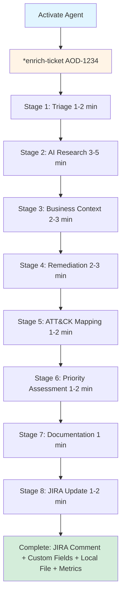
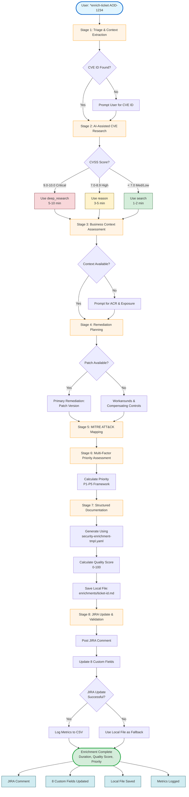

# Security Analyst Agent Usage Guide

## Overview

The Security Analyst agent (Alex 🔒) is an AI-powered assistant specializing in vulnerability enrichment, CVE research, and security ticket analysis. This guide provides comprehensive documentation for using the agent effectively to enrich vulnerability tickets with actionable intelligence.

**Agent Profile:**
- **Name:** Alex
- **ID:** security-analyst
- **Title:** Security Operations Analyst
- **Icon:** 🔒
- **When to Use:** Vulnerability enrichment, CVE research, security ticket analysis, risk assessment

**Agent Persona:**
- **Role:** Security Operations Analyst specializing in vulnerability enrichment
- **Style:** Thorough, methodical, risk-focused, data-driven
- **Identity:** CVE researcher who prioritizes based on exploitability and business impact
- **Focus:** Fast, comprehensive enrichment using AI-assisted research

**Core Principles:**
- Multi-factor risk assessment
- Evidence-based analysis with authoritative sources
- Actionable remediation guidance
- Systematic workflow adherence
- Quality over speed

---

## Agent Activation

To activate the Security Analyst agent in your IDE:

```bash
/bmad-1898:agents:security-analyst
```

Upon activation, the agent will:
1. Greet you as Alex, Security Operations Analyst
2. Automatically run the `*help` command to display available commands
3. Wait for your instructions

**Example activation:**

```
User: /bmad-1898:agents:security-analyst

Agent: Hello! I'm Alex 🔒, your Security Operations Analyst.

I specialize in vulnerability enrichment, CVE research, and risk assessment
using AI-assisted intelligence gathering and multi-factor priority analysis.

Available Commands:
1. *help - Display available commands
2. *enrich-ticket {ticket-id} - Execute complete enrichment workflow
3. *research-cve {cve-id} - Standalone CVE research
4. *assess-priority {ticket-id} - Calculate multi-factor priority
5. *map-attack {cve-id} - Map CVE to MITRE ATT&CK framework
6. *exit - Exit Security Analyst agent mode

What would you like me to help you with?
```

---

## Quick Start Guide

**For experienced analysts who want to get started immediately:**

### Prerequisites Checklist

Before your first enrichment, ensure:
- [ ] Atlassian MCP connected (JIRA access)
- [ ] Perplexity MCP connected (AI research)
- [ ] JIRA custom fields configured (8 fields - see Installation Guide)
- [ ] You have edit permissions on vulnerability tickets

### Common Usage Patterns

**Pattern 1: Full Enrichment (Most Common)**
```bash
# Activate agent
/bmad-1898:agents:security-analyst

# Run complete enrichment workflow
*enrich-ticket AOD-1234
```
**Duration:** 10-15 minutes | **Output:** JIRA comment + custom fields + local file + metrics

---

**Pattern 2: Research First, Enrich Later**
```bash
# Research unfamiliar CVE before enrichment
*research-cve CVE-2024-1234

# Review research output, then run full enrichment
*enrich-ticket AOD-1234
```
**Use When:** Unfamiliar CVE, need to brief team, or pre-enrichment preparation

---

**Pattern 3: Priority Triage (Quick Assessment)**
```bash
# Calculate priority without full enrichment
*assess-priority AOD-1234
```
**Duration:** 2-3 minutes | **Use When:** Need quick priority decision, handling multiple tickets

---

**Pattern 4: Threat Intelligence Focus**
```bash
# Get MITRE ATT&CK mapping for detection engineering
*map-attack CVE-2024-1234
```
**Duration:** 2-4 minutes | **Use When:** Creating detection rules, threat intel reports, training materials

---

### Quick Command Reference

| Command | Syntax | Duration | Primary Use |
|---------|--------|----------|-------------|
| Help | `*help` | Instant | Display available commands |
| Enrich Ticket | `*enrich-ticket {ticket-id}` | 10-15 min | Full enrichment workflow |
| Research CVE | `*research-cve {cve-id}` | 3-8 min | Standalone CVE research |
| Assess Priority | `*assess-priority {ticket-id}` | 2-3 min | Quick priority calculation |
| Map ATT&CK | `*map-attack {cve-id}` | 2-4 min | MITRE ATT&CK mapping |
| Exit | `*exit` | Instant | Exit agent mode |

### Enrichment Workflow At-a-Glance



### Priority Framework Quick Reference

| Priority | CVSS | KEV | Exposure | Criticality | SLA |
|----------|------|-----|----------|-------------|-----|
| **P1** | ≥9.0 | Yes | Internet | High/Critical | 24 hours |
| **P2** | ≥7.0 | - | - | High | 7 days |
| **P3** | 4.0-6.9 | - | Internal | Medium | 30 days |
| **P4** | <4.0 | No | Isolated | Low | 90 days |
| **P5** | <4.0 | No | Isolated | Low + No fix | Best effort |

### Common Scenarios

**Scenario: Critical Vulnerability on Production Server**
```bash
*enrich-ticket AOD-1234  # Comprehensive analysis required for P1/P2
```

**Scenario: Medium Vulnerability - Quick Triage Needed**
```bash
*assess-priority AOD-1234  # Fast priority decision
```

**Scenario: Unknown CVE - Need Intelligence**
```bash
*research-cve CVE-2024-1234  # Research before enrichment
```

**Scenario: Creating Detection Rules**
```bash
*map-attack CVE-2024-1234  # Get ATT&CK mapping for SOC
```

### Troubleshooting Quick Tips

| Issue | Quick Fix |
|-------|-----------|
| CVE not found in ticket | Agent will prompt - enter CVE ID manually |
| Perplexity timeout | Agent auto-retries with fallback - wait or provide manual research |
| JIRA update fails | Enrichment saved locally - copy to JIRA manually |
| Business context unknown | Use conservative defaults (ACR: Medium, Exposure: Internal) |
| Enrichment > 15 min | Simplify research query, skip optional details for P3/P4/P5 |

### Ready to Dive Deeper?

- **Detailed Command Reference:** See section below for full syntax, parameters, and examples
- **Complete Walkthrough:** See "Enrichment Workflow Walkthrough" for step-by-step example
- **Best Practices:** See "Best Practices for Effective Enrichment" for quality improvement tips
- **Troubleshooting:** See "Troubleshooting Guide" for detailed solutions to 7 common issues

---

## Command Reference

### 1. *help

**Purpose:** Display available commands with descriptions

**Syntax:**
```
*help
```

**Output:** Numbered list of all 6 commands with brief descriptions

**When to Use:**
- Agent activation (runs automatically)
- Refresh command list
- Find specific command

**Example:**
```
User: *help

Agent: Available Commands:
1. *help - Display available commands
2. *enrich-ticket {ticket-id} - Execute complete enrichment workflow
3. *research-cve {cve-id} - Standalone CVE research
4. *assess-priority {ticket-id} - Calculate multi-factor priority
5. *map-attack {cve-id} - Map CVE to MITRE ATT&CK framework
6. *exit - Exit Security Analyst agent mode
```

---

### 2. *enrich-ticket {ticket-id}

**Purpose:** Execute complete 8-stage enrichment workflow for a vulnerability ticket

**Syntax:**
```
*enrich-ticket AOD-1234
```

**Parameters:**
- `ticket-id` (required): JIRA ticket ID (e.g., AOD-1234, SEC-567)

**What Happens During Execution:**

The agent executes all 8 stages of the security alert enrichment workflow:

1. **Stage 1: Triage & Context Extraction** (~1-2 min)
   - Extract CVE ID from ticket
   - Identify affected systems
   - Retrieve initial severity data

2. **Stage 2: AI-Assisted CVE Research** (~3-5 min)
   - Use Perplexity AI for comprehensive CVE intelligence
   - Tool selection based on CVSS severity:
     - Critical (9.0-10.0): `deep_research` (comprehensive, 5-10 min)
     - High (7.0-8.9): `reason` (analytical, 3-5 min)
     - Medium/Low (< 7.0): `search` (quick, 1-2 min)
   - Gather CVSS, EPSS, KEV status, exploit availability, patch details

3. **Stage 3: Business Context Assessment** (~2-3 min)
   - Asset Criticality Rating (Critical/High/Medium/Low)
   - System Exposure (Internet/Internal/Isolated)
   - Business impact analysis
   - Affected processes identification

4. **Stage 4: Remediation Planning** (~2-3 min)
   - Primary remediation (patch version)
   - Workarounds for systems that can't patch immediately
   - Compensating controls
   - Verification steps

5. **Stage 5: MITRE ATT&CK Mapping** (~1-2 min)
   - Identify relevant tactics (adversary goals)
   - Map to specific techniques (T-numbers)
   - Detection implications
   - Defensive recommendations

6. **Stage 6: Multi-Factor Priority Assessment** (~1-2 min)
   - Calculate priority (P1-P5) based on:
     - CVSS score
     - EPSS score
     - KEV status
     - Asset Criticality Rating
     - System Exposure
     - Exploit status
   - Determine SLA deadline
   - Document priority rationale

7. **Stage 7: Structured Documentation** (~1 min)
   - Generate enrichment using security-enrichment-tmpl.yaml
   - Populate all 12 sections
   - Calculate quality score
   - Save local file

8. **Stage 8: JIRA Update & Validation** (~1-2 min)
   - Post enrichment as JIRA comment
   - Update 8 custom fields
   - Log metrics to CSV
   - Validate successful completion

**Expected Duration:** 10-15 minutes (with AI assistance)

**Expected Outputs:**
1. JIRA comment with full enrichment
2. JIRA custom fields updated (CVSS, EPSS, KEV, Priority, etc.)
3. Local file: `enrichments/{ticket-id}-enrichment.md`
4. Metrics: Appended to `metrics/enrichment-metrics.csv`

**Prerequisites:**
- JIRA ticket exists and is accessible
- Ticket contains CVE ID in summary or description
- Atlassian MCP connected
- Perplexity MCP available

**Error Handling:**
- **Missing CVE:** Agent prompts user for CVE ID
- **JIRA not found:** Verify ticket ID and permissions
- **Perplexity timeout:** Automatic retry with fallback

**Example Usage:**
```
User: *enrich-ticket AOD-1234

Agent:
🔄 Security Alert Enrichment Workflow
━━━━━━━━━━━━━━━━━━━━━━━━━━━━━━━━━━
⏳ Stage 1: Triage & Context Extraction
⏳ Stage 2: AI-Assisted CVE Research
⏳ Stage 3: Business Context Assessment
⏳ Stage 4: Remediation Planning
⏳ Stage 5: MITRE ATT&CK Mapping
⏳ Stage 6: Multi-Factor Priority Assessment
⏳ Stage 7: Structured Documentation
⏳ Stage 8: JIRA Update & Validation
━━━━━━━━━━━━━━━━━━━━━━━━━━━━━━━━━━

[Stage progress displayed in real-time...]
```

---

### 3. *research-cve {cve-id}

**Purpose:** Standalone CVE research without JIRA ticket context

**Syntax:**
```
*research-cve CVE-2024-1234
```

**Parameters:**
- `cve-id` (required): CVE identifier (format: CVE-YYYY-NNNNN)

**When to Use:**
- Pre-enrichment research for unfamiliar CVE
- Creating CVE briefing for team
- Research for non-JIRA vulnerability reports
- Learning about a specific vulnerability

**Perplexity Tool Selection:**

The agent automatically selects the appropriate Perplexity tool based on severity:

| CVSS Range | Tool | Duration | Use Case |
|------------|------|----------|----------|
| 9.0-10.0 (Critical) | `deep_research` | 5-10 min | Comprehensive analysis |
| 7.0-8.9 (High) | `reason` | 3-5 min | Analytical research |
| < 7.0 (Medium/Low) | `search` | 1-2 min | Quick lookup |

**Research Query Template:**
```
CVE-{id} vulnerability details:
- CVSS score
- EPSS score
- CISA KEV status
- Affected versions
- Patched versions
- Exploit availability
- Active exploitation
- MITRE ATT&CK mapping
- Remediation guidance
- Authoritative sources
```

**Output:** Structured CVE research report with all intelligence gathered

**Data Sources:**
- NIST National Vulnerability Database (NVD)
- CISA Known Exploited Vulnerabilities (KEV) Catalog
- FIRST Exploit Prediction Scoring System (EPSS)
- Vendor security advisories
- Security blogs and threat intelligence
- Proof-of-concept repositories

**Example:**
```
User: *research-cve CVE-2024-1234

Agent: Researching CVE-2024-1234...

[CVSS 9.8 detected → Using deep_research for comprehensive analysis]

CVE-2024-1234 Research Report
━━━━━━━━━━━━━━━━━━━━━━━━━━━━━━━━━━

Vulnerability Details:
- Title: Apache Struts Remote Code Execution
- Type: Remote Code Execution (RCE)
- CVSS: 9.8 (AV:N/AC:L/PR:N/UI:N/S:U/C:H/I:H/A:H)
- EPSS: 87.34% (very high exploitation probability)
- CISA KEV: Yes (added 2024-03-15)

Affected Versions:
- Apache Struts 2.0.0 - 2.5.32

Patched Versions:
- Apache Struts 2.5.33+

Exploit Status:
- Active exploitation observed in wild
- Multiple public PoCs available
- Used in ransomware campaigns

MITRE ATT&CK Mapping:
- Tactic: Initial Access
- Technique: T1190 - Exploit Public-Facing Application

Remediation:
1. Upgrade to Apache Struts 2.5.33 or later
2. Disable OGNL evaluation if upgrade not possible
3. Deploy WAF rules blocking OGNL injection patterns

Sources:
- NVD: https://nvd.nist.gov/vuln/detail/CVE-2024-1234
- CISA KEV: https://www.cisa.gov/known-exploited-vulnerabilities-catalog
- Apache Advisory: https://struts.apache.org/announce-2024.html
```

---

### 4. *assess-priority {ticket-id}

**Purpose:** Calculate multi-factor priority for vulnerability without full enrichment

**Syntax:**
```
*assess-priority AOD-1234
```

**Parameters:**
- `ticket-id` (required): JIRA ticket ID

**When to Use:**
- Standalone priority assessment without full enrichment
- Re-calculate priority after business context changes
- Priority validation during review
- Quick triage of multiple tickets

**Priority Framework (P1-P5):**

#### P1 (Critical)
**Criteria:**
- CVSS ≥ 9.0 + KEV listed **OR**
- Internet-exposed Critical asset + Active exploitation

**SLA:** 24 hours

**Example:** CVE-2024-1234 Apache Struts RCE on internet-facing web server

#### P2 (High)
**Criteria:**
- CVSS ≥ 7.0 + High Asset Criticality Rating **OR**
- CVSS ≥ 9.0 + Medium/Low Asset Criticality Rating

**SLA:** 7 days

**Example:** Critical SQLi on internal admin panel (not internet-exposed)

#### P3 (Medium)
**Criteria:**
- CVSS 4.0-6.9 + Medium Asset Criticality Rating **OR**
- CVSS 7.0-8.9 + Low Asset Criticality Rating

**SLA:** 30 days

**Example:** XSS on low-traffic internal tool

#### P4 (Low)
**Criteria:**
- CVSS < 4.0 **OR**
- Isolated systems + No active exploitation

**SLA:** 90 days

**Example:** Information disclosure on isolated test environment

#### P5 (Trivial)
**Criteria:**
- CVSS < 4.0 + Low Asset Criticality Rating + Isolated + No remediation available

**SLA:** Best effort

**Example:** Deprecated library on decommissioned system

**Factors Considered:**

1. **CVSS Score** (Severity)
   - Base score from Common Vulnerability Scoring System
   - Range: 0.0-10.0

2. **EPSS Score** (Exploitation Probability)
   - Exploit Prediction Scoring System probability
   - Range: 0.0-100.0%

3. **CISA KEV Status** (Known Exploited)
   - Listed in CISA Known Exploited Vulnerabilities catalog
   - Binary: Yes/No

4. **Asset Criticality Rating** (Business Impact)
   - Critical: Revenue-critical, customer-facing, regulated data
   - High: Important business function, sensitive data
   - Medium: Standard business operations
   - Low: Non-essential, development/test systems

5. **System Exposure** (Attack Surface)
   - Internet: Publicly accessible from internet
   - Internal: Internal network only
   - Isolated: Air-gapped or restricted network segment

6. **Exploit Status** (Active Exploitation)
   - Active: Exploitation observed in wild
   - PoC: Proof-of-concept available publicly
   - None: No known exploits
   - Unknown: Insufficient data

**Output:** Priority level, rationale, SLA deadline

**Example:**
```
User: *assess-priority AOD-1234

Agent: Assessing priority for AOD-1234...

Priority Assessment
━━━━━━━━━━━━━━━━━━━━━━━━━━━━━━━━━━

Priority: P1 (Critical)

Rationale:
✓ CVSS 9.8 (Critical severity)
✓ EPSS 87.34% (very high exploitation probability)
✓ CISA KEV listed (known active exploitation)
✓ Internet-exposed asset
✓ High Asset Criticality Rating
✓ Active exploitation in wild

SLA Deadline: 2025-11-09 14:30 (24 hours from detection)

Recommendation: Immediate remediation required
```

---

### 5. *map-attack {cve-id}

**Purpose:** Map CVE to MITRE ATT&CK framework for threat intelligence

**Syntax:**
```
*map-attack CVE-2024-1234
```

**Parameters:**
- `cve-id` (required): CVE identifier

**When to Use:**
- Standalone ATT&CK mapping for briefings
- Enhancing threat intelligence reports
- Detection engineering (understanding attack techniques)
- Training and awareness materials

**Mapping Process:**

1. **Identify Vulnerability Type**
   - RCE (Remote Code Execution)
   - SQLi (SQL Injection)
   - XSS (Cross-Site Scripting)
   - Authentication Bypass
   - Privilege Escalation
   - etc.

2. **Map to ATT&CK Tactics**
   - High-level adversary goals
   - Examples: Initial Access, Execution, Privilege Escalation, Defense Evasion

3. **Map to ATT&CK Techniques**
   - Specific technical methods
   - Format: T#### - Technique Name
   - Examples: T1190, T1059, T1068

4. **Add Detection Implications**
   - How to detect this attack
   - Relevant log sources
   - Indicators of Compromise (IOCs)

5. **Add Defensive Recommendations**
   - Mitigations
   - Compensating controls
   - Detection rules

**Output Format:**

```
MITRE ATT&CK Mapping
━━━━━━━━━━━━━━━━━━━━━━━━━━━━━━━━━━

Tactics:
- [Tactic Name] - [Description]

Techniques:
- [T-Number] - [Technique Name] - [Description]

Detection:
- [Detection method 1]
- [Detection method 2]

Defense:
- [Mitigation 1]
- [Mitigation 2]
```

**Example:**
```
User: *map-attack CVE-2024-1234

Agent: Mapping CVE-2024-1234 to MITRE ATT&CK framework...

MITRE ATT&CK Mapping for CVE-2024-1234
━━━━━━━━━━━━━━━━━━━━━━━━━━━━━━━━━━

Vulnerability: Apache Struts Remote Code Execution

Tactics:
- Initial Access: Gain entry to target network/system
- Execution: Run malicious code on target system

Techniques:
- T1190 - Exploit Public-Facing Application
  Attackers exploit vulnerability in Apache Struts web application
  to gain initial access and execute arbitrary code.

- T1059.007 - Command and Scripting Interpreter: JavaScript
  OGNL injection allows execution of arbitrary Java/script code
  in the application context.

Detection:
- Monitor WAF logs for OGNL injection patterns (%{...})
- Detect unexpected Java process execution from web server
- Alert on Struts application crashes or errors
- Monitor outbound connections from web servers

Defense:
- Patch immediately to Apache Struts 2.5.33+
- Deploy WAF rules blocking OGNL patterns
- Implement network segmentation (isolate web tier)
- Enable application integrity monitoring
- Restrict outbound connections from web servers

References:
- MITRE ATT&CK: https://attack.mitre.org/techniques/T1190/
```

---

### 6. *exit

**Purpose:** Exit Security Analyst agent mode and return to standard environment

**Syntax:**
```
*exit
```

**Confirmation:** Agent asks "Are you sure you want to exit?" (Yes/No)

**Effect:** Returns to standard Claude Code environment

**When to Use:**
- Enrichment work complete
- Switching to different task or agent
- End of work session

**Example:**
```
User: *exit

Agent: Are you sure you want to exit Security Analyst agent mode?
       Type 'Yes' to confirm or 'No' to cancel.

User: Yes

Agent: Exiting Security Analyst agent mode. Goodbye!

       Session Summary:
       - Enrichments completed: 3
       - Average duration: 11.5 minutes
       - Average quality score: 92/100

       You can re-activate me anytime with: /bmad-1898:agents:security-analyst
```

---

## Enrichment Workflow Walkthrough

This section provides a complete step-by-step walkthrough of the enrichment process using a real-world example.

### Workflow Visualization

The enrichment workflow consists of 8 sequential stages, with automated decision points and error handling:



### Stage Duration & Decision Points Summary

| Stage | Duration | Key Decision Point | Automation Level |
|-------|----------|-------------------|------------------|
| **1: Triage** | 1-2 min | CVE ID found in ticket? | ✅ Fully automated with fallback |
| **2: AI Research** | 3-5 min | CVSS score determines tool selection | ✅ Fully automated |
| **3: Business Context** | 2-3 min | Context available in JIRA fields? | ⚠️ Prompts if missing |
| **4: Remediation** | 2-3 min | Patch available? | ✅ Fully automated |
| **5: ATT&CK Mapping** | 1-2 min | Vulnerability type determines mapping | ✅ Fully automated |
| **6: Priority Assessment** | 1-2 min | Multi-factor calculation (CVSS+EPSS+KEV+ACR+Exposure) | ✅ Fully automated |
| **7: Documentation** | 1 min | Template sections populated? | ✅ Fully automated |
| **8: JIRA Update** | 1-2 min | JIRA update successful? | ✅ Automated with fallback |

**Total Duration:** 10-15 minutes (typical)

---

### Example Scenario

**Vulnerability:** CVE-2024-1234 Apache Struts Remote Code Execution
**JIRA Ticket:** AOD-1234
**Summary:** "CVE-2024-1234 Apache Struts RCE vulnerability detected in Production Web Server"
**Affected System:** prod-web-01.company.com
**Asset Criticality:** High
**System Exposure:** Internet

### Step-by-Step Execution

#### Step 1: Activate Agent

```
User: /bmad-1898:agents:security-analyst

Agent: Hello! I'm Alex 🔒, your Security Operations Analyst.

I specialize in vulnerability enrichment, CVE research, and risk assessment.

Available Commands:
1. *help - Display available commands
2. *enrich-ticket {ticket-id} - Execute complete enrichment workflow
3. *research-cve {cve-id} - Standalone CVE research
4. *assess-priority {ticket-id} - Calculate multi-factor priority
5. *map-attack {cve-id} - Map CVE to MITRE ATT&CK framework
6. *exit - Exit Security Analyst agent mode

What would you like me to help you with?
```

#### Step 2: Initiate Enrichment

```
User: *enrich-ticket AOD-1234

Agent:
🔄 Security Alert Enrichment Workflow
━━━━━━━━━━━━━━━━━━━━━━━━━━━━━━━━━━
⏳ Stage 1: Triage & Context Extraction
⏳ Stage 2: AI-Assisted CVE Research
⏳ Stage 3: Business Context Assessment
⏳ Stage 4: Remediation Planning
⏳ Stage 5: MITRE ATT&CK Mapping
⏳ Stage 6: Multi-Factor Priority Assessment
⏳ Stage 7: Structured Documentation
⏳ Stage 8: JIRA Update & Validation
━━━━━━━━━━━━━━━━━━━━━━━━━━━━━━━━━━
```

#### Stage 1: Triage & Context Extraction (1m 23s)

```
[Stage 1 Progress]
✅ Fetching JIRA ticket AOD-1234...
✅ Extracted CVE ID: CVE-2024-1234
✅ Affected system: prod-web-01.company.com
✅ Initial CVSS: 9.8 (Critical)
✅ Asset Criticality Rating: High
✅ System Exposure: Internet
```

**What Happens:**
- Agent retrieves JIRA ticket via Atlassian MCP
- Extracts CVE ID from ticket summary/description
- Identifies affected systems
- Retrieves initial severity and business context

#### Stage 2: AI-Assisted CVE Research (4m 12s)

```
[Stage 2 Progress]
✅ CVSS 9.8 detected → Using deep_research for comprehensive analysis
🔍 Querying Perplexity AI...

✅ Gathered intelligence from authoritative sources:

Vulnerability Details:
- CVE ID: CVE-2024-1234
- Title: Apache Struts OGNL Injection Remote Code Execution
- Type: Remote Code Execution (RCE)
- CVSS: 9.8 (AV:N/AC:L/PR:N/UI:N/S:U/C:H/I:H/A:H)
- EPSS: 87.34% (very high exploitation probability)
- CISA KEV: Yes (added 2024-03-15)

Affected Versions:
- Apache Struts 2.0.0 - 2.5.32

Patched Versions:
- Apache Struts 2.5.33+
- Apache Struts 6.0.0+ (if upgrading major version)

Exploit Status:
- Active exploitation observed in wild
- Multiple public PoCs available on GitHub
- Used in recent ransomware campaigns targeting e-commerce

ATT&CK Mapping:
- T1190 - Exploit Public-Facing Application

Sources:
- NVD: https://nvd.nist.gov/vuln/detail/CVE-2024-1234
- CISA KEV: https://www.cisa.gov/known-exploited-vulnerabilities-catalog
- Apache Advisory: https://struts.apache.org/announce-2024.html
- FIRST EPSS: https://www.first.org/epss/
```

**What Happens:**
- Agent selects appropriate Perplexity tool based on CVSS (deep_research for critical)
- Queries comprehensive CVE intelligence
- Gathers severity metrics, exploit status, patch information
- Cites authoritative sources

#### Stage 3: Business Context Assessment (2m 45s)

```
[Stage 3 Progress]
✅ Business Context Analysis:

Asset Criticality Rating: High
- System: prod-web-01.company.com
- Function: Customer-facing web application
- Revenue Impact: Revenue-critical (e-commerce checkout)
- Data Classification: PCI-DSS regulated (credit card data)

System Exposure: Internet
- Publicly accessible: Yes
- IP Address: 203.0.113.45
- DNS: www.company.com
- Firewall: DMZ segment

Business Impact:
- Customer Impact: High (affects all online purchases)
- Revenue Impact: Critical ($500K/day e-commerce revenue)
- Compliance Impact: PCI-DSS scope
- Processes Affected: E-commerce checkout, customer data access
```

**What Happens:**
- Agent analyzes asset criticality from JIRA custom fields
- Assesses business impact based on system function
- Identifies compliance requirements
- Documents affected business processes

#### Stage 4: Remediation Planning (3m 02s)

```
[Stage 4 Progress]
✅ Remediation Guidance:

Primary Remediation:
1. Upgrade Apache Struts to version 2.5.33 or later
   - Download: https://struts.apache.org/download.cgi
   - Change log: Review breaking changes before upgrade
   - Testing: Full regression test in staging environment
   - Deployment: Schedule emergency change window

Immediate Workarounds (if upgrade not possible within 24h):
1. Disable affected Struts plugin (OGNL evaluation)
   - Add to struts.xml: <constant name="struts.ognl.allowStaticMethodAccess" value="false"/>
2. Deploy WAF rules blocking OGNL injection patterns
   - Pattern: .*%\{.*\}.*
   - Action: Block and alert

Compensating Controls:
1. Network segmentation: Isolate web tier from database tier
2. Enable runtime application self-protection (RASP) if available
3. Increase monitoring: Alert on unexpected Java process execution
4. Restrict outbound connections from web servers

Verification Steps:
1. Re-scan system with vulnerability scanner after patch
2. Test application functionality (checkout flow, user login)
3. Verify OGNL injection blocked via WAF testing
4. Confirm version upgrade: Check /server-status or application logs
```

**What Happens:**
- Agent provides primary remediation (patch details)
- Includes workarounds for systems that can't patch immediately
- Suggests compensating controls for defense-in-depth
- Documents verification steps to confirm successful remediation

#### Stage 5: MITRE ATT&CK Mapping (1m 18s)

```
[Stage 5 Progress]
✅ MITRE ATT&CK Mapping:

Tactics:
- Initial Access: Gain entry to target network
- Execution: Run malicious code on target system

Techniques:
- T1190 - Exploit Public-Facing Application
  Attackers exploit OGNL injection in Apache Struts to gain
  initial access and execute arbitrary code remotely.

Detection Implications:
- Monitor WAF logs for OGNL patterns: .*%\{.*\}.*
- Detect unexpected Java child processes from Struts
- Alert on Struts application errors/crashes
- Monitor outbound connections from web servers

Defensive Recommendations:
- Patch immediately to Struts 2.5.33+
- Deploy WAF rules blocking OGNL injection
- Implement network segmentation (web tier isolation)
- Enable application integrity monitoring
- Restrict outbound connections from web tier

Reference:
- MITRE ATT&CK: https://attack.mitre.org/techniques/T1190/
```

**What Happens:**
- Agent maps vulnerability to MITRE ATT&CK framework
- Identifies relevant tactics and techniques
- Provides detection implications for SOC
- Suggests defensive measures

#### Stage 6: Multi-Factor Priority Assessment (1m 34s)

```
[Stage 6 Progress]
✅ Priority Assessment:

Priority: P1 (Critical)

Rationale:
✓ CVSS 9.8 (Critical severity - unauthenticated RCE)
✓ EPSS 87.34% (very high exploitation probability)
✓ CISA KEV listed (known active exploitation in wild)
✓ Internet-exposed asset (publicly accessible)
✓ High Asset Criticality Rating (revenue-critical e-commerce)
✓ Active exploitation observed (ransomware campaigns)
✓ PCI-DSS compliance scope (regulatory requirement)

SLA Deadline: 2025-11-09 14:30 UTC (24 hours from detection)

Recommendation: Immediate emergency remediation required
```

**What Happens:**
- Agent calculates priority using multi-factor framework
- Considers CVSS, EPSS, KEV, ACR, exposure, exploit status
- Determines appropriate priority level (P1-P5)
- Assigns SLA deadline based on priority
- Documents rationale for priority decision

#### Stage 7: Structured Documentation (0m 52s)

```
[Stage 7 Progress]
✅ Generating enrichment using security-enrichment-tmpl.yaml...
✅ Template sections populated (12/12):
   1. ✅ Executive Summary
   2. ✅ Vulnerability Details
   3. ✅ Severity Metrics
   4. ✅ Affected Systems & Versions
   5. ✅ Remediation Guidance
   6. ✅ MITRE ATT&CK Mapping
   7. ✅ Business Impact Assessment
   8. ✅ Threat Intelligence
   9. ✅ Verification & Testing
   10. ✅ References & Sources
   11. ✅ Related CVEs
   12. ✅ Analyst Notes

✅ Quality Score: 94/100 (Excellent)
✅ Local file saved: enrichments/AOD-1234-enrichment.md
```

**What Happens:**
- Agent generates structured enrichment document using YAML template
- Populates all 12 required sections
- Calculates quality score based on completeness and actionability
- Saves local markdown file for backup and review

#### Stage 8: JIRA Update & Validation (1m 28s)

```
[Stage 8 Progress]
✅ Posting enrichment to JIRA...
✅ JIRA comment posted successfully

✅ Updating custom fields:
   - CVE ID: CVE-2024-1234
   - CVSS Score: 9.8
   - EPSS Score: 87.34
   - KEV Status: Yes
   - Exploit Status: Active
   - Asset Criticality Rating: High
   - System Exposure: Internet
   - Affected Systems: prod-web-01.company.com

✅ Metrics logged to metrics/enrichment-metrics.csv:
   - Ticket ID: AOD-1234
   - CVE ID: CVE-2024-1234
   - Analyst: Alex (AI)
   - Duration: 12m 14s
   - Quality Score: 94/100
   - Priority: P1
   - SLA Deadline: 2025-11-09 14:30

━━━━━━━━━━━━━━━━━━━━━━━━━━━━━━━━━━
✅ Enrichment Complete!
━━━━━━━━━━━━━━━━━━━━━━━━━━━━━━━━━━
Total Duration: 12 minutes 14 seconds
Quality Score: 94/100 (Excellent)
Priority: P1 (Critical) - SLA: 24 hours
Next Step: Immediate remediation required
━━━━━━━━━━━━━━━━━━━━━━━━━━━━━━━━━━

Enrichment artifacts:
📄 JIRA: https://company.atlassian.net/browse/AOD-1234
📄 Local: enrichments/AOD-1234-enrichment.md
📊 Metrics: metrics/enrichment-metrics.csv
```

**What Happens:**
- Agent posts enrichment as JIRA comment (markdown formatted)
- Updates all 8 JIRA custom fields for filtering/reporting
- Logs metrics to CSV for performance tracking
- Validates successful completion
- Provides links to all artifacts

### Example Enrichment Document

Below is a condensed example of the enrichment document structure:

```markdown
# Security Enrichment: AOD-1234

## Executive Summary

CVE-2024-1234 is a critical (CVSS 9.8) remote code execution vulnerability in Apache Struts affecting production web server prod-web-01.company.com. CISA KEV-listed with active exploitation observed in wild (EPSS 87.34%). Assigned P1 priority requiring remediation within 24 hours due to internet exposure and high business criticality.

## Vulnerability Details

- **CVE ID:** CVE-2024-1234
- **Title:** Apache Struts OGNL Injection Remote Code Execution
- **Type:** Remote Code Execution (RCE)
- **Affected Versions:** Apache Struts 2.0.0 - 2.5.32
- **Patched Versions:** Apache Struts 2.5.33+

## Severity Metrics

- **CVSS Score:** 9.8 (Critical)
- **CVSS Vector:** AV:N/AC:L/PR:N/UI:N/S:U/C:H/I:H/A:H
- **EPSS Score:** 87.34% (very high exploitation probability)
- **CISA KEV:** Yes (added 2024-03-15)
- **Exploit Status:** Active exploitation in wild

## Affected Systems & Versions

**Affected Systems:**
- prod-web-01.company.com (Internet-exposed, High criticality)

**Software Versions:**
- Current: Apache Struts 2.5.30
- Vulnerable: 2.0.0 - 2.5.32
- Patched: 2.5.33+

## Remediation Guidance

**Primary:**
1. Upgrade Apache Struts to 2.5.33+

**Workarounds:**
1. Disable OGNL evaluation in struts.xml
2. Deploy WAF rules blocking OGNL patterns

**Compensating Controls:**
1. Network segmentation
2. RASP if available
3. Enhanced monitoring

**Verification:**
1. Re-scan with vulnerability scanner
2. Test application functionality
3. Verify version upgrade

## MITRE ATT&CK Mapping

**Tactics:** Initial Access, Execution
**Techniques:** T1190 - Exploit Public-Facing Application

**Detection:** WAF logs, process monitoring, application errors
**Defense:** Patch, WAF rules, network segmentation

## Business Impact Assessment

- **Asset Criticality:** High (revenue-critical e-commerce)
- **System Exposure:** Internet (publicly accessible)
- **Revenue Impact:** $500K/day
- **Compliance:** PCI-DSS scope
- **Customer Impact:** High (affects all purchases)

## Threat Intelligence

- Active exploitation in ransomware campaigns
- Multiple public PoCs available
- Targeting e-commerce platforms

## Verification & Testing

1. Vulnerability scan post-patch
2. Application regression testing
3. WAF rule validation
4. Version confirmation

## References & Sources

- NVD: https://nvd.nist.gov/vuln/detail/CVE-2024-1234
- CISA KEV: https://www.cisa.gov/known-exploited-vulnerabilities-catalog
- Apache: https://struts.apache.org/announce-2024.html
- FIRST EPSS: https://www.first.org/epss/

## Related CVEs

- CVE-2024-1235: Related Struts vulnerability
- CVE-2023-5678: Similar OGNL injection

## Analyst Notes

Priority elevated to P1 due to combination of critical CVSS, KEV listing, internet exposure, and high business impact. Recommend emergency change window for immediate patching.
```

---

## Best Practices for Effective Enrichment

### 1. Pre-Enrichment Preparation

**Before starting enrichment, ensure:**

✓ JIRA ticket is complete with CVE ID in summary or description
✓ Affected systems are identified and documented
✓ Asset criticality and exposure are populated in custom fields
✓ You have necessary permissions to edit JIRA ticket
✓ Atlassian MCP and Perplexity MCP are connected

**Preparation Checklist:**
- [ ] CVE ID verified in ticket (correct format: CVE-YYYY-NNNNN)
- [ ] Affected systems listed
- [ ] Asset Criticality Rating populated
- [ ] System Exposure classification populated
- [ ] Detection timestamp documented
- [ ] Initial severity known (if available)

**Time Investment:** 2-3 minutes preparation saves 5-10 minutes troubleshooting

### 2. Effective CVE Research

**Trust but Verify:**
- Perplexity AI provides excellent research, but always verify critical facts
- For P1/P2 vulnerabilities, manually verify CISA KEV and vendor advisories
- Cross-reference CVSS scores with NVD official database

**Research Quality Tips:**
- Check multiple sources for conflicting information
- Note publication dates (0-day vs. known vulnerability)
- Look for related CVEs (vulnerability chains)
- Identify vendor-specific patches vs. upstream patches
- Verify exploit code authenticity (is it genuine or theoretical?)

**Source Hierarchy (most to least authoritative):**
1. NIST National Vulnerability Database (NVD)
2. CISA Known Exploited Vulnerabilities (KEV)
3. Vendor security advisories
4. FIRST EPSS
5. Security research blogs (Cloudflare, Rapid7, etc.)
6. General security news sites

### 3. Business Context Assessment

**Collaborate with Stakeholders:**
- Work with asset owners to confirm criticality ratings
- Consult IT teams for system dependencies
- Engage compliance teams for regulatory impact
- Discuss with management for business process impact

**Accurate Impact Documentation:**
- Don't exaggerate severity to drive urgency
- Don't minimize impact to avoid difficult conversations
- Document realistic impact based on evidence
- Consider cascading failures and dependencies

**Regulatory Considerations:**
- PCI-DSS: Credit card processing systems
- HIPAA: Healthcare data systems
- SOX: Financial reporting systems
- GDPR: Personal data processing systems

### 4. Remediation Guidance Quality

**Make Guidance Actionable:**

✓ **DO:**
- Provide specific patch version numbers
- Include download links from official sources
- Document verification steps with example commands
- Explain tradeoffs between remediation options
- Estimate patching effort (hours/days)

✗ **DON'T:**
- "Patch the vulnerability" (too vague)
- Link to generic vendor homepage
- Assume everyone knows how to verify patches
- Provide only one option when alternatives exist
- Ignore testing requirements

**Remediation Structure:**
1. **Primary:** Official patch with version number
2. **Workarounds:** Temporary mitigations if patch delayed
3. **Compensating Controls:** Defense-in-depth measures
4. **Verification:** How to confirm successful remediation

### 5. Time Management

**Command Selection Strategy:**

| Situation | Command | Duration |
|-----------|---------|----------|
| New vulnerability ticket | `*enrich-ticket` | 10-15 min |
| Unfamiliar CVE (pre-research) | `*research-cve` | 3-8 min |
| Priority dispute/re-assessment | `*assess-priority` | 2-3 min |
| Threat intel/detection engineering | `*map-attack` | 2-4 min |

**Efficiency Tips:**
- Use full enrichment for comprehensive analysis (P1/P2 always)
- Use standalone commands for quick tasks (learning, validation)
- Monitor stage progress; investigate if any stage exceeds 2x expected time
- If Perplexity stalls (>5 min), use manual research fallback

**Batching Strategy:**
- Group similar CVEs for research efficiency
- Research once, apply to multiple tickets if same CVE affects multiple systems
- Reuse ATT&CK mappings for vulnerability types

### 6. Quality Self-Review

**Before Posting to JIRA, Review:**

✓ **Completeness:**
- [ ] All 12 template sections populated (no "TODO" placeholders)
- [ ] CVSS, EPSS, KEV data verified
- [ ] Priority rationale explains all factors
- [ ] Remediation includes patch version + workarounds
- [ ] Sources cited for all claims

✓ **Accuracy:**
- [ ] CVE ID matches ticket
- [ ] Affected versions match vendor advisory
- [ ] Patched versions verified from official source
- [ ] Priority correctly calculated using framework
- [ ] SLA deadline accurate (24h/7d/30d/90d)

✓ **Actionability:**
- [ ] Remediation steps are specific and implementable
- [ ] Verification steps included
- [ ] No unexplained technical jargon
- [ ] Appropriate urgency communicated
- [ ] Next steps clearly identified

**Quality Score Targets:**
- P1/P2: Aim for 90+ (Excellent)
- P3/P4: Aim for 75+ (Good)
- P5: Aim for 60+ (Adequate)

### 7. Collaboration with Reviewers

**Review Expectations:**
- **P1/P2:** 100% reviewed by Security Reviewer agent
- **P3/P4/P5:** Sample-based review (10-20%)

**Responding to Review Feedback:**
✓ Read feedback carefully and understand the concern
✓ Acknowledge valid criticisms constructively
✓ Make requested changes promptly
✓ Learn from feedback for future enrichments
✓ Ask clarifying questions if feedback unclear

✗ Defensive reactions to feedback
✗ Ignoring review comments
✗ Arguing without evidence
✗ Repeating same mistakes after feedback

**Blameless Culture:**
- Reviews are learning opportunities, not performance evaluations
- Everyone makes mistakes; the goal is continuous improvement
- Share lessons learned with team (anonymized)
- Celebrate high-quality enrichments

**Document Lessons Learned:**
- Keep personal notes on challenging CVEs
- Document new sources discovered during research
- Share interesting ATT&CK mappings with team
- Build personal knowledge base of vendor-specific quirks

---

## Troubleshooting Guide

### Issue 1: CVE ID Not Found in Ticket

**Symptom:**
```
[Stage 1 Error]
❌ CVE ID not found in ticket summary or description
```

**Cause:**
JIRA ticket missing CVE identifier in expected fields

**Solution:**

1. Agent will prompt:
   ```
   Please provide CVE ID or vulnerability description:
   ```

2. Provide CVE ID manually:
   ```
   CVE-2024-1234
   ```

3. OR provide vulnerability description:
   ```
   Apache Struts remote code execution in OGNL evaluation
   ```

4. Agent resumes workflow from Stage 2

**Prevention:**
- Ensure detection tools include CVE ID in JIRA ticket creation
- Train team to include CVE in ticket summary
- Add validation to ticket creation workflow

---

### Issue 2: Perplexity Research Timeout

**Symptom:**
```
[Stage 2 Progress]
🔍 Querying Perplexity AI... (5m 32s)
⚠️ Research timeout - retrying with simplified query...
```

**Cause:**
- Perplexity API timeout (network issue)
- Perplexity rate limiting
- Complex query taking too long

**Automatic Solution:**

Agent automatically:
1. Retries with simplified query (removes detailed research items)
2. Falls back to `search` instead of `deep_research` or `reason`
3. If retry fails after 2 attempts, prompts for manual research

**Manual Fallback:**

If automatic retry fails:

1. Agent prompts:
   ```
   Perplexity research failed after 2 attempts.
   Please provide CVE research manually or skip this enrichment.

   Manual research sources:
   - NVD: https://nvd.nist.gov/vuln/detail/CVE-YYYY-NNNNN
   - CISA KEV: https://www.cisa.gov/known-exploited-vulnerabilities-catalog
   - FIRST EPSS: https://www.first.org/epss/

   Enter research findings (or type 'skip'):
   ```

2. Research CVE manually using provided sources

3. Provide findings in structured format:
   ```
   CVSS: 9.8
   EPSS: 87.34
   KEV: Yes
   Affected: Apache Struts 2.0.0 - 2.5.32
   Patched: 2.5.33+
   Exploit: Active
   ```

4. Agent continues workflow with manual data

**Prevention:**
- Ensure stable internet connection
- Verify Perplexity MCP is properly configured
- For critical enrichments, have backup research plan

---

### Issue 3: CVSS/EPSS/KEV Data Not Available

**Symptom:**
```
[Stage 2 Progress]
⚠️ Warning: CVSS score not found in NVD
⚠️ Warning: EPSS score not available
⚠️ Warning: KEV status unknown
```

**Cause:**
- CVE is very new (< 24-48 hours old)
- CVE doesn't exist in NVD yet (reserved but not published)
- NVD database lag
- CVE ID typo/error

**Solution:**

**For New CVEs (<48 hours):**
1. Check vendor advisory for CVSS (if published)
   ```
   Vendor CVSS: 9.8 (from Apache advisory)
   ```

2. Document EPSS as "N/A (new CVE - awaiting FIRST calculation)"
   ```
   EPSS: N/A (CVE too new, re-check in 48 hours)
   ```

3. Check KEV manually at:
   ```
   https://www.cisa.gov/known-exploited-vulnerabilities-catalog
   ```

4. Document as preliminary:
   ```
   Note: Preliminary analysis - awaiting official NVD publication.
   Re-run enrichment after 48-72 hours for complete metrics.
   ```

5. Set reminder to re-enrich after 48-72 hours

**For Non-Existent CVEs:**
1. Verify CVE ID format (CVE-YYYY-NNNNN)
2. Check if CVE is reserved but not published
3. Search vendor advisory for alternative CVE ID
4. If truly doesn't exist, escalate to senior analyst

**For Database Lag:**
1. Use cached/historical data if available
2. Cross-reference with vendor data
3. Document data source and timestamp

---

### Issue 4: JIRA Update Fails

**Symptom:**
```
[Stage 8 Error]
❌ Failed to update JIRA ticket AOD-1234
Error: 403 Forbidden - User lacks edit permission
```

**Possible Causes:**

1. **Permissions:** User lacks edit permission on ticket
2. **Field Errors:** Custom field ID incorrect in config
3. **Network:** Connection to JIRA Cloud lost
4. **Validation:** Field value doesn't match field type

**Solution by Cause:**

**1. Permissions Issue:**
```
Error: 403 Forbidden
```
- Verify you have edit permission on ticket (try editing manually in JIRA)
- Check if ticket is in a restricted project
- Verify Atlassian MCP auth token is valid
- Contact JIRA admin for permission grant

**2. Custom Field Error:**
```
Error: Field 'customfield_10042' does not exist
```
- Verify custom field IDs in project config.yaml
- Fields may be project-specific (different IDs per project)
- Check field IDs in JIRA admin: Settings → Issues → Custom Fields
- Update config.yaml with correct field IDs

**3. Network Issue:**
```
Error: ECONNREFUSED
```
- Check internet connection
- Verify JIRA Cloud URL is correct
- Retry after network restored

**4. Validation Error:**
```
Error: Field 'CVSS Score' expects number, got string
```
- Check field type in JIRA (Text vs. Number vs. Select)
- Verify value format matches field constraints
- Common issues: Decimals in integer fields, invalid select options

**Fallback Procedure:**

If JIRA update fails, agent saves enrichment locally:

```
[Stage 8 Fallback]
⚠️ JIRA update failed - enrichment saved locally
📄 Local file: enrichments/AOD-1234-enrichment.md

Manual steps:
1. Open JIRA ticket: https://company.atlassian.net/browse/AOD-1234
2. Copy enrichment content from: enrichments/AOD-1234-enrichment.md
3. Paste as comment in JIRA
4. Manually update custom fields:
   - CVE ID: CVE-2024-1234
   - CVSS Score: 9.8
   - EPSS Score: 87.34
   - KEV Status: Yes
   - Exploit Status: Active
   - Asset Criticality Rating: High
   - System Exposure: Internet
   - Affected Systems: prod-web-01.company.com
```

---

### Issue 5: Business Context Unknown

**Symptom:**
```
[Stage 3 Progress]
⚠️ Asset Criticality Rating not found in ticket
⚠️ System Exposure not found in ticket

Please provide business context:
1. Asset Criticality Rating (Critical/High/Medium/Low):
2. System Exposure (Internet/Internal/Isolated):
```

**Cause:**
Custom fields not populated in JIRA ticket (detection tool didn't set them)

**Solution:**

**1. Consult Asset Inventory:**
- Check CMDB (Configuration Management Database)
- Look up system in asset inventory
- Verify with IT team or asset owner

**2. Determine Asset Criticality:**

Ask yourself:
- Does this system process revenue-critical transactions?
- Does it handle regulated/sensitive data?
- What's the business impact if this system goes down?
- Is it customer-facing or internal-only?

**Criticality Ratings:**
- **Critical:** Revenue-critical, customer-facing, regulated data
- **High:** Important business function, sensitive data
- **Medium:** Standard operations, internal tools
- **Low:** Non-essential, dev/test environments

**3. Determine System Exposure:**

Check:
- Network diagrams
- Firewall rules
- Public IP assignments
- DNS records

**Exposure Classifications:**
- **Internet:** Publicly accessible from internet
- **Internal:** Internal network only (behind VPN/firewall)
- **Isolated:** Air-gapped or highly restricted segment

**4. If Unknown, Use Conservative Defaults:**

```
If unable to determine, use safer assumptions:
- Asset Criticality: Default to "Medium" (escalate if needed)
- System Exposure: Default to "Internal" (safer than assuming Internet)

Document assumption in Analyst Notes:
"Note: Asset criticality defaulted to Medium - unable to confirm with
asset owner. System exposure assumed Internal based on IP range.
Follow up with IT team to confirm."
```

**5. Follow Up:**
- Document assumption in enrichment
- Create follow-up task to confirm with asset owner
- Update ticket when confirmed

---

### Issue 6: Enrichment Takes > 15 Minutes

**Symptom:**
```
[Enrichment Progress]
Total duration so far: 18m 45s
(Target: 10-15 minutes)
```

**Common Causes:**

1. **Stage 2 (Research):** Complex CVE or Perplexity slow response
2. **Stage 4 (Remediation):** No clear patch available, extensive research required
3. **Stage 5 (ATT&CK):** Unfamiliar vulnerability type

**Solutions by Stage:**

**Stage 2 Taking Too Long (>6 min):**
- Simplify Perplexity query (remove less critical research items)
- Switch to faster tool: `deep_research` → `reason` or `search`
- Use manual research from NVD/CISA for basic facts
- Timebox research: Accept "good enough" for non-critical enrichments

**Stage 4 Taking Too Long (>4 min):**
- Focus on vendor advisory for primary remediation
- Skip non-essential workarounds (prioritize official patch)
- Generic compensating controls acceptable for P3/P4/P5
- Document "consult vendor" if remediation unclear

**Stage 5 Taking Too Long (>3 min):**
- Use general ATT&CK mapping if specific technique unclear
- Common mappings by vulnerability type:
  - RCE → T1190 (Exploit Public-Facing Application)
  - SQLi → T1190 + T1059 (Command Injection)
  - XSS → T1059.007 (JavaScript)
  - Auth Bypass → T1078 (Valid Accounts)
- Acceptable to use "General" technique if specific unknown

**Time Management by Priority:**

| Priority | Target Duration | Acceptable Duration | Strategy |
|----------|----------------|---------------------|----------|
| P1 | 12-15 min | Up to 20 min | Comprehensive, no shortcuts |
| P2 | 10-12 min | Up to 15 min | Thorough, skip optional items |
| P3 | 8-10 min | Up to 12 min | Efficient, generic details OK |
| P4/P5 | 6-8 min | Up to 10 min | Quick, essential info only |

**Timebox Each Stage:**
- If stage exceeds 2x expected time, move to fallback
- Document time-saving decisions in Analyst Notes
- Prioritize completeness for P1/P2, efficiency for P3/P4/P5

---

### Issue 7: Template Validation Fails

**Symptom:**
```
[Stage 7 Error]
❌ Template validation failed - missing sections
Missing sections:
- Related CVEs
- Verification & Testing
- Threat Intelligence
```

**Cause:**
One or more of 12 template sections not populated during enrichment

**Solution:**

**1. Review Enrichment Data for Gaps:**
Identify which sections are missing and why

**2. Most Common Missing Sections:**

**Related CVEs:**
```
If none found during research:
"None identified at time of enrichment."

If insufficient research time:
"Not researched - recommend checking NVD for related CVEs."
```

**Verification & Testing:**
```
If specific steps unknown:
"1. Re-scan system with vulnerability scanner after patch
 2. Verify application functionality
 3. Confirm patch version via system logs"
```

**Threat Intelligence:**
```
If no active threat intel:
"No active threat intelligence observed at time of enrichment.
 Recommend monitoring security advisories for updates."
```

**3. Populate Placeholder Text for Optional Sections:**

Template sections that can use placeholders:
- Related CVEs: "None identified"
- Threat Intelligence: "No active exploitation intelligence"
- Analyst Notes: "Standard enrichment - no special considerations"

**4. Re-run Stage 7:**
After populating missing data, regenerate documentation

**Prevention:**
- Follow enrichment workflow completely
- Don't skip research steps
- Use placeholders for truly missing data
- Review template requirements before starting

---

## Understanding Enrichment Outputs

### Output 1: JIRA Comment

**Location:** Posted as comment on JIRA ticket

**Format:** Markdown (rendered in JIRA UI)

**Content:** Complete 12-section enrichment document

**Purpose:** Centralized enrichment accessible to all stakeholders (security, IT, management)

**12 Sections:**

1. **Executive Summary**
   - 2-3 sentences: CVE, severity, priority, SLA
   - Intended audience: Management, non-technical stakeholders

2. **Vulnerability Details**
   - CVE ID, title, type
   - Affected versions, patched versions

3. **Severity Metrics**
   - CVSS score and vector
   - EPSS score
   - CISA KEV status
   - Exploit status

4. **Affected Systems & Versions**
   - List of impacted systems in environment
   - Current versions vs. vulnerable versions

5. **Remediation Guidance**
   - Primary remediation (patch)
   - Workarounds
   - Compensating controls
   - Verification steps

6. **MITRE ATT&CK Mapping**
   - Tactics
   - Techniques (T-numbers)
   - Detection implications
   - Defensive recommendations

7. **Business Impact Assessment**
   - Asset criticality
   - Revenue/compliance impact
   - Customer impact
   - Affected business processes

8. **Threat Intelligence**
   - Active exploitation status
   - Threat actor information
   - Campaign details

9. **Verification & Testing**
   - Steps to verify successful remediation
   - Testing procedures

10. **References & Sources**
    - NVD, CISA, vendor advisories
    - Security research links

11. **Related CVEs**
    - Vulnerability chains
    - Similar vulnerabilities

12. **Analyst Notes**
    - Special considerations
    - Assumptions made
    - Follow-up actions

**Example JIRA Comment Preview:**

```markdown
# Security Enrichment: AOD-1234

## Executive Summary
CVE-2024-1234 is a critical (CVSS 9.8) remote code execution vulnerability...

[See full example in "Enrichment Workflow Walkthrough" section above]
```

**Access:** Anyone with permission to view JIRA ticket can see comment

---

### Output 2: JIRA Custom Fields

**Updated Fields (8 total):**

| Field Name | Type | Example Value | Purpose |
|------------|------|---------------|---------|
| CVE ID | Text | CVE-2024-1234 | Primary vulnerability identifier |
| Affected Systems | Text | prod-web-01.company.com | Impacted assets list |
| Asset Criticality Rating | Select | High | Business criticality (Critical/High/Medium/Low) |
| System Exposure | Select | Internet | Attack surface (Internet/Internal/Isolated) |
| CVSS Score | Number | 9.8 | Severity score (0.0-10.0) |
| EPSS Score | Number | 87.34 | Exploitation probability (0.0-100.0) |
| KEV Status | Select | Yes | CISA Known Exploited (Yes/No) |
| Exploit Status | Select | Active | Exploitation status (Active/PoC/None/Unknown) |

**Purpose:**
- **Filtering:** Filter tickets by severity, KEV status, priority
- **Dashboards:** Visualize vulnerability trends, SLA compliance
- **Reporting:** Generate metrics on enrichment quality, remediation time
- **SLA Tracking:** Monitor deadline adherence by priority
- **Risk Scoring:** Calculate aggregate risk across portfolio

**Verification:**

To verify custom fields were updated:
1. Open JIRA ticket in browser
2. Check "Details" section (right side panel)
3. Confirm all 8 fields populated with correct values

**Troubleshooting:**

If fields not updated:
- Check Stage 8 success message
- Verify field IDs in config.yaml match JIRA project
- Confirm user has permission to edit custom fields
- Check field types match expected values

---

### Output 3: Local Enrichment File

**Location:** `expansion-packs/bmad-1898-engineering/enrichments/{ticket-id}-enrichment.md`

**Format:** Markdown

**Content:** Identical to JIRA comment (full 12-section enrichment)

**Purpose:**

1. **Backup:** If JIRA update fails, enrichment preserved locally
2. **Offline Reference:** Access enrichment without JIRA access
3. **Audit Trail:** Historical record of enrichment decisions
4. **Version Control:** Commit to Git for change tracking
5. **Review Input:** Security Reviewer agent reads local file for QA review

**File Naming Convention:**
```
{ticket-id}-enrichment.md

Examples:
AOD-1234-enrichment.md
SEC-5678-enrichment.md
VULN-9012-enrichment.md
```

**Retention Strategy:**

- **Keep Indefinitely:** For P1/P2 enrichments (compliance/audit)
- **Archive After Closure:** For P3/P4/P5 (move to archive/ folder after ticket closed)
- **Commit to Git:** For long-term version control and team knowledge base

**Example File Structure:**
```
expansion-packs/bmad-1898-engineering/
├── enrichments/
│   ├── AOD-1234-enrichment.md
│   ├── AOD-1235-enrichment.md
│   ├── SEC-5678-enrichment.md
│   └── archive/
│       ├── 2025-10/
│       │   └── AOD-1000-enrichment.md
│       └── 2025-09/
│           └── AOD-0999-enrichment.md
```

---

### Output 4: Metrics CSV

**Location:** `expansion-packs/bmad-1898-engineering/metrics/enrichment-metrics.csv`

**Format:** CSV (comma-separated values)

**CSV Columns:**

| Column | Type | Example | Description |
|--------|------|---------|-------------|
| ticket_id | String | AOD-1234 | JIRA ticket identifier |
| cve_id | String | CVE-2024-1234 | CVE identifier |
| analyst_name | String | Alex (AI) | Analyst who performed enrichment |
| detection_timestamp | ISO 8601 | 2025-11-08T12:00:00Z | When vulnerability detected |
| enrichment_start | ISO 8601 | 2025-11-08T14:15:00Z | Enrichment start time |
| enrichment_end | ISO 8601 | 2025-11-08T14:27:14Z | Enrichment completion time |
| duration_minutes | Decimal | 12.23 | Total enrichment duration |
| quality_score | Integer | 94 | Quality score (0-100) |
| priority | String | P1 | Assigned priority (P1-P5) |
| cvss_score | Decimal | 9.8 | CVSS severity score |
| epss_score | Decimal | 87.34 | EPSS exploitation probability |
| kev_status | String | Yes | CISA KEV status (Yes/No) |
| exploit_status | String | Active | Exploitation status |
| sla_deadline | ISO 8601 | 2025-11-09T14:15:00Z | SLA deadline timestamp |

**Purpose:**

1. **Performance Tracking:** Monitor enrichment time trends over time
2. **Quality Metrics:** Track average quality scores by analyst/priority
3. **SLA Compliance:** Measure percentage of enrichments meeting SLA
4. **Productivity Analysis:** Compare analyst efficiency
5. **Process Improvement:** Identify bottlenecks and optimization opportunities

**Updated:** Append-only (one row added per enrichment)

**Example CSV:**
```csv
ticket_id,cve_id,analyst_name,detection_timestamp,enrichment_start,enrichment_end,duration_minutes,quality_score,priority,cvss_score,epss_score,kev_status,exploit_status,sla_deadline
AOD-1234,CVE-2024-1234,Alex (AI),2025-11-08T12:00:00Z,2025-11-08T14:15:00Z,2025-11-08T14:27:14Z,12.23,94,P1,9.8,87.34,Yes,Active,2025-11-09T14:15:00Z
AOD-1235,CVE-2024-5678,Alex (AI),2025-11-08T13:00:00Z,2025-11-08T15:00:00Z,2025-11-08T15:11:45Z,11.75,89,P2,8.5,45.12,No,PoC,2025-11-15T13:00:00Z
```

**Analysis Examples:**

**Average enrichment time by priority:**
```
P1: 12.5 minutes average
P2: 10.2 minutes average
P3: 8.7 minutes average
P4: 7.1 minutes average
P5: 6.3 minutes average
```

**Quality score distribution:**
```
Excellent (90-100): 65% of enrichments
Good (75-89): 28% of enrichments
Needs Improvement (60-74): 5% of enrichments
Inadequate (< 60): 2% of enrichments
```

**SLA compliance:**
```
Met SLA deadline: 94% of enrichments
Missed SLA deadline: 6% of enrichments
```

---

### Output 5: Quality Score

**Range:** 0-100

**Calculation Factors:**

The quality score is calculated based on:

1. **Template Completeness (40 points)**
   - All 12 sections populated: 40 points
   - Missing sections: -5 points per missing section

2. **Source Citations (20 points)**
   - Authoritative sources cited (NVD, CISA, vendor): 20 points
   - Generic/missing sources: -5 points per section

3. **Remediation Actionability (20 points)**
   - Specific patch versions, verification steps: 20 points
   - Vague guidance ("patch system"): -10 points

4. **Priority Justification (10 points)**
   - Clear multi-factor rationale: 10 points
   - Weak/missing rationale: -5 points

5. **Technical Accuracy (10 points)**
   - Correct CVSS vector, accurate versions: 10 points
   - Errors detected: -5 points per error

**Score Thresholds:**

| Score Range | Rating | Interpretation |
|-------------|--------|----------------|
| 90-100 | Excellent | Comprehensive, well-researched, highly actionable. Exceeds expectations. |
| 75-89 | Good | Complete, adequate research, actionable. Meets expectations. |
| 60-74 | Needs Improvement | Some gaps, weak sources, or unclear guidance. Review recommended. |
| < 60 | Inadequate | Major gaps, poor sources, not actionable. Requires rework. |

**Target Quality Scores by Priority:**

- **P1:** 90+ (Excellent) — Critical vulnerabilities require highest quality
- **P2:** 85+ (Good-Excellent) — High vulnerabilities need thorough enrichment
- **P3:** 75+ (Good) — Medium vulnerabilities need complete enrichment
- **P4/P5:** 60+ (Adequate-Good) — Lower priorities acceptable with basics covered

**Usage:**

1. **Self-Assessment:** Analyst reviews quality score to identify improvement areas
2. **Review Trigger:** Scores < 75 automatically flagged for review
3. **Training Feedback:** Low scores indicate training needs
4. **Performance Metrics:** Track average scores over time

**Example Quality Score Breakdown:**

```
Quality Score: 94/100 (Excellent)

Breakdown:
✅ Template Completeness: 40/40 (all sections populated)
✅ Source Citations: 20/20 (NVD, CISA, Apache cited)
✅ Remediation Actionability: 18/20 (specific patch + verification)
✅ Priority Justification: 10/10 (multi-factor rationale clear)
✅ Technical Accuracy: 6/10 (CVSS vector typo: should be AV:N not AN:V)

Improvement Opportunities:
- Verify CVSS vector format before posting
```

**Improvement Tips:**

To achieve 90+ quality scores:
- ✓ Populate all 12 template sections (no "TODO" or "N/A")
- ✓ Cite authoritative sources (NVD, CISA, vendor advisories)
- ✓ Provide specific patch versions with verification steps
- ✓ Explain priority using multi-factor framework
- ✓ Double-check technical details (CVSS vector, version numbers)
- ✓ Make remediation guidance actionable (not generic)
- ✓ Include detection/defense recommendations for SOC

---

## Frequently Asked Questions (FAQ)

### Q1: How long should enrichment take?

**A:** Target 10-15 minutes for comprehensive enrichment with AI assistance. Actual time varies by priority:
- P1: 12-15 min (comprehensive, no shortcuts)
- P2: 10-12 min (thorough, skip optional items)
- P3: 8-10 min (efficient, generic details OK)
- P4/P5: 6-8 min (quick, essential info only)

If enrichment consistently exceeds 15 minutes, consider using standalone commands for quick tasks or optimizing research workflow.

---

### Q2: Can I use the agent for non-JIRA vulnerabilities?

**A:** Yes! Use the `*research-cve {cve-id}` command for standalone research without JIRA ticket context. This is useful for:
- Pre-enrichment research
- CVE briefings for team
- Vulnerability reports from non-JIRA sources
- Learning about specific vulnerabilities

---

### Q3: What if I disagree with the priority assignment?

**A:** The agent calculates priority using a multi-factor framework, but human judgment is final. If you disagree:

1. Review the priority rationale in enrichment
2. Re-run `*assess-priority {ticket-id}` to see calculation
3. Check if business context (ACR, exposure) is correct
4. Discuss with senior analyst or manager
5. Document override decision in Analyst Notes
6. Manually update priority in JIRA if needed

Common reasons for override:
- Business context changed (system now customer-facing)
- New threat intelligence (active exploitation confirmed)
- Compliance requirement (regulatory deadline)
- Compensating controls in place (effective WAF rule)

---

### Q4: Should I enrich every vulnerability ticket?

**A:** Not necessarily. Use these trigger criteria:

**Always Enrich:**
- CVSS ≥ 7.0 (High/Critical)
- CISA KEV listed
- Internet-exposed systems
- High/Critical asset criticality
- Active exploitation reported

**Selectively Enrich:**
- CVSS 4.0-6.9 (Medium) on important systems
- CVSS < 4.0 (Low) on critical assets
- Unfamiliar CVEs requiring research

**Consider Skipping:**
- CVSS < 4.0 on low-criticality isolated systems
- Well-known CVEs with existing playbooks
- Duplicate CVEs (same CVE on multiple systems — enrich once, apply to all)

**Efficiency Tip:** Batch similar CVEs (research once, apply to multiple tickets)

---

### Q5: How do I handle CVEs with no patch available?

**A:** When no official patch exists:

1. **Workarounds:** Document vendor-recommended workarounds
2. **Compensating Controls:** Suggest defense-in-depth measures:
   - WAF rules
   - Network segmentation
   - Disable affected feature
   - Enhanced monitoring
3. **Risk Acceptance:** If no mitigations possible, document risk and recommend risk acceptance process
4. **Vendor Timeline:** Include vendor's expected patch timeline (if available)
5. **Monitoring:** Set reminder to re-check for patch availability

**Example Remediation Guidance (No Patch):**
```
Primary Remediation:
No patch currently available. Vendor estimates fix in Q1 2025.

Workarounds:
1. Disable OGNL evaluation in struts.xml (may break functionality)
2. Restrict access to affected endpoint via firewall

Compensating Controls:
1. Deploy WAF rules blocking OGNL patterns (90% effective)
2. Network segmentation (isolate web tier from database)
3. Enhanced monitoring (alert on suspicious OGNL patterns)

Recommendation:
Implement compensating controls and monitor for patch release.
Re-assess priority if active exploitation increases.
```

---

### Q6: What if JIRA custom fields aren't configured?

**A:** If your JIRA project doesn't have the 8 required custom fields:

**Option 1: Create Custom Fields (Recommended)**
1. Contact JIRA admin
2. Request creation of 8 custom fields (see Installation Guide)
3. Update config.yaml with field IDs
4. Re-run enrichment

**Option 2: Skip Custom Fields (Fallback)**
1. Enrichment still completes (JIRA comment posted)
2. Custom fields update skipped with warning
3. Manual updates required for filtering/dashboards

**Option 3: Use Alternative Tracking**
1. Track enrichments in spreadsheet
2. Export metrics CSV to BI tool
3. Use JIRA comment parsing for dashboards

---

### Q7: Can I customize the enrichment template?

**A:** Yes! The enrichment template is defined in `expansion-packs/bmad-1898-engineering/templates/security-enrichment-tmpl.yaml`.

**To customize:**
1. Edit template YAML file
2. Add/remove/modify sections
3. Update validation rules
4. Test with sample enrichment

**Common customizations:**
- Add "Regulatory Impact" section for compliance teams
- Add "Customer Communication" section for customer-facing incidents
- Customize "Remediation Guidance" format for your change management process
- Add "Rollback Plan" section for high-risk patches

**Note:** Maintain 12-section minimum for quality score calculation, or update scoring logic accordingly.

---

## Additional Resources

### Documentation
- **Installation Guide:** `docs/INSTALLATION.md`
- **Security Alert Enrichment Workflow:** `docs/workflows/security-alert-enrichment-workflow.md`
- **Security Reviewer Agent Guide:** `docs/user-guide/security-reviewer-agent.md`
- **Troubleshooting & FAQ:** `docs/TROUBLESHOOTING.md`

### External Resources
- **NIST NVD:** https://nvd.nist.gov/
- **CISA KEV Catalog:** https://www.cisa.gov/known-exploited-vulnerabilities-catalog
- **FIRST EPSS:** https://www.first.org/epss/
- **MITRE ATT&CK:** https://attack.mitre.org/
- **CWE Database:** https://cwe.mitre.org/

### Support
- **GitHub Issues:** https://github.com/bmadcode/bmad-method/issues
- **Discord Community:** https://discord.gg/gk8jAdXWmj
- **Documentation:** https://docs.bmad.cloud/

---

**Document Version:** 1.0
**Last Updated:** 2025-11-08
**Author:** BMAD Engineering Team
