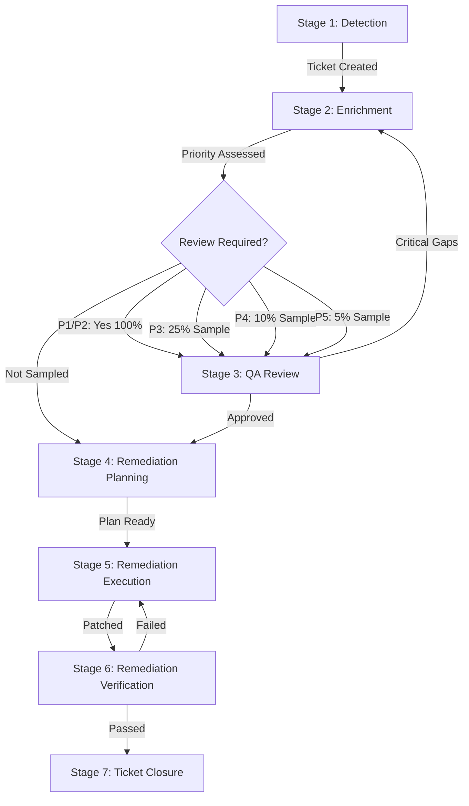

# Complete Vulnerability Lifecycle Guide

**Version:** 1.0
**Last Updated:** 2025-11-08
**Audience:** Security Operations Managers, Security Analysts, Security Reviewers, DevOps Teams

---

## Overview

This guide provides comprehensive documentation of the complete vulnerability lifecycle from detection through closure. It covers all workflows, team handoffs, responsibilities, SLA tracking, and metrics capture for the bmad-1898-engineering security operations framework.

### Purpose

Understanding the end-to-end vulnerability management process enables teams to:

- **Understand workflow stages**: Know what happens at each step from detection to closure
- **Clarify responsibilities**: Understand which roles are responsible for each action
- **Manage handoffs**: Execute smooth transitions between teams
- **Track SLAs**: Monitor and meet service level agreements
- **Capture metrics**: Measure performance and identify improvement opportunities
- **Maintain audit compliance**: Preserve complete audit trails for security reviews

### Key Concepts

- **7-Stage Lifecycle**: Detection → Enrichment → QA Review → Remediation Planning → Remediation Execution → Verification → Closure
- **Priority-Based Review**: P1/P2 vulnerabilities receive 100% mandatory review; P3-P5 use sampling
- **SLA-Driven Process**: Each priority level has defined remediation SLAs (P1: 24hr, P2: 7d, P3: 30d, P4: 90d, P5: Best effort)
- **Quality Assurance**: Structured review process ensures enrichment accuracy and completeness
- **Complete Audit Trail**: All actions, transitions, and artifacts logged for compliance

---

## Table of Contents

1. [Lifecycle Overview](#lifecycle-overview)
2. [Stage 1: Detection](#stage-1-detection)
3. [Stage 2: Enrichment](#stage-2-enrichment)
4. [Stage 3: Quality Assurance Review](#stage-3-quality-assurance-review)
5. [Stage 4: Remediation Planning](#stage-4-remediation-planning)
6. [Stage 5: Remediation Execution](#stage-5-remediation-execution)
7. [Stage 6: Remediation Verification](#stage-6-remediation-verification)
8. [Stage 7: Ticket Closure](#stage-7-ticket-closure)
9. [JIRA Status Transitions](#jira-status-transitions)
10. [Role Responsibility Matrix (RACI)](#role-responsibility-matrix-raci)
11. [Handoff Procedures](#handoff-procedures)
12. [SLA Tracking and Escalation](#sla-tracking-and-escalation)
13. [Metrics and Audit Trail](#metrics-and-audit-trail)
14. [Complete Lifecycle Example](#complete-lifecycle-example)
15. [Troubleshooting and FAQ](#troubleshooting-and-faq)

---

## Lifecycle Overview

The vulnerability lifecycle consists of 7 sequential stages, with conditional branching for quality review based on priority:



### Typical Durations by Priority

> **Important Note**: The duration estimates below represent **typical observed performance** based on workflow complexity analysis and may vary significantly based on:
>
> - Vulnerability complexity and severity
> - Analyst/reviewer experience level
> - Organizational processes and tooling
> - System environment and infrastructure
>
> These estimates are provided for **planning and expectation-setting purposes** and are **not strict requirements or SLAs**. Actual durations should be tracked via metrics and adjusted based on your organization's performance.

#### P1 (Critical) - Total: 18-30 hours (24hr SLA)

- Detection: Immediate
- Enrichment: 10-15 minutes
- Review: 15-20 minutes (100% reviewed)
- Remediation Planning: 1-2 hours
- Remediation Execution: 2-12 hours (emergency change)
- Verification: 1-4 hours
- Closure: 5 minutes

#### P2 (High) - Total: 3-7 days (7d SLA)

- Detection: Immediate
- Enrichment: 10-15 minutes
- Review: 15-20 minutes (100% reviewed)
- Remediation Planning: 4-8 hours
- Remediation Execution: 2-5 days (scheduled maintenance)
- Verification: 4-12 hours
- Closure: 5 minutes

#### P3 (Medium) - Total: 15-30 days (30d SLA)

- Similar stages with more time for planning and scheduling
- 25% of tickets receive quality review

#### P4 (Low) - Total: 60-90 days (90d SLA)

- Longer planning cycles, batch remediation
- 10% of tickets receive quality review

#### P5 (Trivial) - Best effort (no SLA)

- May be resolved in next major upgrade cycle
- 5% of tickets receive quality review

---

## Stage 1: Detection

### Overview

Detection is the initial identification of a vulnerability through automated scanners, security feeds, or manual assessment. This stage creates the JIRA ticket that will track the vulnerability through its complete lifecycle.

### Details

| Attribute               | Value                                                                        |
| ----------------------- | ---------------------------------------------------------------------------- |
| **JIRA Status**         | Open                                                                         |
| **Typical Duration**    | Immediate (automated), <15 minutes (manual)                                  |
| **Primary Responsible** | Vulnerability Management Platform (automated) or Security Team Lead (manual) |
| **SLA Impact**          | Detection timestamp starts the SLA clock                                     |

### Trigger Events

- Vulnerability scanner alert (Qualys, Nessus, Rapid7, etc.)
- Security feed notification (CISA KEV, vendor advisory)
- Manual security assessment finding
- Penetration test result
- Bug bounty report

### Entry Criteria

- Vulnerability identified
- Basic details available (CVE ID or description)

### Actions

1. **Automated or manual JIRA ticket creation**
2. **Populate ticket with initial details:**
   - Summary: CVE ID + product + vulnerability type
   - Description: Initial finding details
   - Reporter: Scanner name or analyst name
   - Project: Vulnerability management project (e.g., AOD, SEC)
3. **Assign to Security Analyst** (round-robin or least-loaded)
4. **Set initial priority** (if scanner provides severity)
5. **Log detection timestamp** (SLA start)

### Exit Criteria

- JIRA ticket created with minimum fields populated
- Ticket assigned to Security Analyst
- Detection timestamp logged

### Outputs

- JIRA ticket (Open status)
- Detection timestamp
- Initial assignment

### Common Issues and Solutions

| Issue                                                 | Solution                                     |
| ----------------------------------------------------- | -------------------------------------------- |
| **Duplicate detection** (same CVE, multiple scanners) | De-duplicate, link related tickets           |
| **CVE ID missing from scanner**                       | Analyst must research during enrichment      |
| **False positive from scanner**                       | Triage and close if confirmed false positive |

---

## Stage 2: Enrichment

### Overview

Enrichment is the comprehensive analysis phase where Security Analysts research the vulnerability, assess business context, plan remediation, and assign priority using a multi-factor assessment framework.

### Details

| Attribute               | Value                                       |
| ----------------------- | ------------------------------------------- |
| **JIRA Status**         | In Progress                                 |
| **Typical Duration**    | 10-15 minutes (config.yaml max: 20 minutes) |
| **Primary Responsible** | Security Analyst                            |
| **Quality Target**      | ≥75% quality score (self-assessment)        |

### Trigger

- Ticket assigned to Security Analyst

### Entry Criteria

- JIRA ticket exists in Open status
- Analyst available to perform enrichment

### Actions

1. **Security Analyst activates Security Analyst agent**: `/bmad-1898:agents:security-analyst`
2. **Run enrichment workflow**: `*enrich-ticket {ticket-id}`
3. **Execute 8-stage enrichment workflow** (see [Security Alert Enrichment Workflow Deep Dive](enrichment-workflow-deep-dive.md) for details):
   - **Stage 1**: Triage & Context Extraction
   - **Stage 2**: AI-Assisted CVE Research
   - **Stage 3**: Business Context Assessment
   - **Stage 4**: Remediation Planning
   - **Stage 5**: MITRE ATT&CK Mapping
   - **Stage 6**: Multi-Factor Priority Assessment
   - **Stage 7**: Structured Documentation
   - **Stage 8**: JIRA Update & Validation
4. **Post enrichment as JIRA comment**
5. **Update JIRA custom fields** (CVSS, EPSS, KEV, Priority, ACR, Exposure, etc.)
6. **Save local enrichment file**: `enrichments/{ticket-id}-enrichment.md`
7. **Log enrichment metrics**

### Exit Criteria

- Enrichment complete (all 8 stages)
- JIRA comment posted
- Custom fields updated
- Priority assigned (P1-P5)
- Quality score ≥75% (self-assessment)

### Outputs

- **JIRA enrichment comment** (12 sections)
- **JIRA custom fields updated** (8 fields)
- **Local enrichment file**: `enrichments/{ticket-id}-enrichment.md`
- **Enrichment metrics entry**
- **Priority assigned**: P1-P5

### Post-Enrichment Workflow

The `lifecycle_workflow.py` script automatically determines if review is required:

- **P1/P2**: Transition to "In Review", assign reviewer (100% mandatory)
- **P3**: 25% random sample → "In Review" or "Remediation Planning"
- **P4**: 10% random sample → "In Review" or "Remediation Planning"
- **P5**: 5% random sample → "In Review" or "Remediation Planning"

### Common Issues and Solutions

| Issue                             | Solution                               |
| --------------------------------- | -------------------------------------- |
| **Enrichment exceeds 15 minutes** | Complete anyway, note in analyst notes |
| **Low quality score (<75%)**      | Self-review and improve before posting |
| **JIRA update fails**             | Save locally, manual JIRA update       |

### Related Documentation

- [Security Analyst Agent Usage Guide](security-analyst-agent.md)
- [Security Alert Enrichment Workflow Deep Dive](enrichment-workflow-deep-dive.md)

---

## Stage 3: Quality Assurance Review

### Overview

Quality Assurance Review is a structured evaluation of enrichment quality performed by Security Reviewers. Reviews are mandatory for P1/P2 (100%) and use sampling for P3-P5 to balance quality assurance with resource efficiency.

### Details

| Attribute               | Value                                       |
| ----------------------- | ------------------------------------------- |
| **JIRA Status**         | In Review                                   |
| **Typical Duration**    | 15-20 minutes (config.yaml max: 25 minutes) |
| **Primary Responsible** | Security Reviewer                           |
| **Quality Threshold**   | ≥60% to approve                             |

### Trigger

Priority-based review triggering:

- **P1/P2**: 100% mandatory, blocking
- **P3**: 25% sampling, non-blocking
- **P4**: 10% sampling, non-blocking
- **P5**: 5% sampling, non-blocking

### Entry Criteria

- Enrichment complete
- Review required (mandatory or sampled)
- Reviewer available

### Actions

1. **Reviewer assigned automatically** (least-loaded for P1/P2, round-robin for P3-P5)
2. **JIRA comment posted**: "Quality review required for [ticket-id]"
3. **Security Reviewer activates Security Reviewer agent**: `/bmad-1898:agents:security-reviewer`
4. **Run review workflow**: `*review-enrichment {ticket-id}`
5. **Execute 7-stage review workflow** (see [Security Analysis Review Workflow Deep Dive](review-workflow-deep-dive.md) for details):
   - **Stage 1**: Review Preparation
   - **Stage 2**: Systematic Quality Evaluation (8 dimensions)
   - **Stage 3**: Gap Identification & Categorization
   - **Stage 4**: Cognitive Bias Detection
   - **Stage 5**: Fact Verification (P1/P2 mandatory, P3-P5 optional)
   - **Stage 6**: Review Report Documentation
   - **Stage 7**: Feedback & Improvement Loop
6. **Post review report as JIRA comment**
7. **Save local review file**: `reviews/{ticket-id}-review.md`
8. **Log review metrics**

### Exit Criteria

- Review complete (all 7 stages)
- Quality score calculated
- Review report posted to JIRA
- Approval decision made

### Outputs

- **JIRA review comment** (12 sections)
- **Quality score and classification** (Excellent/Good/Acceptable/Needs Improvement/Unacceptable)
- **Gap findings** (Critical/Significant/Minor)
- **Approval status** (Approved / Return to Analyst)
- **Local review file**: `reviews/{ticket-id}-review.md`
- **Review metrics entry**

### Post-Review Workflow

- **If Critical gaps found**: Transition to "In Progress", assign to original analyst
- **If Approved** (no Critical gaps, quality ≥60%): Transition to "Remediation Planning"
- **If multiple iterations**: Track re-review count, escalate after 2 returns

### Handoff Procedures

> **Note**: The handoff procedures and response time expectations below are **proposed guidelines** based on operational best practices. Organizations should define handoff SLAs based on their team size, structure, and operational requirements.

#### Analyst → Reviewer

- Analyst completes enrichment
- Automatic JIRA assignment to reviewer
- JIRA notification to reviewer
- **Response expectation**: Review within 24 hours (P1/P2) or 3 days (P3-P5)

#### Reviewer → Analyst (if critical gaps)

- Review report posted
- JIRA re-assigned to analyst
- **Response expectation**: Analyst addresses gaps within SLA timeline
- Analyst posts update comment addressing each gap

#### Reviewer → DevOps (if approved)

- Review report posted with approval
- JIRA transitioned to "Remediation Planning"
- Optionally assigned to DevOps team or team lead
- DevOps expected to review remediation guidance and plan execution

### Common Issues and Solutions

| Issue                                     | Solution                                                     |
| ----------------------------------------- | ------------------------------------------------------------ |
| **Reviewer unavailable**                  | Fallback to next available reviewer in pool                  |
| **Analyst disagrees with review finding** | Use conversation starters, escalate to manager if unresolved |
| **Review takes >20 minutes**              | Complete anyway, note complexity in review report            |

### Related Documentation

- [Security Reviewer Agent Usage Guide](security-reviewer-agent.md)
- [Security Analysis Review Workflow Deep Dive](review-workflow-deep-dive.md)
- [Priority-Based Review Triggering Reference](../stories/5.7.priority-based-review-triggering-reference.md)

---

## Stage 4: Remediation Planning

### Overview

Remediation Planning is where DevOps/SysAdmin teams review enrichment guidance and create executable remediation plans including patch deployment, maintenance windows, and change management.

### Details

| Attribute               | Value                                                            |
| ----------------------- | ---------------------------------------------------------------- |
| **JIRA Status**         | Remediation Planning                                             |
| **Typical Duration**    | 1-2 hours (P1), 4-8 hours (P2), days (P3/P4/P5)                  |
| **Primary Responsible** | DevOps Team, System Administration, Engineering Team             |
| **Support**             | Security Analyst (clarifications), Change Management (approvals) |

### Trigger

- Enrichment approved (review passed or sampling skipped)

### Entry Criteria

- Enrichment complete with priority assigned
- Quality review passed (if applicable)
- Remediation guidance provided in enrichment

### Actions

1. **DevOps/SysAdmin team reviews enrichment** (JIRA comment)
2. **Review remediation guidance**:
   - Patch version and installation method
   - Workarounds if patch delayed
   - Compensating controls
   - Verification steps
3. **Assess remediation approach**:
   - Patch immediately (P1 emergency change)
   - Schedule maintenance window (P2/P3 standard change)
   - Batch with other updates (P4/P5)
4. **Create remediation plan**:
   - Systems to patch (from affected systems list)
   - Patch method (manual, automation, orchestration tool)
   - Testing requirements (dev/staging before production)
   - Rollback plan
   - Estimated downtime
5. **Schedule maintenance window** (if required):
   - Coordinate with business stakeholders
   - Create change request (if change management required)
   - Update JIRA with planned execution date
6. **Post remediation plan as JIRA comment**

### Exit Criteria

- Remediation plan documented
- Maintenance window scheduled (if required)
- Change request approved (if required)
- Ready to execute

### Outputs

- **Remediation plan** (JIRA comment)
- **Maintenance window scheduled**
- **Change request ticket** (linked)
- **Execution readiness confirmed**

### Handoff Procedures

#### Security → DevOps

- Security posts enrichment with remediation guidance
- JIRA assigned to DevOps team or specific engineer
- DevOps acknowledges receipt (JIRA comment or assignment acceptance)
- **Response expectation**:
  - P1: 2 hours
  - P2: 24 hours
  - P3: 3 days
- DevOps questions posted as JIRA comments, security analyst responds

### Common Issues and Solutions

| Issue                                                | Solution                                             |
| ---------------------------------------------------- | ---------------------------------------------------- |
| **Remediation guidance unclear**                     | DevOps requests clarification from analyst           |
| **Patch not compatible with production environment** | DevOps proposes alternative approach                 |
| **Maintenance window unavailable within SLA**        | Escalate to management, assess compensating controls |
| **Change freeze** (holiday blackout period)          | Apply compensating controls, schedule post-freeze    |

---

## Stage 5: Remediation Execution

### Overview

Remediation Execution is the actual deployment of patches, configuration changes, workarounds, and compensating controls to affected systems.

### Details

| Attribute               | Value                                                                       |
| ----------------------- | --------------------------------------------------------------------------- |
| **JIRA Status**         | Remediation In Progress                                                     |
| **Typical Duration**    | P1: 2-12 hours, P2: 2-5 days, P3: 1-2 weeks, P4: 3-4 weeks, P5: Best effort |
| **Primary Responsible** | DevOps Team, System Administration                                          |
| **Support**             | Application Teams (functionality testing), Security Analyst (questions)     |

### Trigger

- Remediation plan approved
- Maintenance window reached

### Entry Criteria

- Remediation plan complete
- Maintenance window approved
- Necessary access and resources available

### Actions

1. **Execute remediation per plan**:
   - Deploy patches to affected systems
   - Apply configuration changes
   - Implement workarounds (if patch delayed)
   - Deploy compensating controls
2. **Document execution**:
   - Systems patched (with timestamps)
   - Patch versions applied
   - Issues encountered and resolution
   - Execution notes
3. **Test functionality post-remediation**:
   - Application smoke tests
   - Service health checks
   - Performance validation
4. **Update JIRA with execution status**:
   - Post execution summary as comment
   - Update custom field: "Remediation Date"
   - Link to change request ticket

### Exit Criteria

- Patches applied to all affected systems
- Functionality verified
- Execution documented
- Ready for verification scan

### Outputs

- **Patched systems list**
- **Execution notes** (JIRA comment)
- **Functionality test results**
- **Change request completion**

### Common Issues and Solutions

| Issue                             | Solution                                                    |
| --------------------------------- | ----------------------------------------------------------- |
| **Patch fails on some systems**   | Troubleshoot, apply workarounds, document exceptions        |
| **Application breaks post-patch** | Rollback per plan, investigate, retry                       |
| **Maintenance window exceeded**   | Complete critical systems, schedule follow-up for remaining |

---

## Stage 6: Remediation Verification

### Overview

Remediation Verification confirms that the vulnerability has been successfully remediated through re-scanning and functional validation.

### Details

| Attribute               | Value                                           |
| ----------------------- | ----------------------------------------------- |
| **JIRA Status**         | Verification                                    |
| **Typical Duration**    | 1-4 hours (scan execution and analysis)         |
| **Primary Responsible** | Security Analyst or DevOps (cross-verification) |
| **Support**             | Application Teams (if functional issues)        |

### Trigger

- Remediation execution complete

### Entry Criteria

- Patches applied
- Systems stable (no immediate rollbacks)
- Ready for verification scan

### Actions

1. **Re-scan affected systems**:
   - Use same scanner that detected vulnerability
   - Or use alternative scanner for cross-validation
   - Scan all systems listed in "Affected Systems"
2. **Analyze scan results**:
   - Verify vulnerability no longer present
   - Check patch version matches expected
   - Confirm CVSS/CVE no longer flagged
3. **Functional validation**:
   - Application functionality verified (from Stage 5)
   - No new issues introduced
   - Performance acceptable
4. **Document verification**:
   - Scan results attached to JIRA
   - Verification status: Passed / Failed
   - If failed: Root cause analysis, systems still vulnerable
5. **Update JIRA with verification results**

### Exit Criteria

- Verification scan complete
- Results analyzed
- Pass/Fail decision made

### Outputs

- **Verification scan results** (attached to JIRA)
- **Verification status** (JIRA comment)
- **Decision**: Pass → Proceed to Closure, Fail → Return to Remediation Execution with root cause

### Decision Logic

#### Pass Criteria

- Vulnerability no longer detected in scan
- Patch version confirmed on all systems
- Functionality verified

#### Fail Criteria

- Vulnerability still detected on any system
- Patch version incorrect or missing
- New issues introduced

### Handoff Procedures

#### DevOps → Security (verification request)

- DevOps completes remediation
- JIRA transitioned to "Verification"
- Assigned to Security Analyst for verification scan
- **Response expectation**: Scan within 24 hours (P1/P2) or 48 hours (P3-P5)

#### Security → DevOps (if verification failed)

- Scan results posted to JIRA
- Root cause documented
- JIRA re-assigned to DevOps
- DevOps investigates and re-remediates

### Common Issues and Solutions

| Issue                                                              | Solution                                            |
| ------------------------------------------------------------------ | --------------------------------------------------- |
| **Scan false negative** (vulnerability fixed but scanner outdated) | Manual verification, update scanner                 |
| **Scan false positive** (still flagged but actually patched)       | Verify patch version manually, close with exception |
| **Partial remediation** (some systems patched, others not)         | Identify gap, complete remediation                  |

---

## Stage 7: Ticket Closure

### Overview

Ticket Closure is the final lifecycle stage where the ticket is closed, artifacts are archived, and final metrics are logged to complete the audit trail.

### Details

| Attribute               | Value                                     |
| ----------------------- | ----------------------------------------- |
| **JIRA Status**         | Closed                                    |
| **Typical Duration**    | 5-10 minutes                              |
| **Primary Responsible** | Security Analyst or automated workflow    |
| **Support**             | Security Manager (lessons learned review) |

### Trigger

- Verification passed

### Entry Criteria

- Verification scan passed
- All affected systems remediated
- No outstanding issues

### Actions

1. **Final JIRA update**:
   - Post closure comment with summary
   - Update "Resolution Date" custom field
   - Set "Resolution" to "Fixed" (or "False Positive" / "Risk Accepted" if applicable)
2. **Archive artifacts**:
   - Enrichment file: `enrichments/{ticket-id}-enrichment.md` (keep indefinitely)
   - Review file: `reviews/{ticket-id}-review.md` (if reviewed)
   - Scan results: Attached to JIRA, exported if needed
   - Execution notes: Preserved in JIRA comments
3. **Log final metrics**:
   - Append to `metrics/lifecycle-metrics.csv`:
     - ticket_id, cve_id, priority, detection_ts, enrichment_ts, review_ts (if applicable)
     - remediation_start_ts, remediation_end_ts, verification_ts, closure_ts
     - mttr (detection to closure), total_duration, sla_met (yes/no)
     - enrichment_quality_score, review_quality_score (if reviewed)
4. **Capture lessons learned** (optional but recommended):
   - What went well
   - What could be improved
   - Process improvements identified
   - Post to JIRA comment or retrospective doc
5. **Close JIRA ticket**
6. **Send closure notification** (if configured)

### Exit Criteria

- JIRA ticket closed
- All metrics logged
- Artifacts archived

### Outputs

- **Closed JIRA ticket**
- **Complete metrics entry**
- **Archived enrichment/review files**
- **Lessons learned** (optional)

### Metrics Captured

| Metric                            | Description                                   |
| --------------------------------- | --------------------------------------------- |
| **Detection to Enrichment**       | Time to enrich after detection                |
| **Enrichment to Review**          | Time to review (if applicable)                |
| **Review to Remediation**         | Time to start remediation planning            |
| **Remediation to Verification**   | Time to remediate                             |
| **Verification to Closure**       | Time to close                                 |
| **MTTR (Mean Time To Remediate)** | Detection to Closure                          |
| **Total Lifecycle Duration**      | Detection to Closure                          |
| **SLA Met**                       | Yes/No (based on priority SLA)                |
| **Quality Scores**                | Enrichment and review quality (if applicable) |

### Audit Trail

- All JIRA status transitions logged
- All JIRA comments preserved
- All custom field updates logged
- All enrichment/review files archived
- All metrics logged to CSV
- Complete timeline reconstructable from JIRA history

---

## JIRA Status Transitions

### Workflow Diagram

```
Open → In Progress (analyst starts enrichment)
  ↓
In Progress → In Review (if P1/P2 or sampled P3-P5)
In Progress → Remediation Planning (if P3-P5 not sampled)
  ↓
In Review → In Progress (if critical gaps found - re-enrichment)
In Review → Remediation Planning (if approved)
  ↓
Remediation Planning → Remediation In Progress (plan approved)
  ↓
Remediation In Progress → Verification (remediation complete)
  ↓
Verification → Remediation In Progress (if verification failed)
Verification → Closed (if verification passed)
```

### Transition Rules

| Transition                                         | Trigger                         | Who Can Execute                |
| -------------------------------------------------- | ------------------------------- | ------------------------------ |
| **Open → In Progress**                             | Analyst starts enrichment       | Analyst (manual or auto)       |
| **In Progress → In Review**                        | Priority P1/P2 or sampled P3-P5 | `lifecycle_workflow.py` (auto) |
| **In Progress → Remediation Planning**             | P3-P5 not sampled               | `lifecycle_workflow.py` (auto) |
| **In Review → In Progress**                        | Critical gaps found             | Reviewer (manual)              |
| **In Review → Remediation Planning**               | Approved                        | Reviewer (manual or auto)      |
| **Remediation Planning → Remediation In Progress** | Execution starts                | DevOps (manual)                |
| **Remediation In Progress → Verification**         | Remediation complete            | DevOps (manual)                |
| **Verification → Remediation In Progress**         | Verification failed             | Analyst (manual)               |
| **Verification → Closed**                          | Verification passed             | Analyst (manual)               |

### Workflow Permissions

- **Analysts**: Can transition Open → In Progress, In Progress → In Review, Verification → Closed
- **Reviewers**: Can transition In Review → In Progress, In Review → Remediation Planning
- **DevOps**: Can transition Remediation Planning → Remediation In Progress, Remediation In Progress → Verification
- **Managers**: Can transition any status (override permissions)

---

## Role Responsibility Matrix (RACI)

> **Note**: This RACI matrix is **proposed documentation** based on workflow analysis and role responsibilities derived from the lifecycle stages. Organizations should adapt this matrix to their specific team structure and operational model.

| Stage                        | Security Analyst   | Security Reviewer | DevOps/SysAdmin | Security Manager |
| ---------------------------- | ------------------ | ----------------- | --------------- | ---------------- |
| **1. Detection**             | I (Informed)       | -                 | -               | A (Accountable)  |
| **2. Enrichment**            | R (Responsible), A | C (Consulted)     | I               | I                |
| **3. QA Review**             | C                  | R, A              | I               | I                |
| **4. Remediation Planning**  | C                  | I                 | R, A            | I                |
| **5. Remediation Execution** | I                  | -                 | R, A            | I                |
| **6. Verification**          | R, A               | I                 | C               | I                |
| **7. Closure**               | R, A               | I                 | I               | I                |
| **SLA Monitoring**           | I                  | I                 | I               | R, A             |
| **Escalation Handling**      | C                  | C                 | C               | R, A             |

### Legend

- **R**: Responsible (does the work)
- **A**: Accountable (final authority/decision)
- **C**: Consulted (input requested)
- **I**: Informed (kept updated)

### Role Descriptions

#### Security Analyst

**Primary Responsibilities**:

- Perform enrichment (Stage 2)
- Execute verification scans (Stage 6)
- Close tickets (Stage 7)
- Address review feedback

**Key Activities**:

- CVE research and analysis
- Business context assessment
- Remediation guidance documentation
- Quality self-assessment

#### Security Reviewer

**Primary Responsibilities**:

- Conduct quality reviews (Stage 3)
- Provide constructive feedback
- Approve or return enrichments

**Key Activities**:

- Systematic quality evaluation
- Gap identification
- Fact verification (P1/P2)
- Cognitive bias detection

#### DevOps/SysAdmin

**Primary Responsibilities**:

- Plan remediation (Stage 4)
- Execute patches/changes (Stage 5)
- Coordinate maintenance windows

**Key Activities**:

- Remediation plan creation
- Patch deployment
- Change management
- Rollback execution (if needed)

#### Security Manager

**Primary Responsibilities**:

- Monitor SLAs
- Handle escalations
- Process improvement oversight

**Key Activities**:

- Dashboard monitoring
- Escalation response
- Team coordination
- Executive reporting

---

## Handoff Procedures

> **Note**: The handoff procedures and response time expectations below are **proposed guidelines** based on operational best practices. Organizations should define handoff SLAs based on their team size, structure, and operational requirements.

### 1. Analyst → Reviewer (Post-Enrichment)

**Trigger**: Enrichment complete, priority requires review

**Process**:

1. Analyst completes enrichment workflow
2. `lifecycle_workflow.py` determines review required
3. JIRA automatically transitions to "In Review"
4. Reviewer assigned (least-loaded for P1/P2, round-robin for P3-P5)
5. JIRA notification sent to reviewer
6. Email/Slack notification (if configured)

**Response Expectations**:

- **P1/P2**: Review within 24 hours
- **P3-P5**: Review within 3 days

**Handoff Checklist**:

- [ ] Enrichment comment posted to JIRA
- [ ] Custom fields updated
- [ ] Quality score ≥75%
- [ ] All 12 enrichment sections complete
- [ ] JIRA status = "In Review"
- [ ] Reviewer assigned

---

### 2. Reviewer → Analyst (Critical Gaps Found)

**Trigger**: Review identifies Critical gaps requiring re-work

**Process**:

1. Reviewer completes review, identifies Critical gaps
2. Review report posted to JIRA
3. JIRA re-assigned to original analyst
4. JIRA transitioned back to "In Progress"
5. Analyst notification sent

**Response Expectations**:

- Analyst addresses gaps within remaining SLA time
- Analyst posts update comment for each gap addressed
- Re-enrichment follows same workflow

**Handoff Checklist**:

- [ ] Review report posted to JIRA
- [ ] Critical gaps clearly documented
- [ ] Constructive feedback provided
- [ ] JIRA re-assigned to analyst
- [ ] JIRA status = "In Progress"

**Escalation**: If 2+ returns occur, escalate to Security Manager

---

### 3. Reviewer → DevOps (Approved for Remediation)

**Trigger**: Review approved (quality ≥60%, no Critical gaps)

**Process**:

1. Reviewer approves enrichment
2. Review report posted with approval
3. JIRA transitioned to "Remediation Planning"
4. JIRA assigned to DevOps team or specific engineer
5. DevOps notification sent

**Response Expectations**:

- **P1**: DevOps reviews within 2 hours
- **P2**: DevOps reviews within 24 hours
- **P3**: DevOps reviews within 3 days

**Handoff Checklist**:

- [ ] Review report posted with approval
- [ ] Remediation guidance clear and actionable
- [ ] Affected systems list complete
- [ ] Priority and SLA clearly documented
- [ ] JIRA status = "Remediation Planning"
- [ ] DevOps assigned

---

### 4. DevOps → Security (Verification Request)

**Trigger**: Remediation execution complete

**Process**:

1. DevOps completes patch deployment
2. Execution summary posted to JIRA
3. JIRA transitioned to "Verification"
4. JIRA assigned to Security Analyst
5. Analyst notification sent

**Response Expectations**:

- **P1/P2**: Scan within 24 hours
- **P3-P5**: Scan within 48 hours

**Handoff Checklist**:

- [ ] Execution summary posted
- [ ] All affected systems patched
- [ ] Patch versions documented
- [ ] Functionality tests passed
- [ ] JIRA status = "Verification"
- [ ] Security Analyst assigned

---

### 5. Security → DevOps (Verification Failed)

**Trigger**: Verification scan shows vulnerability still present

**Process**:

1. Analyst completes verification scan
2. Scan results posted to JIRA
3. Root cause analysis documented
4. JIRA re-assigned to DevOps
5. JIRA transitioned back to "Remediation In Progress"
6. DevOps notification sent

**Response Expectations**:

- DevOps investigates root cause immediately (within SLA)
- Re-remediation executed
- New verification requested

**Handoff Checklist**:

- [ ] Scan results attached to JIRA
- [ ] Root cause analysis documented
- [ ] Systems still vulnerable identified
- [ ] JIRA re-assigned to DevOps
- [ ] JIRA status = "Remediation In Progress"

---

## SLA Tracking and Escalation

> **Note**: SLA definitions below are sourced from Story 1.7 (authoritative source). Escalation procedures and thresholds are **proposed operational guidelines** based on industry best practices. Organizations should adjust escalation thresholds based on their operational capabilities and risk tolerance.

### SLA Definitions

**Source**: Story 1.7 Multi-Factor Priority Assessment

| Priority          | SLA         | Definition           |
| ----------------- | ----------- | -------------------- |
| **P1 (Critical)** | 24 hours    | Detection to closure |
| **P2 (High)**     | 7 days      | Detection to closure |
| **P3 (Medium)**   | 30 days     | Detection to closure |
| **P4 (Low)**      | 90 days     | Detection to closure |
| **P5 (Trivial)**  | Best effort | No SLA               |

### SLA Timing

- **SLA Start Time**: Detection timestamp (JIRA ticket created date)
- **SLA End Time**: Closure timestamp (JIRA ticket closed date) OR Verification passed timestamp

### SLA Pause Conditions (Clock Stops)

The SLA clock can be paused under specific conditions where the team is blocked by external factors:

| Pause Condition                                                     | Documentation Required                                         |
| ------------------------------------------------------------------- | -------------------------------------------------------------- |
| **Waiting on vendor response** (patch not available)                | JIRA comment with vendor ticket ID and expected ETA            |
| **Maintenance window constraints** (change freeze, blackout period) | JIRA comment with freeze dates and planned resume date         |
| **Risk acceptance process** (awaiting executive approval)           | JIRA comment with approval request ID and decision date        |
| **External dependencies** (third-party remediation)                 | JIRA comment with external party details and coordination plan |

**SLA Resume**: When blocker removed, document in JIRA, clock resumes

### SLA Escalation Procedures

#### P1 Critical - Escalation at 18 hours (75% of SLA)

- **Automatic notification** to Security Manager
- **Escalation meeting** scheduled
- **Status update** required every 4 hours
- **Executive notification** at 24 hours if not closed

**Escalation Actions**:

1. Security Manager joins incident response
2. Additional resources allocated if needed
3. Executive briefing prepared
4. Incident command structure activated

---

#### P2 High - Escalation at 5 days (71% of SLA)

- **Automatic notification** to Security Manager
- **Daily status update** required
- **DevOps manager** looped in if remediation blocked

**Escalation Actions**:

1. Daily stand-up inclusion
2. Blocker identification and removal
3. Resource reallocation if needed

---

#### P3 Medium - Escalation at 25 days (83% of SLA)

- **Notification** to Security Manager
- **Weekly status update** required

**Escalation Actions**:

1. Weekly review with team leads
2. Plan adjustment if needed

---

#### P4/P5 - Monitoring only (no escalation)

- **Quarterly review** of open P4/P5 tickets
- **Batch closure** or upgrade if needed

---

### SLA Breach Handling

When an SLA is breached, formal incident response is required:

| Priority  | Breach Response                                                                                       |
| --------- | ----------------------------------------------------------------------------------------------------- |
| **P1**    | Incident report required, Root cause analysis, Process improvement recommendations, Executive summary |
| **P2**    | Incident report required, Root cause analysis, Process improvement recommendations                    |
| **P3**    | Root cause documentation, Process review                                                              |
| **P4/P5** | Track in quarterly metrics review                                                                     |

### SLA Reporting Dashboards

**Recommended Metrics**:

1. **Current SLA Status** (red/yellow/green by ticket)
   - Red: >90% of SLA consumed
   - Yellow: 75-90% of SLA consumed
   - Green: <75% of SLA consumed

2. **SLA Compliance Rate** (% met vs. total)
   - Target: >95% for P1/P2
   - Target: >90% for P3/P4

3. **Average Time Per Stage** (identify bottlenecks)
   - Detection to Enrichment
   - Enrichment to Review
   - Review to Remediation
   - Remediation to Verification
   - Verification to Closure

4. **Aging Report** (tickets open > SLA deadline)
   - Prioritized list of overdue tickets
   - Days overdue
   - Assigned owner
   - Current blocker

---

## Metrics and Audit Trail

### Metrics Files

All metrics are logged to CSV files in the `metrics/` directory:

| File                     | Content                                                               |
| ------------------------ | --------------------------------------------------------------------- |
| `enrichment-metrics.csv` | Enrichment performance (duration, quality score, analyst)             |
| `review-metrics.csv`     | Review performance (duration, quality score, reviewer, decision)      |
| `lifecycle-metrics.csv`  | Complete lifecycle performance (MTTR, SLA compliance, all timestamps) |
| `review-decisions.csv`   | Review decision tracking (approve/return, gap categories)             |

### Lifecycle Metrics Schema

```csv
ticket_id,cve_id,priority,detection_ts,enrichment_start_ts,enrichment_end_ts,enrichment_duration_min,enrichment_quality_score,review_ts,review_duration_min,review_quality_score,review_decision,remediation_start_ts,remediation_end_ts,remediation_duration_hours,verification_ts,closure_ts,mttr_hours,total_lifecycle_hours,sla_deadline_hours,sla_met,analyst,reviewer
```

### Audit Trail Requirements

Complete audit trails are maintained through:

1. **JIRA Audit Log**:
   - All status transitions with timestamps
   - All field updates with before/after values
   - All assignments and re-assignments
   - All comments with author and timestamp

2. **Enrichment Files** (`enrichments/{ticket-id}-enrichment.md`):
   - Complete enrichment content
   - All research sources
   - All assessment decisions
   - Self-assessed quality score

3. **Review Files** (`reviews/{ticket-id}-review.md`):
   - Complete review report
   - Quality evaluation scores
   - Gap findings with evidence
   - Fact verification results

4. **Metrics CSV Files**:
   - All timestamps (detection, enrichment, review, remediation, verification, closure)
   - All durations (per stage and total)
   - All quality scores
   - SLA compliance status

5. **Scan Results**:
   - Initial detection scan (attached to JIRA)
   - Verification scan (attached to JIRA)

### Timeline Reconstruction

Any ticket's complete timeline can be reconstructed from:

1. JIRA history (all transitions and comments)
2. Enrichment file (analyst work)
3. Review file (reviewer work)
4. Metrics CSV (all timestamps)
5. Attached scan results (detection and verification)

---

## Complete Lifecycle Example

> **Note**: This is an **illustrative example** using fictional data (CVE-2024-9876, personas Alex/Riley/Jordan, systems, timestamps). The scenario demonstrates realistic workflow execution and timing but is **not based on actual incidents**. Organizations should use this as a template for documenting real lifecycle executions.

### Scenario: CVE-2024-9876 Apache Struts Remote Code Execution

**Timeline**: 36 hours (P1 Critical)

---

### Stage 1: Detection

**Time**: 2025-11-08 08:00 AM
**Duration**: Immediate (automated)

**Trigger**: Qualys scanner detects CVE-2024-9876 on prod-web-01.company.com

**Actions**:

- Qualys integration creates JIRA ticket AOD-1567
- Summary: "CVE-2024-9876 Apache Struts RCE detected on prod-web-01"
- Assigned to Alex (Security Analyst - round-robin)
- Detection timestamp: 2025-11-08 08:00:00

**Outputs**:

- JIRA AOD-1567 created, status: Open
- SLA Start: 08:00 AM, SLA Deadline: 08:00 AM Nov 9 (24 hours)

---

### Stage 2: Enrichment

**Time**: 2025-11-08 08:30 AM - 08:43 AM
**Duration**: 13 minutes

**Actions**:

Alex activates Security Analyst agent and runs: `*enrich-ticket AOD-1567`

Enrichment workflow executes all 8 stages:

1. **Triage**: Extracted CVE-2024-9876, system prod-web-01, ACR: High, Exposure: Internet
2. **CVE Research**: CVSS 9.8, EPSS 92.3%, KEV: Yes (added 2024-11-05), Struts 2.0.0-2.5.32 affected, patch: 2.5.33+
3. **Business Context**: High ACR, Internet exposure, E-commerce checkout affected
4. **Remediation**: Upgrade to Struts 2.5.33, WAF rules as compensating control
5. **ATT&CK**: T1190 Exploit Public-Facing Application
6. **Priority**: P1 (CVSS 9.8 + KEV + Internet + High ACR + Active exploitation)
7. **Documentation**: All 12 sections populated, quality score: 91/100
8. **JIRA Update**: Comment posted, fields updated

**Outputs**:

- JIRA enrichment comment (12 sections)
- Custom fields: CVSS 9.8, EPSS 92.3, KEV Yes, Priority P1, ACR High, Exposure Internet
- Local file: `enrichments/AOD-1567-enrichment.md`
- Metrics: AOD-1567, CVE-2024-9876, Alex, 08:30-08:43, 13 min, 91%, P1

---

### Post-Enrichment Automation

**Time**: 2025-11-08 08:43 AM
**Duration**: <1 minute

**Actions**:

- `lifecycle_workflow.py` executes
- Priority P1 detected → Review required: 100% (mandatory)
- Reviewer assignment: Riley (senior reviewer, least-loaded)
- JIRA transitioned: In Progress → In Review
- JIRA assigned: Alex → Riley
- Comment posted: "P1 priority - mandatory quality review required"
- Email notification sent to Riley

**Outputs**:

- JIRA AOD-1567 status: In Review, assigned to Riley

---

### Stage 3: Quality Assurance Review

**Time**: 2025-11-08 09:15 AM - 09:32 AM
**Duration**: 17 minutes

**Actions**:

Riley activates Security Reviewer agent and runs: `*review-enrichment AOD-1567`

Review workflow executes all 7 stages:

1. **Preparation**: Enrichment extracted, 12 sections parsed, claims listed
2. **Quality Evaluation**: 8 dimensions scored
   - Technical Accuracy: 95% (verified CVSS, EPSS, KEV against NVD/CISA)
   - Completeness: 100% (all sections present)
   - Actionability: 90% (clear patch guidance)
   - Contextualization: 95% (business impact well-articulated)
   - Documentation Quality: 95% (excellent formatting)
   - Attack Mapping: 100% (T1190 correct)
   - Cognitive Bias: 90% (minor confirmation bias noted)
   - Source Citation: 95% (all claims sourced)
   - **Overall Quality Score: 93.75/100 (Excellent)**
3. **Gap Identification**: 1 Significant gap - verification steps could be more detailed
4. **Cognitive Bias**: Minor confirmation bias (focused on exploitation, could balance with non-exploitation context)
5. **Fact Verification**: All P1 claims verified (CVSS, KEV, EPSS) - all accurate
6. **Review Report**: Generated with blameless constructive feedback
7. **Feedback**: Posted to JIRA, approved for remediation

**Outputs**:

- JIRA review comment (12 sections)
- Quality score: 93.75/100 (Excellent)
- 1 Significant gap (verification detail)
- Approval status: Approved
- Local file: `reviews/AOD-1567-review.md`
- Metrics: AOD-1567, Riley, 09:15-09:32, 17 min, 93.75%, Approved

---

### Post-Review Automation

**Time**: 2025-11-08 09:32 AM
**Duration**: <1 minute

**Actions**:

- Review approved (no Critical gaps)
- JIRA transitioned: In Review → Remediation Planning
- JIRA assigned: Riley → DevOps Team (Jordan - DevOps Engineer)
- Comment posted: "Quality review passed (93.75/100) - approved for remediation"
- Email notification sent to DevOps team

**Outputs**:

- JIRA AOD-1567 status: Remediation Planning, assigned to Jordan (DevOps)

---

### Stage 4: Remediation Planning

**Time**: 2025-11-08 10:00 AM - 11:30 AM
**Duration**: 1.5 hours

**Actions**:

Jordan reviews enrichment and remediation guidance:

**Assessment**:

- P1 Critical → Emergency change (no CAB approval required)
- System: prod-web-01 (production e-commerce web server)
- Patch: Apache Struts 2.5.32 → 2.5.33
- Testing: Test in staging first (1 hour), then production
- Rollback: Struts 2.5.32 package retained for quick rollback
- Downtime: 30 minutes estimated for production

**Remediation Plan** (posted to JIRA):

- Systems: prod-web-01 (staging: staging-web-01 first)
- Method: Ansible playbook (automated upgrade)
- Testing: Staging smoke tests (checkout flow, API endpoints)
- Execution window: 2025-11-08 14:00-15:00 (low-traffic period)
- Rollback: Ansible rollback playbook ready

**Coordination**:

- Coordinated with e-commerce manager (stakeholder approval)
- Emergency change ticket created: CHG-9876

**Outputs**:

- Remediation plan (JIRA comment)
- Execution window: 14:00-15:00 Nov 8
- Change ticket: CHG-9876 (emergency)
- Stakeholder approval: Confirmed

---

### Stage 5: Remediation Execution

**Time**: 2025-11-08 14:00 PM - 14:45 PM
**Duration**: 45 minutes

**Actions**:

- **14:00**: Jordan transitions JIRA to "Remediation In Progress"
- **14:05**: Execute Ansible playbook on staging-web-01
- **14:15**: Staging tests pass (checkout flow functional, Struts version confirmed: 2.5.33)
- **14:20**: Execute Ansible playbook on prod-web-01
- **14:35**: Production deployment complete, Struts 2.5.33 confirmed
- **14:40**: Production smoke tests pass (checkout flow, API health checks green)
- **14:45**: Post execution summary to JIRA

**Execution Notes** (JIRA comment):

- Staging patched successfully at 14:15
- Production patched successfully at 14:35
- Struts version confirmed: 2.5.33 on both systems
- Smoke tests passed, no rollback required
- Downtime: 28 minutes (within estimate)

**Outputs**:

- Systems patched: staging-web-01, prod-web-01
- Change ticket CHG-9876: Completed

---

### Stage 6: Remediation Verification

**Time**: 2025-11-08 16:00 PM - 17:30 PM
**Duration**: 1.5 hours

**Actions**:

- Jordan transitions JIRA to "Verification" and assigns to Alex
- **16:00**: Alex triggers Qualys re-scan of prod-web-01
- **16:45**: Qualys scan completes
- **17:00**: Alex analyzes results:
  - CVE-2024-9876: No longer detected
  - Struts version detected: 2.5.33 (patched)
  - No new vulnerabilities introduced
- **17:15**: Alex verifies functionality (manual checkout test)
- **17:30**: Verification summary posted to JIRA: **PASSED**

**Outputs**:

- Verification scan results attached to JIRA
- Verification status: PASSED (JIRA comment)
- CVE-2024-9876 no longer detected
- Functional verification: Passed

---

### Stage 7: Ticket Closure

**Time**: 2025-11-08 17:35 PM
**Duration**: 5 minutes

**Actions**:

Alex posts closure summary to JIRA:

**Closure Summary**:

- CVE-2024-9876 successfully remediated
- Struts upgraded to 2.5.33 on prod-web-01
- Verification scan confirmed vulnerability resolved
- Total lifecycle: 9 hours 35 minutes
- SLA: 24 hours (MET with 14.5 hours to spare)

**Final Updates**:

- Custom field: Resolution Date: 2025-11-08 17:35
- JIRA ticket closed: Resolution = Fixed
- Metrics logged to `lifecycle-metrics.csv`:
  - ticket_id: AOD-1567, cve_id: CVE-2024-9876, priority: P1
  - detection_ts: 2025-11-08 08:00, closure_ts: 2025-11-08 17:35
  - mttr: 9.58 hours, total_duration: 9.58 hours
  - sla_deadline: 24 hours, sla_met: YES (9.58 < 24)
  - enrichment_quality: 91%, review_quality: 93.75%

**Outputs**:

- JIRA AOD-1567 status: Closed, resolution: Fixed
- Metrics entry: MTTR 9.58 hours, SLA met
- Artifacts archived: `enrichments/AOD-1567-enrichment.md`, `reviews/AOD-1567-review.md`
- Scan results: Attached to JIRA

---

### Lessons Learned

**What Went Well**:

- Enrichment and review process worked smoothly (30 minutes total)
- Emergency change process effective for P1 (no delays)
- Ansible automation enabled fast remediation (45 minutes)

**Opportunities for Improvement**:

- Verification scan timing could be optimized (1.5 hours, could schedule immediately after patch)

**Process Improvement**:

- Configure Qualys to auto-scan after JIRA status changes to "Verification"

---

### Final SLA Performance

| Metric        | Value                                 |
| ------------- | ------------------------------------- |
| **Detection** | 08:00 AM Nov 8                        |
| **Closure**   | 17:35 PM Nov 8                        |
| **Duration**  | 9 hours 35 minutes                    |
| **SLA**       | 24 hours                              |
| **Result**    | **MET (40% of SLA used, 60% buffer)** |

---

## Troubleshooting and FAQ

### Common Issues

#### Enrichment Taking Too Long (>20 minutes)

**Symptoms**: Enrichment workflow exceeding config.yaml max duration (20 minutes)

**Causes**:

- Complex vulnerability requiring extensive research
- Multiple CVEs in single ticket
- Insufficient context in initial detection
- Network/API latency for CVE database queries

**Solutions**:

1. Complete enrichment anyway - note complexity in analyst notes
2. If multiple CVEs, consider splitting into separate tickets
3. Document research time in enrichment notes
4. Review metrics to identify patterns

---

#### Review Returns with Critical Gaps

**Symptoms**: Reviewer returns enrichment with Critical gaps requiring re-work

**Causes**:

- Missing critical information (affected systems, remediation guidance)
- Factual errors (incorrect CVSS, wrong patch version)
- Incomplete sections (missing business context, remediation steps)

**Solutions**:

1. Read review feedback carefully - each gap is documented
2. Address each gap explicitly in re-enrichment
3. Post update comment showing gap resolution
4. Improve self-review before posting enrichment
5. If 2+ returns occur, escalate to Security Manager

---

#### Verification Scan Still Shows Vulnerability

**Symptoms**: Post-remediation scan still flags vulnerability as present

**Causes**:

- Patch not applied correctly
- Patch version incorrect
- Scanner database outdated (false positive)
- Partial remediation (some systems missed)

**Solutions**:

1. **Verify patch version manually**: SSH to system, check package version
2. **Check scanner database version**: Update scanner if outdated
3. **Review affected systems list**: Ensure all systems were patched
4. **Re-run remediation** if patch failed
5. **Document exception** if scanner false positive confirmed

---

#### SLA Approaching Deadline

**Symptoms**: Ticket nearing SLA escalation threshold (75-90% consumed)

**Causes**:

- Blocked on external dependency (vendor patch not available)
- Maintenance window unavailable
- Complex remediation requiring extensive testing
- Resource constraints

**Solutions**:

1. **Document blocker** in JIRA comment
2. **Pause SLA clock** if waiting on external factors
3. **Escalate to Security Manager** for resource allocation
4. **Assess compensating controls** if remediation delayed
5. **Coordinate emergency maintenance** if P1/P2 and approaching breach

---

### FAQ

**Q: What happens if a P3 ticket is sampled for review but analyst disagrees?**

A: P3 reviews are non-blocking - even if reviewed and gaps found, the ticket can proceed to remediation. However, addressing review feedback improves quality and analyst skill development.

**Q: Can I skip enrichment stages if information is not available?**

A: No. All 8 enrichment stages are required. If information is unavailable (e.g., vendor hasn't published patch), document "Not yet available - monitoring vendor advisory" in that section.

**Q: What if DevOps can't remediate within SLA due to change freeze?**

A: Pause the SLA clock by documenting the freeze in a JIRA comment. Assess compensating controls (WAF rules, network segmentation) to reduce risk during freeze. Resume SLA when freeze lifts.

**Q: Do I need to re-scan after applying a workaround instead of a patch?**

A: Yes. Verification is required regardless of remediation method. For workarounds, verification may be manual (check configuration) rather than automated scan.

**Q: Can Security Manager close tickets without verification?**

A: Yes, managers have override permissions. However, proper process is to complete verification before closure to maintain audit trail and metrics accuracy.

**Q: What if the same CVE affects 100 systems?**

A: Create ONE enrichment for the CVE (detailing all affected systems). Remediation may be executed in batches, but all batches track to the same ticket. Update affected systems list as batches complete.

**Q: How do I handle false positives detected by scanners?**

A: Enrich the ticket normally, but in Business Context Assessment section, document why it's a false positive (e.g., "System not vulnerable - uses different code path"). Priority will likely be P5. Close with Resolution = "False Positive" after confirmation.

---

## Related Documentation

- [Installation & Initial Setup Guide](../stories/5.1.installation-initial-setup-guide.md)
- [Security Analyst Agent Usage Guide](security-analyst-agent.md)
- [Security Reviewer Agent Usage Guide](security-reviewer-agent.md)
- [Security Alert Enrichment Workflow Deep Dive](enrichment-workflow-deep-dive.md)
- [Security Analysis Review Workflow Deep Dive](review-workflow-deep-dive.md)
- [Priority-Based Review Triggering Reference](../stories/5.7.priority-based-review-triggering-reference.md)
- [Configuration Reference & Customization Guide](configuration-reference.md)
- [Metrics, Reporting & Continuous Improvement](../stories/5.9.metrics-reporting-continuous-improvement.md)

---

## Version History

| Version | Date       | Changes         | Author   |
| ------- | ---------- | --------------- | -------- |
| 1.0     | 2025-11-08 | Initial release | Dev Team |

---

**Document ID**: bmad-1898-engineering-lifecycle-guide-v1.0
**Classification**: Internal Use
**Owner**: Security Operations Team
