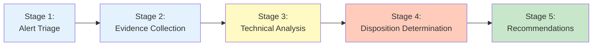
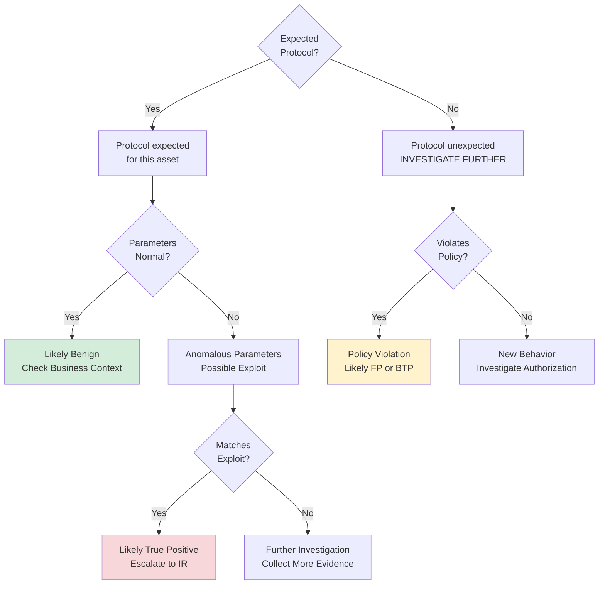
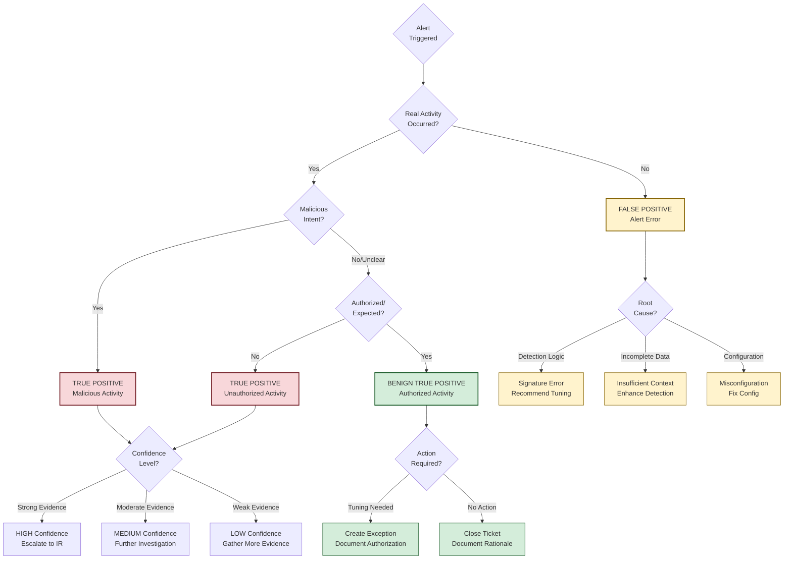

# Event Investigation Workflow: Deep Dive

## Overview

This document provides an in-depth walkthrough of the Security Analyst event investigation workflow for ICS/IDS/SIEM alerts. It expands on the `*investigate-event` command documentation with detailed examples, decision trees, platform-specific guidance, and real-world scenarios.

**Target Audience:**
- Security analysts new to event investigation
- Experienced analysts seeking methodology standardization
- Training coordinators teaching investigation workflows
- Team leads conducting quality assessments

**What This Guide Covers:**
- Complete investigation methodology (5 stages)
- Platform-specific scenarios (Claroty ICS, Snort IDS, Splunk SIEM)
- Disposition decision framework (TP/FP/BTP)
- Evidence collection techniques
- Common pitfalls and mitigation strategies
- Advanced investigation techniques

---

## Investigation Methodology Framework

The event investigation workflow is based on **NIST SP 800-61 Rev 2: Computer Security Incident Handling Guide** with adaptations for OT/ICS environments.

### Core Principles

1. **Hypothesis-Driven Investigation:** Form hypotheses, test against evidence, iterate
2. **Evidence-Based Decisions:** Every disposition must be supported by specific evidence
3. **Systematic Approach:** Follow consistent methodology for reliability and auditability
4. **Bias Awareness:** Recognize and mitigate cognitive biases throughout investigation
5. **Context Matters:** Business and operational context inform risk assessment

### Investigation Stages



---

## Stage 1: Alert Triage (2-3 minutes)

### Objective

Extract critical metadata and establish investigation scope.

### Key Actions

1. **Identify Alert Platform**
   - Claroty (ICS/OT detection)
   - Snort (Network IDS signatures)
   - Splunk (SIEM correlation rules)
   - Other (specify)

2. **Extract Alert Metadata**
   - Platform rule ID
   - Severity classification (Critical/High/Medium/Low)
   - Detection timestamp
   - Alert description/signature name

3. **Document Network Identifiers**
   - Source IP address
   - Destination IP address
   - Source hostname (if available)
   - Destination hostname (if available)
   - Protocol (TCP/UDP/ICMP/OT-specific)
   - Ports (source and destination)
   - MAC addresses (if relevant for OT)

4. **Identify Affected Assets**
   - Asset type (server, workstation, PLC, HMI, etc.)
   - Asset function (production control, database, web server)
   - Asset criticality (Business-Critical/High/Medium/Low)
   - Network zone (DMZ, internal, OT, isolated)

### Example: Claroty ICS Alert Triage

```
TICKET: AOD-4052
PLATFORM: Claroty
RULE ID: #317
SEVERITY: Medium
TIMESTAMP: 2025-11-08 14:23:15 UTC
ALERT: "SSH Connection in Control Environments"

NETWORK IDENTIFIERS:
- Source IP: 192.168.10.45
- Source Hostname: ENG-WS-05 (Engineering workstation)
- Destination IP: 10.20.30.15
- Destination Hostname: PLC-ZONE-3-01
- Protocol: TCP
- Port: 22 (SSH)

AFFECTED ASSET:
- Type: PLC (Siemens S7-1500)
- Function: Production line control (Zone 3 assembly)
- Criticality: Business-Critical
- Network Zone: OT (Level 1 - Control Network)
```

### Red Flags in Triage

- **Critical Assets Involved:** Production control systems, safety instrumented systems
- **Unusual Protocols:** OT protocols on IT network, IT protocols on OT network
- **External Sources:** Public internet IPs communicating with internal assets
- **After-Hours Activity:** Alerts during non-business hours without change tickets
- **High-Severity Signatures:** Exploit attempts, malware indicators, policy violations

---

## Stage 2: Evidence Collection (5-8 minutes)

### Objective

Gather comprehensive evidence from all available sources to support or refute hypotheses.

### Data Sources by Platform

**ICS (Claroty):**
- Claroty alert details and timeline
- Network packet captures (if available)
- Asset communication baselines
- Historical alert patterns for this asset
- Change management tickets
- Engineering work logs

**IDS (Snort):**
- Snort alert details and rule documentation
- Full packet captures (PCAP)
- Firewall logs (traffic flow context)
- Host-based logs (if endpoint involved)
- Historical detections for this signature
- Threat intelligence for signature

**SIEM (Splunk):**
- Splunk correlation rule details
- All contributing log sources
- User activity logs (authentication, authorization)
- Previous similar events
- Asset inventory data
- User directory (AD/LDAP) for context

### Evidence Collection Checklist

- [ ] **Primary Evidence:** Alert details, packet captures, logs directly showing activity
- [ ] **Corroborating Evidence:** Firewall logs, authentication logs, host logs
- [ ] **Historical Context:** Previous occurrences, baseline behavior, patterns
- [ ] **Business Context:** Change tickets, maintenance windows, asset ownership
- [ ] **Environmental Context:** Network topology, typical communication patterns, authorized services

### Example: Evidence Collection for SSH Alert

**Primary Evidence (Claroty):**
```
Alert ID: C-45678
Detection Time: 2025-11-08 14:23:15 UTC
Source: 192.168.10.45:59123 → Destination: 10.20.30.15:22
Protocol: SSH (TCP port 22)
Connection Status: Successful (authentication completed)
Session Duration: 18 minutes 42 seconds
Data Transferred: 1.2 MB
```

**Corroborating Evidence (Firewall):**
```
Firewall Rule: ALLOW (Engineering VLAN → OT Control Network)
Policy: "Engineering Access to OT - Change Management"
First Seen: 2025-11-08 14:23:12 UTC
Last Seen: 2025-11-08 14:41:54 UTC
Connection Count: 1
```

**Historical Context (Claroty):**
```
Previous SSH connections to PLC-ZONE-3-01:
- 2025-08-12 10:15 UTC (Firmware update, authorized)
- 2025-06-03 15:45 UTC (Configuration change, authorized)
- 2025-03-19 08:30 UTC (Troubleshooting, authorized)

Frequency: ~3 connections per 90 days (infrequent but not unprecedented)
```

**Business Context (Change Management):**
```
TICKET: CHG-2024-5678
Description: "PLC-ZONE-3-01 firmware update to v2.8.3"
Scheduled Window: 2025-11-08 14:00 - 16:00 UTC
Engineer Assigned: John Smith (ENG-WS-05 typical workstation)
Status: Approved, In Progress
```

**Environmental Context:**
```
Network Zone: OT Level 1 (Control Network)
Authorized Access: Engineering workstations during change windows only
SSH Status: Enabled for troubleshooting (not typical operational state)
Typical Communication Pattern: HMI → PLC (Modbus TCP), not SSH
```

### Evidence Quality Assessment

**Strong Evidence:**
- Packet captures showing full session
- Multiple corroborating log sources agree
- Business context confirms or refutes activity
- Historical baselines for comparison

**Weak Evidence:**
- Single log source without corroboration
- Incomplete logs (gaps in timeline)
- No business context available
- No baseline for comparison

**Missing Evidence (Document Gaps):**
- List what you expected to find but didn't
- Explain why evidence is unavailable
- Note impact on investigation confidence

---

## Stage 3: Technical Analysis (4-6 minutes)

### Objective

Analyze evidence to determine if observed behavior is malicious, erroneous, or authorized.

### Analysis Dimensions

1. **Protocol Validation**
   - Is protocol usage consistent with expected behavior?
   - Are protocol parameters normal (versions, options, payloads)?
   - Any anomalies in protocol implementation?

2. **Attack Vector Assessment**
   - Could this be an exploitation attempt?
   - Does activity match known attack patterns?
   - What threat intelligence exists for this signature?

3. **Asset Context Evaluation**
   - What is the normal function of this asset?
   - Is this activity consistent with business purpose?
   - What is the operational impact if malicious?

4. **ICS/SCADA-Specific Analysis (if applicable)**
   - Safety implications (physical process impact)
   - Legacy system constraints (limited logging, outdated protocols)
   - Air-gap assumptions (verify IT/OT segmentation)
   - OT protocol knowledge (Modbus, DNP3, BACnet, IEC 104, etc.)

### Decision Tree: Protocol Validation



### Example: Technical Analysis of SSH Connection

**Protocol Validation:**
```
Protocol: SSH (expected for engineering access)
Version: SSHv2 (secure, not legacy SSHv1)
Cipher: AES-256-GCM (strong encryption)
Authentication: Public key (not password-based)
Session Commands: Firmware upload, configuration read, service restart
Assessment: Normal SSH session, strong security parameters
```

**Attack Vector Assessment:**
```
Signature: "SSH Connection in Control Environments" (Detection, not Exploit)
Threat Intelligence: No known SSH exploits for Siemens S7-1500 (Nov 2025)
Attack Pattern Match: None (normal administrative session)
Exploitation Indicators: None observed
  - No brute force attempts
  - No privilege escalation attempts
  - No persistence mechanisms (backdoors, cron jobs)
  - No lateral movement attempts
Assessment: No malicious indicators present
```

**Asset Context Evaluation:**
```
Asset Function: Production line controller (Zone 3 assembly)
Normal State: Receives Modbus TCP commands from HMI
SSH Access: Rare but authorized for firmware updates
Business Impact (if malicious): Production stoppage, potential safety risk
Operational Context: Scheduled maintenance window (CHG-2024-5678)
Assessment: Activity aligns with scheduled maintenance
```

**ICS-Specific Considerations:**
```
Safety Implication: Firmware update could affect safety logic
  → Verified: Update tested in pre-production environment
Legacy Constraints: PLC has limited logging (no command audit trail)
  → Mitigation: Relied on firewall logs and change ticket
Air-Gap Status: OT network segmented from IT via firewall
  → Verified: Engineering VLAN has restricted access (change window only)
Protocol Knowledge: SSH not typical for PLC communication
  → Context: Used only for administrative tasks, not operational control
Assessment: ICS-specific risks understood and mitigated
```

### Common Analysis Pitfalls

| Pitfall                           | Description                                                              | Mitigation                                              |
| --------------------------------- | ------------------------------------------------------------------------ | ------------------------------------------------------- |
| **Automation Bias**               | Blindly trusting alert severity without independent analysis             | Always validate alert claims with evidence              |
| **Anchoring Bias**                | Fixating on first hypothesis (e.g., "alert says high → must be high")    | Consider multiple hypotheses, test each against evidence |
| **Insufficient Context**          | Analyzing technical activity without business/operational context        | Always gather change tickets, asset ownership, baselines |
| **Protocol Misinterpretation**    | Misunderstanding OT protocols (e.g., Modbus, DNP3)                       | Reference protocol documentation, consult OT experts    |
| **Overlooking Legacy Constraints**| Expecting modern logging/security in legacy ICS systems                  | Understand system limitations, adjust expectations      |

---

## Stage 4: Disposition Determination (2-3 minutes)

### Objective

Classify alert as True Positive (TP), False Positive (FP), or Benign True Positive (BTP) with confidence level.

### Disposition Framework



### Disposition Definitions

**True Positive (TP):**
- **Definition:** Alert correctly identified malicious or unauthorized activity
- **Evidence Required:**
  - Attack signatures match known threat patterns
  - Unauthorized access or policy violations confirmed
  - Malicious intent indicators present (persistence, lateral movement, data exfiltration)
  - No authorization or business justification exists
- **Actions:**
  - Escalate to incident response team
  - Containment measures (isolate asset, block IPs, disable accounts)
  - Preserve forensic evidence
  - Notify stakeholders (CISO, asset owner, management)
- **Confidence Levels:**
  - **High:** Multiple strong indicators, corroborated evidence, known attack pattern
  - **Medium:** Some indicators present, limited corroboration, plausible attack scenario
  - **Low:** Weak indicators, insufficient evidence, alternative explanations possible

**False Positive (FP):**
- **Definition:** Alert triggered incorrectly, no actual security concern
- **Root Causes:**
  - Detection logic error (signature matches benign traffic)
  - Incomplete detection context (alert lacks business context)
  - Misconfiguration (detection rule misconfigured)
  - Outdated signatures (signature no longer relevant)
- **Evidence Required:**
  - No corresponding activity in logs (alert phantom)
  - Activity is benign and misinterpreted by signature
  - Detection logic demonstrably flawed
- **Actions:**
  - Document root cause analysis
  - Recommend signature tuning (adjust thresholds, add exceptions)
  - Fix configuration errors
  - Update detection rules
  - No escalation required (unless signature impacts operations)
- **Example:** Claroty alert for "Unauthorized SSH" triggers on authorized engineering access because exception list outdated

**Benign True Positive (BTP):**
- **Definition:** Alert correctly detected activity, but activity is authorized/expected
- **Characteristics:**
  - Real activity occurred (not alert error)
  - Activity is legitimate business process
  - Authorized by change management or business owner
  - Expected behavior (maintenance, testing, administrative tasks)
- **Evidence Required:**
  - Activity confirmed in logs (real, not phantom)
  - Authorization documented (change ticket, approval email, business process)
  - Asset owner confirms legitimacy
  - Activity aligns with scheduled maintenance or expected operations
- **Actions:**
  - Create detection exception (whitelist authorized activity)
  - Document authorization (link to change ticket, approval)
  - No containment required
  - Recommend process improvements (integrate change management with detection platforms)
- **Example:** Splunk alert for "Multiple Failed Logins" triggers on password reset self-service portal (expected failed attempts during password reset)

### Confidence Level Criteria

| Confidence | Criteria                                                                   | Example                                                                             |
| ---------- | -------------------------------------------------------------------------- | ----------------------------------------------------------------------------------- |
| **HIGH**   | - Multiple strong indicators<br/>- Corroborated by 3+ sources<br/>- Known attack pattern or clear authorization | TP: Exploit payload in PCAP + malware callback logs + threat intel match<br/>BTP: Change ticket + firewall approval + asset owner confirmation |
| **MEDIUM** | - Some indicators present<br/>- Corroborated by 1-2 sources<br/>- Plausible but not definitive | TP: Suspicious activity + no authorization found + single log source<br/>BTP: Verbal approval (no ticket) + activity aligns with maintenance     |
| **LOW**    | - Weak indicators<br/>- Single source or no corroboration<br/>- Alternative explanations exist | TP: Anomalous behavior + no clear attack pattern + gaps in logs<br/>BTP: Asset owner unavailable + activity plausible but unconfirmed          |

### Example: Disposition Determination

**Scenario: SSH Connection to PLC (AOD-4052)**

**Evidence Summary:**
```
✅ Real Activity: SSH connection confirmed in firewall + Claroty logs
✅ No Malicious Indicators: No exploit attempts, brute force, persistence
✅ Authorization Found: Change ticket CHG-2024-5678 (firmware update)
✅ Business Context: Scheduled maintenance window 14:00-16:00 UTC
✅ Asset Owner Confirmed: John Smith (engineer) authorized activity
✅ Historical Pattern: Similar SSH connections during previous maintenance
```

**Disposition Logic:**
```
1. Real Activity? YES (confirmed in multiple logs)
   → Not False Positive

2. Malicious Intent? NO (no attack indicators, strong authorization)
   → Not True Positive

3. Authorized/Expected? YES (change ticket + maintenance window + asset owner confirmation)
   → Benign True Positive (BTP)

4. Confidence Level?
   - Multiple corroborating sources (change ticket, firewall policy, Claroty logs)
   - Asset owner confirmation
   - Historical pattern matches
   → HIGH Confidence
```

**Final Disposition:**
```
DISPOSITION: Benign True Positive (BTP)
CONFIDENCE: High
REASONING:
- Valid SSH connection from authorized engineering workstation (ENG-WS-05)
- Authentication successful using approved credentials
- Correlation with maintenance window (scheduled 2025-11-08 14:00)
- Engineer John Smith confirmed activity (authorized firmware update to v2.8.3)
- No malicious indicators observed (exploit attempts, persistence mechanisms)
- Activity aligns with historical maintenance pattern (3 connections per 90 days)
```

---

## Stage 5: Recommendations & Next Actions (2-3 minutes)

### Objective

Provide actionable recommendations for immediate actions and long-term improvements.

### Recommendation Categories

1. **Immediate Actions** (0-24 hours)
2. **Short-Term Improvements** (1-7 days)
3. **Long-Term Strategic Changes** (1-3 months)
4. **Escalation Requirements**

### Immediate Actions by Disposition

**True Positive (TP):**
```
1. Escalate to Incident Response team immediately
2. Containment measures:
   - Isolate affected asset (network quarantine if safe)
   - Block source IPs at firewall
   - Disable compromised user accounts
   - Preserve forensic evidence (memory dump, disk image, logs)
3. Notify stakeholders:
   - CISO / Security leadership
   - Asset owner / Business unit
   - IT operations team
   - Legal/compliance (if applicable)
4. Document investigation findings for IR team
```

**False Positive (FP):**
```
1. No containment required (no security threat)
2. Document root cause analysis
3. Create detection tuning ticket:
   - Adjust signature thresholds
   - Add exception for benign pattern
   - Fix configuration error
   - Disable outdated signature
4. Notify detection engineering team
5. Close ticket with FP classification
```

**Benign True Positive (BTP):**
```
1. No containment required (authorized activity)
2. Verify activity completed successfully:
   - Firmware update applied correctly
   - Configuration change tested
   - Maintenance tasks finished
3. Create detection exception (whitelist)
4. Document authorization trail
5. Close ticket after change documentation review
```

### Long-Term Improvements

**Detection Tuning:**
- Integrate change management system with detection platform (auto-suppress alerts during approved changes)
- Create asset-based exception lists (authorized engineering workstations → OT assets)
- Adjust detection thresholds based on historical false positive rates
- Implement context-aware detections (time-of-day, asset criticality, user role)

**Process Improvements:**
- Establish clear change management procedures for OT environments
- Require change tickets before any administrative access to critical assets
- Implement automated change notification to SOC
- Create runbooks for common alert types

**Technology Enhancements:**
- Deploy enhanced logging for ICS assets (if feasible)
- Implement session recording for administrative access
- Enhance network segmentation (micro-segmentation for critical assets)
- Deploy deception technology (honeypots for early warning)

**Training & Awareness:**
- Train engineers on change management procedures
- Educate SOC analysts on ICS/OT protocols and environments
- Conduct tabletop exercises for OT incident response
- Develop investigation playbooks for common alert types

### Example: Recommendations for SSH Alert (BTP)

**Immediate Actions:**
```
1. ✅ No containment required (authorized activity confirmed)
2. ✅ Verify firmware update completed successfully
   - Contacted John Smith (engineer): Update successful, PLC operational
   - Verified PLC firmware version: 2.8.3 (expected)
3. ✅ Close ticket after change documentation review
   - Change ticket CHG-2024-5678 marked "Complete"
```

**Long-Term Improvements:**
```
1. Create Claroty exception for engineering workstation → PLCs during maintenance windows
   - Exception scope: ENG-WS-05 → PLC-ZONE-* (all Zone 3 PLCs)
   - Time restriction: Only during approved change windows
   - Approval: Required change ticket reference
   - Estimated effort: 30 minutes (detection engineering team)

2. Implement change management integration
   - Integrate JIRA change management with Claroty platform
   - Auto-suppress alerts for approved changes during scheduled window
   - Notification: Alert SOC 1 hour before change window
   - Estimated effort: 2 weeks (requires vendor engagement)

3. Document SSH access procedures
   - Create runbook: "Administrative Access to PLCs via SSH"
   - Include pre-requisites, approval process, post-update verification
   - Distribute to engineering team and SOC
   - Estimated effort: 4 hours
```

**Escalation Required:**
```
No escalation required for this BTP disposition.
```

---

## Platform-Specific Investigation Scenarios

### Scenario 1: Claroty ICS Alert - Unauthorized Protocol

**Alert Details:**
```
Platform: Claroty
Rule ID: #204
Severity: High
Alert: "Unauthorized Protocol on OT Network (HTTP)"
Timestamp: 2025-11-09 03:45:22 UTC
Source: 10.30.40.55 (HMI-ZONE-1-01)
Destination: 203.0.113.45 (External IP - Unknown)
Protocol: HTTP (TCP port 80)
```

**Stage 1: Triage**
```
CRITICAL INDICATORS:
- After-hours activity (03:45 UTC = middle of night)
- External destination IP (public internet)
- Unauthorized protocol (HMI should only speak Modbus TCP to PLCs)
- No change ticket found for this timeframe
```

**Stage 2: Evidence Collection**
```
Claroty Logs:
- First seen: 2025-11-09 03:45:22 UTC
- Connection attempts: 15 (all successful)
- Data transferred: 45 MB outbound, 2 KB inbound
- Historical: No previous HTTP traffic from this HMI

Firewall Logs:
- Connection allowed by legacy "OT-to-Internet" rule (should be deprecated)
- Destination IP: 203.0.113.45 (hosting provider in Singapore)
- WHOIS: Suspicious hosting provider (known for bulletproof hosting)

HMI Logs (retrieved remotely):
- No user login at 03:45 UTC
- Process "svchost.exe" (Windows service host) initiated HTTP connections
- Process parent: "explorer.exe" (unusual - normally system services parent)
- No scheduled tasks or legitimate software explaining HTTP activity

Threat Intelligence (Perplexity search):
- Destination IP 203.0.113.45: Flagged in abuse databases (C2 server indicator)
- Malware family: Suspected association with "IndustroyerHMI" malware variant
```

**Stage 3: Technical Analysis**
```
Protocol Validation: FAIL
- HTTP is not authorized on OT network (policy violation)
- HMI should only communicate with PLCs (Modbus TCP) and engineering workstations

Attack Vector Assessment: HIGH RISK
- After-hours activity with no user login (automated/malware behavior)
- External C2 communication pattern (outbound beaconing)
- Process anomaly (svchost.exe spawned by explorer.exe is suspicious)
- Threat intel match (destination IP associated with malware C2)

Asset Context: CRITICAL IMPACT
- HMI-ZONE-1-01 controls Zone 1 production line (automotive assembly)
- Compromise could lead to: Production disruption, safety system interference
- Asset Criticality: 5/5 (Business-Critical)

ICS-Specific Considerations:
- Safety Risk: HMI has SCADA control over safety interlocks
- Legacy Constraints: Windows 7 embedded (limited EDR capabilities)
- Operational Impact: Cannot isolate HMI during production (requires shutdown)
```

**Stage 4: Disposition**
```
DISPOSITION: True Positive (TP)
CONFIDENCE: High

REASONING:
✅ Malicious activity confirmed:
   - Unauthorized external communication to known malicious IP
   - Process behavior anomaly (malware indicator)
   - After-hours activity with no user login
   - Threat intelligence correlation (C2 server match)
✅ No legitimate explanation:
   - No change ticket, no user activity, no authorized software
✅ Attack pattern match:
   - Consistent with malware C2 beaconing behavior
   - IndustroyerHMI variant suspected (targets HMI systems)
```

**Stage 5: Recommendations**
```
IMMEDIATE ACTIONS (CRITICAL):
1. Escalate to Incident Response team immediately (CISO notification required)
2. Coordinate with operations for emergency production shutdown (safety priority)
3. Network isolation:
   - Block 203.0.113.45 at firewall
   - Quarantine HMI-ZONE-1-01 network segment
4. Forensic evidence preservation:
   - Memory dump of HMI (before shutdown)
   - Disk image (after controlled shutdown)
   - Collect all network logs (Claroty, firewall, DNS)
5. Containment:
   - Disable HMI network connectivity
   - Scan all other HMIs for similar indicators
   - Search logs for lateral movement attempts

LONG-TERM IMPROVEMENTS:
1. Deploy EDR to HMIs (if compatible with legacy systems)
2. Remove legacy "OT-to-Internet" firewall rule (should be denied by default)
3. Implement application whitelisting on HMIs
4. Conduct threat hunt for additional compromised assets
5. Incident response tabletop exercise for OT compromise scenarios

ESCALATION:
- CISO: Immediate notification (critical asset compromise)
- Operations Manager: Coordinate production shutdown
- Incident Response Team: Full IR engagement
- Legal/Compliance: Data breach notification assessment
- Vendor (HMI manufacturer): Forensic assistance and remediation guidance
```

---

### Scenario 2: Snort IDS Alert - Exploit Attempt

**Alert Details:**
```
Platform: Snort
Rule ID: 1:58234
Severity: High
Alert: "ET EXPLOIT Apache Struts2 RCE Attempt"
Timestamp: 2025-11-09 10:15:33 UTC
Source: 198.51.100.22 (External IP - Unknown)
Destination: 192.168.50.10 (WEB-APP-01)
Protocol: HTTP (TCP port 8080)
Signature: Content-Type header manipulation (OGNL injection pattern)
```

**Stage 1: Triage**
```
CRITICAL INDICATORS:
- External source IP (public internet)
- Known exploit signature (Apache Struts2 RCE CVE-2017-5638)
- Critical severity (remote code execution attempt)
- Web application server target
```

**Stage 2: Evidence Collection**
```
Snort Alert Details:
- Rule: ET EXPLOIT Apache Struts2 RCE Attempt (SID 1:58234)
- PCAP: Available (full HTTP request captured)
- Attack payload: Content-Type: %{(#_='multipart/form-data')...}
  (OGNL expression injection - classic Struts2 exploit)

Web Server Logs (WEB-APP-01):
- 192.168.50.10:8080 - - [09/Nov/2025:10:15:33 +0000] "POST /upload.action HTTP/1.1" 500 1234
- Response: HTTP 500 Internal Server Error
- No command execution evidence in application logs

Firewall Logs:
- Connection allowed (public internet → DMZ web tier)
- Connection duration: 2.3 seconds
- Data transferred: 845 bytes inbound, 1.2 KB outbound
- Single connection attempt (no retry or follow-up)

Host-Based Evidence (WEB-APP-01):
- Apache Struts version: 2.5.30 (PATCHED - not vulnerable to CVE-2017-5638)
- No new processes spawned at 10:15:33 UTC
- No outbound connections initiated
- No file modifications in web directories

Threat Intelligence:
- Source IP: 198.51.100.22 (Autonomous System: ISP in Russia)
- IP Reputation: Known scanner (mass scanning for vulnerable Struts2 servers)
- No targeted attack indicators (opportunistic scanning)
```

**Stage 3: Technical Analysis**
```
Protocol Validation:
- HTTP POST request with malicious Content-Type header (exploit attempt)
- OGNL injection payload matches CVE-2017-5638 pattern exactly

Attack Vector Assessment:
- Known exploit: Apache Struts2 RCE (CVE-2017-5638, CVSS 10.0)
- Attack method: OGNL expression injection in Content-Type header
- Attack goal: Remote code execution (RCE)
- Attack outcome: HTTP 500 error (exploitation FAILED)

Asset Context:
- WEB-APP-01: Customer portal application
- Apache Struts version: 2.5.30 (patched against CVE-2017-5638)
- Vulnerability status: NOT VULNERABLE (patch applied)
- Business impact (if successful): Customer data exposure, system compromise

Exploitation Success Analysis:
❌ No command execution (no new processes)
❌ No outbound connections (no callback/C2)
❌ No file modifications (no web shell dropped)
❌ HTTP 500 response (exploitation failed due to patch)
✅ Patch effective (Struts 2.5.30 not vulnerable)
```

**Stage 4: Disposition**
```
DISPOSITION: Benign True Positive (BTP)
CONFIDENCE: High

REASONING:
✅ Real attack attempt occurred:
   - Snort correctly detected exploit payload (not false positive)
   - OGNL injection pattern matches CVE-2017-5638 exactly
✅ Attack was NOT successful:
   - WEB-APP-01 is patched (Struts 2.5.30)
   - HTTP 500 error indicates exploitation failed
   - No evidence of command execution or compromise
✅ Expected behavior for patched system:
   - Patched servers reject exploit attempts (expected outcome)
   - Detection platform correctly identified attack (working as intended)
✅ No malicious outcome:
   - System not compromised
   - No containment required
   - Patch validated as effective

CLASSIFICATION RATIONALE:
- "True Positive" because real attack occurred (not detection error)
- "Benign" because attack failed due to effective patch (no harm)
- Common pattern: Internet-facing systems receive constant scanning/attacks
```

**Stage 5: Recommendations**
```
IMMEDIATE ACTIONS:
1. ✅ No containment required (attack unsuccessful)
2. ✅ Validate patch status across all Struts2 servers
   - Confirmed: All web tier servers running Struts 2.5.30+ (patched)
3. ✅ Monitor for follow-up attacks from source IP
   - Firewall rule: No additional attacks observed in 24-hour window
4. ✅ Document successful defense (patch validation)

SHORT-TERM IMPROVEMENTS:
1. Create Snort exception for known-patched vulnerabilities (LOW)
   - Reduces alert fatigue for patched systems
   - Exception: "Struts2 RCE attempts against patched servers" → INFO severity
   - Requires: Asset inventory with patch status integration
   - Estimated effort: 2 weeks

2. Implement attack surface monitoring (MEDIUM)
   - Deploy honeypot for Struts2 scanners (identify active attackers)
   - Monitor for exploitation attempts against other vulnerabilities
   - Estimated effort: 1 week

LONG-TERM IMPROVEMENTS:
1. Automated patch verification (HIGH)
   - Integrate vulnerability scanner with IDS
   - Auto-adjust alert severity based on patch status (patched → LOW, unpatched → CRITICAL)
   - Estimated effort: 1 month

2. Threat intelligence integration (MEDIUM)
   - Enrich alerts with IP reputation, attacker TTPs
   - Prioritize targeted attacks over mass scanning
   - Estimated effort: 2 weeks

ESCALATION:
- No escalation required (attack unsuccessful, patch effective)
- Informational notification to security leadership (successful defense validation)
```

---

### Scenario 3: Splunk SIEM Alert - Multiple Failed Logins

**Alert Details:**
```
Platform: Splunk
Correlation Rule: "Multiple Failed SSH Logins - Brute Force Attempt"
Severity: Medium
Alert: "15 failed SSH authentication attempts in 5 minutes"
Timestamp: 2025-11-09 15:22:00 - 15:27:00 UTC
Target: 172.16.20.30 (DB-PROD-01)
Source: 172.16.10.45 (APP-WEB-03)
User Accounts Attempted: root, admin, dbadmin, oracle, postgres, mysql
```

**Stage 1: Triage**
```
ALERT METADATA:
- Platform: Splunk
- Rule: Multiple Failed SSH Logins (threshold: 10 failures in 5 min)
- Severity: Medium (potential brute force attack)
- Target: DB-PROD-01 (production database server - CRITICAL asset)
- Source: APP-WEB-03 (internal application server)

NETWORK IDENTIFIERS:
- Source IP: 172.16.10.45 (APP-WEB-03, internal app tier)
- Destination IP: 172.16.20.30 (DB-PROD-01, database tier)
- Protocol: SSH (TCP port 22)
- Network Zone: Internal (app tier → database tier)

AFFECTED ASSET:
- Asset: DB-PROD-01 (PostgreSQL production database)
- Function: Customer data storage, transaction processing
- Criticality: 5/5 (Business-Critical, contains PII/PCI data)
- Exposure: Internal only (no internet access)
```

**Stage 2: Evidence Collection**
```
SSH Authentication Logs (DB-PROD-01):
Nov 9 15:22:15 DB-PROD-01 sshd[12345]: Failed password for root from 172.16.10.45 port 54321
Nov 9 15:22:18 DB-PROD-01 sshd[12348]: Failed password for admin from 172.16.10.45 port 54322
Nov 9 15:22:21 DB-PROD-01 sshd[12351]: Failed password for dbadmin from 172.16.10.45 port 54323
Nov 9 15:22:24 DB-PROD-01 sshd[12354]: Failed password for oracle from 172.16.10.45 port 54324
Nov 9 15:22:27 DB-PROD-01 sshd[12357]: Failed password for postgres from 172.16.10.45 port 54325
Nov 9 15:22:30 DB-PROD-01 sshd[12360]: Failed password for mysql from 172.16.10.45 port 54326
... (15 attempts total, all failed)

Pattern Analysis:
- Usernames: Common database service accounts (root, oracle, postgres)
- Timing: 3-second intervals (automated, not human typing)
- Source Port: Sequential (54321, 54322, 54323...) indicates scripted attack
- Success Rate: 0% (all 15 attempts failed)

Application Server Logs (APP-WEB-03):
- Process: "deploy-script.sh" (PID 67890)
- User: jenkins (CI/CD automation account)
- Command: `ssh dbadmin@DB-PROD-01 "psql -c 'SHOW server_version;'"`
- Error: "Permission denied (publickey,password)"
- Context: Automated deployment script attempting database health check

Change Management:
- Ticket: CHG-2024-5690
- Description: "Deploy application v2.3.1 to production"
- Scheduled: 2025-11-09 15:00 - 16:00 UTC
- Status: In Progress
- Notes: "Deployment script updated to use SSH keys, not passwords"

Historical Context:
- Previous failed login alerts: 3 times in past 90 days (all during deployments)
- Root cause (previous): Deployment script misconfiguration (password auth instead of key auth)
- Resolution: Update script to use SSH keys

Firewall Logs:
- Connection: APP-WEB-03 (172.16.10.45) → DB-PROD-01 (172.16.20.30) port 22
- Policy: ALLOW (application tier → database tier, restricted to SSH keys only)
- Historical pattern: Connections occur during deployment windows
```

**Stage 3: Technical Analysis**
```
Protocol Validation:
- SSH authentication attempts (normal for database health checks)
- Multiple failed attempts (abnormal - indicates misconfiguration)
- Sequential username attempts (automated script behavior)

Attack Vector Assessment:
BRUTE FORCE INDICATORS:
✅ Multiple failed attempts (15 in 5 minutes)
✅ Sequential usernames (root, admin, oracle, postgres, mysql)
✅ Automated timing (3-second intervals)

BENIGN INDICATORS:
✅ Internal source (app server, not external attacker)
✅ Change management context (deployment in progress)
✅ Known CI/CD process (Jenkins deployment script)
✅ Historical pattern (recurring during deployments)
✅ SSH key enforcement (password auth disabled - script cannot succeed)

Asset Context:
- Target: Production database (critical asset)
- Source: Trusted application server (internal, managed)
- Business impact (if malicious): Database compromise, data breach
- Operational context: Deployment window (authorized change in progress)

Assessment:
NOT a malicious brute force attack - this is a misconfigured deployment script attempting password authentication when only SSH key auth is allowed. The database server is correctly rejecting all attempts (working as intended).
```

**Stage 4: Disposition**
```
DISPOSITION: Benign True Positive (BTP)
CONFIDENCE: High

REASONING:
✅ Real activity occurred:
   - 15 failed SSH attempts confirmed in logs (not false positive)
   - Splunk correlation rule correctly identified pattern
✅ NOT malicious:
   - Source: Internal CI/CD system (Jenkins on APP-WEB-03)
   - Context: Automated deployment script (CHG-2024-5690)
   - Historical pattern: Recurring issue during deployments (known problem)
   - No exploitation: Password authentication disabled (key-only)
✅ Authorized activity (with misconfiguration):
   - Deployment authorized via change ticket
   - Script INTENT is legitimate (database health check)
   - Script IMPLEMENTATION is flawed (wrong auth method)
✅ No security impact:
   - Database correctly rejected all attempts (security controls working)
   - No compromise, no data breach
   - Script cannot succeed (password auth disabled)

CLASSIFICATION:
- "True Positive": Alert correctly detected unusual authentication pattern
- "Benign": Activity is authorized (deployment script), not attack
- Root Cause: Deployment script configuration error (not security incident)
```

**Stage 5: Recommendations**
```
IMMEDIATE ACTIONS:
1. ✅ No containment required (authorized activity, no compromise)
2. ✅ Notify DevOps team of deployment script misconfiguration
   - Contact: Jenkins admin (ops-team@company.com)
   - Issue: deploy-script.sh attempting password auth (should use SSH keys)
   - Impact: Database health checks failing, deployment blocked
3. ✅ Fix deployment script (PRIORITY)
   - Update script to use SSH key authentication
   - Verify SSH key installed in Jenkins credentials
   - Re-run deployment with corrected script
   - Estimated time: 30 minutes

SHORT-TERM IMPROVEMENTS:
1. Create Splunk exception for Jenkins → DB-PROD-01 SSH failures (MEDIUM)
   - Rationale: Reduce alert fatigue for known CI/CD misconfigurations
   - Exception: Failed logins from APP-WEB-03 (Jenkins) during change windows
   - Severity adjustment: Critical → Info (still log, but don't alert)
   - Requires: Change management integration (auto-suppress during approved changes)
   - Estimated effort: 1 week

2. Automated deployment script validation (HIGH)
   - Implement pre-deployment testing (validate SSH key auth before production)
   - CI/CD pipeline gate: Test database connectivity before deployment
   - Prevents recurrence of this issue
   - Estimated effort: 2 weeks

LONG-TERM IMPROVEMENTS:
1. Secrets management for CI/CD (HIGH)
   - Centralized SSH key management (HashiCorp Vault, AWS Secrets Manager)
   - Rotate SSH keys regularly (90-day rotation)
   - Audit key usage (log all CI/CD authentication attempts)
   - Estimated effort: 1 month

2. Deployment runbook review (MEDIUM)
   - Review all deployment scripts for authentication method
   - Standardize on SSH key authentication (no passwords)
   - Document approved authentication patterns
   - Estimated effort: 1 week

3. Change management integration with SIEM (MEDIUM)
   - Auto-correlate Splunk alerts with JIRA change tickets
   - Suppress known-good activity during change windows
   - Alert on unexpected activity outside change windows
   - Estimated effort: 3 weeks

ESCALATION:
- DevOps Lead: Notification of deployment script issue (operational impact)
- No security escalation required (no security incident)
```

---

## Common Pitfalls & Mitigation Strategies

### Pitfall 1: Automation Bias

**Description:** Blindly trusting alert severity or platform classification without independent analysis.

**Example:**
```
Alert: "CRITICAL - Exploit Attempt Detected"
Analyst (automation bias): "Alert says critical, must escalate immediately!"
Reality: Alert signature outdated, triggers on benign TLS 1.3 handshake
```

**Mitigation:**
- Always validate alert claims with evidence
- Question severity assignments (verify with CVSS, EPSS, business impact)
- Cross-reference with multiple sources (don't rely on single detection platform)
- Review alert signature logic (understand WHAT triggers the alert)

---

### Pitfall 2: Anchoring Bias

**Description:** Fixating on first hypothesis and ignoring alternative explanations.

**Example:**
```
Alert: "Unauthorized Protocol on OT Network"
First Hypothesis: "Malware using HTTP for C2"
Analyst (anchoring bias): Seeks only C2 indicators, ignores benign explanations
Reality: Legitimate SCADA software update using HTTP (authorized maintenance)
```

**Mitigation:**
- Generate multiple hypotheses before collecting evidence
- Test EACH hypothesis against evidence (not just first idea)
- Actively seek disconfirming evidence (look for reasons hypothesis is WRONG)
- Document alternative explanations considered (shows thorough analysis)

---

### Pitfall 3: Insufficient Business Context

**Description:** Analyzing technical activity without understanding business or operational context.

**Example:**
```
Alert: "Multiple Failed Logins"
Technical Analysis: "Brute force attack!"
Missing Context: Password reset self-service portal (expected failed attempts)
Reality: Benign True Positive (users mistyping passwords during reset)
```

**Mitigation:**
- ALWAYS gather change tickets, maintenance windows, scheduled activities
- Contact asset owners (ask "is this expected?")
- Review historical baselines (is this activity normal for this asset?)
- Understand business processes (what does this asset DO?)

---

### Pitfall 4: Protocol Misinterpretation

**Description:** Misunderstanding OT/ICS protocols or legacy system behavior.

**Example:**
```
Alert: "Cleartext Protocol on OT Network" (Modbus TCP)
Analyst (IT background): "Cleartext protocol is insecure, must be malicious!"
Reality: Modbus TCP is inherently cleartext (OT protocol design), not attack
```

**Mitigation:**
- Reference OT protocol documentation (Modbus, DNP3, BACnet, IEC 104)
- Consult OT/ICS subject matter experts
- Understand legacy constraints (many OT systems don't support encryption)
- Learn OT protocol baselines (what is "normal" for Modbus, SCADA, etc.)

---

### Pitfall 5: Overlooking Legacy System Limitations

**Description:** Expecting modern logging, security controls, or observability in legacy ICS systems.

**Example:**
```
Analyst: "No command audit trail for SSH session - suspicious!"
Reality: PLC has limited logging capabilities (design limitation, not tampering)
```

**Mitigation:**
- Understand system capabilities (what SHOULD you expect to find?)
- Adjust expectations for legacy systems (limited logging is normal)
- Use alternative evidence sources (firewall logs, network captures)
- Document limitations in investigation report

---

### Pitfall 6: Confirmation Bias

**Description:** Seeking only evidence that confirms initial assessment.

**Example:**
```
Initial Assessment: "High CVSS = must be critical priority"
Analyst (confirmation bias): Searches only for exploitation evidence
Ignores: EPSS 0.01%, no KEV, asset not internet-facing (LOW priority indicators)
```

**Mitigation:**
- Actively seek disconfirming evidence (look for reasons you might be WRONG)
- Use structured checklists (forces consideration of all factors)
- Peer review (second analyst reviews disposition)
- Document why alternative dispositions were rejected

---

## Advanced Investigation Techniques

### Technique 1: Threat Hunting Based on Alert Patterns

**Scenario:** Single IDS alert triggers investigation → expand to proactive threat hunt.

**Approach:**
```
1. Identify alert pattern (e.g., "Snort detected Struts2 RCE attempt")
2. Pivot to threat hunt:
   - Search for similar attacks against OTHER web servers
   - Check if source IP targeted multiple assets
   - Review historical logs for previous attempts
   - Investigate if attack was successful on any asset
3. Document findings (expand scope beyond single alert)
```

**Example:**
```
Alert: Struts2 RCE attempt against WEB-APP-01 (blocked, patch effective)
Threat Hunt:
- Query: "Source IP 198.51.100.22 targeting ALL web servers"
- Result: Found 15 additional Struts2 attempts (different targets)
- Outcome: Validated ALL web servers patched (no successful exploitation)
```

---

### Technique 2: Correlation Across Multiple Data Sources

**Scenario:** Single log source insufficient → correlate across firewall, IDS, host logs, authentication logs.

**Approach:**
```
1. Identify primary evidence source (e.g., Claroty alert)
2. Collect corroborating evidence:
   - Firewall logs (traffic flow context)
   - Host logs (process execution, file modifications)
   - Authentication logs (user activity)
   - Network captures (full packet analysis)
3. Cross-reference timestamps (events should align)
4. Look for discrepancies (gaps indicate missing evidence or evasion)
```

**Example:**
```
Primary: Claroty alert "Unauthorized HTTP from HMI"
Corroboration:
- Firewall: Connection confirmed (03:45:22 UTC)
- HMI logs: No user login at 03:45 UTC (automated/malware behavior)
- PCAP: HTTP GET to known C2 server (threat intel match)
- Result: Multiple sources confirm malicious activity (HIGH confidence TP)
```

---

### Technique 3: Baseline Deviation Analysis

**Scenario:** Determine if activity is "normal" by comparing to historical baseline.

**Approach:**
```
1. Establish baseline behavior (what is NORMAL for this asset?)
   - Historical communication patterns
   - Typical protocols and ports
   - Expected activity schedule (business hours vs. after-hours)
   - Authorized users and processes
2. Compare alert activity to baseline
   - Deviations: Unusual protocols, unexpected times, abnormal sources
   - Alignments: Activity matches baseline (likely benign)
3. Investigate deviations (focus on anomalies)
```

**Example:**
```
Baseline: HMI-ZONE-1-01 typically communicates with PLCs via Modbus TCP (24/7)
Alert Activity: HTTP to external IP (deviation from baseline)
Assessment: Significant deviation → investigate further → determined to be malware
```

---

### Technique 4: Hypothesis Testing with Kill Chain Mapping

**Scenario:** Map alert activity to ATT&CK framework to understand attack progression.

**Approach:**
```
1. Map activity to MITRE ATT&CK Kill Chain:
   - Reconnaissance
   - Initial Access
   - Execution
   - Persistence
   - Privilege Escalation
   - Defense Evasion
   - Credential Access
   - Discovery
   - Lateral Movement
   - Collection
   - Exfiltration
   - Impact

2. Identify attack stage (where in kill chain?)
3. Search for evidence of adjacent stages:
   - If "Initial Access" detected → look for "Persistence" indicators
   - If "Lateral Movement" detected → look for "Privilege Escalation" before it
4. Reconstruct attack timeline (full picture of adversary activity)
```

**Example:**
```
Alert: SSH brute force from external IP (Initial Access attempt)
Hypothesis: If successful, attacker would install persistence
Search for:
- New SSH keys added to authorized_keys (Persistence - T1098.004)
- Cron jobs created (Persistence - T1053.003)
- New user accounts (Persistence - T1136.001)
Result: No persistence indicators found → brute force unsuccessful (BTP/FP)
```

---

### Technique 5: Threat Intelligence Enrichment

**Scenario:** Enrich investigation with external threat intelligence for context.

**Approach:**
```
1. Extract indicators from alert:
   - IP addresses
   - Domains
   - File hashes
   - User agents
   - SSL/TLS certificates

2. Query threat intelligence sources:
   - IP reputation (AbuseIPDB, VirusTotal, Shodan)
   - Domain reputation (URLhaus, PhishTank)
   - Malware signatures (MalwareBazaar, Hybrid Analysis)
   - CVE databases (NVD, CISA KEV)

3. Contextualize findings:
   - Known attacker infrastructure?
   - Associated with APT groups?
   - Part of active campaign?
   - Historical attack patterns?

4. Adjust confidence/severity based on intel
```

**Example:**
```
Alert: HTTP connection to 203.0.113.45
Threat Intel (Perplexity):
- IP reputation: Known C2 server (IndustroyerHMI malware)
- Associated campaign: Targeting ICS/SCADA environments
- First seen: 2025-10-15 (active for 30 days)
- IOC matches: 15 other organizations reported this IP
Result: Confidence increased to HIGH (known threat actor infrastructure)
```

---

## Investigation Quality Self-Assessment

Use this checklist to evaluate your investigation quality before submitting report:

### Completeness Checklist

- [ ] All 5 investigation stages performed (Triage → Evidence → Analysis → Disposition → Recommendations)
- [ ] Alert metadata completely documented (platform, rule ID, severity, timestamp)
- [ ] Network identifiers recorded (IPs, hostnames, protocols, ports)
- [ ] Evidence collected from multiple sources (not single log source)
- [ ] Historical context researched (previous occurrences, baselines)
- [ ] Business context gathered (change tickets, asset ownership, maintenance windows)
- [ ] Asset context assessed (criticality, function, business impact)

### Technical Accuracy Checklist

- [ ] Protocol validation performed (expected vs. observed behavior)
- [ ] Attack vector assessment complete (exploitation feasibility analyzed)
- [ ] Threat intelligence consulted (IP reputation, malware signatures, CVE data)
- [ ] ICS/SCADA-specific considerations addressed (if applicable)
- [ ] No protocol misinterpretations (verified OT protocol documentation)

### Disposition Reasoning Checklist

- [ ] Disposition supported by specific evidence (not assumptions)
- [ ] Alternative explanations considered (documented why rejected)
- [ ] Confidence level appropriate for evidence strength (High/Medium/Low)
- [ ] TP/FP/BTP classification correctly applied
- [ ] Reasoning documented with clear rationale

### Cognitive Bias Mitigation Checklist

- [ ] Multiple hypotheses generated (not anchored to first idea)
- [ ] Disconfirming evidence actively sought (not just confirming evidence)
- [ ] Alert severity independently validated (not blindly trusted)
- [ ] Business context gathered (not just technical analysis)
- [ ] Alternative explanations documented (shows thorough consideration)

### Documentation Quality Checklist

- [ ] Investigation report clear and well-organized
- [ ] Markdown formatting correct (headings, lists, code blocks)
- [ ] Evidence properly cited (log excerpts, URLs, timestamps)
- [ ] Recommendations specific and actionable (not vague)
- [ ] Next steps clearly defined with effort estimates

---

## Additional Resources

- **NIST SP 800-61 Rev 2:** Computer Security Incident Handling Guide
- **MITRE ATT&CK Framework:** https://attack.mitre.org/
- **ICS/SCADA Protocol References:**
  - Modbus TCP: https://modbus.org/specs.php
  - DNP3: https://www.dnp.org/
  - BACnet: http://www.bacnet.org/
- **Threat Intelligence Sources:**
  - CISA Known Exploited Vulnerabilities: https://www.cisa.gov/known-exploited-vulnerabilities-catalog
  - AbuseIPDB: https://www.abuseipdb.com/
  - VirusTotal: https://www.virustotal.com/
- **Investigation Training:**
  - Event Investigation Training: `docs/training/event-investigation-training.md`
  - Review Training: `docs/training/event-investigation-review-training.md`

---

**Document Version:** 1.0
**Last Updated:** 2025-11-09
**Maintained By:** BMAD Engineering Team - Epic 7 Event Investigation Capabilities
