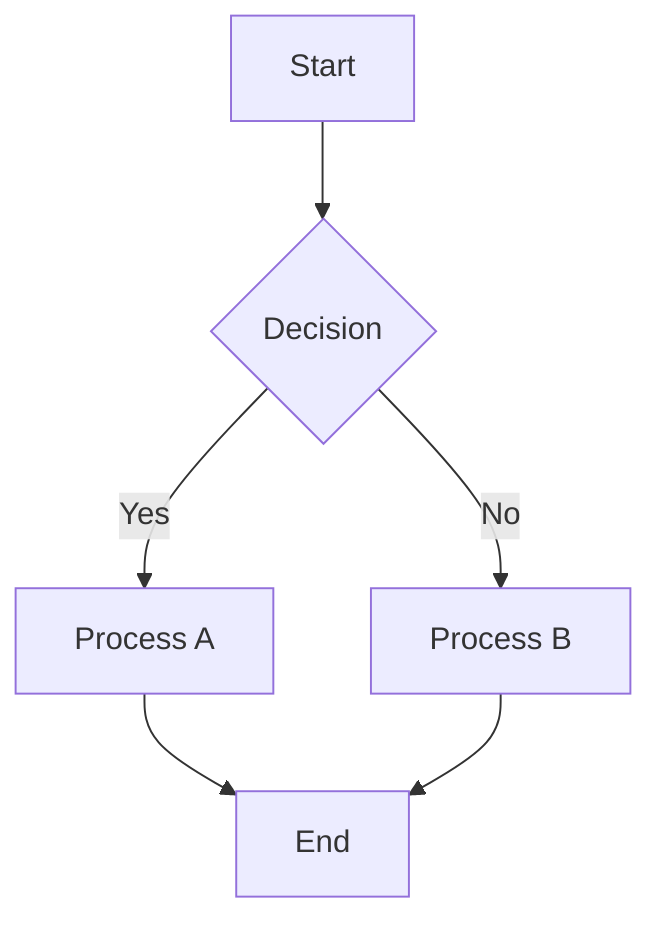
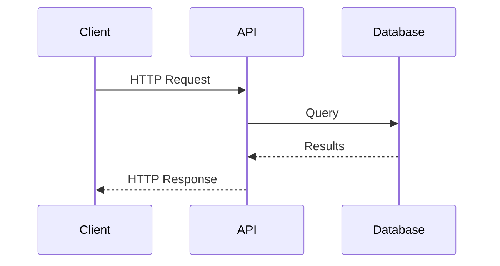
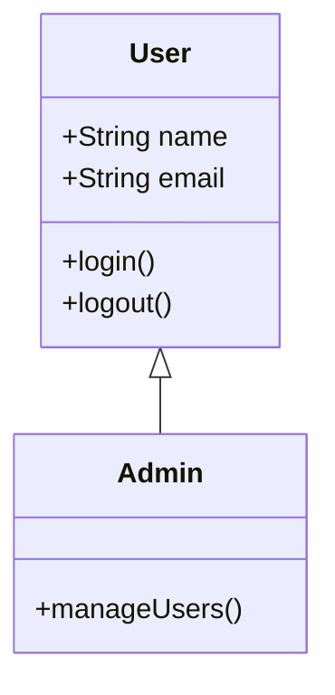
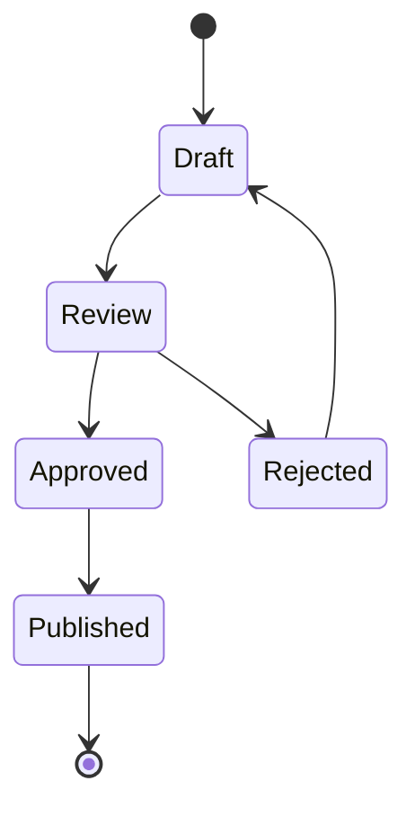
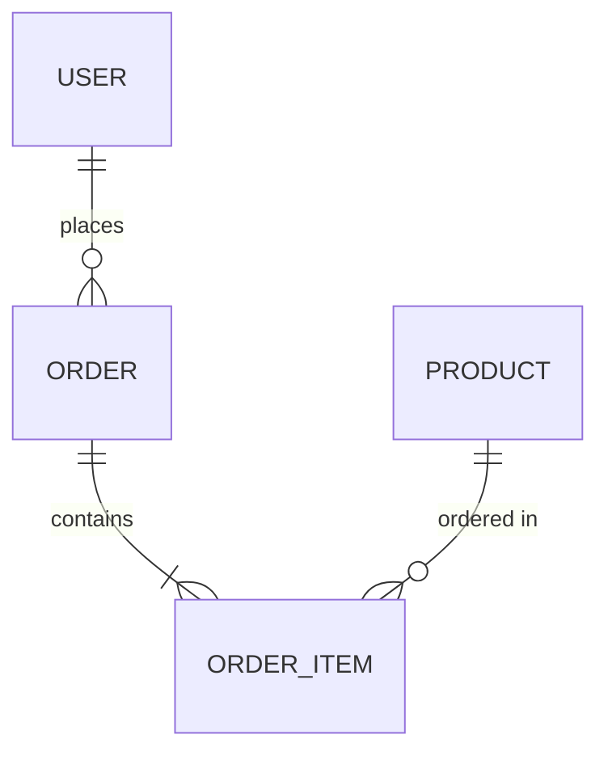
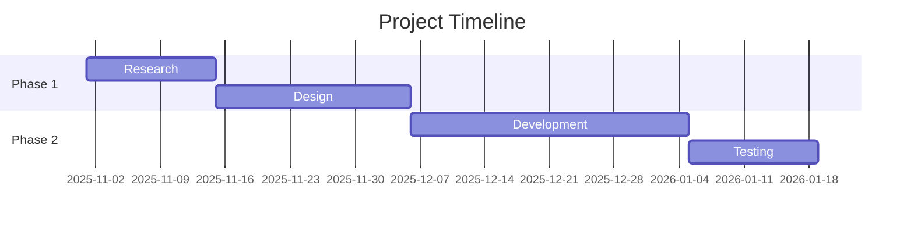

# Obsidian Technical Guide

**Version:** 1.0
**Phase:** 1 - MVP
**Last Updated:** 2025-11-09
**Purpose:** Comprehensive technical guide to Obsidian architecture, Smart Connections plugin, and community plugin integration for AI agents in the BMAD Obsidian 2nd Brain expansion pack

---

## Table of Contents

1. [Introduction](#introduction)
2. [Obsidian Architecture](#obsidian-architecture)
3. [Smart Connections Plugin](#smart-connections-plugin)
4. [Community Plugins for Integration](#community-plugins-for-integration)
5. [Integration Points](#integration-points)
6. [Troubleshooting](#troubleshooting)
7. [Cross-References](#cross-references)
8. [Future Phases](#future-phases)

---

## Introduction

### What is Obsidian?

**Obsidian** is a powerful knowledge base application that works on top of a local folder of plain text Markdown files. Unlike traditional note-taking applications, Obsidian emphasizes:

- **Local-first approach** - All your data stays on your device
- **Plain text Markdown** - Complete data ownership and portability
- **Network thinking** - Notes are connected through links, creating a knowledge graph
- **Extensibility** - Rich plugin ecosystem for customization

### Why Obsidian for Second Brain?

Obsidian excels as a second brain platform because:

1. **Future-proof** - Plain text files never become obsolete
2. **Flexible organization** - Supports both hierarchical folders and network-based links
3. **Powerful linking** - Wikilinks and backlinks create bidirectional relationships
4. **Semantic search** - Plugins like Smart Connections enable AI-powered discovery
5. **Developer-friendly** - APIs and plugins enable external integrations
6. **Privacy-first** - Local processing keeps your knowledge private

### Phase 1 Scope

This guide covers **Phase 1 foundations**:

- Obsidian core architecture and vault structure
- Markdown format and wikilink syntax
- Frontmatter (YAML metadata)
- Smart Connections plugin for semantic search
- Local REST API plugin for external integration
- MCP Tools plugin for AI assistant integration

**Not covered in Phase 1** (coming in later phases):

- Neo4j + Graphiti MCP (Phase 2 - temporal graph database)
- Advanced graph analysis and visualization (Phase 3)
- Research MCP servers and integrations (Phase 5)

---

## Obsidian Architecture

### Vault Structure

#### What is a Vault?

An Obsidian **vault** is a folder on your computer containing:

- Markdown files (`.md`) - Your notes
- Attachments and media files
- Configuration directory (`.obsidian/`)
- Optional subdirectories for organization

When you create a vault, Obsidian designates any folder on your system as your knowledge base. The vault represents a self-contained collection where all files are stored as **plain text markdown**, giving you complete ownership and portability.

**Key characteristics:**

- One vault = one folder
- Multiple vaults can exist independently
- Each vault has its own configuration and plugins
- Vaults can be synced via file sync services (Dropbox, Git, Obsidian Sync)

#### Folder Organization Strategies

Obsidian supports flexible folder organization. Common approaches include:

**Flat structure (minimal folders):**

```
vault/
├── note-1.md
├── note-2.md
├── note-3.md
├── attachments/
└── .obsidian/
```

**Benefits:** Fast access through search and links, minimal organizational overhead

**Topic-based folders:**

```
vault/
├── Projects/
├── Areas/
├── Resources/
├── Archives/
├── attachments/
└── .obsidian/
```

**Benefits:** Clear categorization, PARA method support

**Numbered prefixes (controlled ordering):**

```
vault/
├── 000-Inbox/
├── 001-Projects/
├── 002-Areas/
├── 003-Resources/
├── 999-Archives/
└── .obsidian/
```

**Benefits:** Explicit display order, independent of alphabetical sorting

**Hybrid (folders + tags + links):**

Use folders for broad categories while relying on tags and links for cross-cutting relationships that don't fit hierarchically.

**Recommendation for BMAD integration:**

- Use PARA folder structure (Projects, Areas, Resources, Archives)
- Leverage tags for cross-cutting concerns (#security, #performance)
- Use wikilinks extensively for semantic relationships

#### Hidden Files and Directories (.obsidian/)

The `.obsidian/` directory stores all vault-specific configuration and state:

```
.obsidian/
├── app.json                    # Application-level settings
├── workspace.json              # UI state (pane layout, zoom, sidebar)
├── community-plugins.json      # Installed community plugins list
├── core-plugins.json          # Core plugin enable/disable state
├── plugins/                   # Community plugin files
│   ├── plugin-name/
│   │   ├── main.js
│   │   ├── manifest.json
│   │   └── data.json
├── themes/                    # Custom theme files
├── daily-notes.json           # Daily notes configuration
└── config.json                # Legacy configuration (older versions)
```

**Important:**

- `.obsidian/` should be excluded from version control (add to `.gitignore`)
- Configuration is local to each machine and may conflict across devices
- Plugin data.json files contain plugin-specific settings

#### Attachment and Media File Handling

Obsidian supports various media types:

- **Images:** PNG, JPG, GIF, SVG
- **Audio:** MP3, WAV, M4A, OGG, 3GP
- **Video:** MP4, MKV
- **Documents:** PDF

**Attachment folder configuration** (Settings → Files & Links):

1. **Vault root** - All attachments in root directory
2. **Same folder as note** - Attachments next to the note
3. **Subfolder next to note** - Create subfolder for each note's attachments
4. **Designated attachment folder** - Single folder for all attachments (e.g., `attachments/`)

**Recommendation:**

```
vault/
├── notes/
├── attachments/               # Centralized attachment folder
│   ├── images/
│   ├── audio/
│   └── documents/
└── .obsidian/
```

**Embedding syntax:**

```markdown
![[image.png]] # Embed image
![[document.pdf]] # Embed PDF
![[audio.mp3]] # Embed audio player
![[image.png|300]] # Embed with width
```

### Markdown Format

#### Standard Markdown Support

Obsidian fully supports **CommonMark** specification:

**Headings:**

```markdown
# H1 Heading

## H2 Heading

### H3 Heading
```

**Emphasis:**

```markdown
_italic_ or _italic_
**bold** or **bold**
**_bold italic_**
~~strikethrough~~
```

**Lists:**

```markdown
- Unordered item

* Another unordered item
  - Nested item

1. Ordered item
2. Second item
   1. Nested ordered item
```

**Links and Images:**

```markdown
[Link text](https://example.com)

```

**Code:**

````markdown
Inline `code` with backticks

```python
# Code block with syntax highlighting
def hello_world():
    print("Hello, World!")
```
````

````

**Blockquotes:**
```markdown
> This is a blockquote
> Multiple lines
>> Nested blockquote
````

**Tables:**

```markdown
| Header 1 | Header 2 |
| -------- | -------- |
| Cell 1   | Cell 2   |
| Cell 3   | Cell 4   |
```

**Horizontal Rules:**

```markdown
---

---

---
```

**Footnotes:**

```markdown
Here's a sentence with a footnote.[^1]

[^1]: This is the footnote content.
```

#### Wikilink Syntax

**Wikilinks** are Obsidian's internal linking syntax, creating bidirectional connections between notes.

**Basic wikilink:**

```markdown
[[Note Name]]
```

Creates a link to `Note Name.md`. If the note doesn't exist, creates a "ghost link" that can be followed to create the note.

**Wikilink with display text:**

```markdown
[[Actual Note Name|Display Text]]
```

Links to `Actual Note Name.md` but displays "Display Text" in the rendered note.

**Section linking (heading links):**

```markdown
[[Note Name#Section Heading]]
```

Links directly to a specific heading within the target note.

**Block linking:**

```markdown
[[Note Name#^block-id]]
```

Links to a specific block marked with `^block-id`:

```markdown
This is a paragraph block. ^important-block

You can link to this block from another note:
[[Current Note#^important-block]]
```

**Relative paths:**

```markdown
[[../folder/note]] # Parent folder reference
[[subfolder/note]] # Subfolder reference
```

**Aliases for multiple link names:**

In frontmatter:

```yaml
---
aliases: [Alias 1, Alias 2, Short Name]
---
```

Then link using any alias:

```markdown
[[Alias 1]] # Links to this note
[[Alias 2]] # Also links to this note
[[Short Name]] # Also links to this note
```

**Backlinks:**

Obsidian automatically tracks all links pointing to a note. View backlinks in the Backlinks pane to see which notes reference the current note.

**Example linking pattern:**

```markdown
# Project: API Migration

Related concepts:

- [[Microservices Architecture]]
- [[Database Sharding]]
- [[API Gateway Pattern]]

See also:

- [[Projects/Q4 Roadmap#API Work]]
- [[Architecture Decisions#ADR-005]]
```

#### Tag Syntax

Tags provide orthogonal organization independent of folder structure.

**Flat tags:**

```markdown
#tag
#important
#work
```

**Nested tags (hierarchical):**

```markdown
#project/active
#project/archived
#project/onhold

#tech/javascript
#tech/javascript/async
#tech/python
```

**Tag location:**

Tags can appear anywhere in the note:

```markdown
---
tags: [frontmatter-tag, another-tag]
---

# Note Title

This note discusses #inline-tag concepts.

## Section

More content with #another-inline-tag here.
```

**Tag best practices:**

- Use nested tags for hierarchical categorization
- Be consistent with tag naming (lowercase, hyphens vs underscores)
- Don't overuse tags—links are often more semantic
- Reserve tags for cross-cutting concerns (e.g., `#status/draft`, `#priority/high`)

**Tag pane:**

The Tag pane shows all tags in your vault hierarchically:

```
Tags
├── project (15)
│   ├── active (8)
│   ├── archived (5)
│   └── onhold (2)
├── tech (32)
│   ├── javascript (12)
│   │   └── async (4)
│   └── python (8)
```

Click any tag to see all notes containing it.

#### Frontmatter (YAML Metadata)

**Frontmatter** is YAML metadata at the beginning of a note, enabling machine-readable properties.

**Basic structure:**

```yaml
---
title: Note Title
date: 2025-11-09
tags: [tag1, tag2, tag3]
---
# Note content starts here
```

**Common frontmatter fields:**

```yaml
---
title: My Note Title # Display name
date: 2025-11-09 # Creation date
modified: 2025-11-10 # Last modified
tags: [project, active, infrastructure] # Tags array
aliases: [Alias 1, Short Name] # Alternative link names
author: John Doe # Content creator
status: draft # Development state
type: permanent-note # Note type
category: Development # Categorization
parent: [[Parent Note]] # Hierarchical parent
related: # Related notes
  - [[Related Note 1]]
  - [[Related Note 2]]
source: https://example.com/article # Original source URL
---
```

**Custom fields for domain-specific metadata:**

```yaml
---
title: Microservices Architecture Pattern
type: technical-reference
difficulty: advanced
last-reviewed: 2025-11-01
topics: [microservices, architecture, distributed-systems]
technologies: [kubernetes, docker, service-mesh]
examples-count: 7
completeness: 80
confidence: high
---
```

**Dataview plugin integration:**

The Dataview plugin treats frontmatter as database fields, enabling queries:

```dataview
TABLE status, difficulty, last-reviewed
FROM "Resources"
WHERE type = "technical-reference" AND difficulty = "advanced"
SORT last-reviewed DESC
```

This renders:

| File                       | Status   | Difficulty | Last Reviewed |
| -------------------------- | -------- | ---------- | ------------- |
| Microservices Architecture | complete | advanced   | 2025-11-01    |
| Distributed Transactions   | draft    | advanced   | 2025-10-15    |

**Frontmatter templates:**

**Project note template:**

```yaml
---
type: project
status: active
priority: high
deadline: 2025-12-31
tags: [projects, infrastructure]
related:
  - [[Area/Infrastructure]]
progress: 30
---
```

**Reference note template:**

```yaml
---
type: reference
source: https://docs.example.com
date: 2025-11-09
tags: [documentation, api]
topics: [rest-api, authentication]
reviewed: false
---
```

**Daily note template:**

```yaml
---
date: 2025-11-09
week: 45
year: 2025
type: daily-note
tags: [daily]
---
```

#### Math Notation (LaTeX)

Obsidian supports **LaTeX** mathematical notation via MathJax.

**Inline math:**

```markdown
The equation $E=mc^2$ shows mass-energy equivalence.
```

Renders: The equation E=mc² shows mass-energy equivalence.

**Block math (display mode):**

```markdown
$$
\frac{-b \pm \sqrt{b^2 - 4ac}}{2a}
$$
```

Renders centered as a display equation.

**Common LaTeX commands:**

```latex
$\alpha, \beta, \gamma$              # Greek letters
$\frac{numerator}{denominator}$      # Fractions
$\sqrt{x}$                           # Square root
$x^2$                                # Superscript
$x_i$                                # Subscript
$\sum_{i=1}^{n} x_i$                 # Summation
$\int_{a}^{b} f(x) dx$               # Integral
$\lim_{x \to \infty} f(x)$           # Limit
$\begin{matrix} a & b \\ c & d \end{matrix}$  # Matrix
```

**Example technical documentation:**

```markdown
## Algorithm Complexity

The time complexity is $O(n \log n)$ where $n$ is the input size.

The recurrence relation:

$$
T(n) = 2T\left(\frac{n}{2}\right) + O(n)
$$

Solving using the Master Theorem gives $T(n) = O(n \log n)$.
```

#### Diagrams (Mermaid)

Obsidian includes **Mermaid** diagram support in code blocks.

**Flowchart:**

````markdown

````

**Sequence diagram:**

````markdown

````

**Class diagram:**

````markdown

````

**State diagram:**

````markdown

````

**Entity relationship diagram:**

````markdown

````

**Gantt chart:**

````markdown

````

#### Embedding and Transclusion

**Embed entire notes:**

```markdown
![[Note Name]]
```

Includes the full content of "Note Name" inline.

**Embed specific section:**

```markdown
![[Note Name#Section Heading]]
```

Includes only the specified section.

**Embed specific block:**

```markdown
![[Note Name#^block-id]]
```

Includes the specific block marked with `^block-id`.

**Embed with custom heading level:**

```markdown
![[Note Name#Section]]
```

The embedded content respects its original heading hierarchy.

**Embed images with sizing:**

```markdown
![[image.png|300]] # Width 300px
![[image.png|300x200]] # Width 300px, height 200px
```

**Embed PDFs:**

```markdown
![[document.pdf]] # Full PDF
![[document.pdf#page=3]] # Specific page
```

**Practical transclusion example:**

**File:** `Templates/Meeting-Notes-Template.md`

```markdown
## Attendees

## Agenda

## Discussion

## Action Items

## Next Steps
```

**File:** `Meetings/2025-11-09-Team-Sync.md`

```markdown
# Team Sync - November 9, 2025

![[Templates/Meeting-Notes-Template]]

## Attendees

- Alice, Bob, Charlie

## Agenda

- Sprint review
- Q4 planning
```

The template content is embedded and can be filled in.

**Benefits of embedding:**

- **DRY principle** - Single source of truth for reusable content
- **Dynamic updates** - Changes to source automatically reflect in embeddings
- **Modular composition** - Build complex notes from smaller components

---

## Smart Connections Plugin

### Overview

**Smart Connections** is an AI-powered plugin that enhances note management and discovery through **semantic search**. Unlike keyword search, semantic search understands meaning and context, enabling natural language queries to find relevant content even when exact words don't match.

**Core capabilities:**

- **Smart Connections View** - Displays semantically related notes based on AI embeddings
- **Smart Chat** - Conversational interface to interact with your notes
- **Semantic Search** - Natural language queries to find relevant content
- **Local Processing** - All embeddings generated locally for complete privacy

**Key differentiator:** Traditional search finds exact keyword matches. Semantic search understands that "machine learning" relates to "neural networks," "AI," and "deep learning" even if those exact terms don't appear.

### How Smart Connections Uses Embeddings

**Embeddings** are vector representations of text that capture semantic meaning. Each note (or note chunk) is converted into a high-dimensional vector where semantically similar content has similar vectors.

**Process:**

1. **Indexing** - Plugin processes each note through the BGE-micro-v2 model
2. **Vectorization** - Note content converted to 384-dimension embedding vector
3. **Storage** - Embeddings stored locally in `.smart-env/embeddings/`
4. **Similarity search** - When querying, your query is embedded and compared to note embeddings
5. **Ranking** - Notes ranked by cosine similarity (vector distance) to your query

**Example:**

Query: "How do I handle async operations?"

Traditional keyword search might miss a note titled "Promise-based workflow patterns" that doesn't contain the word "async."

Semantic search understands these are related concepts and surfaces the relevant note.

### Performance Characteristics

**Large vault handling:**

- Efficiently handles **10,000+ notes**
- Local processing (no API rate limits)
- Incremental indexing (only re-processes changed notes)

**Indexing speed:**

- Approximately **1 minute per 100 notes** (varies by hardware and note length)
- Background processing doesn't block Obsidian usage
- First-time indexing is a one-time cost

**Memory usage:**

- Embeddings stored efficiently in quantized format
- Minimal memory footprint during searches
- `.smart-env/` directory size scales with vault size

**Privacy features:**

- **100% local execution** - No data sent to external servers
- **No API keys required** - Model runs on your machine
- **Offline capable** - Works without internet connection
- **Complete data control** - Embeddings stored in your vault

### Directory Structure

```
vault-root/
└── .smart-env/
    ├── embeddings/
    │   ├── note-hash-1.ajson
    │   ├── note-hash-2.ajson
    │   └── note-hash-n.ajson
    ├── models/
    │   └── bge-micro-v2/
    │       ├── model.onnx
    │       ├── tokenizer.json
    │       └── config.json
    └── config.json
```

**Directory purposes:**

- **`.smart-env/`** - Root directory for Smart Connections data
- **`embeddings/`** - Stores `.ajson` files containing note embeddings
- **`models/`** - Contains the BGE-micro-v2 model files
- **`config.json`** - Plugin configuration and settings

**Note:** `.smart-env/` should be excluded from version control (add to `.gitignore`), as embeddings are specific to your local vault and can be regenerated.

### BGE-micro-v2 Embedding Model

**BGE-micro-v2** is a compact embedding model optimized for semantic search tasks.

**Model specifications:**

- **Architecture:** Based on BERT architecture, optimized for embedding generation
- **Context window:** 512 tokens (approximately 400-450 words depending on content)
- **Embedding dimension:** 384 dimensions per vector
- **Quantization:** int8 quantization for reduced memory footprint and faster inference
- **Model size:** Compact enough for local execution on consumer hardware
- **Execution:** Local, CPU-optimized (no GPU required)

**Why BGE-micro-v2:**

- **Performance:** Excellent semantic understanding for its size
- **Efficiency:** Fast inference on CPUs without GPU requirements
- **Privacy:** Runs entirely locally without external API calls
- **Compatibility:** Optimized for knowledge management use cases

**Limitations:**

- **Context window:** Notes longer than 512 tokens are chunked (see .ajson format)
- **Languages:** Primarily optimized for English (multi-language support varies)

### .ajson Format (Annotated JSON)

**Note:** The specific `.ajson` format details are not comprehensively documented in public sources. The following represents general understanding of embedding storage approaches.

**Purpose:** `.ajson` files store note embeddings and associated metadata.

**Likely structure:**

```json
{
  "note_path": "path/to/note.md",
  "note_hash": "hash-of-note-content",
  "chunks": [
    {
      "chunk_id": 0,
      "text": "Chunk text content...",
      "start_offset": 0,
      "end_offset": 512,
      "embedding": [0.123, -0.456, 0.789, ...]
    },
    {
      "chunk_id": 1,
      "text": "Next chunk text...",
      "start_offset": 512,
      "end_offset": 1024,
      "embedding": [0.234, -0.567, 0.891, ...]
    }
  ],
  "metadata": {
    "indexed_at": "2025-11-09T10:30:00Z",
    "model_version": "bge-micro-v2"
  }
}
```

**Chunking strategy:**

Long notes exceeding the 512-token context window are split into overlapping chunks:

- **Chunk size:** Approximately 512 tokens (model context window)
- **Overlap:** Likely some overlap between chunks to preserve context
- **Embedding per chunk:** Each chunk gets its own 384-dimension embedding vector

**Update triggers:**

Embeddings are regenerated when:

- Note content changes (detected via hash comparison)
- Manual refresh triggered by user
- Plugin settings change embedding parameters

**File naming:**

Files are named based on note content hash, allowing quick lookup and change detection.

### Semantic Search Capabilities

**Search interface:**

Smart Connections provides several ways to search:

1. **Smart Connections View** - Shows related notes for the current note automatically
2. **Command Palette** - Use commands to trigger searches
3. **Smart Chat** - Conversational interface for finding information

**Available commands:**

- `Smart Connections: Find connections` - Manually trigger connection search
- `Smart Connections: Refresh & Make Connections` - Re-index and find connections
- `Smart Connections: Random Smart Connection` - Discover serendipitous connections
- `Smart Connections: Open view` - Open the Smart Connections sidebar view

**Result ranking:**

Results are ranked by **cosine similarity** between query embedding and note embeddings:

- **Similarity score:** Typically 0.0 to 1.0 (higher = more similar)
- **Top-N results:** Configurable in settings
- **Threshold filtering:** Can set minimum similarity threshold

**Search examples:**

**Traditional keyword search:**

```
Query: "Docker deployment"
Results: Only notes containing both "Docker" and "deployment"
```

**Semantic search:**

```
Query: "How to containerize applications"
Results:
- Docker deployment guide
- Kubernetes orchestration
- Container best practices
- Microservices architecture
(Even if some don't mention "containerize" explicitly)
```

### Configuration and Best Practices

#### Initial Setup

1. **Install Smart Connections:**
   - Settings → Community Plugins → Browse
   - Search "Smart Connections"
   - Install and Enable

2. **Initial indexing:**
   - Plugin automatically starts indexing on first enable
   - Monitor progress in plugin settings
   - Allow completion before heavy usage (approximately 1 min per 100 notes)

3. **Configure settings:**
   - Settings → Smart Connections
   - Set number of results to display (default: 10)
   - Configure excluded folders (if needed)
   - Set similarity threshold (default usually appropriate)

#### Re-indexing Triggers

Smart Connections automatically detects and re-indexes changed notes. Manual re-indexing needed when:

- Plugin settings change
- Model updates
- Corruption suspected
- Complete rebuild desired

**Manual re-index:** Use "Refresh & Make Connections" command

#### Performance Optimization

**For large vaults:**

- **Exclude non-note folders:** Exclude attachments, templates, and system folders
- **Incremental indexing:** Let the plugin handle updates automatically (don't manually re-index unnecessarily)
- **Background processing:** Index during periods of lower Obsidian activity

**For better search results:**

- **Use descriptive note titles** - Titles are weighted heavily in embeddings
- **Write complete sentences** - Fragments embed less effectively than coherent text
- **Include context** - Semantic search works best with contextual content
- **Use consistent terminology** - While semantic search handles synonyms, consistency helps

#### Privacy and Security

**Data privacy guarantees:**

- **Local processing only** - No data sent to external servers
- **No telemetry** - Plugin doesn't track usage or send analytics
- **Offline operation** - No internet connection required after initial model download
- **Your vault, your data** - Complete control over embeddings and data

**Security considerations:**

- Embeddings are derivative data (can't reconstruct original notes from embeddings alone)
- `.smart-env/` can be excluded from cloud sync if desired (will require re-indexing on other devices)
- Model files are static and don't communicate with external services

---

## Community Plugins for Integration

### Local REST API Plugin

#### Purpose and Core Functionality

The **Local REST API** plugin exposes a secure REST API that enables external tools and applications to interact with your Obsidian vault programmatically. This is essential for:

- **Automation** - Script note creation, updates, deletion
- **External integrations** - Connect other tools to your knowledge base
- **Command-line workflows** - Interact with vault from terminal
- **Browser extensions** - Capture web content directly to Obsidian
- **CI/CD pipelines** - Automate documentation generation

**Plugin details:**

- **Author:** Adam Coddington
- **Downloads:** 181,997+ from community plugins
- **Latest version:** 3.2.0 (as of May 2025)

#### Installation

1. **Open Obsidian** → Settings → Community Plugins → Browse
2. **Search** for "Local REST API"
3. **Install** the plugin by Adam Coddington
4. **Enable** the plugin
5. **Configure** in Settings → Local REST API
   - Set API key (required for security)
   - Note the API URL (typically `https://127.0.0.1:27124`)
   - Configure CORS settings if needed

#### Available API Endpoints

**Core capabilities:**

1. **Note Management**
   - `GET /vault/` - List all notes in vault
   - `GET /vault/{path}` - Read specific note content
   - `POST /vault/{path}` - Create new note
   - `PUT /vault/{path}` - Update existing note (replace)
   - `PATCH /vault/{path}` - Insert content into note sections
   - `DELETE /vault/{path}` - Delete note

2. **Periodic Notes**
   - `GET /periodic/daily/` - Get today's daily note
   - `POST /periodic/daily/{date}` - Create daily note for specific date
   - Similar endpoints for weekly, monthly notes

3. **Commands**
   - `GET /commands/` - List available Obsidian commands
   - `POST /commands/{command-id}` - Execute specific command

4. **OpenAPI Documentation**
   - `GET /openapi.yaml` - Get OpenAPI specification for runtime API exploration

**Example API calls:**

**Create a new note:**

```bash
curl -X POST https://127.0.0.1:27124/vault/Notes/MyNote.md \
  -H "Authorization: Bearer YOUR_API_KEY" \
  -H "Content-Type: text/markdown" \
  -d "# My Note

This is the content of my new note."
```

**Read a note:**

```bash
curl -X GET https://127.0.0.1:27124/vault/Notes/MyNote.md \
  -H "Authorization: Bearer YOUR_API_KEY"
```

**Update a note (replace content):**

```bash
curl -X PUT https://127.0.0.1:27124/vault/Notes/MyNote.md \
  -H "Authorization: Bearer YOUR_API_KEY" \
  -H "Content-Type: text/markdown" \
  -d "# Updated Note

This is the updated content."
```

**Patch a note (insert content):**

```bash
curl -X PATCH https://127.0.0.1:27124/vault/Notes/MyNote.md \
  -H "Authorization: Bearer YOUR_API_KEY" \
  -H "Content-Type: application/json" \
  -d '{
    "position": "end",
    "content": "\n\n## New Section\n\nAppended content."
  }'
```

**List all notes:**

```bash
curl -X GET https://127.0.0.1:27124/vault/ \
  -H "Authorization: Bearer YOUR_API_KEY"
```

**Execute an Obsidian command:**

```bash
curl -X POST https://127.0.0.1:27124/commands/editor:toggle-bold \
  -H "Authorization: Bearer YOUR_API_KEY"
```

#### Authentication and Security

**HTTPS interface:**

- All API communications use HTTPS (TLS encryption)
- Self-signed certificate (expect certificate warnings when using `curl`)
- Use `curl -k` or `--insecure` flag for self-signed certs in testing

**API Key authentication:**

Required header for all requests:

```
Authorization: Bearer YOUR_API_KEY
```

**Set API key in plugin settings:**

- Settings → Local REST API → API Key
- Generate a strong random key
- Store securely (treat like a password)

**CORS configuration:**

If accessing from web browsers, configure CORS:

- Settings → Local REST API → CORS
- Add allowed origins (e.g., `http://localhost:3000`)
- Leave empty to allow all origins (less secure)

#### Configuration Options

**Settings:**

- **API Key** - Required for authentication
- **Port** - Default 27124 (change if conflict)
- **HTTPS** - Enabled by default (recommended)
- **CORS** - Configure allowed origins for browser access

**Environment variables (for scripts):**

```bash
export OBSIDIAN_API_URL="https://127.0.0.1:27124"
export OBSIDIAN_API_KEY="your-api-key"
```

Use in scripts to avoid hardcoding credentials.

#### Use Cases for Developers

**1. Automated note capture from CLI:**

```bash
#!/bin/bash
# Capture quick note from terminal

NOTE_PATH="Inbox/$(date +%Y-%m-%d-%H%M%S).md"
NOTE_CONTENT="# Quick Capture

$1
"

curl -X POST https://127.0.0.1:27124/vault/$NOTE_PATH \
  -H "Authorization: Bearer $OBSIDIAN_API_KEY" \
  -H "Content-Type: text/markdown" \
  -d "$NOTE_CONTENT"
```

**2. Daily note creation with template:**

```bash
#!/bin/bash
# Create daily note with template

DAILY_NOTE_PATH="Daily/$(date +%Y-%m-%d).md"
TEMPLATE_CONTENT="# $(date +%Y-%m-%d)

## Tasks

## Notes

## Journal
"

curl -X POST https://127.0.0.1:27124/vault/$DAILY_NOTE_PATH \
  -H "Authorization: Bearer $OBSIDIAN_API_KEY" \
  -H "Content-Type: text/markdown" \
  -d "$TEMPLATE_CONTENT"
```

**3. Append to inbox note:**

```python
import requests
import os
from datetime import datetime

OBSIDIAN_API_URL = os.environ["OBSIDIAN_API_URL"]
OBSIDIAN_API_KEY = os.environ["OBSIDIAN_API_KEY"]

def append_to_inbox(content):
    url = f"{OBSIDIAN_API_URL}/vault/Inbox.md"
    headers = {
        "Authorization": f"Bearer {OBSIDIAN_API_KEY}",
        "Content-Type": "application/json"
    }
    data = {
        "position": "end",
        "content": f"\n\n## {datetime.now().strftime('%Y-%m-%d %H:%M')}\n\n{content}"
    }
    response = requests.patch(url, headers=headers, json=data, verify=False)
    return response.status_code == 200

# Usage
append_to_inbox("Important idea captured from external tool")
```

**4. Export notes to static site generator:**

```python
import requests
import os

OBSIDIAN_API_URL = os.environ["OBSIDIAN_API_URL"]
OBSIDIAN_API_KEY = os.environ["OBSIDIAN_API_KEY"]
EXPORT_DIR = "./site/content/"

def export_notes(folder):
    url = f"{OBSIDIAN_API_URL}/vault/"
    headers = {"Authorization": f"Bearer {OBSIDIAN_API_KEY}"}
    response = requests.get(url, headers=headers, verify=False)

    notes = [n for n in response.json()["files"] if n.startswith(folder)]

    for note in notes:
        note_url = f"{OBSIDIAN_API_URL}/vault/{note}"
        content = requests.get(note_url, headers=headers, verify=False).text

        export_path = os.path.join(EXPORT_DIR, note)
        os.makedirs(os.path.dirname(export_path), exist_ok=True)

        with open(export_path, 'w') as f:
            f.write(content)

# Export all notes from Published folder
export_notes("Published/")
```

### MCP Tools Plugin (Model Context Protocol)

#### Purpose and Overview

The **MCP Tools** plugin (more accurately: **Obsidian Local REST API MCP Server**) acts as a bridge between MCP (Model Context Protocol) clients and the Obsidian Local REST API. This enables AI assistants like Claude Desktop to interact directly with your Obsidian vault.

**Architecture:**

```
MCP Client (Claude Desktop, VS Code)
        ↓
MCP Protocol
        ↓
Obsidian Local REST API MCP Server
        ↓
HTTP REST API
        ↓
Obsidian Local REST API Plugin
        ↓
Obsidian Vault
```

**Key benefit:** AI assistants can read, create, update, and search your notes conversationally.

#### Installation and Setup

**Prerequisites:**

- Obsidian with Local REST API plugin installed and configured
- Node.js or Bun JavaScript runtime installed
- MCP client (Claude Desktop, VS Code, etc.)

**Installation steps:**

1. **Clone the MCP server repository:**

   ```bash
   git clone https://github.com/[repo-url]/obsidian-local-rest-api-mcp
   cd obsidian-local-rest-api-mcp
   ```

2. **Install dependencies:**

   ```bash
   bun install    # or: npm install
   ```

3. **Build the project:**

   ```bash
   bun run build  # or: npm run build
   ```

4. **Set environment variables:**

   ```bash
   export OBSIDIAN_API_URL="https://127.0.0.1:27124"
   export OBSIDIAN_API_KEY="your-api-key"
   ```

5. **Run the server:**
   ```bash
   bun run start  # or: npm start
   # Or directly: node build/index.js
   ```

#### Available MCP Tools and Operations

The MCP server exposes comprehensive vault operations:

**File Operations:**

- **List files** - Enumerate all files in vault or specific folder
- **Retrieve file** - Read file content with full directory path support
- **Create file** - Create new files in specified locations
- **Update file** - Modify existing file content
- **Delete file** - Remove files from vault

**Note Operations:**

- **List notes** - Get all markdown notes in vault
- **Retrieve note** - Read note content including frontmatter
- **Create note** - Create new notes with optional frontmatter
- **Update note** - Modify note content and metadata
- **Delete note** - Remove notes

**Search Capability:**

- **Search notes** - Search based on content or metadata queries
- **Filter by frontmatter** - Query notes by frontmatter field values
- **Full-text search** - Find notes containing specific text

**Metadata Management:**

- **List frontmatter keys** - Get all frontmatter fields used in vault
- **Retrieve frontmatter values** - Get unique values for specific frontmatter keys
- **Query by metadata** - Find notes matching metadata criteria

**Error Handling:**

- API failures and timeouts
- Invalid parameters
- Authentication errors
- File not found errors
- Comprehensive error messages passed back to MCP client

#### Configuration for AI Assistants

**Claude Desktop Configuration:**

Edit `claude_desktop_config.json`:

```json
{
  "mcpServers": {
    "obsidian-vault": {
      "command": "node",
      "args": ["/absolute/path/to/obsidian-local-rest-api-mcp/build/index.js"],
      "env": {
        "OBSIDIAN_API_URL": "https://127.0.0.1:27124",
        "OBSIDIAN_API_KEY": "your-api-key"
      }
    }
  }
}
```

**Restart Claude Desktop** after configuration changes.

**Cherry Studio Configuration:**

| Setting                                  | Value                                     |
| ---------------------------------------- | ----------------------------------------- |
| Name                                     | `obsidian-vault` (or your preferred name) |
| Type                                     | `Standard Input/Output (stdio)`           |
| Command                                  | `npx`                                     |
| Arguments                                | `obsidian-local-rest-api-mcp`             |
| Environment Variable: `OBSIDIAN_API_URL` | `https://127.0.0.1:27124`                 |
| Environment Variable: `OBSIDIAN_API_KEY` | Your API key                              |

**VS Code Configuration:**

Use the included `.vscode/mcp.json` configuration template:

```json
{
  "mcpServers": {
    "obsidian": {
      "command": "node",
      "args": ["./build/index.js"],
      "env": {
        "OBSIDIAN_API_URL": "https://127.0.0.1:27124",
        "OBSIDIAN_API_KEY": "your-api-key"
      }
    }
  }
}
```

#### Example Workflows Using MCP Tools

**Workflow 1: AI-Assisted Note Summarization**

**User (in Claude Desktop):**

> "Please summarize all my notes tagged with #project/active"

**Claude:**

1. Uses MCP `search_notes` tool to find notes with tag `#project/active`
2. Uses MCP `retrieve_note` tool to read each note
3. Generates summary of all active projects
4. Optionally creates a new summary note using MCP `create_note` tool

**Workflow 2: Automated Knowledge Base Update**

**User (in Claude Desktop):**

> "Based on today's conversation, create a permanent note about semantic search"

**Claude:**

1. Synthesizes conversation content
2. Uses MCP `create_note` tool to create new note in Resources/Zettelkasten/
3. Includes appropriate frontmatter (tags, date, type)
4. Links to related existing notes

**Workflow 3: Daily Note Creation with AI**

**User (in Claude Desktop):**

> "Create today's daily note and summarize my tasks from yesterday"

**Claude:**

1. Uses MCP `retrieve_note` to read yesterday's daily note
2. Extracts incomplete tasks
3. Uses MCP `create_note` to create today's daily note
4. Populates with carried-over tasks and daily template structure

**Workflow 4: Research Compilation**

**User (in Claude Desktop):**

> "Compile all my notes about microservices architecture into a structured research document"

**Claude:**

1. Uses MCP `search_notes` to find relevant notes (keyword "microservices", tags, metadata)
2. Uses MCP `retrieve_note` to read all relevant notes
3. Synthesizes content into structured document
4. Uses MCP `create_note` to save compiled research

**Workflow 5: Vault Maintenance**

**User (in Claude Desktop):**

> "Find all notes I haven't updated in over 6 months and list them"

**Claude:**

1. Uses MCP `list_notes` to get all notes
2. Uses MCP `retrieve_note` to read frontmatter (last-modified dates)
3. Filters notes older than 6 months
4. Presents list for review

---

## Integration Points

### Architecture Overview

The complete Obsidian integration ecosystem consists of layered components:

```
┌─────────────────────────────────────────┐
│   MCP Clients                           │
│   (Claude Desktop, VS Code, etc.)       │
└─────────────────┬───────────────────────┘
                  │ Model Context Protocol (stdio)
┌─────────────────▼───────────────────────┐
│   Obsidian Local REST API MCP Server    │
│   (Translation layer: MCP ↔ HTTP)       │
└─────────────────┬───────────────────────┘
                  │ HTTP REST API (HTTPS)
┌─────────────────▼───────────────────────┐
│   Local REST API Plugin                 │
│   (Exposes Obsidian internals via API)  │
└─────────────────┬───────────────────────┘
                  │ Plugin API
┌─────────────────▼───────────────────────┐
│   Obsidian Core                         │
│   ┌───────────────────────────────┐     │
│   │  Vault (Markdown files)       │     │
│   └───────────┬───────────────────┘     │
│               │                         │
│   ┌───────────▼───────────────────┐     │
│   │  Smart Connections            │     │
│   │  (Semantic search embeddings) │     │
│   └───────────────────────────────┘     │
└─────────────────────────────────────────┘
```

### How Plugins Work Together

**Local REST API + MCP Server:**

- **Local REST API** exposes Obsidian capabilities via HTTP endpoints
- **MCP Server** translates MCP protocol calls to HTTP REST calls
- Together they enable AI assistants to interact with your vault conversationally

**Smart Connections + Local REST API:**

While Smart Connections doesn't directly expose its API via the Local REST API plugin (as of Phase 1), potential integration patterns include:

- **Manual search workflow:** AI assistant reads notes → User performs Smart Connections search → AI assistant helps interpret results
- **Metadata-based discovery:** AI uses frontmatter queries to find related notes, complementing Smart Connections' semantic approach
- **Future integration:** Phase 2+ may include direct API access to Smart Connections semantic search

**Smart Connections + MCP Workflows:**

Indirect integration through conversational workflows:

**User:** "Find notes related to the concept of 'dependency injection'"

**Claude (via MCP):**

1. Searches notes using keyword "dependency injection"
2. Retrieves relevant notes
3. Identifies related concepts (IoC, DI containers, frameworks)
4. Suggests user perform Smart Connections search on key notes for additional semantic relationships

**User then:**

- Opens suggested note in Obsidian
- Uses Smart Connections view to see semantically related notes
- Reports findings back to Claude for further analysis

### Common Automation Workflows

**Workflow 1: Capture-Process-Organize Pipeline**

```
External Tool (Browser, Email, CLI)
        ↓
Local REST API (POST /vault/Inbox/{capture}.md)
        ↓
Obsidian Inbox
        ↓
[Manual or AI-assisted processing]
        ↓
MCP Server helps organize (create permanent notes, link to existing)
        ↓
Smart Connections indexes new notes
```

**Example automation script:**

```python
# capture.py - Capture web clippings to Obsidian

import requests
import sys
from datetime import datetime

OBSIDIAN_API_URL = "https://127.0.0.1:27124"
OBSIDIAN_API_KEY = "your-api-key"

def capture_to_inbox(title, content, source_url):
    timestamp = datetime.now().strftime("%Y%m%d%H%M%S")
    filename = f"Inbox/{timestamp}-{title.replace(' ', '-')}.md"

    note_content = f"""---
title: {title}
source: {source_url}
captured: {datetime.now().strftime("%Y-%m-%d %H:%M")}
status: inbox
---

# {title}

{content}

## Source
{source_url}
"""

    response = requests.post(
        f"{OBSIDIAN_API_URL}/vault/{filename}",
        headers={
            "Authorization": f"Bearer {OBSIDIAN_API_KEY}",
            "Content-Type": "text/markdown"
        },
        data=note_content,
        verify=False
    )

    return response.status_code == 200

# Usage
if __name__ == "__main__":
    title = sys.argv[1]
    content = sys.argv[2]
    source_url = sys.argv[3]

    if capture_to_inbox(title, content, source_url):
        print(f"Captured: {title}")
    else:
        print("Failed to capture")
```

**Workflow 2: AI-Assisted Literature Note Creation**

```
User reads article
        ↓
Captures highlights to Obsidian (via REST API)
        ↓
Claude Desktop (via MCP) reads raw highlights
        ↓
AI generates literature note in own words
        ↓
AI creates note via MCP with proper frontmatter
        ↓
Smart Connections indexes new note
        ↓
AI suggests related permanent notes based on Smart Connections results
```

**Workflow 3: Daily Review and Planning**

```
Scheduled script (cron, Task Scheduler)
        ↓
REST API: Read yesterday's daily note
        ↓
Extract incomplete tasks
        ↓
REST API: Create today's daily note with template
        ↓
Populate with carried-over tasks
        ↓
Notify user (desktop notification, email)
```

**Example script:**

```bash
#!/bin/bash
# daily-note-automation.sh

YESTERDAY=$(date -d "yesterday" +%Y-%m-%d)
TODAY=$(date +%Y-%m-%d)

# Read yesterday's note
YESTERDAY_CONTENT=$(curl -s -X GET \
  "https://127.0.0.1:27124/vault/Daily/${YESTERDAY}.md" \
  -H "Authorization: Bearer $OBSIDIAN_API_KEY" \
  -k)

# Extract incomplete tasks (lines starting with - [ ])
INCOMPLETE_TASKS=$(echo "$YESTERDAY_CONTENT" | grep "^- \[ \]")

# Create today's note
TODAY_NOTE="---
date: $TODAY
week: $(date +%W)
type: daily-note
---

# $TODAY

## Carried Over from Yesterday

$INCOMPLETE_TASKS

## Today's Tasks

- [ ]

## Notes

## Journal
"

curl -X POST \
  "https://127.0.0.1:27124/vault/Daily/${TODAY}.md" \
  -H "Authorization: Bearer $OBSIDIAN_API_KEY" \
  -H "Content-Type: text/markdown" \
  -d "$TODAY_NOTE" \
  -k

echo "Daily note created: $TODAY"
```

**Workflow 4: Knowledge Graph Export**

```
MCP Server lists all notes
        ↓
For each note, retrieve content and metadata
        ↓
Extract wikilinks and tags
        ↓
Build graph structure (nodes = notes, edges = links)
        ↓
Export to Neo4j/Graphiti (Phase 2)
        ↓
Visualize knowledge graph
```

### Best Practices for Plugin Combination

**Security:**

- **Use strong API keys** - Generate random, high-entropy keys
- **HTTPS only** - Never disable TLS/SSL in production
- **Localhost binding** - Don't expose Local REST API to network without VPN/firewall
- **MCP server access control** - Limit which clients can connect to MCP server
- **Credential storage** - Use environment variables, not hardcoded keys

**Performance:**

- **Batch operations** - Use bulk endpoints where available instead of individual calls
- **Caching** - Cache frequently accessed notes in automation scripts
- **Rate limiting** - Be mindful of API call frequency (though local, still consumes resources)
- **Incremental updates** - Only update changed content, don't rewrite entire notes unnecessarily

**Reliability:**

- **Error handling** - Always check API response codes and handle failures gracefully
- **Retry logic** - Implement exponential backoff for transient failures
- **Logging** - Log API calls and responses for debugging
- **Health checks** - Verify Local REST API is running before attempting operations

**Maintainability:**

- **Version compatibility** - Keep plugins and MCP server versions synchronized
- **Configuration management** - Use environment variables or config files for API URLs and keys
- **Documentation** - Document custom workflows and automation scripts
- **Testing** - Test automation scripts in non-production vaults first

---

## Troubleshooting

### Common Installation Issues

**Issue: Plugin won't install from Community Plugins**

**Symptoms:**

- Plugin doesn't appear in search results
- Installation fails with error message
- Plugin installs but won't enable

**Solutions:**

1. **Check internet connection** - Community plugins require download
2. **Disable Safe Mode** - Settings → Community Plugins → Turn off safe mode
3. **Clear plugin cache:**
   - Close Obsidian
   - Delete `.obsidian/plugins/[plugin-name]/` folder
   - Restart Obsidian and reinstall
4. **Check Obsidian version** - Update Obsidian to latest version
5. **Manual installation:**
   - Download plugin from GitHub releases
   - Extract to `.obsidian/plugins/[plugin-name]/`
   - Reload Obsidian

**Issue: Smart Connections indexing fails**

**Symptoms:**

- Indexing stuck at 0%
- "Failed to process note" errors
- Embeddings not generating

**Solutions:**

1. **Check note content:**
   - Extremely long notes may timeout (split into smaller notes)
   - Invalid markdown syntax may cause parsing errors
2. **Re-download model:**
   - Settings → Smart Connections → Delete models folder
   - Restart Obsidian to re-download BGE-micro-v2 model
3. **Exclude problematic folders:**
   - Settings → Smart Connections → Excluded folders
   - Add folders causing issues (attachments, templates)
4. **Check disk space:**
   - Ensure sufficient space for `.smart-env/` directory
   - Model + embeddings can be 100MB+ for large vaults
5. **Restart Obsidian:**
   - Complete restart often resolves transient issues

**Issue: Local REST API returns 401 Unauthorized**

**Symptoms:**

- API calls fail with 401 status code
- "Authorization header required" or "Invalid API key" errors

**Solutions:**

1. **Verify API key:**
   - Settings → Local REST API → Check API key value
   - Ensure no extra spaces or characters
2. **Check Authorization header:**

   ```bash
   # Correct format:
   Authorization: Bearer YOUR_API_KEY

   # Common mistakes:
   Authorization: YOUR_API_KEY          # Missing "Bearer "
   Authorization: Bearer: YOUR_API_KEY  # Extra colon
   ```

3. **Test with simple curl:**
   ```bash
   curl -X GET https://127.0.0.1:27124/vault/ \
     -H "Authorization: Bearer YOUR_API_KEY" \
     -k
   ```
4. **Check plugin is enabled:**
   - Settings → Community Plugins → Ensure Local REST API is enabled

### Plugin Conflicts

**Issue: Plugins interfere with each other**

**Symptoms:**

- One plugin stops working after installing another
- Obsidian slows down significantly
- Unexpected behavior or crashes

**Solutions:**

1. **Disable plugins one by one:**
   - Disable all community plugins
   - Enable one at a time to identify conflict
2. **Check plugin compatibility:**
   - Review plugin documentation for known conflicts
   - Check plugin GitHub issues for reported incompatibilities
3. **Update all plugins:**
   - Settings → Community Plugins → Check for updates
   - Update all plugins to latest versions
4. **Review plugin settings:**
   - Some plugins have settings that conflict (hotkeys, API ports, etc.)
5. **Report conflicts:**
   - Open issues on plugin GitHub repositories
   - Provide detailed reproduction steps

**Issue: Obsidian becomes slow with many plugins**

**Symptoms:**

- Typing lag
- Slow note switching
- High CPU or memory usage

**Solutions:**

1. **Disable unnecessary plugins:**
   - Keep only essential plugins enabled
   - Use "Reload without plugins" to test performance
2. **Optimize Smart Connections:**
   - Exclude large folders (attachments, archives)
   - Reduce number of displayed connections
3. **Reduce indexing frequency:**
   - Configure plugins to index less frequently
   - Manual refresh instead of automatic
4. **Check system resources:**
   - Close other applications
   - Allocate more RAM if possible

### Performance Problems

**Issue: Vault becomes slow with 10,000+ notes**

**Symptoms:**

- Slow search
- Lag when opening notes
- Backlinks slow to load

**Solutions:**

1. **Use Smart Connections efficiently:**
   - Exclude archived notes from indexing
   - Limit connection results (Settings → Smart Connections)
2. **Optimize vault structure:**
   - Archive old notes to separate vault
   - Use more focused subvaults for different domains
3. **Disable expensive features:**
   - Turn off real-time preview if not needed
   - Reduce number of panes/windows open
4. **Upgrade hardware:**
   - SSD significantly improves note loading
   - More RAM helps with large vaults

**Issue: MCP Server slow or unresponsive**

**Symptoms:**

- Timeout errors from MCP clients
- Slow responses from AI assistant
- "Connection refused" errors

**Solutions:**

1. **Check Local REST API performance:**
   - Test direct API calls for speed
   - Verify Obsidian isn't overloaded
2. **Optimize MCP server:**
   - Use Bun instead of Node.js for faster runtime
   - Increase timeout in MCP client config
3. **Network issues:**
   - Verify localhost connectivity
   - Check firewall isn't blocking connections
4. **Restart MCP server:**
   - Stop and restart the MCP server process
   - Check server logs for errors (stderr output)

### Solutions and Workarounds

**Workaround: Smart Connections + Local REST API integration**

Since Smart Connections doesn't directly expose API (Phase 1), use this workflow:

**AI-assisted semantic search:**

1. **AI suggests keywords** based on user query
2. **User performs Smart Connections search** manually in Obsidian
3. **User reports top results** to AI
4. **AI retrieves notes via MCP** for detailed analysis

**Example:**

**User (to Claude):** "Help me find notes about async programming patterns"

**Claude:** "Let me suggest some keywords. Please search Smart Connections for:

- 'async patterns'
- 'promises'
- 'event loop'

Let me know which notes appear most relevant."

**User:** "Top results are: 'JavaScript Promises Guide', 'Async/Await Best Practices'"

**Claude:** _Uses MCP to retrieve those specific notes and analyzes content_

**Workaround: Rate limiting with Local REST API**

For high-frequency automation, implement rate limiting:

```python
import time
import requests

class ObsidianAPIClient:
    def __init__(self, api_url, api_key):
        self.api_url = api_url
        self.api_key = api_key
        self.last_request = 0
        self.min_interval = 0.1  # 100ms between requests

    def _rate_limit(self):
        elapsed = time.time() - self.last_request
        if elapsed < self.min_interval:
            time.sleep(self.min_interval - elapsed)
        self.last_request = time.time()

    def get_note(self, path):
        self._rate_limit()
        response = requests.get(
            f"{self.api_url}/vault/{path}",
            headers={"Authorization": f"Bearer {self.api_key}"},
            verify=False
        )
        return response.text
```

**Workaround: Handling large note chunking**

When creating very large notes via API, split into sections:

```python
def create_large_note(path, sections):
    # Create note with first section
    create_note(path, sections[0])

    # Append remaining sections
    for section in sections[1:]:
        append_to_note(path, section)
        time.sleep(0.1)  # Small delay between appends
```

---

## Cross-References

### Integration with BMAD Framework

Obsidian's architecture aligns with BMAD-METHOD™ principles:

**BMAD Concept → Obsidian Alignment:**

- **Modular components** → Plugins extend core functionality
- **Dependency resolution** → Wikilinks and backlinks create dependency graphs
- **Natural language** → Markdown for human-readable content
- **Dual environment** → Local (Obsidian app) + Web (via REST API + MCP)
- **Reusable resources** → Templates and structure notes

For comprehensive BMAD framework details, see [[bmad-kb|BMAD Knowledge Base]].

### Second Brain Methodologies

For implementing second brain methodologies in Obsidian:

- **Zettelkasten workflow:** See [[second-brain-methodologies#zettelkasten-method|Zettelkasten Method]] for note-taking and linking practices
- **PARA organization:** See [[second-brain-methodologies#para-method|PARA Method]] for folder structure and actionability-based organization
- **Method comparison:** See [[second-brain-methodologies#comparison-and-integration|Comparison and Integration]] for choosing the right methodology

### Practical Implementation Examples

**Example: Zettelkasten in Obsidian**

```
vault/
├── Zettelkasten/
│   ├── Fleeting/              # Quick captures
│   ├── Literature/            # Source material notes
│   ├── Permanent/             # Processed knowledge
│   ├── Structure/             # Topic maps and outlines
│   └── Index/                 # Entry points
```

**Permanent note with Obsidian features:**

```markdown
---
type: permanent-note
created: 2025-11-09
tags: [knowledge-management, zettelkasten]
aliases: [Slip-box thinking partner]
---

# The Slip-Box as Thinking Partner

A note-taking system becomes a thinking partner when it:

1. **Externalizes cognition** - allows focusing on one thought while preserving others
2. **Enables unexpected connections** - juxtaposes ideas from different contexts
3. **Creates dialogue** - lets you respond to your past thinking

This differs from storage-focused systems where notes are merely retrieved.
The value emerges from the **network of connections**, not individual notes.

## Related Concepts

- [[Extended Cognition Theory]] - theoretical foundation
- [[Writing as Thinking Process]] - practical application
- [[Emergent Knowledge Networks]] - systems-level view

## Examples

![[Example-Zettelkasten-Workflow#Permanent Note Creation]]

## References

- Source: [[Literature-How-to-Take-Smart-Notes]]
- Contrast: [[PARA Method for Actionable Organization]]
```

**Example: PARA in Obsidian with frontmatter**

```markdown
---
category: project
status: active
priority: high
deadline: 2025-12-31
tags: [projects, infrastructure, migration]
related:
  - [[Area-Infrastructure-Operations]]
  - [[Resource-Kubernetes-Deployment-Guide]]
progress: 45
---

# Project: Microservices Migration

## Objective

Migrate monolithic application to microservices architecture.

## Current Status

![[Project-Status-Dashboard#Microservices-Migration]]

## Architecture Decisions

- [[ADR-001-Service-Boundaries]]
- [[ADR-002-Communication-Patterns]]
- [[ADR-003-Data-Consistency]]

## Related Areas

- [[Area-System-Architecture]] - governing standards
- [[Area-Infrastructure-Operations]] - deployment procedures

## Resources

- [[Resource-Microservices-Patterns-Catalog]]
- [[Resource-Kubernetes-Best-Practices]]
```

---

## Future Phases

This guide covers **Phase 1 foundations**. Future phases will expand with:

### Phase 2: Temporal Graph Database

**Neo4j + Graphiti MCP Integration**

- Graph database for temporal knowledge representation
- Graphiti MCP server for AI-powered graph queries
- Time-based relationship tracking
- Knowledge evolution visualization

**Use cases:**

- Track how ideas evolve over time
- Visualize concept emergence and decay
- Query historical knowledge states
- Identify knowledge gaps and connections

### Phase 3: Advanced Graph Analysis

**Graph Algorithms and Visualization**

- Centrality analysis (identify key concepts)
- Community detection (find topic clusters)
- Path finding (trace idea lineages)
- Interactive graph visualization

### Phase 4: Enhanced Semantic Search

**Hybrid Search Approaches**

- Combine keyword + semantic + graph search
- Multi-modal embeddings (text + images + diagrams)
- Context-aware ranking
- Personalized search results

### Phase 5: Research MCP Servers

**Specialized MCP Integrations**

- Academic paper MCP (arXiv, PubMed integration)
- Web research MCP (automated source gathering)
- Citation management MCP
- Literature review automation

### Phase 6: Advanced Automation

**Workflow Orchestration**

- Complex multi-step automation
- Event-driven note processing
- AI-powered note enhancement
- Automatic linking and tagging

---

**Document End**

_This technical guide is maintained by the BMAD Obsidian 2nd Brain expansion pack. For questions, improvements, or contributions, see the expansion pack README or raise an issue in the project repository._

_For methodology guidance, see [[second-brain-methodologies]]. For BMAD framework fundamentals, see [[bmad-kb]]._
