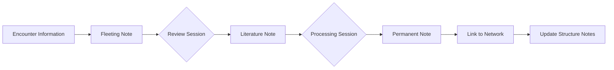
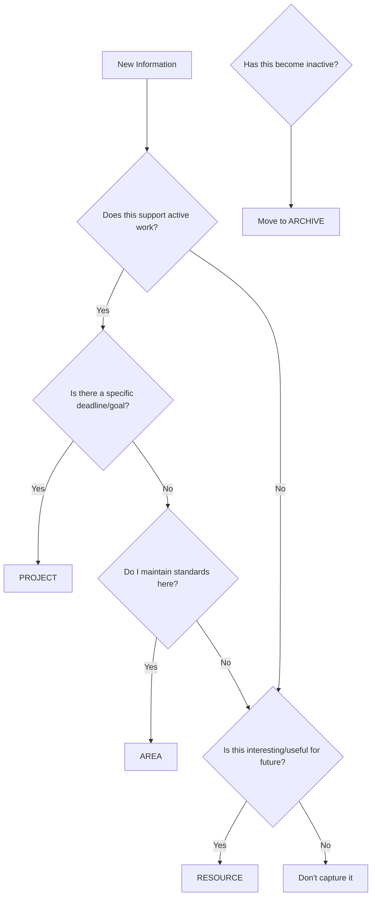

# Second Brain Methodologies

**Version:** 1.0
**Phase:** 1 - MVP
**Last Updated:** 2025-11-09
**Purpose:** Comprehensive guide to Zettelkasten and PARA methodologies for AI agents in the BMAD Obsidian 2nd Brain expansion pack

---

## Table of Contents

1. [Introduction](#introduction)
2. [Zettelkasten Method](#zettelkasten-method)
3. [PARA Method](#para-method)
4. [Comparison and Integration](#comparison-and-integration)
5. [Cross-References](#cross-references)
6. [Future Phases](#future-phases)

---

## Introduction

### What is a "Second Brain"?

A "second brain" is an external, organized system for capturing, connecting, and retrieving knowledge. Unlike traditional note-taking that focuses on storage and retrieval, a second brain actively supports thinking, creativity, and knowledge development. It serves as:

- **External memory** - Offloading information from your biological brain
- **Thinking partner** - A system that helps you develop and connect ideas
- **Knowledge network** - An interconnected web of concepts rather than isolated notes
- **Productivity engine** - A foundation for creating new work from accumulated knowledge

### Why Use Structured Methodologies?

Raw note-taking without structure creates information graveyards—places where notes go to die. Structured methodologies provide:

- **Clarity** - Clear rules for where information belongs
- **Discoverability** - Systems for finding relevant information when needed
- **Context** - Frameworks that preserve the relationships between ideas
- **Actionability** - Organization that supports doing work, not just storing information

### How This Guide Relates to BMAD Framework

The BMAD-METHOD™ framework emphasizes:

- Natural language workflows
- Modular, reusable components
- Clear dependencies and relationships
- Support for both planning and development phases

These second brain methodologies align perfectly with BMAD principles. Zettelkasten provides network-based knowledge development similar to BMAD's dependency-driven architecture. PARA provides actionability-based organization that mirrors BMAD's distinction between active stories and archived work.

For BMAD framework fundamentals, see [[bmad-kb|BMAD Knowledge Base]].

---

## Zettelkasten Method

### History and Principles

The Zettelkasten method originated with **Niklas Luhmann (1927-1998)**, a German sociologist who achieved extraordinary productivity: **70 books and over 400 scholarly articles** during his academic career. He attributed this output to his Zettelkasten (German for "slip-box") system, which he began building in the 1950s and eventually accumulated **over 90,000 index cards**.

In his foundational 1981 paper "Communicating with Slip Boxes" (_Kommunikation mit Zettelkästen_), Luhmann described the system in detail. He famously stated:

> "Without writing, one cannot think; at least not in a sophisticated, connectable manner."

Luhmann conceived of his Zettelkasten as more than a note-taking tool—it was his **communication partner, an external brain capable of dialoguing with him, facilitating thinking, and even "surprising" himself.**

### Core Principle: Network Over Hierarchy

**Luhmann developed topics bottom-up rather than using preconceived hierarchical organization.** His revolutionary insight was that **one idea's value depended entirely on its context**, which was not necessarily the context from which it was originally taken. He designed his system so that **one idea could relate and contribute to different contexts.**

Rather than creating a static archive where you retrieve what you put in, **he used the slip-box as a system to think with, where the references between notes became much more important than references from an index to individual notes.** This approach meant that **the collection became much more than the sum of its parts**—it became his dialogue partner, main idea generator, and productivity engine.

Traditional hierarchical systems force you to decide upfront where information belongs. Zettelkasten recognizes that ideas gain meaning through their connections to other ideas—connections that emerge over time rather than being predetermined.

### Atomicity as Outcome (Not Input Requirement)

A common misconception about Zettelkasten is that notes must be "atomic" (one idea per note) from the start. In reality, **atomicity is an outcome of processing, not an input requirement.**

When you first encounter an idea:

1. **Capture it quickly** (fleeting note) - Don't worry about perfection
2. **Process it later** (literature note) - Extract the meaningful parts
3. **Develop it further** (permanent note) - Distill to core concepts in your own words

Atomicity emerges through this refinement process. You naturally identify distinct concepts that deserve their own notes as you work with the material.

### The 6 Building Blocks

Modern Zettelkasten practice recognizes six types of notes, each serving a specific function:

#### 1. Fleeting Notes (Quick Captures)

**Purpose:** Capture ideas immediately before they're lost

**Characteristics:**

- Written in any format (voice memo, scribble, quick text)
- Temporary by nature
- Not meant for long-term storage
- Processed within 24-48 hours

**Example:**

```
"Ideas from podcast - network effects in social platforms
- More users = more value
- Tipping point concept
- Connection to Metcalfe's Law?
- Check out book recommendation: 'The Network State'"
```

**Workflow:**

- Capture immediately when inspiration strikes
- Review daily or every few days
- Convert valuable fleeting notes into literature or permanent notes
- Discard fleeting notes after processing

#### 2. Literature Notes (Source Material)

**Purpose:** Document ideas from external sources in your own words

**Characteristics:**

- One note per source (book, article, video, conversation)
- Brief and selective (not comprehensive summaries)
- Written in your own words (forces understanding)
- Include citation information

**Example:**

```
Source: "How to Take Smart Notes" by Sönke Ahrens (2017)

Key insight: The slip-box is not just a storage system but a thinking tool.

Ahrens argues that externalizing thinking onto paper allows you to:
- Focus on one thought at a time without losing others
- Combine thoughts in unexpected ways
- Create a dialogue with your past thinking

This challenges the common view of notes as mere reminders.

Related concepts to explore:
- Extended cognition theory
- Writing as thinking
```

#### 3. Permanent Notes (Processed Knowledge)

**Purpose:** Capture your own developed understanding in the permanent knowledge base

**Characteristics:**

- Written as if for someone else (clear, complete sentences)
- Self-contained (understandable without context)
- One concept per note
- Permanent and stable
- Connected to other permanent notes

**Example:**

```
# The Slip-Box as Thinking Partner

A note-taking system becomes a thinking partner when it:

1. Externalizes cognition - allows focusing on one thought while preserving others
2. Enables unexpected connections - juxtaposes ideas from different contexts
3. Creates dialogue - lets you respond to your past thinking

This differs from storage-focused systems where notes are merely retrieved.
The value emerges from the network of connections, not individual notes.

Links:
- See [[Extended Cognition Theory]]
- See [[Writing as Thinking Process]]
- See [[Emergent Knowledge Networks]]
```

#### 4. Index Notes (Entry Points)

**Purpose:** Provide entry points into topic clusters

**Characteristics:**

- Minimal text, mostly links
- Thematic organization
- Multiple index notes for different perspectives
- Only link to 1-3 starting points per topic

**Example:**

```
# Index: Knowledge Management

Starting points:
- [[Zettelkasten Method Overview]] - Core methodology
- [[PARA Organization System]] - Actionability-based framework
- [[Extended Cognition Theory]] - Theoretical foundation
```

Luhmann was very economical with index references, adding only one or two notes (rarely more) next to a keyword. This selectivity was essential because **the main power of the system lay in connections between notes rather than index lookups.**

#### 5. Structure Notes (Topic Maps)

**Purpose:** Organize thinking about specific topics and show relationships

**Characteristics:**

- Overview of a topic domain
- Narrative structure explaining connections
- Guide you through a line of thought
- Evolve as understanding develops

**Example:**

```
# Structure Note: Personal Knowledge Management Systems

## Overview
PKM systems help individuals capture, organize, and retrieve knowledge.
Two main approaches dominate: network-based (Zettelkasten) and
action-based (PARA).

## Network-Based Approaches
Starting with [[Zettelkasten Method Overview]], we see emphasis on:
- [[Bottom-Up Knowledge Development]]
- [[Emergent Organization]]
- [[Link-Based Discovery]]

This leads to considerations of [[Network Effects in Knowledge Bases]].

## Action-Based Approaches
Contrasting with [[PARA Organization System]], which prioritizes:
- [[Actionability Over Topics]]
- [[Project-Oriented Information]]
- [[Just-In-Time Organization]]

## Integration Strategies
Hybrid approaches combine strengths:
- [[PARA for Projects, Zettelkasten for Knowledge]]
- [[Time-Based vs. Topic-Based Navigation]]
```

#### 6. Keyword Notes (Concept Clusters)

**Purpose:** Gather notes related to specific concepts or keywords

**Characteristics:**

- Tag-like functionality but with context
- Explain why notes are grouped together
- Show different facets of a concept
- Bridge between different topic areas

**Example:**

```
# Keyword: Emergence

Notes exploring emergence across different domains:

## Systems Theory
- [[Emergent Properties in Complex Systems]] - Properties arising from interactions
- [[Self-Organization Patterns]] - Bottom-up order formation

## Knowledge Management
- [[Emergent Knowledge Networks]] - Understanding developing through connections
- [[Bottom-Up Knowledge Development]] - Ideas organizing themselves naturally

## Software Architecture
- [[Emergent Design Patterns]] - Patterns arising from constraints
- [[Conway's Law and Team Structure]] - System structure mirroring organization

The common thread: **whole becomes greater than sum of parts through interaction.**
```

### Workflow: Fleeting → Literature → Permanent

The Zettelkasten workflow transforms raw information into developed knowledge:



#### Step 1: Capture (Fleeting Notes)

When you encounter something interesting:

- Write it down immediately in any format
- Don't worry about organization or polish
- Include enough context to remember later

**Frequency:** Throughout the day, as ideas arise

#### Step 2: Review and Extract (Literature Notes)

During daily review:

- Process fleeting notes from the past 24-48 hours
- For external sources, create literature notes
- Write in your own words to ensure understanding
- Be selective—capture what matters to you

**Frequency:** Daily or every few days

#### Step 3: Develop (Permanent Notes)

During focused thinking sessions:

- Transform literature notes into permanent notes
- Develop your own thinking about the concepts
- Write clearly and completely
- One concept per note

**Frequency:** Weekly or when accumulating insights

#### Step 4: Connect (Linking)

For each permanent note:

- Ask: "What does this relate to in my existing knowledge?"
- Add links to related notes
- Update structure notes if developing a topic
- Create new index entries for new topics

**Frequency:** Immediately when creating permanent notes

#### Step 5: Develop Structure (Structure Notes)

Periodically:

- Create structure notes when clusters emerge
- Revise structure notes as understanding develops
- Use structure notes to identify gaps in knowledge

**Frequency:** Monthly or when exploring a topic deeply

### Unique Identifier Conventions

Zettelkasten notes require stable, unique identifiers that don't change over time. Three main approaches exist:

#### Timestamp-Based Identifiers

Format: `YYYYMMDDHHmm` or `YYYYMMDDHHmmss`

**Example:** `202511091430` (November 9, 2025, 14:30)

**Advantages:**

- Automatically unique
- Chronological ordering shows development over time
- No planning required
- Works well with digital tools

**Disadvantages:**

- No semantic meaning
- Can't manually create hierarchies
- Harder to remember specific note IDs

**Best for:** Digital Zettelkasten systems, especially when using tools with good search and linking

#### Sequential Luhmann-Style Identifiers

Format: Alternating numbers and letters with optional separators

**Examples:**

- `1` → `2` → `3`
- `1` → `1a` → `1b` → `1a1`
- `21/3d7a6` → `21/3d7a7`

**How it works:**

- New main topic gets next number: `1`, `2`, `3`
- Related note added after `1` becomes `1a`
- Note related to `1a` becomes `1a1` or `1b` depending on relationship
- Use `/` to indicate branches in thinking

**Advantages:**

- Shows relationships through proximity
- Creates organic hierarchies
- Flexible branching for tangential thoughts
- Historical fidelity to Luhmann's original method

**Disadvantages:**

- Requires planning where notes "belong"
- Can become complex (`21/3d7a7g2`)
- Harder to maintain in digital systems

**Best for:** Physical Zettelkasten, those wanting structural proximity

#### Hybrid Approaches

Combining methods can leverage strengths:

**Timestamp + Manual Tags:**

- Use timestamp for unique ID
- Add semantic tags or prefixes for human navigation
- Example: `202511091430-zettelkasten-workflow`

**Folder Prefix + Timestamp:**

- Organize broad categories by folder
- Unique timestamp within each folder
- Example: `knowledge-management/202511091430.md`

### Linking Conventions and Best Practices

The power of Zettelkasten emerges from connections between notes. Effective linking requires intention and strategy:

#### Direct Links (Explicit Connections)

**Purpose:** Show explicit relationships between concepts

**When to create:**

- One note directly builds on another
- Contradictory perspectives on same topic
- Different applications of same principle
- Examples illustrating a concept

**How to implement:**

- In note text: `See [[Note Title]]` or `Related: [[Note Title]]`
- Bidirectional links when using digital tools
- Brief context explaining the connection

**Example:**

```markdown
# PARA Organization System

The PARA method prioritizes actionability over topics.

This contrasts with [[Zettelkasten Method Overview]], which prioritizes
network connections over actionability. However, the two can work together:
see [[PARA for Projects, Zettelkasten for Knowledge]].
```

#### Hub Notes (Connection Points)

**Purpose:** Structure notes or index notes that serve as central connection points

**Characteristics:**

- Many inbound and outbound links
- Provide narrative structure
- Evolve as understanding develops
- Multiple hubs can organize same content differently

**Strategy:**

- Create hubs when 5-10 notes cluster around a topic
- Update hubs as you add related notes
- Don't over-structure—let organization emerge

#### Link Density Best Practices

**Optimal link density:** 3-8 links per permanent note

**Too few links (<2):**

- Note becomes isolated
- Knowledge doesn't integrate
- Discovery potential diminished

**Too many links (>15):**

- Cognitive overload
- Links lose meaning
- Navigation becomes difficult

**Quality over quantity:**

- Each link should be meaningful
- Explain why notes connect
- Prefer specific connections over generic ones

**Example of meaningful linking:**

```markdown
# Bottom-Up Knowledge Development

Rather than planning structure upfront, let organization emerge from content.

This principle appears across domains:

- In software: [[Emergent Design Patterns]]
- In systems theory: [[Self-Organization Patterns]]
- In urban planning: [[Jane Jacobs on Organic City Growth]]

The common insight: **imposed order often conflicts with actual use patterns**.
See [[Planning Paradox]] for why this occurs.

Contrast with [[Top-Down Hierarchical Organization]], which has different
strengths and weaknesses.
```

### Examples: Complete Workflow

#### Example 1: From Web Article to Permanent Note

**Day 1 - Encounter & Capture (Fleeting Note):**

```
Voice memo: "Article about spaced repetition in learning. Key point:
timing of review more important than amount of review. Mentions
forgetting curve. Check out Anki app."
```

**Day 2 - Extract (Literature Note):**

```
Source: "How Spaced Repetition Works" - Nicky Case (2018)
https://ncase.me/remember/

Key insights:
1. We forget information predictably (forgetting curve)
2. Reviewing just before forgetting strengthens memory maximally
3. Optimal spacing increases over time (1 day, 3 days, 1 week, etc.)
4. Active recall (testing yourself) beats passive review

This challenges the common practice of cramming before exams.

Questions this raises:
- How does this apply to conceptual knowledge vs. facts?
- Connection to Zettelkasten review patterns?
```

**Day 3 - Develop (Permanent Note):**

```
# Spaced Repetition Principle

Memory strengthening is maximized when review occurs just before forgetting.

Key mechanism:
1. Learning creates weak memory trace
2. Memory decays predictably over time (forgetting curve)
3. Successful recall before complete forgetting strengthens trace
4. Each successful recall extends the interval until next forgetting

Optimal review schedule increases geometrically:
- First review: 1 day after learning
- Second review: 3 days after first review
- Third review: 1 week after second review
- Fourth review: 2 weeks after third review
- And so on...

This differs from mass practice (cramming), which creates temporary
strength but poor long-term retention.

Applications:
- [[Spaced Repetition Software]] (Anki, SuperMemo)
- [[Zettelkasten Review Patterns]] - periodic revisiting of notes
- [[Curriculum Design Using Spaced Practice]]

Theoretical foundation:
- [[Ebbinghaus Forgetting Curve]]
- [[Memory Consolidation Process]]

Related learning principles:
- [[Active Recall vs. Passive Review]]
- [[Interleaving Practice]]
```

**Day 4 - Connect (Linking & Structure):**

Update structure note:

```
# Structure Note: Learning and Memory

## Foundational Principles
- [[Ebbinghaus Forgetting Curve]] - predictable memory decay
- [[Memory Consolidation Process]] - how memories stabilize

## Evidence-Based Techniques
- [[Spaced Repetition Principle]] - timing of review ← NEW
- [[Active Recall vs. Passive Review]]
- [[Interleaving Practice]]

## Applications
- [[Spaced Repetition Software]]
- [[Zettelkasten Review Patterns]] ← UPDATED LINK
```

#### Example 2: Linking Pattern Development

As your Zettelkasten grows, linking patterns reveal emergent themes:

```
Initial notes (Week 1):
- [[Network Effects in Social Platforms]]
- [[Metcalfe's Law]]

Connection discovered (Week 3):
- [[Emergent Knowledge Networks]]
  Links to both notes above - network effects apply to knowledge too!

Theme emerges (Week 6):
Create structure note:

# Structure Note: Network Effects Across Domains

Network effects—where value increases with participants—appear everywhere:

## Technology Platforms
- [[Network Effects in Social Platforms]]
- [[Metcalfe's Law]] - value proportional to n²

## Knowledge Systems
- [[Emergent Knowledge Networks]]
- [[Zettelkasten Network Value]]

## Biological Systems
- [[Neural Network Development]]
- [[Ecosystem Interconnection Strength]]

Cross-domain insight: **Systems gain value through connection density, not
just component quality.** See [[Quality vs. Connection Density Trade-offs]].
```

---

## PARA Method

### Core Concepts and Taxonomy

The PARA method, developed by **Tiago Forte** and detailed in his book _Building a Second Brain_, organizes all digital information into four fundamental categories. The system prioritizes **clarity and simplicity**, recognizing that if your organizational framework becomes as complex as your life, it will consume the time and energy you need to actually use it.

#### Projects: Short-Term, Goal-Oriented Efforts

**Definition:** Work with defined outcomes and specific timeframes

**Characteristics:**

- Finite duration (weeks to months)
- Clear success criteria
- Active effort required
- Specific deliverables

**Examples (Technical Context):**

- "Implement microservices architecture for payment system"
- "Migrate legacy database to PostgreSQL"
- "Build API documentation portal"
- "Complete security audit remediation"

**Examples (Personal Context):**

- "Plan summer vacation to Japan"
- "Prepare presentation for conference"
- "Organize home office renovation"

#### Areas: Ongoing Responsibilities

**Definition:** Long-term domains requiring continuous maintenance without defined endpoints

**Characteristics:**

- Indefinite duration
- Standard-setting rather than goal-achieving
- Regular maintenance required
- Success measured by consistency, not completion

**Examples (Technical Context):**

- "System Architecture Standards"
- "Code Quality Guidelines"
- "Infrastructure Monitoring"
- "Security Practices"
- "Team Knowledge Management"

**Examples (Personal Context):**

- "Health and Fitness"
- "Financial Management"
- "Professional Development"
- "Family Relationships"

#### Resources: Reference Collections

**Definition:** Useful materials that support your work without being tasks themselves

**Characteristics:**

- Non-actionable (currently)
- Reference material
- Interest-based collections
- Passive until needed

**Examples (Technical Context):**

- "Machine Learning Research Articles"
- "API Documentation Templates"
- "DevOps Tools Comparison"
- "Database Optimization Techniques"
- "Software Architecture Patterns"

**Examples (Personal Context):**

- "Travel Destinations to Explore"
- "Recipe Collection"
- "Book Recommendations"
- "Home Improvement Ideas"

#### Archives: Inactive Items

**Definition:** Preserved information from Projects, Areas, or Resources that are no longer active

**Characteristics:**

- Completely non-actionable
- Historical reference
- Potential future reactivation
- Cold storage

**Examples (Technical Context):**

- Completed projects ("Legacy System Migration 2024")
- Deprecated technologies ("Flash Development Resources")
- Obsolete standards ("Pre-Kubernetes Deployment Procedures")
- Former responsibilities ("Mobile Team Lead" after role change)

**Examples (Personal Context):**

- Completed projects ("Wedding Planning 2023")
- Past hobbies ("Photography Equipment Research")
- Old jobs ("Marketing Career Materials")

### Actionability-Based Organization

The fundamental organizing principle of PARA is **actionability**—the degree to which information demands your attention right now. This creates a natural hierarchy:

```
HIGHEST ACTIONABILITY
↓
Projects       ███████ Requires immediate, active work
↓
Areas          ████    Requires regular maintenance
↓
Resources      ██      Useful when needed, passive otherwise
↓
Archives       ░       Completely inactive unless reactivated
↓
LOWEST ACTIONABILITY
```

#### How to Categorize Information

Ask yourself: **What is my current relationship to this information?**

**Decision Flow:**



**Examples of categorization:**

| Information                         | Question                       | Category                     | Reasoning                            |
| ----------------------------------- | ------------------------------ | ---------------------------- | ------------------------------------ |
| "Kubernetes best practices" article | Active K8s migration project?  | Project (if yes)             | Directly supports active work        |
| Same article                        | No active project, but use K8s | Area                         | Maintaining infrastructure standards |
| Same article                        | Don't use K8s, but interested  | Resource                     | Future potential use                 |
| "Docker Swarm deployment guide"     | Using Docker Swarm?            | Archive (if switched to K8s) | Inactive technology                  |

#### Decision Tree for Placement

**Start here:** Is this information actionable right now?

- **YES → Is it supporting a specific goal/deliverable?**
  - YES → **PROJECT**
  - NO → Is it an ongoing responsibility/standard?
    - YES → **AREA**
    - NO → **RESOURCE** (might become actionable later)

- **NO → Is it worth keeping for potential future use?**
  - YES → **RESOURCE**
  - NO → Don't capture it

**Already captured but circumstances changed?**

- **Was in Project but shipped/cancelled** → Move to **ARCHIVE**
- **Was in Area but no longer your responsibility** → Move to **ARCHIVE**
- **Was in Resource but now supporting active project** → Move to **PROJECT**
- **Was in Archive but needed again** → Move to appropriate active category

#### Moving Items Through Lifecycle

Information flows naturally through PARA categories as your relationship to it changes:

**Resource → Project:**
"Terraform infrastructure-as-code guides" moves from Resources to "Cloud Migration Project" when migration starts

**Project → Archive:**
"API Gateway Upgrade" moves to Archives when deployment completes

**Area → Archive:**
"Mobile Development Standards" moves to Archives when you change teams

**Archive → Area:**
"Security Best Practices 2020" moves back to Areas if you return to security role

**Project → Area:**
"Build CI/CD Pipeline" (Project) becomes "CI/CD Maintenance" (Area) after initial implementation

This fluidity is a feature, not a bug. **There's no permanently perfect place for information**—relevance depends on your current context.

### Project vs. Area Distinction

This distinction often creates confusion, but clarity emerges from three core differences:

#### Time-Bound vs. Ongoing

**Projects:**

- Have explicit end dates (or cancellation dates)
- Measure progress toward completion
- Cease to exist after shipping
- Examples: "Q4 2025", "Before conference in March", "3-month timeline"

**Areas:**

- Have no endpoint—continue indefinitely
- Measure adherence to standards
- Persist as long as responsibility persists
- Examples: "As long as I'm Tech Lead", "Ongoing health commitment", "Lifelong learning"

#### Goal-Driven vs. Standard-Driven

**Projects:**

- Achieve specific outcomes
- Success = completion
- Binary state (done or not done)
- Examples: "System deployed and tested", "Documentation published", "Feature shipped to users"

**Areas:**

- Maintain quality levels
- Success = consistency
- Continuous state (always in progress)
- Examples: "Code quality above threshold", "Security posture maintained", "Health metrics stable"

#### Examples and Edge Cases

| Scenario       | Project                                                   | Area                                                    |
| -------------- | --------------------------------------------------------- | ------------------------------------------------------- |
| Authentication | "Design new authentication system" (3-6 months to deploy) | "Authentication Standards Maintenance" (ongoing)        |
| Database       | "Migrate to PostgreSQL" (finite migration)                | "Database Performance Optimization" (continuous)        |
| Documentation  | "Create API documentation portal" (project to build)      | "Documentation Quality Standards" (ongoing maintenance) |
| Testing        | "Achieve 80% test coverage" (goal-driven sprint)          | "Test Quality and Coverage" (continuous responsibility) |
| Learning       | "Complete AWS Certification" (specific goal)              | "Cloud Architecture Skills" (career-long development)   |

**Edge Case 1: When Projects Graduate to Areas**

"Build internal API platform" starts as a Project. Once operational, it becomes Area: "API Platform Maintenance"

**Handling strategy:**

- Complete the Project and move to Archives
- Create a new Area for ongoing maintenance
- Link the archived Project from the active Area for context

**Edge Case 2: When Areas Spawn Projects**

Area "Security Practices" identifies need for "Implement Zero-Trust Architecture"

**Handling strategy:**

- Create new Project under the specific initiative
- Link Project back to parent Area
- Project feeds improvements back into Area standards when complete

**Edge Case 3: Technology Evaluations**

"Evaluate containerization solutions" feels like ongoing research (Area) but has decision deadline (Project)

**Handling strategy:**

- Treat as Project with defined completion criteria ("Make decision by Q1 2025")
- Move evaluation materials to Archives after decision
- Chosen technology may spawn new Area ("Container Orchestration Standards")

**Edge Case 4: Technical Debt**

Is technical debt a Project or Area?

**Answer:** Depends on scope

- "Refactor payment processing module" = Project (finite scope)
- "Technical Debt Management" = Area (ongoing identification and prioritization)
- Specific debt items become Projects when actively tackled

### Information Lifecycle Management

PARA naturally manages information lifecycles through movement rather than deletion.

#### When to Archive

**Archive a Project when:**

- ✅ Successfully completed and shipped
- ❌ Cancelled or deprioritized indefinitely
- ⏸️ On hold for >3 months with no clear restart date

**Archive an Area when:**

- No longer your responsibility (role change, delegation)
- Domain no longer relevant to your life/work
- Standards have been superseded completely

**Archive a Resource when:**

- Topic no longer interests you
- Information became outdated/deprecated
- Haven't referenced in 12+ months (periodic review trigger)

**Key principle:** Don't delete—preserve for potential future reference. Storage is cheap; recreating context is expensive.

#### Periodic Reviews

PARA emphasizes **"just-in-time" organization** rather than scheduled maintenance sessions. Organize information as a natural consequence of working with your system:

**When putting information IN:**

- Quick categorization (Project/Area/Resource/Archive)
- Don't overthink—you can move it later
- Err toward Projects if uncertain (most actionable category)

**When pulling information OUT:**

- Notice if it's in the wrong place
- Move it while you have context
- Update related notes if needed

**Periodic reviews (optional but valuable):**

- **Weekly:** Scan Projects for completed items → Archive
- **Monthly:** Review Areas for inactive domains → Archive
- **Quarterly:** Scan Resources for deprecated/uninteresting content → Archive
- **Annually:** "Information bankruptcy" option (see below)

#### Pruning Strategies

**Strategy 1: Just-In-Time Pruning**

As you work, notice what's no longer relevant and archive it immediately. This distributes organizational overhead across your workflow rather than concentrating it in "cleanup sessions."

**Strategy 2: Declare "Information Bankruptcy"**

Periodically (annually or when system feels overwhelming):

1. Move EVERYTHING to Archives (except active Projects)
2. Start fresh with empty Projects/Areas/Resources
3. Pull items back from Archives as you need them
4. What stays in Archives after 3-6 months probably belongs there

**Benefits:**

- Eliminates accumulated baggage
- Keeps you nimble and focused
- Nothing truly lost—Archives remain searchable
- Reveals what actually matters through use patterns

**Strategy 3: Resource Pruning by Activity**

For Resources specifically:

- Tag or note when you last accessed each Resource collection
- During quarterly review, archive Resources untouched in 6+ months
- Exception: Reference materials you know you'll need eventually

**Strategy 4: Archive Mining**

Occasionally browse Archives to:

- Rediscover forgotten insights
- Identify patterns across completed work
- Extract reusable templates/processes
- Generate new Project ideas from past work

### Practical Folder Structure

#### Technical Knowledge Base Example

```
PARA/
├── Projects/
│   ├── 2025-Q4_Microservices_Migration/
│   │   ├── 00_Requirements_and_Scope.md
│   │   ├── 01_Architecture_Decisions/
│   │   │   ├── ADR-001_Service_Boundaries.md
│   │   │   ├── ADR-002_Communication_Patterns.md
│   │   │   └── ADR-003_Data_Consistency_Strategy.md
│   │   ├── 02_Implementation_Progress/
│   │   │   ├── Sprint_Planning.md
│   │   │   ├── Technical_Specs/
│   │   │   └── Code_Reviews.md
│   │   ├── 03_Testing_and_Validation/
│   │   └── 04_Deployment_Runbook.md
│   │
│   ├── 2025-Q3_API_Gateway_Upgrade/
│   ├── 2025-Q3_Documentation_Portal_Launch/
│   └── 2025-Q2_Security_Audit_Remediation/
│
├── Areas/
│   ├── System_Architecture/
│   │   ├── Design_Principles.md
│   │   ├── Approved_Patterns_Catalog.md
│   │   ├── Standards_Compliance_Checklist.md
│   │   └── Architecture_Review_Process.md
│   │
│   ├── Infrastructure_Operations/
│   │   ├── Deployment_Procedures/
│   │   ├── Monitoring_and_Alerting/
│   │   ├── Incident_Response_Playbooks/
│   │   └── Disaster_Recovery_Plans/
│   │
│   ├── Code_Quality_Standards/
│   │   ├── Style_Guides/
│   │   ├── Review_Checklist.md
│   │   ├── Testing_Requirements.md
│   │   └── Documentation_Standards.md
│   │
│   ├── Security_Practices/
│   │   ├── Threat_Modeling_Process.md
│   │   ├── Security_Review_Checklist.md
│   │   └── Vulnerability_Management.md
│   │
│   └── Performance_Optimization/
│       ├── Profiling_Methodology.md
│       ├── Caching_Strategies.md
│       └── Database_Query_Optimization.md
│
├── Resources/
│   ├── Technology_Research/
│   │   ├── Container_Orchestration/
│   │   │   ├── Kubernetes_vs_ECS_Comparison.md
│   │   │   ├── Service_Mesh_Options.md
│   │   │   └── Scaling_Strategies.md
│   │   ├── Caching_Technologies/
│   │   ├── Database_Comparison/
│   │   └── Observability_Tools/
│   │
│   ├── Code_Snippets/
│   │   ├── Python_Utils/
│   │   ├── SQL_Queries/
│   │   └── Shell_Scripts/
│   │
│   ├── Tool_Documentation/
│   │   ├── Docker_Reference.md
│   │   ├── Git_Advanced_Techniques.md
│   │   └── AWS_CLI_Cookbook.md
│   │
│   └── Third_Party_APIs/
│       ├── Payment_Gateway_Integration.md
│       ├── Authentication_Providers.md
│       └── Monitoring_Services.md
│
└── Archives/
    ├── Completed_Projects/
    │   ├── 2024_Legacy_System_Migration/
    │   ├── 2023_Cloud_Migration/
    │   └── 2023_Payment_Integration/
    │
    ├── Retired_Technologies/
    │   ├── Docker_Swarm_Deployment_Guides/
    │   ├── MongoDB_Procedures/
    │   └── AngularJS_Components/
    │
    └── Deprecated_Standards/
        ├── Pre_K8s_Deployment_Procedures/
        └── Legacy_Code_Review_Process/
```

#### Personal Knowledge Management Example

```
PARA/
├── Projects/
│   ├── 2025-Summer_Japan_Vacation/
│   ├── 2025-Q2_AWS_Certification/
│   └── 2025-Q1_Home_Office_Renovation/
│
├── Areas/
│   ├── Health_and_Fitness/
│   ├── Financial_Management/
│   ├── Professional_Development/
│   ├── Family_Relationships/
│   └── Home_Maintenance/
│
├── Resources/
│   ├── Travel_Destinations/
│   ├── Recipe_Collection/
│   ├── Book_Recommendations/
│   └── Learning_Materials/
│
└── Archives/
    ├── 2024_Kitchen_Remodel/
    ├── 2023_Wedding_Planning/
    └── Former_Hobbies/
```

### When to Use PARA vs. Other Methodologies

#### PARA Strengths

**Choose PARA when:**

- Managing multiple concurrent projects
- Need to find information quickly by current relevance
- Working across different life/work domains
- Prefer action-oriented organization over topic-based
- Want simple, low-maintenance categorization

**PARA excels at:**

- Project-based work (software development, consulting, creative projects)
- Professional knowledge management
- Cross-domain organization (work + personal in one system)
- Getting Things Done (GTD) integration

#### Comparison to Other Systems

| System             | Organizing Principle     | Best For                         | Integration with PARA                                       |
| ------------------ | ------------------------ | -------------------------------- | ----------------------------------------------------------- |
| **Zettelkasten**   | Network connections      | Deep thinking, research, writing | Use Zettelkasten within Resources; PARA for actionable work |
| **Johnny Decimal** | Hierarchical numbering   | Rigid categories, finding files  | Can number PARA categories for filesystem organization      |
| **GTD**            | Context and next actions | Task management                  | PARA organizes reference material supporting GTD tasks      |
| **Categorical**    | Subject/topic            | Libraries, academic research     | PARA's Resources can use categorical sub-organization       |

#### When NOT to Use PARA

**PARA may be overkill when:**

- Managing single project with no ongoing responsibilities
- Small team without formal knowledge management
- AI-powered search makes organization less critical
- Static reference library (library science systems better suited)

#### Integration Strategies

**PARA + Zettelkasten:**

- **Projects:** Action-oriented work with deadlines
- **Areas:** Ongoing responsibilities and standards
- **Resources:** Zettelkasten (network-based knowledge development)
- **Archives:** Completed projects and inactive Zettelkasten notes

**PARA + GTD:**

- **Projects:** GTD Projects (multi-step outcomes)
- **Project support material:** Organized in PARA Projects
- **Areas:** GTD Areas of Responsibility
- **Resources:** Reference material for someday/maybe
- **GTD lists** (Next Actions, Waiting For) remain separate task management

**PARA + Johnny Decimal:**

```
10-19 Projects/
  11 Microservices Migration/
  12 API Gateway Upgrade/
20-29 Areas/
  21 System Architecture/
  22 Infrastructure Operations/
30-39 Resources/
  31 Technology Research/
  32 Code Snippets/
40-49 Archives/
```

### Implementation in Digital Tools

PARA is tool-agnostic and adapts to whatever platform you use.

#### Filesystem-Based Implementation

```bash
~/Documents/PARA/
├── Projects/
│   └── 2025-Q4_ProjectName/
├── Areas/
│   └── AreaName/
├── Resources/
│   └── TopicName/
└── Archives/
    └── YYYY_ProjectName/
```

**Naming convention:** Include dates in Projects for automatic chronological sorting

#### Notion Implementation

**Database Structure:**

- Create four databases (Projects, Areas, Resources, Archives)
- Properties:
  - Status (Active, Completed, On Hold)
  - Start Date / End Date (Projects)
  - Last Updated (all)
  - Tags (flexible categorization)
  - Related Items (database relations)

**Views:**

- "My Current Work" - Active Projects + relevant Areas
- "By Domain" - Group by tags
- "Timeline" - Gantt chart of Projects
- "Recently Updated" - Sort by modification date

#### Obsidian Implementation

**Folder Structure + Tags:**

```
Projects/
Areas/
Resources/
Archives/

With YAML frontmatter:
---
category: project
status: active
deadline: 2025-12-31
tags: [infrastructure, migration]
---
```

**MOC (Map of Content) Notes:**

- Create "Projects MOC" linking all active projects
- Create "Areas MOC" organizing ongoing responsibilities
- Use Obsidian graph view to visualize connections

#### Confluence Implementation

**Space-Based Organization:**

- Separate spaces for Projects, Areas, Resources, Archives
- Or single space with page tree structure
- Use labels for cross-cutting concerns
- Macros for project templates

### Cross-Cutting Connections

PARA categories aren't silos—create connections:

**From Projects:**

- Reference Area standards: "Following [[Code Quality Standards]]"
- Pull from Resources: "Using approach from [[Caching Strategies]]"
- Link related Projects: "Depends on [[API Gateway Upgrade]]"

**From Areas:**

- Reference standards in Projects: "Projects must follow this checklist"
- Spawn Projects: "Need project to implement this standard"
- Update based on completed Projects: "Incorporating lessons from [[Migration Project]]"

**From Resources:**

- Become active in Projects: "Now applying this to [[Current Project]]"
- Inform Area standards: "Consider adopting this approach"

Use your tool's relationship features (links, database relations, cross-references) to create this web of connections.

---

## Comparison and Integration

Both Zettelkasten and PARA are powerful methodologies, but they serve different purposes and can complement each other.

### Core Differences

| Aspect                   | Zettelkasten                        | PARA                                     |
| ------------------------ | ----------------------------------- | ---------------------------------------- |
| **Primary Goal**         | Develop thinking, generate insights | Organize actionable information          |
| **Organizing Principle** | Network connections                 | Actionability level                      |
| **Structure**            | Bottom-up, emergent                 | Top-down categories (4 types)            |
| **Best For**             | Research, writing, deep thinking    | Project execution, reference management  |
| **Complexity**           | Higher learning curve               | Simple, immediate usability              |
| **Time Horizon**         | Long-term knowledge development     | Short to medium-term action              |
| **Change Frequency**     | Notes stable, links evolve          | Items move between categories frequently |

### When to Use Each

#### Choose Zettelkasten When

- **Deep research and writing** - Developing original thinking
- **Long-term knowledge building** - Creating personal knowledge base
- **Connecting ideas across domains** - Seeking unexpected insights
- **Academic or intellectual work** - Theory development, literature review
- **Slow, deliberate thinking** - Processing complex concepts

**Example scenarios:**

- Writing a book or research paper
- Developing expertise in a field
- Building theoretical understanding
- Connecting interdisciplinary concepts

#### Choose PARA When

- **Active project management** - Multiple concurrent deliverables
- **Quick information retrieval** - Finding what you need now
- **Clear actionability needed** - Distinguishing what requires attention
- **Cross-domain organization** - Work and personal in one system
- **Low maintenance overhead** - Simple, sustainable organization

**Example scenarios:**

- Software development with multiple projects
- Consulting work across clients
- Managing work and personal life together
- Need to onboard others to your system

### Integration Strategies

#### Strategy 1: PARA for Structure, Zettelkasten for Knowledge

Use PARA as your outer organizational framework and Zettelkasten within the Resources category:

```
PARA/
├── Projects/              [PARA - actionable work]
├── Areas/                 [PARA - ongoing responsibilities]
├── Resources/
│   └── Zettelkasten/     [Zettelkasten - knowledge development]
│       ├── Permanent Notes/
│       ├── Literature Notes/
│       ├── Structure Notes/
│       └── Index Notes/
└── Archives/              [PARA - inactive items]
```

**Workflow:**

1. Capture ideas and research in Zettelkasten
2. When knowledge becomes actionable, create Project
3. Link Project to relevant Zettelkasten notes
4. After Project completes, insights feed back into Zettelkasten

**Benefits:**

- Clear separation between thinking and doing
- Actionable work easy to find (Projects/Areas)
- Deep knowledge development protected (Zettelkasten)
- Cross-pollination between theory and practice

#### Strategy 2: Zettelkasten for Everything, PARA as Tagging

Build a pure Zettelkasten but tag notes with PARA categories:

```markdown
---
category: project
project: Microservices Migration
status: active
---

# Service Boundary Decision

[Permanent note content with links to other notes...]
```

**Benefits:**

- Single unified system
- Network connections preserved
- PARA filtering when needed
- Flexible categorization (notes can serve multiple purposes)

#### Strategy 3: Separate Systems by Domain

- **Work:** PARA (project-focused, collaborative)
- **Personal Learning:** Zettelkasten (knowledge development, private)

**Benefits:**

- Each system optimized for its purpose
- Work knowledge accessible to team (PARA in Confluence/Notion)
- Personal thinking private (Zettelkasten in Obsidian)
- Clear boundaries between professional and personal

#### Strategy 4: Time-Based Hybrid

- **Active work (next 3 months):** PARA organization
- **Long-term knowledge:** Zettelkasten organization
- **Archives:** Hybrid (completed projects + inactive notes)

**Workflow:**

1. Start with PARA for current projects
2. Extract insights into Zettelkasten as you work
3. Archive completed projects
4. Zettelkasten grows as evergreen knowledge base

### Adapting to Your Workflow

#### For Software Engineers

**Recommendation:** PARA + selective Zettelkasten

- **Projects:** Active sprints, features, technical initiatives
- **Areas:** Architecture standards, code quality, ops runbooks
- **Resources:**
  - Research and learning materials
  - Zettelkasten for technical concepts and patterns
- **Archives:** Completed projects, deprecated tech

**Why:** Software work is highly project-oriented, but technical knowledge benefits from networked thinking.

#### For Researchers and Writers

**Recommendation:** Zettelkasten + PARA tagging

- Core system: Zettelkasten for knowledge development
- Tags: PARA categories for current projects and responsibilities
- Export: Generate deliverables from Zettelkasten network

**Why:** Research and writing require deep, networked thinking. PARA provides actionable focus without disrupting knowledge connections.

#### For Consultants and Multi-Project Professionals

**Recommendation:** Pure PARA with rich cross-referencing

- **Projects:** Client engagements and deliverables
- **Areas:** Expertise domains and service offerings
- **Resources:** Methods, frameworks, templates
- **Archives:** Past client work (searchable case studies)

**Why:** Rapid context switching between clients demands clear project boundaries. Rich Resources provide reusable expertise.

#### For Students and Learners

**Recommendation:** Hybrid with Zettelkasten emphasis

- **Projects:** Courses, assignments, research papers
- **Areas:** Subject domains, skill development
- **Resources:** Zettelkasten for course content and reading
- **Archives:** Completed courses

**Why:** Learning benefits from networked knowledge (Zettelkasten), but coursework has clear project structure.

### Practical Integration Example

**Scenario:** Software engineer writing a technical blog

**PARA Structure:**

```
Projects/
  2025-Q4_Blog_Post_Microservices_Patterns/
    Draft.md
    Outline.md
    Related_Zettelkasten_Notes.md  ← Links to knowledge base

Areas/
  Technical_Writing_Standards/
  Professional_Brand_Development/

Resources/
  Zettelkasten/
    Microservices_Architecture_Pattern.md
    Service_Discovery_Mechanisms.md
    Distributed_System_Fallacies.md
    [... networked notes ...]
```

**Workflow:**

1. Research microservices (add to Zettelkasten in Resources)
2. Connections emerge between notes (Zettelkasten linking)
3. Decide to write blog post (create Project)
4. Outline post structure in Project folder
5. Reference Zettelkasten notes while writing
6. Publish post (complete Project → Archive)
7. Insights from writing feed back into Zettelkasten notes
8. Update Technical Writing Standards (Area) with lessons learned

**Result:**

- Project provides focused workspace
- Zettelkasten provides rich research foundation
- Area captures reusable process improvements
- Archive preserves completed work

---

## Cross-References

### Integration with BMAD Framework

Both Zettelkasten and PARA align with BMAD-METHOD™ principles:

**BMAD Concept → Methodology Alignment:**

- **Modular agents** → Zettelkasten atomic notes, PARA clear categories
- **Dependency resolution** → Zettelkasten linking, PARA cross-references
- **Dual environment support** → PARA Projects (active) vs Archives (inactive)
- **Reusable resources** → PARA Resources category, Zettelkasten structure notes

For comprehensive BMAD framework details, see [[bmad-kb|BMAD Knowledge Base]].

### Obsidian Implementation

For technical details on implementing these methodologies in Obsidian:

- Wikilink syntax for Zettelkasten connections: See [[obsidian-technical-guide#wikilink-syntax|Obsidian Wikilink Syntax]]
- Frontmatter for PARA categorization: See [[obsidian-technical-guide#frontmatter|Obsidian Frontmatter]]
- Smart Connections for semantic discovery: See [[obsidian-technical-guide#smart-connections-plugin|Smart Connections Plugin]]

---

## Future Phases

This knowledge base covers **Phase 1 methodologies** (Zettelkasten and PARA). Future phases will expand with additional methodologies and frameworks:

### Phase 2 Additions

**LYT (Linking Your Thinking)** by Nick Milo

- Home notes and MOCs (Maps of Content)
- Progressive summarization techniques
- Idea emergence framework
- Integration with Zettelkasten structure notes

### Phase 6 Additions

**Johnny Decimal System**

- Hierarchical numbering for digital organization
- Category and ID structure
- Filesystem optimization
- Integration with PARA categories

**Progressive Summarization**

- Multi-layer highlighting approach
- Information density optimization
- Active reading techniques
- Integration with literature notes

### Continuous Evolution

This knowledge base will evolve as:

- New methodologies gain prominence
- Best practices emerge from community usage
- Integration patterns prove valuable
- Tool capabilities expand

For the latest updates and community contributions, see the expansion pack repository and documentation.

---

**Document End**

_This knowledge base is maintained by the BMAD Obsidian 2nd Brain expansion pack. For questions, improvements, or contributions, see the expansion pack README or raise an issue in the project repository._
