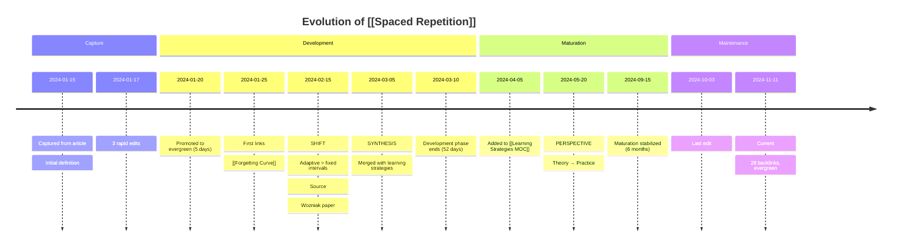
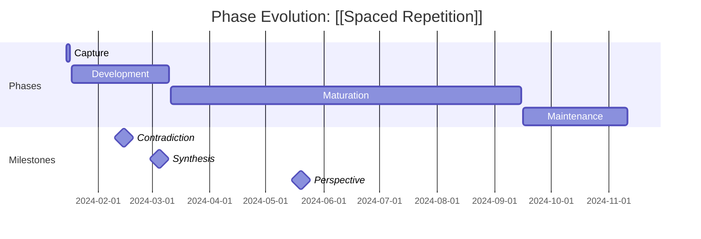

<!-- Powered by BMAD™ Core -->

# Generate Timeline Visualization

## Purpose

Create visual timeline representations of concept evolution in both ASCII format (for terminal display) and Mermaid format (for Obsidian rendering).

## Inputs

- **temporal_events** (Array, required): Chronological events
- **evolution_phases** (Array, required): Identified phases
- **key_shifts** (Array, required): Major understanding shifts
- **note_metadata** (Object, required): Note title, domain

## Outputs

- **ascii_timeline** (String): Text-based timeline for terminal display
- **mermaid_timeline** (String): Mermaid diagram code for Obsidian rendering

## Procedure

### Step 1: Select Events for Visualization

Filter to significant events only (max 15-20 events for readability):

```javascript
significant_events = temporal_events.filter(e => {
  return e.type === 'CAPTURE' ||
         e.type === 'PROMOTION' ||
         e.type === 'MOC_ADDED' ||
         (e.type === 'EDIT' && e.edit_size >= 15) ||
         (e.type === 'LINK' && isSignificantLink(e)) ||
         key_shifts.some(s => datesEqual(s.date, e.timestamp));
});

// If still > 20 events, sample evenly
if (significant_events.length > 20) {
  significant_events = sampleEvenly(significant_events, 20);
}
```

### Step 2: Generate ASCII Timeline

```javascript
function generateASCIITimeline(events, phases) {
  const title = `Evolution Timeline: [[${note_metadata.title}]]`;
  const separator = '='.repeat(80);

  let timeline = `${title}\n${separator}\n`;

  for (const event of events) {
    const date = formatDate(event.timestamp, 'YYYY-MM-DD');
    const icon = getEventIcon(event.type);
    const description = truncate(event.description, 60);

    // Add vertical connector
    if (events.indexOf(event) > 0) {
      timeline += '            |\n';
    }

    // Add event line
    timeline += `${date}  ${icon} ${event.type.padEnd(12)} ${description}\n`;

    // Add phase markers
    const phase_end = phases.find(p => datesEqual(p.end, event.timestamp));
    if (phase_end) {
      timeline += `            ${'\u2501'.repeat(50)} ${phase_end.phase} Phase Ends ${\u2501'.repeat(15)}\n`;
    }
  }

  // Add current status
  timeline += '            |\n';
  timeline += `${formatDate(new Date(), 'YYYY-MM-DD')}  \ud83d\udccd TODAY        ${getCurrentStatus()}\n`;
  timeline += `${separator}\n\n`;

  // Add phase summary bar
  timeline += generatePhaseSummaryBar(phases);
  timeline += '\n\n';

  // Add metrics summary
  timeline += generateMetricsSummary(maturation_metrics);

  return timeline;
}

function getEventIcon(event_type) {
  const icons = {
    'CAPTURE': '\ud83d\udce5',
    'EDIT': '\u270f\ufe0f ',
    'PROMOTION': '\u2b06\ufe0f ',
    'LINK': '\ud83d\udd17',
    'MOC_ADDED': '\ud83d\uddfa\ufe0f '
  };
  return icons[event_type] || '\u2022';
}
```

**Example ASCII Output:**

```
Evolution Timeline: [[Spaced Repetition]]
================================================================================
2024-01-15  📥 CAPTURE      Initial capture from article
            |
2024-01-20  ⬆️  PROMOTION    Moved to evergreen (5 days)
            |
2024-01-25  🔗 LINK         Connected to [[Forgetting Curve]]
            |
2024-02-15  💡 SHIFT        Understanding changed: adaptive > fixed intervals
            |               [Source: Wozniak SM-2 paper]
            |
2024-03-05  🔄 SYNTHESIS    Merged with [[Interleaving]] concepts
            |
2024-03-10  ━━━━━━━━━━━━━━━ Development Phase Ends ━━━━━━━━━━━━━━━
            |
2024-04-05  🗺️  MOC_ADDED   Added to [[Learning Strategies MOC]]
            |
2024-11-11  📍 TODAY        28 backlinks, evergreen reference
================================================================================

Phase Summary:
  Capture:     2 days    (Jan 15 - Jan 17)  ████
  Development: 52 days   (Jan 18 - Mar 10)  ████████████████████████████████
  Maturation:  6 months  (Mar 11 - Sep 15)  ████████████████████████████████████████████
  Maintenance: 2 months  (Sep 16 - Today)   ████████████

Metrics:
  Days to Evergreen: 5 (vault avg: 18)
  Edit Velocity: 2.1/week (vault avg: 1.4/week)
  Link Accumulation: 4.2/month (vault avg: 2.8/month)
  Maturation Speed: 1.62x (fast)
```

### Step 3: Generate Phase Summary Bar

```javascript
function generatePhaseSummaryBar(phases) {
  const total_days = daysBetween(phases[0].start, new Date());

  let summary = 'Phase Summary:\n';

  for (const phase of phases) {
    const percentage = (phase.duration_days / total_days) * 100;
    const bar_length = Math.round(percentage / 2);  // Scale to ~50 chars max
    const bar = '\u2588'.repeat(bar_length);

    summary += `  ${phase.phase.padEnd(13)}: ${phase.duration_days.toString().padStart(3)} days   `;
    summary += `(${formatDateRange(phase.start, phase.end)})  ${bar}\n`;
  }

  return summary;
}
```

### Step 4: Generate Mermaid Timeline

```javascript
function generateMermaidTimeline(events, phases, key_shifts) {
  let mermaid = 'timeline\n';
  mermaid += `    title Evolution of [[${note_metadata.title}]]\n\n`;

  for (const phase of phases) {
    mermaid += `    section ${capitalizeFirst(phase.phase)}\n`;

    // Get events for this phase
    const phase_events = events.filter(e =>
      e.timestamp >= phase.start && e.timestamp <= phase.end
    );

    for (const event of phase_events) {
      const date = formatDate(event.timestamp, 'YYYY-MM-DD');
      const description = event.description.replace(/\n/g, ' ').substring(0, 50);

      mermaid += `        ${date} : ${description}\n`;

      // If event is a key shift, add additional context line
      const shift = key_shifts.find(s => datesEqual(s.date, event.timestamp));
      if (shift) {
        mermaid += `                   : ${shift.type.toUpperCase()}: ${shift.description}\n`;
      }
    }

    mermaid += '\n';
  }

  return mermaid;
}
```

**Example Mermaid Output:**

````markdown

````

### Step 5: Generate Alternative: Gantt-style Mermaid

For phase emphasis over events:

```javascript
function generateMermaidGantt(phases, key_shifts) {
  let gantt = 'gantt\n';
  gantt += `    title Phase Evolution: [[${note_metadata.title}]]\n`;
  gantt += `    dateFormat YYYY-MM-DD\n`;
  gantt += `    section Phases\n`;

  for (const phase of phases) {
    const start = formatDate(phase.start, 'YYYY-MM-DD');
    const end = formatDate(phase.end, 'YYYY-MM-DD');

    gantt += `    ${capitalizeFirst(phase.phase)} : ${start}, ${end}\n`;
  }

  // Add milestones for key shifts
  if (key_shifts.length > 0) {
    gantt += `    section Milestones\n`;
    for (const shift of key_shifts) {
      const date = formatDate(shift.date, 'YYYY-MM-DD');
      gantt += `    ${shift.type} : milestone, ${date}, 0d\n`;
    }
  }

  return gantt;
}
```

**Example Gantt Output:**

````markdown

````

### Step 6: Generate Graph-style Mermaid

For showing connections over time:

```javascript
function generateMermaidGraph(events, key_shifts) {
  let graph = 'graph TD\n';

  const link_events = events.filter(e => e.type === 'LINK');

  graph += `    A[[[${note_metadata.title}]]] --> B[Captured ${formatDate(events[0].timestamp)}]\n`;

  for (let i = 0; i < link_events.length; i++) {
    const link = link_events[i];
    const node_id = String.fromCharCode(67 + i);  // C, D, E, ...
    const target_title = extractTitle(link.target);

    graph += `    A -.->|${formatDate(link.timestamp)}| ${node_id}[[${target_title}]]\n`;
  }

  // Style key shifts
  for (const shift of key_shifts) {
    const shift_node = `S${key_shifts.indexOf(shift)}`;
    graph += `    ${shift_node}[${shift.type.toUpperCase()}: ${formatDate(shift.date)}]\n`;
    graph += `    style ${shift_node} fill:#ffe1f5\n`;
  }

  return graph;
}
```

### Step 7: Choose Visualization Based on Context

```javascript
function selectVisualization(events, phases) {
  // Timeline: Best for showing chronological evolution
  if (events.length <= 20 && key_shifts.length >= 2) {
    return 'timeline';
  }

  // Gantt: Best for showing phase durations
  if (phases.length >= 3 && events.length > 20) {
    return 'gantt';
  }

  // Graph: Best for showing connection network
  const link_count = events.filter(e => e.type === 'LINK').length;
  if (link_count >= 10) {
    return 'graph';
  }

  // Default
  return 'timeline';
}
```

### Step 8: Return Both Formats

```json
{
  "ascii_timeline": "Evolution Timeline: [[Spaced Repetition]]\n================================================================================\n...",
  "mermaid_timeline": "timeline\n    title Evolution of [[Spaced Repetition]]\n\n    section Capture\n...",
  "mermaid_gantt": "gantt\n    title Phase Evolution: [[Spaced Repetition]]\n...",
  "mermaid_graph": "graph TD\n    A[[[Spaced Repetition]]] --> B[Captured 2024-01-15]\n...",
  "recommended": "timeline"
}
```

## Integration Notes

**Obsidian Rendering**: Mermaid diagrams render natively in Obsidian
**Terminal Display**: ASCII timeline for Claude Code CLI output
**Export**: Both formats can be included in temporal narrative document

## Error Handling

**Too many events**: Sample to max 20 for readability
**No phases identified**: Show flat chronological list
**Mermaid syntax errors**: Validate before returning, fallback to ASCII only if errors

## Testing

**Test Case 1**: 50 events, verify sampled to 20 significant events
**Test Case 2**: 4 phases identified, verify phase bars scale correctly
**Test Case 3**: Mermaid syntax validation (paste into Obsidian, verify renders)
**Test Case 4**: ASCII formatting in 80-column terminal
