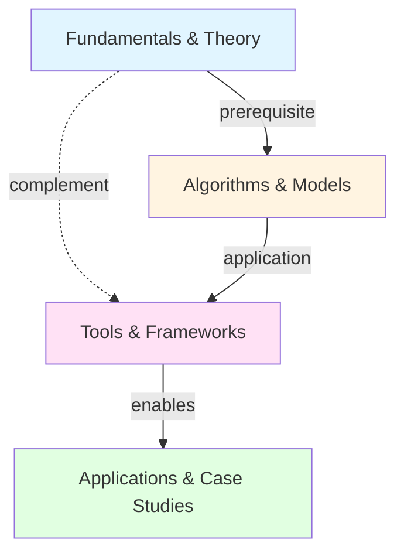

<!-- Powered by BMAD™ Core -->

# Write Bridge Paragraphs

## Purpose

Analyze connections between MOC sections/branches and generate explanatory paragraphs that explain relationships, transitions, and conceptual links between knowledge branches.

## Inputs

- **enriched_moc_structure** (Object, required): MOC structure with summaries from `generate-summaries.md`
- **vault_path** (String, required): Path to Obsidian vault
- **bridge_density** (String, optional): "minimal" (1-2 bridges), "moderate" (default, 3-5 bridges), "comprehensive" (6+ bridges)

## Outputs

- **moc_structure_with_bridges** (Object): MOC structure with bridge paragraphs added at connection points
- **connection_map** (Object): Graph showing relationships between branches

## Procedure

### Step 1: Analyze Branch Relationships

For each pair of branches in the MOC:

**Identify relationship types:**

1. **Sequential Relationship** (A → B):
   - Branch A is prerequisite for Branch B
   - Example: "Fundamentals" → "Algorithms" (must understand basics before algorithms)

2. **Complementary Relationship** (A ↔ B):
   - Branches offer different perspectives on same domain
   - Example: "Theory" ↔ "Practice" (two sides of same coin)

3. **Hierarchical Relationship** (A ⊃ B):
   - Branch A is broader category containing Branch B
   - Example: "Algorithms" contains "Neural Networks" sub-branch

4. **Contrast Relationship** (A ≠ B):
   - Branches present alternative or opposing approaches
   - Example: "Supervised Learning" vs. "Unsupervised Learning"

5. **Application Relationship** (A applies to B):
   - Branch A's concepts are applied in Branch B context
   - Example: "Optimization Theory" applies to "Neural Network Training"

**Detect relationships via:**

- **Shared notes**: Do notes appear in multiple branches?
- **Link analysis**: Do notes in Branch A link heavily to notes in Branch B?
- **Topic overlap**: Do branches share common tags/keywords?
- **Temporal sequence**: Does one branch's content logically precede the other?

### Step 2: Calculate Relationship Strength

For each relationship identified, calculate strength score (0.0-1.0):

```
strength_score = (
  shared_notes_ratio * 0.3 +
  link_density_between_branches * 0.4 +
  topic_overlap_ratio * 0.2 +
  user_defined_connection * 0.1
)
```

**Thresholds for bridge generation:**
- strength > 0.6: Strong connection (definitely needs bridge paragraph)
- 0.3 < strength < 0.6: Moderate connection (consider bridge based on density setting)
- strength < 0.3: Weak connection (skip bridge unless comprehensive density)

### Step 3: Prioritize Bridges to Generate

Based on `bridge_density` setting:

**Minimal (1-2 bridges):**
- Only strongest connections (strength > 0.7)
- Focus on sequential relationships (prerequisites)

**Moderate (3-5 bridges):**
- Strong + moderate connections (strength > 0.4)
- Include sequential and complementary relationships

**Comprehensive (6+ bridges):**
- All detected relationships (strength > 0.25)
- Include contrast and application relationships

Sort relationships by strength, generate top N bridges.

### Step 4: Generate Bridge Paragraph Content

For each relationship to bridge:

**Bridge Paragraph Structure:**

1. **Acknowledge connection** (1 sentence):
   - Explicitly state that the branches are related
   - Name both branches

2. **Explain relationship** (1-2 sentences):
   - Describe the nature of the connection
   - Use relationship type language:
     - Sequential: "Building on X, Y explores..."
     - Complementary: "While X focuses on theory, Y addresses practice..."
     - Contrast: "Unlike X's approach, Y takes a different perspective..."
     - Application: "The concepts in X are applied in Y to..."

3. **Provide navigation guidance** (optional, 1 sentence):
   - Help reader understand when to explore each branch
   - Example: "Master the fundamentals before diving into algorithms"

### Step 5: Apply Relationship-Specific Templates

**Sequential Relationship Bridge:**

Template:
> "Building on the foundational concepts in [Branch A], [Branch B] explores [specific focus]. Understanding [key concept from A] is essential for grasping [key concept from B], as [explanation of dependency]. Readers should work through [Branch A] before tackling [Branch B]'s more advanced material."

Example:
> "Building on the foundational concepts in *Fundamentals & Theory*, *Algorithms & Models* explores how these principles are implemented in practice. Understanding loss functions and gradient descent is essential for grasping how neural networks learn, as all training algorithms optimize these mathematical objectives. Readers should work through *Fundamentals* before tackling *Algorithms*' more advanced material."

**Complementary Relationship Bridge:**

Template:
> "While [Branch A] focuses on [aspect], [Branch B] addresses [complementary aspect]. Together, they provide [holistic understanding]. [Insight about how branches complement each other]."

Example:
> "While *Theory & Research* focuses on the mathematical foundations of machine learning, *Tools & Frameworks* addresses practical implementation. Together, they bridge the gap between understanding algorithms conceptually and deploying them in production. Effective ML practitioners move fluidly between both domains, using theory to guide tool selection and tools to validate theoretical insights."

**Contrast Relationship Bridge:**

Template:
> "[Branch A] and [Branch B] represent different approaches to [shared domain]. Where [Branch A] emphasizes [characteristic], [Branch B] prioritizes [contrasting characteristic]. This contrast reflects [deeper insight about trade-offs or perspectives]."

Example:
> "*Supervised Learning* and *Unsupervised Learning* represent fundamentally different approaches to extracting patterns from data. Where supervised methods emphasize prediction accuracy using labeled examples, unsupervised methods prioritize pattern discovery without ground truth. This contrast reflects the distinction between learning *what* (classification/regression) and learning *structure* (clustering/dimensionality reduction)."

**Application Relationship Bridge:**

Template:
> "The concepts explored in [Branch A] find direct application in [Branch B]. Specifically, [concept from A] enables [capability in B]. Understanding this connection reveals [insight about domain]."

Example:
> "The optimization techniques explored in *Fundamentals & Theory* find direct application in *Neural Network Training*. Specifically, gradient descent variants like Adam and RMSprop enable efficient training of deep architectures with millions of parameters. Understanding this connection reveals why theoretical optimization research directly impacts practical model performance."

### Step 6: Position Bridges in MOC Structure

Determine where bridge paragraphs should appear:

**Option 1: Inline Bridges** (after related branch)
- Place bridge paragraph immediately after Branch A, before Branch B
- Works well for sequential relationships

**Option 2: Dedicated "Connections" Section**
- Group all bridge paragraphs in separate section
- Works well for complex relationship networks

**Option 3: Hybrid Approach** (recommended)
- Inline bridges for strong sequential relationships
- "Related Branches" subsection within each branch for other connections

Example positioning:

```markdown
### Branch: Fundamentals & Theory

[Summary paragraph]

**Core Topics:**
- [[Supervised Learning]]
- [[Loss Functions]]
- [[Gradient Descent]]

**Related Branches:**
*→ Algorithms & Models*: Building on these foundational concepts, *Algorithms & Models* explores how principles are implemented in practice...

---

### Branch: Algorithms & Models

[Summary paragraph]
```

### Step 7: Generate Connection Map

Create visual representation of branch relationships:

**ASCII Connection Map:**

```
MOC Connection Map: Machine Learning

Fundamentals & Theory
    |
    | (prerequisite) ──────────────┐
    ↓                              |
Algorithms & Models                |
    |                              |
    | (application)                |
    ↓                              |
Tools & Frameworks ←───────────────┘
    |                    (complement)
    | (enables)
    ↓
Applications & Case Studies

Legend:
→ Sequential (prerequisite)
↔ Complementary
⊃ Hierarchical
≠ Contrast
```

**Mermaid Graph (for Obsidian rendering):**



### Step 8: Enrich MOC Structure with Bridges

Add bridge paragraphs to MOC structure object:

```yaml
moc_structure:
  domain: "machine-learning"

  branches:
    - name: "Fundamentals & Theory"
      summary: "This branch explores fundamental learning paradigms..."
      notes: [...]

      bridges:
        - target_branch: "Algorithms & Models"
          relationship_type: "sequential"
          strength: 0.85
          paragraph: "Building on the foundational concepts in *Fundamentals & Theory*, *Algorithms & Models* explores how these principles are implemented in practice. Understanding loss functions and gradient descent is essential for grasping how neural networks learn, as all training algorithms optimize these mathematical objectives."

    - name: "Algorithms & Models"
      summary: "This branch surveys the algorithmic landscape..."
      notes: [...]

      bridges:
        - target_branch: "Tools & Frameworks"
          relationship_type: "application"
          strength: 0.72
          paragraph: "The algorithms explored here find practical expression in *Tools & Frameworks*. Libraries like TensorFlow and PyTorch implement these algorithms with optimized computation, making theoretical models deployable at scale."

  connection_map:
    ascii: "[ASCII map string]"
    mermaid: "[Mermaid diagram string]"
```

### Step 9: Quality Check Bridges

**Bridge Quality Criteria:**

- ✅ **Explicit connection**: Clearly names both branches being connected
- ✅ **Relationship explained**: Describes *how* branches relate (not just *that* they do)
- ✅ **Adds insight**: Provides understanding beyond just linking
- ✅ **Concise**: 2-3 sentences (40-70 words)
- ✅ **Navigational value**: Helps reader understand reading order or exploration path
- ✅ **No redundancy**: Doesn't repeat information from branch summaries

**Bad Example (vague):**
> "These two branches are related. See the other branch for more information."

**Good Example (specific):**
> "Building on the foundational concepts in *Fundamentals & Theory*, *Algorithms & Models* explores how these principles are implemented in practice. Understanding loss functions and gradient descent is essential for grasping how neural networks learn, as all training algorithms optimize these mathematical objectives."

### Step 10: Generate Bridge Report

Create report for user review:

```markdown
## Bridge Paragraph Generation Report

**Domain**: machine-learning
**Bridges Generated**: 4 total

### Bridge 1: Fundamentals & Theory → Algorithms & Models
**Relationship**: Sequential (prerequisite)
**Strength**: 0.85 (strong)
**Shared Notes**: 3 notes appear in both branches
**Link Density**: 12 links from Fundamentals to Algorithms

✅ Bridge: "Building on the foundational concepts in *Fundamentals & Theory*..."
Position: Inline after Fundamentals branch
Quality: Pass (explicit, insightful, navigational)

### Bridge 2: Algorithms & Models → Tools & Frameworks
**Relationship**: Application
**Strength**: 0.72 (strong)

✅ Bridge: "The algorithms explored here find practical expression..."
Position: Inline after Algorithms branch
Quality: Pass

[... more bridges]

### Connection Map
[ASCII map visualization]

**Review**: 4 bridges generated, all pass quality criteria. Ready for user approval.
```

### Step 11: Elicit User Approval

Present bridges and connection map:

```
Bridge Paragraph Generation Complete

4 bridges created:
1. Fundamentals → Algorithms (sequential)
2. Algorithms → Tools (application)
3. Theory ↔ Practice (complementary)
4. Supervised ≠ Unsupervised (contrast)

[Display connection map]

Options:
1. Approve all bridges (proceed to MOC finalization)
2. Regenerate specific bridge (which?)
3. Add additional bridge (between which branches?)
4. Remove bridge (which?)
5. Change bridge density setting (current: moderate)

Enter choice (1-5):
```

Wait for user input. Support iteration until approved.

## Integration Notes

**Link Analysis:**
- Use Obsidian MCP `obsidian.getOutlinks` to build link graph between branches
- Calculate link density as: links_between / (notes_in_A * notes_in_B)

**Neo4j Integration (if available):**
- Query graph database for shared paths between branch notes
- Use graph algorithms to detect relationship types
- Graceful degradation: Use Obsidian link counts only if Neo4j unavailable

## Error Handling

**No relationships detected:**
- Warning: "Branches appear isolated. Consider adding cross-references manually."
- Generate at least 1 bridge between first two branches (fallback)

**Bridge generation fails:**
- Retry with simplified template
- If retry fails, generate placeholder: "[Bridge paragraph needed - manual input required]"

**User rejects bridge:**
- Allow manual editing
- Or regenerate with different relationship type
- Support iteration

## Testing

**Test Case 1: Strong Sequential Relationship**
- Expected: Clear prerequisite bridge generated
- Validate: Bridge explains dependency and suggests reading order

**Test Case 2: Weak Relationship (strength < 0.3)**
- Expected: No bridge generated (unless comprehensive density)
- Validate: Bridge skipped appropriately

**Test Case 3: Multiple Relationship Types**
- Expected: Different bridge templates used appropriately
- Validate: Sequential uses "Building on", Contrast uses "Unlike", etc.

**Test Case 4: Hierarchical MOC (sub-branches)**
- Expected: Bridges connect both top-level and sub-branch levels
- Validate: Hierarchical relationships identified

**Test Case 5: Connection Map Visualization**
- Expected: ASCII and Mermaid diagrams accurately represent relationships
- Validate: All bridge relationships appear in map
