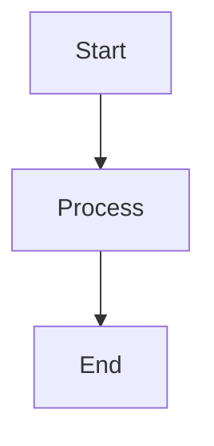

# Integration Guide - Technical Writing Expansion Pack

How to integrate the Technical Writing Expansion Pack with BMad core, other expansion packs, and development tools.

## BMad Core Integration

### When to Use Technical Writing vs Core Agents

**Use Technical Writing Expansion**:

- Writing technical books with code examples
- Creating tutorial-based content
- Need publisher-specific formatting
- Require learning objectives and pedagogical structure

**Use BMad Core**:

- Software project planning (PRD, architecture)
- Application development (coding, testing, deployment)
- Non-book technical documentation

**Use Both Together**:

- Writing a book about your software product
- Creating comprehensive documentation for your project

### Workflow Combination Example

**Scenario**: Writing a technical book about your software product

```
1. BMad Core: PM creates PRD for software
2. BMad Core: Architect designs system
3. BMad Core: Dev builds product
4. Technical Writing: Instructional Designer creates book outline
5. Technical Writing: Tutorial Architect writes chapters about the product
6. Technical Writing: Code Curator uses actual product code as examples
7. Technical Writing: Book Publisher prepares manuscript
```

### Agent Coordination

**PM (Core) → Instructional Designer (TW)**:

- PM's product requirements inform book learning objectives
- User stories become tutorial sections

**Architect (Core) → Tutorial Architect (TW)**:

- Architecture diagrams become book visuals
- System design informs chapter structure

**Dev (Core) → Code Curator (TW)**:

- Product code becomes book examples
- Tests become tutorial verification

---

## Multi-Expansion Usage

### Technical Writing + Creative Writing

**Use Case**: Fiction with technical appendices, or technical books with narrative elements

**Example**:

- Creative Writing agents for engaging story-based introductions
- Technical Writing agents for code examples and tutorials
- Both expansions for mixed-format content

**Workflow**:

```
1. Creative Writing: Narrative Designer creates engaging scenarios
2. Technical Writing: Tutorial Architect builds tutorials using scenarios
3. Creative Writing: Beta Reader reviews narrative flow
4. Technical Writing: Technical Reviewer validates code
```

### Technical Writing + Infrastructure

**Use Case**: DevOps and cloud infrastructure books

**Example**:

- Infrastructure agents for cloud architecture examples
- Technical Writing agents for tutorial structure and publishing

**Workflow**:

```
1. Infrastructure: Platform Engineer creates deployment examples
2. Technical Writing: Code Curator integrates infrastructure code
3. Technical Writing: Tutorial Architect explains deployment processes
4. Infrastructure: DevOps specialist validates configurations
```

---

## Git Integration

### Managing Book Manuscripts in Git

**Recommended Structure**:

```
my-technical-book/
├── .git/
├── .bmad-core/
│   └── core-config.yaml
├── docs/
│   ├── planning/
│   │   ├── book-outline.md
│   │   └── chapter-outlines/
│   ├── sections/
│   │   ├── chapter-01/
│   │   │   ├── section-1.1.md
│   │   │   └── section-1.2.md
│   │   └── chapter-02/
│   ├── chapters/
│   │   ├── chapter-01.md
│   │   └── chapter-02.md
│   └── reviews/
├── code-examples/
│   ├── chapter-01/
│   └── chapter-02/
└── README.md
```

### Branch Strategies

**Feature Branch per Chapter**:

```bash
git checkout -b chapter-03-dictionaries
# Develop chapter 3
git commit -m "feat: complete section 3.1"
git commit -m "feat: complete section 3.2"
git checkout main
git merge chapter-03-dictionaries
```

**Section-Based Commits**:

```bash
# Commit after each section completes
git add manuscript/sections/chapter-01/section-1.1.md
git commit -m "feat(ch01): complete section 1.1 - Lists Introduction"

git add code-examples/chapter-01/section-1.1/
git commit -m "feat(ch01): add code examples for section 1.1"
```

### Collaboration Workflows

**Multiple Authors**:

```bash
# Author 1: Chapters 1-5
git checkout -b author1/chapters-1-5

# Author 2: Chapters 6-10
git checkout -b author2/chapters-6-10

# Merge completed chapters
git checkout main
git merge author1/chapters-1-5
git merge author2/chapters-6-10
```

---

## CI/CD Integration

### Automated Testing of Code Examples

**GitHub Actions Example**:

```yaml
name: Test Code Examples

on:
  push:
    paths:
      - 'code-examples/**'

jobs:
  test:
    runs-on: ubuntu-latest
    steps:
      - uses: actions/checkout@v2
      - name: Set up Python
        uses: actions/setup-python@v2
        with:
          python-version: '3.10'
      - name: Test Chapter 1 Examples
        run: |
          cd code-examples/chapter-01
          pytest -v
      - name: Test Chapter 2 Examples
        run: |
          cd code-examples/chapter-02
          pytest -v
```

### Continuous Deployment to Leanpub

**Auto-publish on merge**:

```yaml
name: Publish to Leanpub

on:
  push:
    branches:
      - main

jobs:
  publish:
    runs-on: ubuntu-latest
    steps:
      - uses: actions/checkout@v2
      - name: Trigger Leanpub Build
        run: |
          curl -d "api_key=${{ secrets.LEANPUB_API_KEY }}" \
            https://leanpub.com/your-book/preview.json
```

---

## Tool Integration

### Markdown Editors

**VS Code**:

- Markdown All in One extension
- Markdown Preview Enhanced
- Code Spell Checker

**Typora**:

- WYSIWYG markdown editing
- Export to multiple formats
- Math equation support

### Diagram Tools

**Mermaid**:

````markdown

````

```

**PlantUML**:
- UML diagrams
- Sequence diagrams
- Class diagrams

### Screenshot Tools

**Snagit**:
- Screen capture
- Annotations
- Video capture

**macOS Built-in**:
- Cmd+Shift+4 for selection
- Cmd+Shift+5 for options

### Code Repository Hosting

**GitHub**:
- Host book code examples
- CI/CD integration
- Issue tracking

**GitLab**:
- Built-in CI/CD
- Container registry
- Pages for previews

---

## Integration Examples

### Example 1: Technical Book About Your Product

**Tools**:
- BMad Core (for product development)
- Technical Writing Pack (for book authoring)
- GitHub (for code hosting)
- GitHub Actions (for CI/CD)

**Workflow**:
1. Develop product with BMad Core agents
2. Plan book with Instructional Designer
3. Write chapters using real product code
4. Automatically test code examples in CI
5. Publish to self-publishing platform

### Example 2: Multi-Author Collaboration

**Tools**:
- Technical Writing Pack (for authoring)
- Git (for version control)
- Discord (for communication)
- Leanpub (for publishing)

**Workflow**:
1. Authors claim chapters
2. Each author works in feature branch
3. Sections committed as completed
4. Technical Reviewer reviews PRs
5. Merged chapters auto-deploy to Leanpub preview

### Example 3: Continuous Publishing

**Tools**:
- Technical Writing Pack (for authoring)
- GitHub Actions (for automation)
- Leanpub (for publishing)
- Manning MEAP (for early access)

**Workflow**:
1. Complete chapter triggers CI tests
2. All tests pass → auto-format for publisher
3. Auto-submit to Leanpub preview
4. Manual review → submit to Manning MEAP
5. Continuous updates published automatically

---

## Best Practices

### Version Control
- Commit sections individually for granular history
- Use conventional commits (`feat:`, `fix:`, `docs:`)
- Tag releases (`v1.0`, `v1.1`)

### CI/CD
- Test all code examples automatically
- Validate markdown formatting
- Check spelling and grammar
- Auto-generate previews

### Collaboration
- Clear chapter ownership
- Regular sync meetings
- Shared style guide
- Code review for technical content

### Publishing
- Automate format conversion
- Test on multiple platforms
- Version control submission packages
- Maintain changelog

---

## Questions?

- 📖 [User Guide](user-guide.md) - System overview
- 🔧 [Troubleshooting](troubleshooting.md) - Common issues
- 💬 [Discord](https://discord.gg/gk8jAdXWmj) - Community support

---

*Integration Guide - Technical Writing Expansion Pack v1.1.0*
```
