# Process Flow Diagrams - Technical Writing Expansion Pack

Visual representations of all workflows, agent collaboration patterns, and the complete book authoring lifecycle.

## Table of Contents

- [How to Read These Diagrams](#how-to-read-these-diagrams)
- [High-Level Overview](#high-level-overview)
  - [Book Authoring Lifecycle](#book-authoring-lifecycle)
  - [Agent Collaboration Map](#agent-collaboration-map)
- [Planning Workflows](#planning-workflows)
  - [Book Planning Workflow](#book-planning-workflow)
- [Development Workflows](#development-workflows)
  - [Section-Driven Development Flow](#section-driven-development-flow)
  - [Section Development Workflow](#section-development-workflow)
  - [Chapter Assembly Workflow](#chapter-assembly-workflow)
  - [Tutorial Creation Workflow](#tutorial-creation-workflow)
  - [Code Example Workflow](#code-example-workflow)
- [Review Workflows](#review-workflows)
  - [Technical Review Workflow](#technical-review-workflow)
  - [Incorporate Review Feedback Workflow](#incorporate-review-feedback-workflow)
- [Publishing Workflows](#publishing-workflows)
  - [Publishing Decision Tree](#publishing-decision-tree)
  - [PacktPub Submission Workflow](#packtpub-submission-workflow)
  - [O'Reilly Submission Workflow](#oreilly-submission-workflow)
  - [Manning MEAP Workflow](#manning-meap-workflow)
  - [Self-Publishing Workflow](#self-publishing-workflow)
- [Brownfield Workflows](#brownfield-workflows)
  - [Book Edition Update Workflow](#book-edition-update-workflow)
  - [Add Chapter to Existing Book Workflow](#add-chapter-to-existing-book-workflow)

---

## How to Read These Diagrams

### Diagram Notation

**Node Colors**:

- 🟡 **Yellow (Planning)** - Initial planning and design activities
- 🟠 **Orange (Development)** - Content creation and code development
- 🔵 **Blue (Review)** - Quality assurance and validation activities
- 🟢 **Green (Complete)** - Finished deliverables and outcomes
- ⚪ **White (Decision)** - Decision points requiring evaluation

**Arrow Types**:

- **Solid arrows** → Required sequence (must follow this path)
- **Dotted arrows** -.-> Optional steps (can be included if needed)

**Agent Indicators**:
Each process step shows which agent performs the work:

- `agent-name: Action Description`

### Reading Flow

1. **Start at the top** - Entry point with prerequisites
2. **Follow solid arrows** - Required sequence of steps
3. **Check decision diamonds** - Branching based on outcomes
4. **Note agent handoffs** - Where one agent passes work to another
5. **End at green nodes** - Final deliverables

---

## High-Level Overview

### Book Authoring Lifecycle

Complete journey from book concept to published book.

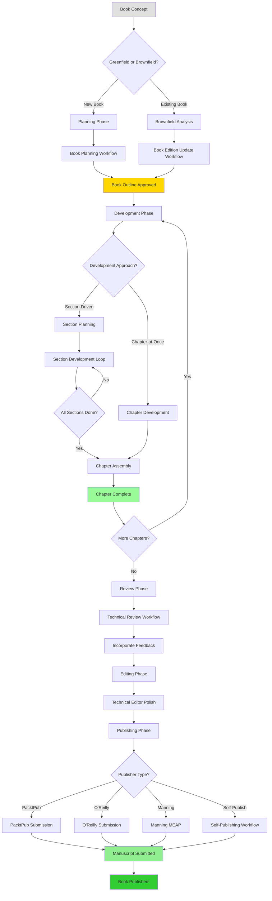

**Caption**: The complete book authoring lifecycle showing greenfield and brownfield paths, development approaches, and publishing options.

---

### Agent Collaboration Map

Shows which agents collaborate with which other agents throughout the workflow.

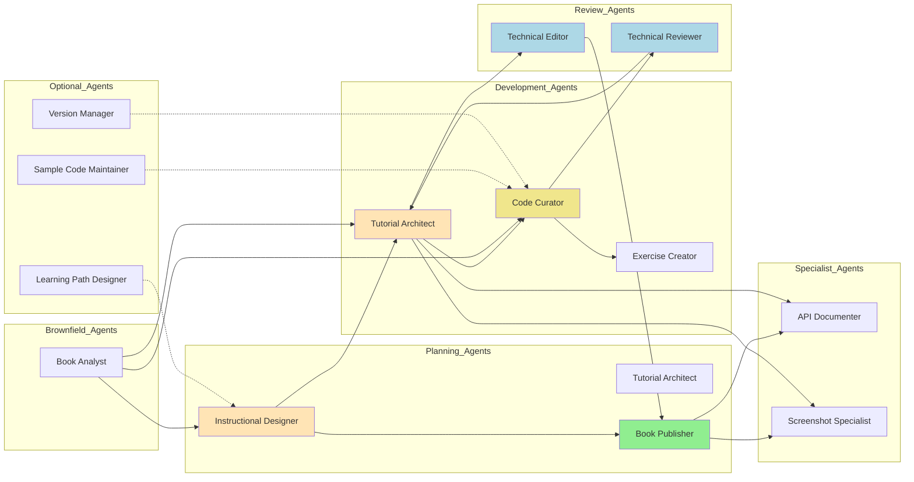

**Caption**: Agent collaboration patterns showing primary workflows (solid) and optional integrations (dotted).

**Key Collaborations**:

- **Instructional Designer → Tutorial Architect**: Passes learning objectives and chapter structure
- **Tutorial Architect → Code Curator**: Requests code examples for tutorials
- **Code Curator → Technical Reviewer**: Submits code for technical accuracy review
- **Technical Reviewer → Tutorial Architect**: Returns review feedback for revisions
- **Tutorial Architect → Technical Editor**: Passes completed content for polish
- **Technical Editor → Book Publisher**: Delivers polished manuscript for publication prep

---

## Planning Workflows

### Book Planning Workflow

Complete book planning from concept to approved outline.

**Workflow Definition**: `workflows/book-planning-workflow.yaml`
**Agents Used**: `book-publisher.md`, `instructional-designer.md`, `technical-editor.md`
**Key Tasks**: `create-doc.md`, `design-book-outline.md`, `validate-learning-flow.md` (Story 7.4)


**Time Estimate**: 20-33 hours | **Agents**: Book Publisher, Instructional Designer, Technical Editor

#### Quick Execution Guide

1. **book-publisher.md**: `*create-proposal` → Use `templates/book-proposal-tmpl.yaml` → Output: `manuscript/planning/book-proposal.md`
2. **instructional-designer.md**: `*design-outline` (runs `tasks/design-book-outline.md`) → Use `templates/book-outline-tmpl.yaml` → Output: `manuscript/planning/book-outline.md`
3. **instructional-designer.md**: `tasks/validate-learning-flow.md` → Use `checklists/learning-objectives-checklist.md` and `prerequisite-clarity-checklist.md` → Output: `manuscript/planning/learning-path-validation.md`
4. **technical-editor.md**: `*review-outline` → Editorial review for clarity/consistency → Output: `manuscript/planning/book-outline-edited.md`
5. **book-publisher.md**: Verify publisher requirements (use `checklists/packtpub-submission-checklist.md`, `oreilly-format-checklist.md`, or `manning-meap-checklist.md`) → Output: `manuscript/planning/book-outline-final.md`

**Success Criteria**: Market analysis complete | Learning path validated (no gaps) | Publisher requirements met

---

## Development Workflows

### Section-Driven Development Flow

High-level overview of section-driven approach to chapter development.

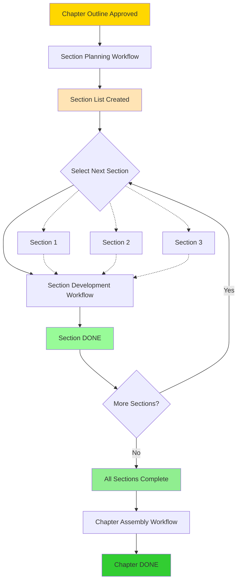

**Caption**: Section-driven development breaks chapters into 2-5 page sections that can be developed independently and in parallel.

**Why Section-Driven?**

- **Manageable scope**: Small sections easier to write
- **Parallel development**: Multiple sections can progress simultaneously
- **Incremental progress**: Each section completion is a milestone
- **Quality focus**: Easier to maintain quality in small chunks

**Typical Chapter**:

- 6-8 sections
- Each section: 2-5 pages
- Total chapter: 18-24 pages

---

### Section Planning Workflow

Break chapter outline into deliverable section units with clear acceptance criteria.

**Workflow Definition**: `workflows/section-planning-workflow.yaml`
**Agents Used**: `tutorial-architect.md`, `instructional-designer.md`
**Key Tasks**: `create-doc.md` (with `section-plan-tmpl.yaml`)

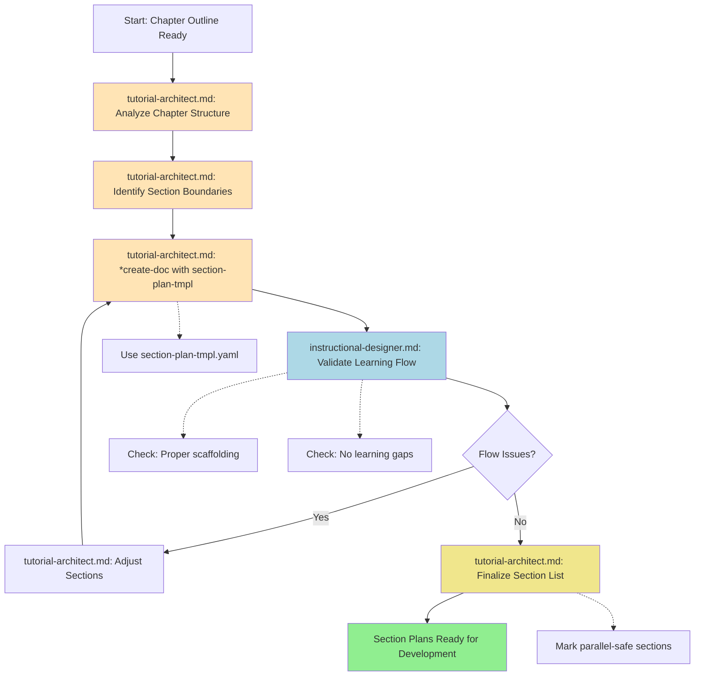

**Time Estimate**: 6-11 hours per chapter
**Agents Involved**: Tutorial Architect, Instructional Designer

#### How to Execute This Workflow

**Prerequisites**:

- Chapter outline completed: `manuscript/outlines/chapter-{n}-outline.md`
- Outline includes learning objectives and main topics

**Step 1: Activate Tutorial Architect**

```bash
/bmad-tw:agents:tutorial-architect
```

**Step 2: Analyze Chapter Structure**

- Read chapter outline: `manuscript/outlines/chapter-{n}-outline.md`
- Review learning objectives, main sections, code examples
- Identify natural breaking points for sections (2-5 pages each)
- Consider logical learning progression and dependencies
- **Output**: Create `section-analysis.md` documenting structure

**Step 3: Identify Section Boundaries**

- Break chapter into 5-8 logical sections
- Each section should teach 1-2 concepts and include 1-3 code examples
- Name each section clearly and define what it teaches
- Identify dependencies (which sections must come first)
- **Output**: Create `preliminary-section-list.md`

**Step 4: Create Section Plans**

- **Command**: `*create-doc` (or run `tasks/create-doc.md`)
- **Template**: Use `templates/section-plan-tmpl.yaml`
- For each section, define:
  - Learning objectives (1-2 max)
  - Prerequisites
  - Content plan
  - Code examples needed
  - Success criteria
  - Dependencies
- **Output**: Create `section-plans/section-{n}.md` for each section

**Step 5: Switch to Instructional Designer**

```bash
/bmad-tw:agents:instructional-designer
```

**Step 6: Validate Learning Flow**

- Review all section plans in `section-plans/`
- **Task**: Run `tasks/validate-learning-flow.md` (Story 7.4)
- Verify:
  - Sections scaffold properly (each builds on previous)
  - Prerequisites met in correct order
  - No learning gaps or concept jumps
  - Section granularity is appropriate (not too small/large)
- **Checklists**:
  - `checklists/learning-objectives-checklist.md`
  - `checklists/prerequisite-clarity-checklist.md`
- **Output**: Create `section-flow-validation.md` with approval/recommendations

**Step 7: Finalize Section List** (back to Tutorial Architect)

```bash
/bmad-tw:agents:tutorial-architect
```

- Incorporate instructional designer feedback
- Adjust section order, prerequisites, or granularity if needed
- Create final prioritized section list with dependencies mapped
- Number sections sequentially
- Mark sections that can be developed in parallel
- **Output**: `manuscript/sections/chapter-{n}-section-list.md` (authoritative plan)

**Success Criteria**:

- [ ] 5-8 sections defined
- [ ] Each section has clear learning objective
- [ ] Prerequisites identified for each section
- [ ] Success criteria defined per section
- [ ] Dependencies mapped
- [ ] Learning flow validated (no gaps)
- [ ] Section granularity appropriate (2-5 pages each)

**File Outputs**:

- `section-analysis.md` - Chapter structure analysis
- `preliminary-section-list.md` - Initial section breakdown
- `section-plans/section-{n}.md` - Detailed plan for each section (5-8 files)
- `section-flow-validation.md` - Instructional designer validation
- `manuscript/sections/chapter-{n}-section-list.md` - Final section list

---

### Section Development Workflow

Complete development of one section (the "story" unit of book writing).

**Workflow Definition**: `workflows/section-development-workflow.yaml`
**Agents Used**: `code-curator.md`, `tutorial-architect.md`, `technical-reviewer.md`
**Key Tasks**: `create-code-example.md`, `test-code-examples.md`, `write-section-draft.md` (Story 7.9)

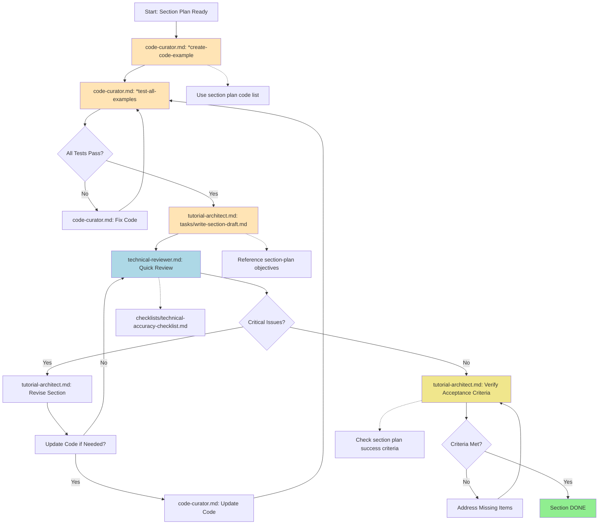

**Time Estimate**: 5.5-10.5 hours per section
**Agents Involved**: Code Curator, Tutorial Architect, Technical Reviewer

#### How to Execute This Workflow

**Prerequisites**:

- Section plan completed: `section-plans/section-{n}.md`
- Chapter outline available: `manuscript/outlines/chapter-{n}-outline.md`

**Step 1: Activate Code Curator**

```bash
/bmad-tw:agents:code-curator
```

**Step 2: Develop Code Examples**

- **Command**: `*create-code-example` (runs `tasks/create-code-example.md`)
- Read section plan code example requirements
- Create all code examples identified in section plan (typically 1-3 examples)
- Follow coding best practices and add inline comments
- Include error handling
- **Output**: `code/chapter-{n}/section-{n}/example-{name}.{ext}` (1-3 files)
- **Time**: 1-2 hours

**Step 3: Test Code Examples**

- **Command**: `*test-all-examples` (runs `tasks/test-code-examples.md`)
- Verify correct output for each example
- Test edge cases and error handling
- Run linting and security checks
- Document test results
- **Output**: Test results and any bug fixes committed
- **Time**: 30 minutes - 1 hour

**Step 4: Switch to Tutorial Architect**

```bash
/bmad-tw:agents:tutorial-architect
```

**Step 5: Write Section Draft**

- **Task**: Execute `tasks/write-section-draft.md` (Story 7.9 - follow task instructions)
- **Alternative**: If task not yet implemented, use workflow notes from YAML
- **Input Files**:
  - `section-plans/section-{n}.md` (section plan)
  - `code/chapter-{n}/section-{n}/` (code examples from code-curator)
  - `manuscript/outlines/chapter-{n}-outline.md` (chapter context)
- Write 2-5 pages addressing:
  1. Concept explanation (0.5-1 page)
  2. Tutorial walkthrough with code inline (2-3 pages)
  3. Practical applications (0.5-1 page)
  4. Transitions (to previous and next sections)
- **Output**: `manuscript/sections/chapter-{n}/section-{n}-draft.md`
- **Time**: 2-4 hours

**Step 6: Switch to Technical Reviewer**

```bash
/bmad-tw:agents:technical-reviewer
```

**Step 7: Quick Technical Review**

- Read `section-draft.md`
- **Task**: Run `tasks/verify-accuracy.md` (Story 7.4) for focused section review
- Verify technical accuracy, code correctness, completeness
- Check for security issues or bad practices
- **Checklist**: Execute `tasks/execute-checklist.md` with `checklists/technical-accuracy-checklist.md`
- **Output**: `section-{n}-review-notes.md` with findings (critical/major/minor)
- **Time**: 30 minutes - 1 hour

**Step 8: Back to Tutorial Architect for Revisions**

```bash
/bmad-tw:agents:tutorial-architect
```

- Read review notes
- Address all critical and major issues
- Update code examples if needed (coordinate with code-curator if major changes)
- Re-test revised code
- **Output**: Updated `section-{n}-draft.md`
- **Time**: 1-2 hours

**Step 9: Verify and Finalize**

- Verify section meets ALL success criteria from section plan
- Check:
  - [ ] Learning objectives addressed
  - [ ] Code tested and working
  - [ ] Length appropriate (2-5 pages)
  - [ ] Transitions clear
  - [ ] Prerequisites mentioned
- Mark section status as DONE in section list
- **Output**: `manuscript/sections/chapter-{n}/section-{n}-final.md`
- **Time**: 30 minutes

**Success Criteria**:

- [ ] All code examples developed and tested
- [ ] Section draft 2-5 pages
- [ ] Learning objectives from section plan addressed
- [ ] All code examples integrated and explained
- [ ] Technical review passed (no critical issues)
- [ ] All section plan success criteria met

**File Outputs**:

- `code/chapter-{n}/section-{n}/example-{name}.{ext}` - Code examples (1-3 files)
- `manuscript/sections/chapter-{n}/section-{n}-draft.md` - Section draft
- `section-{n}-review-notes.md` - Technical review findings
- `manuscript/sections/chapter-{n}/section-{n}-final.md` - Final section (DONE)

---

### Chapter Assembly Workflow

Merge completed sections into cohesive chapter with full review and polish.

**Workflow Definition**: `workflows/chapter-assembly-workflow.yaml`
**Agents Used**: `tutorial-architect.md`, `instructional-designer.md`, `technical-reviewer.md`, `technical-editor.md`
**Key Tasks**: `merge-sections.md` (Story 7.10), `enhance-transitions.md` (Story 7.10), `validate-learning-flow.md` (Story 7.4), `verify-accuracy.md` (Story 7.4)

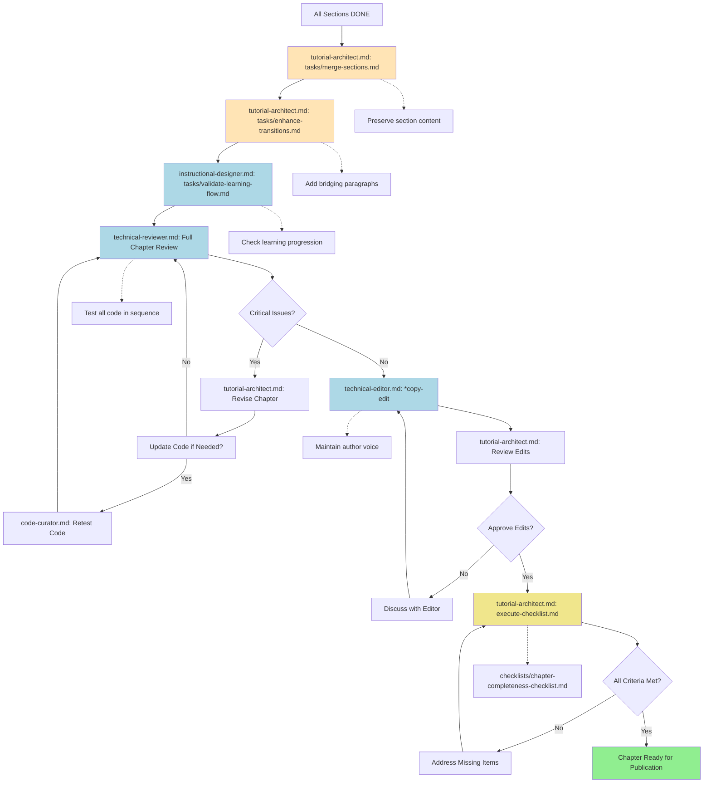

**Time Estimate**: 13-24 hours per chapter
**Agents Involved**: Tutorial Architect, Instructional Designer, Technical Reviewer, Technical Editor

#### How to Execute This Workflow

**Prerequisites**:

- All chapter sections marked DONE
- All section files in `manuscript/sections/chapter-{n}/section-{n}-final.md`

**Step 1: Activate Tutorial Architect**

```bash
/bmad-tw:agents:tutorial-architect
```

**Step 2: Merge Sections**

- **Task**: Execute `tasks/merge-sections.md` (Story 7.10)
- Systematically merge all completed sections into single chapter file
- Preserve section content (don't rewrite)
- Add chapter introduction (if not in section 1)
- Add chapter summary (if not in final section)
- Verify all sections present in correct order
- **Output**: `manuscript/chapters/chapter-{n}-integrated.md`
- **Time**: 1-2 hours

**Step 3: Enhance Transitions**

- **Task**: Execute `tasks/enhance-transitions.md` (Story 7.10)
- Review transitions between sections
- Add bridging paragraphs where sections feel disconnected
- Ensure smooth flow from one concept to next
- Check prerequisites mentioned in earlier sections are fulfilled
- Add cross-references where helpful
- **Output**: Update `chapter-{n}-integrated.md` with improved transitions
- **Time**: 2-3 hours

**Step 4: Switch to Instructional Designer**

```bash
/bmad-tw:agents:instructional-designer
```

**Step 5: Validate Learning Flow**

- **Task**: Execute `tasks/validate-learning-flow.md` (Story 7.4)
- Verify chapter builds concepts logically
- Check exercises progress from easy to challenging
- Ensure no learning gaps or concept jumps
- Confirm chapter learning objectives (from chapter outline) achieved
- **Output**: `learning-flow-validation.md` with findings
- **Time**: 1-2 hours

**Step 6: Switch to Technical Reviewer**

```bash
/bmad-tw:agents:technical-reviewer
```

**Step 7: Full Chapter Technical Review**

- Read complete `chapter-integrated.md`
- **Tasks**:
  - `tasks/verify-accuracy.md` (Story 7.4) - Technical accuracy
  - `tasks/check-best-practices.md` (Story 7.4) - Best practices
  - `tasks/test-code-examples.md` - Test all code in sequence
  - `tasks/security-audit.md` (Story 7.3) - Security review
- **Checklists**:
  - `checklists/technical-accuracy-checklist.md`
  - `checklists/security-best-practices-checklist.md`
  - `checklists/performance-considerations-checklist.md`
- **Template**: Use `templates/technical-review-report-tmpl.yaml`
- **Output**: `reviews/technical-review-chapter-{n}.md`
- **Time**: 3-5 hours

**Step 8: Back to Tutorial Architect for Revisions**

```bash
/bmad-tw:agents:tutorial-architect
```

- Incorporate all review feedback
- Address learning flow issues from instructional designer
- Fix all critical and major technical issues
- Update code examples if needed (coordinate with code-curator)
- Re-test modified code
- **Output**: Update `chapter-{n}-integrated.md` with all revisions
- **Time**: 3-6 hours

**Step 9: Switch to Technical Editor**

```bash
/bmad-tw:agents:technical-editor
```

**Step 10: Copy Edit Chapter**

- **Command**: `*copy-edit` (or `tasks/copy-edit-chapter.md`)
- Improve clarity and readability
- Check terminology consistency
- Enhance transitions
- Verify publisher style compliance
- Review accessibility requirements
- **Checklists**:
  - `checklists/accessibility-checklist.md`
  - Publisher-specific checklist (packtpub/oreilly/manning)
- **Output**: `edited-chapter.md` with change summary
- **Time**: 2-4 hours

**Step 11: Back to Tutorial Architect for Final Approval**

```bash
/bmad-tw:agents:tutorial-architect
```

- Review and approve editorial changes
- Verify technical accuracy preserved during editing
- **Checklist**: Run `tasks/execute-checklist.md` with `checklists/chapter-completeness-checklist.md`
- Mark chapter status as 'Ready for Publication'
- **Output**: `manuscript/chapters/chapter-{n}-final.md` (publisher-ready)
- **Time**: 1-2 hours

**Success Criteria**:

- [ ] All sections merged in correct order
- [ ] Smooth transitions between sections
- [ ] Learning flow validated (no gaps)
- [ ] Technical review passed (no critical issues)
- [ ] All code tested in sequence
- [ ] Copy editing complete
- [ ] Chapter completeness checklist verified

**File Outputs**:

- `manuscript/chapters/chapter-{n}-integrated.md` - Merged sections
- `learning-flow-validation.md` - Instructional designer validation
- `reviews/technical-review-chapter-{n}.md` - Technical review report
- `edited-chapter.md` - Copy-edited version
- `manuscript/chapters/chapter-{n}-final.md` - Final publisher-ready chapter

---

### Tutorial Creation Workflow

Create comprehensive hands-on tutorials with practice exercises.

**Workflow Definition**: `workflows/tutorial-creation-workflow.yaml`
**Agents Used**: `instructional-designer.md`, `tutorial-architect.md`, `code-curator.md`, `exercise-creator.md`
**Key Tasks**: `develop-tutorial.md`, `create-code-example.md`, `design-exercises.md`

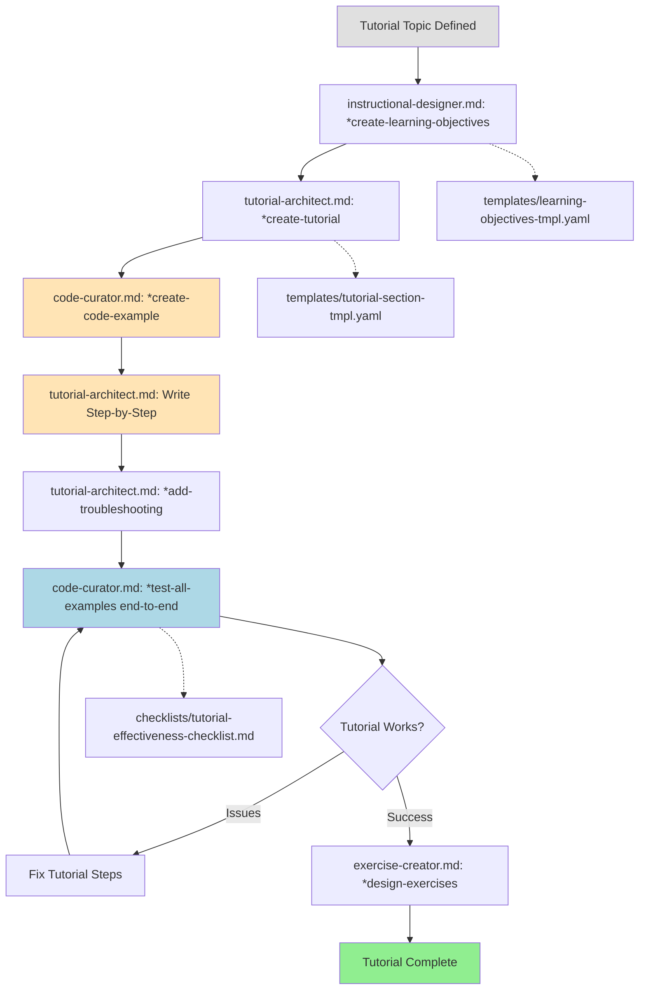

**Time Estimate**: 8-12 hours | **Agents**: Instructional Designer, Tutorial Architect, Code Curator, Exercise Creator

#### Quick Execution Guide

1. **instructional-designer.md**: `*create-learning-objectives` (runs `tasks/create-learning-objectives.md`) → Use `templates/learning-objectives-tmpl.yaml`
2. **tutorial-architect.md**: `*create-tutorial` (runs `tasks/develop-tutorial.md`) → Use `templates/tutorial-section-tmpl.yaml`
3. **code-curator.md**: `*create-code-example` for each example → Test individually
4. **tutorial-architect.md**: Write step-by-step instructions, add expected outcomes, write troubleshooting
5. **code-curator.md**: `*test-all-examples` end-to-end → Use `checklists/tutorial-effectiveness-checklist.md`
6. **exercise-creator.md**: `*design-exercises` (runs `tasks/design-exercises.md`) → Use `templates/exercise-set-tmpl.yaml`

---

### Code Example Workflow

Create, test, and validate code examples for technical accuracy, security, and cross-platform compatibility.

**Workflow Definition**: `workflows/code-example-workflow.yaml`
**Agents Used**: `code-curator.md`
**Key Tasks**: `create-code-example.md`, `test-code-examples.md`, `security-audit.md` (Story 7.3), `cross-platform-test.md` (Story 7.3)

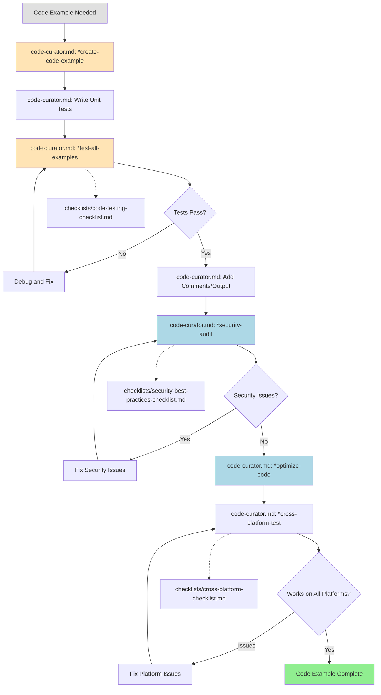

**Time Estimate**: 1-3 hours per example | **Agent**: Code Curator

#### Quick Execution Guide

1. **code-curator.md**: `*create-code-example` (runs `tasks/create-code-example.md`) → Use `templates/code-example-tmpl.yaml`
2. Write unit tests and run `*test-all-examples` (runs `tasks/test-code-examples.md`) → Use `checklists/code-testing-checklist.md`
3. Add inline comments and document expected output
4. Run `*security-audit` (runs `tasks/security-audit.md` - Story 7.3) → Use `checklists/security-best-practices-checklist.md`
5. Run `*optimize-code` (runs `tasks/optimize-code.md` - Story 7.6) → Check performance
6. Run `*cross-platform-test` (runs `tasks/cross-platform-test.md` - Story 7.3) → Use `checklists/cross-platform-checklist.md`

---

## Review Workflows

### Technical Review Workflow

Comprehensive technical accuracy, security, and best practices verification.

**Workflow Definition**: `workflows/technical-review-workflow.yaml`
**Agents Used**: `technical-reviewer.md`
**Key Tasks**: `verify-accuracy.md` (Story 7.4), `test-code-examples.md`, `security-audit.md` (Story 7.3), `check-best-practices.md` (Story 7.4)

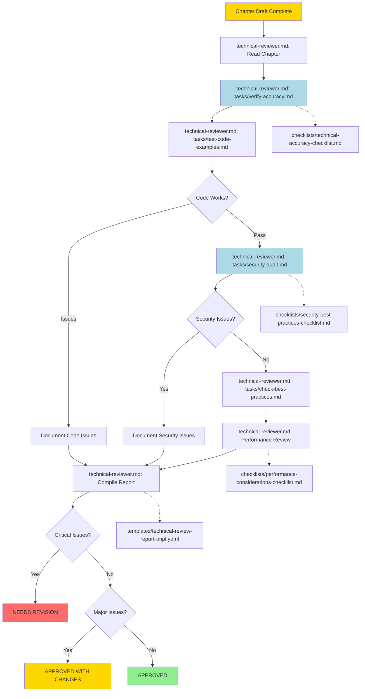

**Time Estimate**: 3-6 hours per chapter | **Agent**: Technical Reviewer

#### Quick Execution Guide

1. **technical-reviewer.md**: Read chapter completely
2. Run `tasks/verify-accuracy.md` (Story 7.4) → Use `checklists/technical-accuracy-checklist.md` → Verify all explanations
3. Run `tasks/test-code-examples.md` → Test all code in sequence → Document any failing examples
4. Run `tasks/security-audit.md` (Story 7.3) → Use `checklists/security-best-practices-checklist.md` → Identify vulnerabilities
5. Run `tasks/check-best-practices.md` (Story 7.4) → Verify code follows industry standards
6. Performance review → Use `checklists/performance-considerations-checklist.md`
7. Compile review report → Use `templates/technical-review-report-tmpl.yaml` → Output: `reviews/technical-review-chapter-{n}.md`
8. Mark status: NEEDS REVISION (critical issues) | APPROVED WITH CHANGES (major issues) | APPROVED (no major issues)

---

### Incorporate Review Feedback Workflow

Apply technical reviewer feedback systematically.

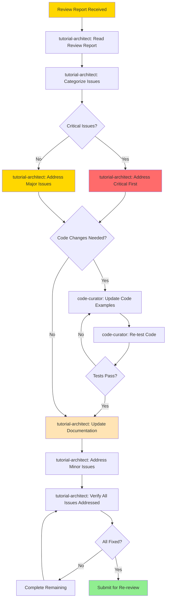

**Caption**: Feedback incorporation workflow ensures all review issues are systematically addressed and verified.

**Time Estimate**: 2-8 hours depending on issues
**Agents Involved**: Tutorial Architect, Code Curator

#### How to Execute This Workflow

**Prerequisites**:

- Technical review report received: `reviews/technical-review-chapter-{n}.md`
- Review status is "NEEDS REVISION" or "APPROVED WITH CHANGES"

**Step 1: Activate Tutorial Architect**

```bash
/bmad-tw:agents:tutorial-architect
```

**Step 2: Read Review Report**

- Read complete technical review report
- Understand all identified issues
- Note reviewer's overall assessment
- **Time**: 15-30 minutes

**Step 3: Categorize Issues**

- **Task**: Execute `tasks/incorporate-reviewer-feedback.md`
- Create issue categories:
  - **Critical**: Must fix (blocks approval)
  - **Major**: Should fix (quality issues)
  - **Minor**: Nice to fix (suggestions)
- Prioritize within each category
- **Output**: `feedback-categorized.md`
- **Time**: 30 minutes

**Step 4: Address Critical Issues First**

- If critical issues exist, tackle them immediately
- Review each critical issue:
  - Understand the problem
  - Plan the fix
  - Determine if code changes needed
- **Time**: 1-4 hours (depends on critical issue count)

**Step 5: Determine if Code Changes Needed**

- Review issues to identify which require code updates
- If yes, proceed to Step 6
- If no documentation-only changes, skip to Step 10

**Step 6: Switch to Code Curator (if code changes needed)**

```bash
/bmad-tw:agents:code-curator
```

**Step 7: Update Code Examples**

- Fix all code issues identified in review
- Apply best practices suggestions
- Address security concerns
- Fix bugs or incorrect examples
- **Output**: Updated code files
- **Time**: 1-3 hours

**Step 8: Re-test Code**

- **Task**: `tasks/test-code-examples.md`
- Test all modified code examples
- Ensure fixes work correctly
- Verify no regressions introduced
- **Time**: 30 minutes - 1 hour

**Step 9: Verify Tests Pass**

- If tests fail, return to Step 7
- If tests pass, continue to Step 10

**Step 10: Back to Tutorial Architect - Update Documentation**

```bash
/bmad-tw:agents:tutorial-architect
```

- Update chapter text to reflect code changes
- Fix technical inaccuracies noted in review
- Improve unclear explanations
- Add missing context or details
- **Output**: Updated chapter file
- **Time**: 1-3 hours

**Step 11: Address Major Issues**

- Work through all major issues
- Apply improvements and corrections
- Enhance quality based on feedback
- **Time**: 1-2 hours

**Step 12: Address Minor Issues**

- Review minor suggestions
- Apply quick wins
- Skip minor issues if time-constrained (these are nice-to-have)
- **Time**: 30 minutes - 1 hour

**Step 13: Verify All Issues Addressed**

- Review original technical review report
- Check off each issue as addressed
- Create summary of changes made
- Note any issues intentionally not fixed (with rationale)
- **Output**: `feedback-response.md`
- **Time**: 30 minutes

**Step 14: Check Completeness**

- Ensure critical issues: 100% addressed
- Ensure major issues: 90%+ addressed
- Minor issues: Best effort
- If incomplete, go back and complete remaining items

**Step 15: Submit for Re-review**

- Update chapter status to "Ready for Re-review"
- Notify technical reviewer
- Provide feedback-response.md showing what was addressed
- **Output**: Chapter ready for re-review
- **Time**: 15 minutes

**Success Criteria**:

- [ ] All critical issues addressed
- [ ] 90%+ of major issues addressed
- [ ] Code changes tested and working
- [ ] Documentation updated to reflect code changes
- [ ] Feedback response document created
- [ ] Chapter improved based on review

**File Outputs**:

- `feedback-categorized.md` - Categorized issue list
- Updated code files (if code changes needed)
- Updated chapter file with corrections
- `feedback-response.md` - Summary of changes made
- Re-review request sent

---

## Publishing Workflows

### Publishing Decision Tree

Choose the right publishing workflow based on your target publisher.

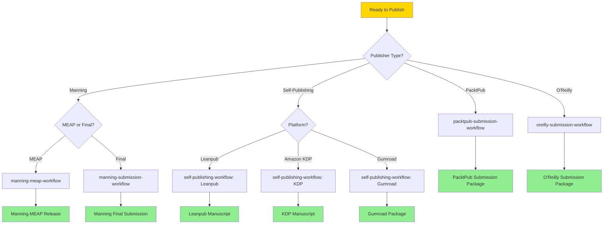

**Caption**: Publishing decision tree guides you to the correct submission workflow based on your publisher.

---

### PacktPub Submission Workflow

Prepare manuscript for PacktPub submission.

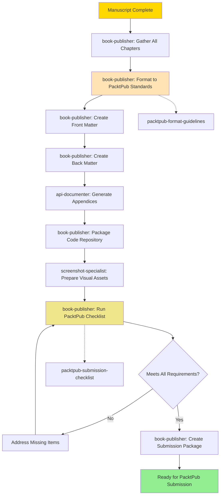

**Caption**: PacktPub submission workflow formats manuscript to publisher standards and creates complete submission package.

**Time Estimate**: 6-10 hours
**Agents Involved**: Book Publisher, API Documenter, Screenshot Specialist

#### How to Execute This Workflow

**Prerequisites**:

- All chapters finalized: `manuscript/chapters/chapter-{n}-final.md`
- Code repository organized and tested
- All images and diagrams prepared

**Step 1: Activate Book Publisher**

```bash
/bmad-tw:agents:book-publisher
```

**Step 2: Gather All Chapters**

- Collect all final chapter files from `manuscript/chapters/`
- Verify chapter numbering is sequential
- Check that all chapters are marked as final
- **Output**: Create `publishing/packtpub/chapters/` directory with all chapters

**Step 3: Format to PacktPub Standards**

- **Task**: Execute `tasks/format-for-packtpub.md` (Story 7.7)
- Apply PacktPub markdown formatting requirements
- Convert headings to PacktPub hierarchy
- Format code blocks with PacktPub syntax
- Add required metadata to each chapter
- **Output**: Formatted chapters in `publishing/packtpub/formatted/`
- **Time**: 2-3 hours

**Step 4: Create Front Matter**

- Write title page, copyright page, dedication
- Create table of contents
- Write preface/foreword
- Create "About the Author" section
- **Output**: `publishing/packtpub/front-matter/`
- **Time**: 1-2 hours

**Step 5: Create Back Matter**

- Compile index entries
- Create bibliography/references
- Add appendices if needed
- **Output**: `publishing/packtpub/back-matter/`
- **Time**: 1 hour

**Step 6: Switch to API Documenter**

```bash
/bmad-tw:agents:api-documenter
```

- Generate API reference appendix if book covers APIs
- **Task**: `tasks/generate-api-docs.md`
- **Output**: `publishing/packtpub/back-matter/appendix-api-reference.md`
- **Time**: 1-2 hours

**Step 7: Back to Book Publisher - Package Code Repository**

```bash
/bmad-tw:agents:book-publisher
```

- **Task**: `tasks/organize-code-repo.md`
- Organize all code examples in clear directory structure
- Create README for code repository
- Add setup instructions
- Test all code examples one final time
- **Output**: `code-repository/` ready for submission
- **Time**: 1-2 hours

**Step 8: Switch to Screenshot Specialist**

```bash
/bmad-tw:agents:screenshot-specialist
```

- Optimize all images for print resolution (300 DPI)
- Convert to PacktPub-approved formats
- **Task**: `tasks/optimize-visuals.md`
- **Output**: `publishing/packtpub/images/` (optimized)
- **Time**: 30 minutes - 1 hour

**Step 9: Back to Book Publisher - Run Checklist**

```bash
/bmad-tw:agents:book-publisher
```

- **Checklist**: Execute `tasks/execute-checklist.md` with `checklists/packtpub-submission-checklist.md`
- Verify:
  - [ ] All chapters formatted correctly
  - [ ] Front matter complete
  - [ ] Back matter complete
  - [ ] Code repository organized
  - [ ] Images optimized
  - [ ] Author bio and photo included
  - [ ] Copyright permissions documented
- **Output**: `packtpub-checklist-results.md`
- **Time**: 30 minutes

**Step 10: Create Submission Package**

- Compile everything into submission package
- Create ZIP file with all materials
- Write submission letter
- **Output**: `publishing/packtpub/submission-package.zip`
- **Time**: 30 minutes

**Success Criteria**:

- [ ] All chapters formatted to PacktPub standards
- [ ] Front and back matter complete
- [ ] Code repository organized and tested
- [ ] All images optimized for print
- [ ] Submission checklist 100% complete
- [ ] Submission package ready to upload

**File Outputs**:

- `publishing/packtpub/formatted/` - All formatted chapters
- `publishing/packtpub/front-matter/` - Title, TOC, preface, about author
- `publishing/packtpub/back-matter/` - Index, bibliography, appendices
- `publishing/packtpub/images/` - Optimized visuals
- `code-repository/` - Complete code examples
- `publishing/packtpub/submission-package.zip` - Final submission

---

### O'Reilly Submission Workflow

Prepare manuscript for O'Reilly submission.

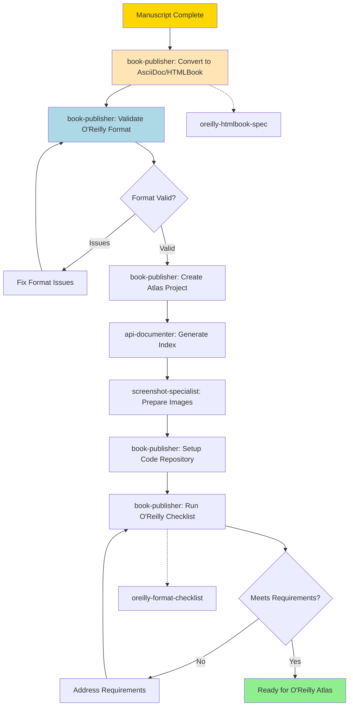

**Caption**: O'Reilly submission workflow converts to HTMLBook format and prepares Atlas-compatible project.

**Time Estimate**: 8-12 hours
**Agents Involved**: Book Publisher, API Documenter, Screenshot Specialist

#### How to Execute This Workflow

**Prerequisites**:

- All chapters finalized: `manuscript/chapters/chapter-{n}-final.md`
- Familiarity with O'Reilly Atlas platform
- O'Reilly HTMLBook specification reviewed

**Step 1: Activate Book Publisher**

```bash
/bmad-tw:agents:book-publisher
```

**Step 2: Convert to AsciiDoc/HTMLBook Format**

- **Task**: Execute `tasks/format-for-oreilly.md` (Story 7.7)
- Convert markdown chapters to HTMLBook format
- Apply O'Reilly semantic markup
- Convert code blocks to O'Reilly syntax
- Add required data attributes
- **Output**: `publishing/oreilly/htmlbook/` (converted chapters)
- **Time**: 3-5 hours

**Step 3: Validate O'Reilly Format**

- Run O'Reilly's HTMLBook validator
- Check for semantic markup errors
- Verify all cross-references resolve
- Validate code block syntax
- **Tool**: Use O'Reilly's validation tools
- **Time**: 1-2 hours

**Step 4: Fix Format Issues (if any)**

- Address validation errors
- Correct markup issues
- Re-validate until clean
- **Iterate**: Repeat validation until all issues resolved

**Step 5: Create Atlas Project**

- Set up O'Reilly Atlas project structure
- Configure book metadata (title, authors, ISBN)
- Set up chapter ordering
- Configure build settings
- **Output**: `publishing/oreilly/atlas-project/`
- **Time**: 1 hour

**Step 6: Switch to API Documenter**

```bash
/bmad-tw:agents:api-documenter
```

- Generate comprehensive index
- **Task**: `tasks/create-index-entries.md`
- Add semantic index markup
- Create glossary if needed
- **Output**: `publishing/oreilly/atlas-project/index.html`
- **Time**: 1-2 hours

**Step 7: Switch to Screenshot Specialist**

```bash
/bmad-tw:agents:screenshot-specialist
```

- Prepare images in O'Reilly-approved formats (SVG preferred, PNG acceptable)
- **Task**: `tasks/optimize-visuals.md`
- Ensure images meet O'Reilly resolution requirements
- Add alt text to all images
- **Output**: `publishing/oreilly/atlas-project/images/`
- **Time**: 1 hour

**Step 8: Back to Book Publisher - Setup Code Repository**

```bash
/bmad-tw:agents:book-publisher
```

- **Task**: `tasks/organize-code-repo.md`
- Create GitHub repository for code examples
- Organize code by chapter
- Add comprehensive README
- Test all examples
- **Output**: GitHub repository URL
- **Time**: 1-2 hours

**Step 9: Run O'Reilly Checklist**

- **Checklist**: Execute `tasks/execute-checklist.md` with `checklists/oreilly-format-checklist.md`
- Verify:
  - [ ] All chapters in valid HTMLBook format
  - [ ] Validation passes with no errors
  - [ ] Index complete
  - [ ] Images properly formatted
  - [ ] Code repository public and tested
  - [ ] Author bio and photo included
  - [ ] Copyright page formatted
  - [ ] Table of contents generated
- **Output**: `oreilly-checklist-results.md`
- **Time**: 30 minutes

**Step 10: Upload to O'Reilly Atlas**

- Push project to O'Reilly Atlas
- Trigger build process
- Review build output
- Verify PDF/ePub generation
- **Output**: Project live on O'Reilly Atlas
- **Time**: 30 minutes - 1 hour

**Success Criteria**:

- [ ] All chapters in valid HTMLBook format
- [ ] O'Reilly validation passes
- [ ] Atlas project builds successfully
- [ ] Index and glossary complete
- [ ] Code repository public and linked
- [ ] All checklists complete

**File Outputs**:

- `publishing/oreilly/htmlbook/` - HTMLBook-formatted chapters
- `publishing/oreilly/atlas-project/` - Complete Atlas project
- `publishing/oreilly/atlas-project/images/` - Optimized images
- GitHub repository (code examples)
- `oreilly-checklist-results.md` - Validation results

---

### Manning MEAP Workflow

Prepare chapter for Manning Early Access Program (MEAP).

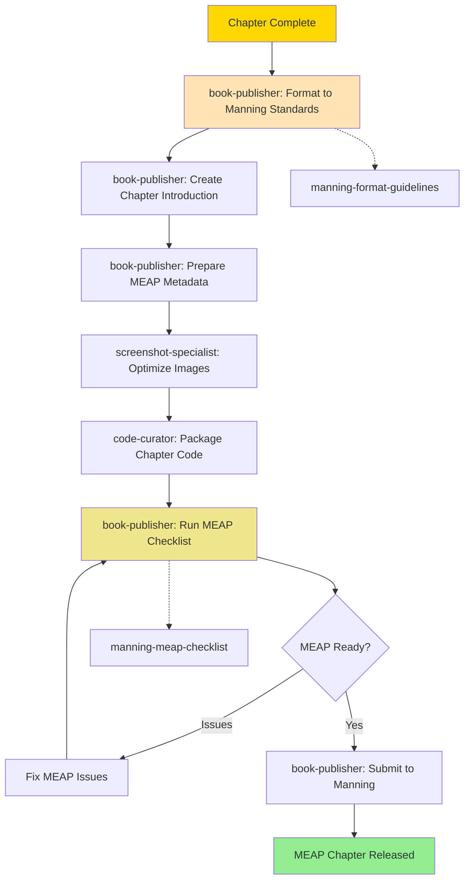

**Caption**: Manning MEAP workflow prepares individual chapters for early access release.

**Time Estimate**: 3-5 hours per chapter
**Agents Involved**: Book Publisher, Screenshot Specialist, Code Curator

#### How to Execute This Workflow

**Prerequisites**:

- Chapter finalized: `manuscript/chapters/chapter-{n}-final.md`
- Manning MEAP agreement in place
- Manning format guidelines reviewed

**Step 1: Activate Book Publisher**

```bash
/bmad-tw:agents:book-publisher
```

**Step 2: Format to Manning Standards**

- **Task**: Execute `tasks/prepare-meap-chapter.md`
- Convert chapter to Manning DocBook XML or Microsoft Word format
- Apply Manning style guidelines
- Format headings, code blocks, and callouts per Manning specs
- **Output**: `publishing/manning-meap/chapter-{n}-formatted.xml` or `.docx`
- **Time**: 1-2 hours

**Step 3: Create Chapter Introduction**

- Write brief introduction for MEAP readers
- Explain what the chapter covers
- Note any prerequisites from earlier chapters
- Add "What you'll learn" section
- **Output**: Add to formatted chapter file
- **Time**: 30 minutes

**Step 4: Prepare MEAP Metadata**

- Fill out Manning MEAP chapter metadata form
- Add chapter title, number, description
- Set release date
- Add author notes for MEAP readers
- **Output**: `publishing/manning-meap/chapter-{n}-metadata.md`
- **Time**: 15 minutes

**Step 5: Switch to Screenshot Specialist**

```bash
/bmad-tw:agents:screenshot-specialist
```

- **Task**: `tasks/optimize-visuals.md`
- Optimize chapter images for MEAP
- Convert to Manning-approved formats
- Ensure proper resolution
- **Output**: `publishing/manning-meap/images/chapter-{n}/`
- **Time**: 30 minutes

**Step 6: Switch to Code Curator**

```bash
/bmad-tw:agents:code-curator
```

- **Task**: `tasks/organize-code-repo.md`
- Package all code examples for this chapter
- Create chapter-specific README
- Test all examples
- Zip code examples for download
- **Output**: `publishing/manning-meap/code/chapter-{n}.zip`
- **Time**: 30 minutes - 1 hour

**Step 7: Back to Book Publisher - Run MEAP Checklist**

```bash
/bmad-tw:agents:book-publisher
```

- **Checklist**: Execute `tasks/execute-checklist.md` with `checklists/manning-meap-checklist.md`
- Verify:
  - [ ] Chapter formatted to Manning standards
  - [ ] Chapter introduction added
  - [ ] Metadata complete
  - [ ] All images optimized
  - [ ] Code examples packaged and tested
  - [ ] No orphaned references
  - [ ] Chapter builds cleanly
- **Output**: `manning-meap-checklist-results.md`
- **Time**: 15 minutes

**Step 8: Submit to Manning**

- Upload chapter file to Manning portal
- Upload images
- Upload code examples
- Submit metadata
- Request Manning review
- **Output**: MEAP chapter submitted
- **Time**: 15-30 minutes

**Step 9: Address Manning Feedback (if any)**

- Review Manning's editorial feedback
- Make required corrections
- Re-submit if needed

**Success Criteria**:

- [ ] Chapter formatted to Manning standards
- [ ] Chapter introduction clear and helpful
- [ ] All images included and optimized
- [ ] Code examples packaged and tested
- [ ] MEAP checklist 100% complete
- [ ] Chapter accepted by Manning for MEAP release

**File Outputs**:

- `publishing/manning-meap/chapter-{n}-formatted.xml` (or `.docx`) - Formatted chapter
- `publishing/manning-meap/chapter-{n}-metadata.md` - Chapter metadata
- `publishing/manning-meap/images/chapter-{n}/` - Chapter images
- `publishing/manning-meap/code/chapter-{n}.zip` - Code examples
- `manning-meap-checklist-results.md` - Validation results

---

### Self-Publishing Workflow

Prepare manuscript for self-publishing platforms.

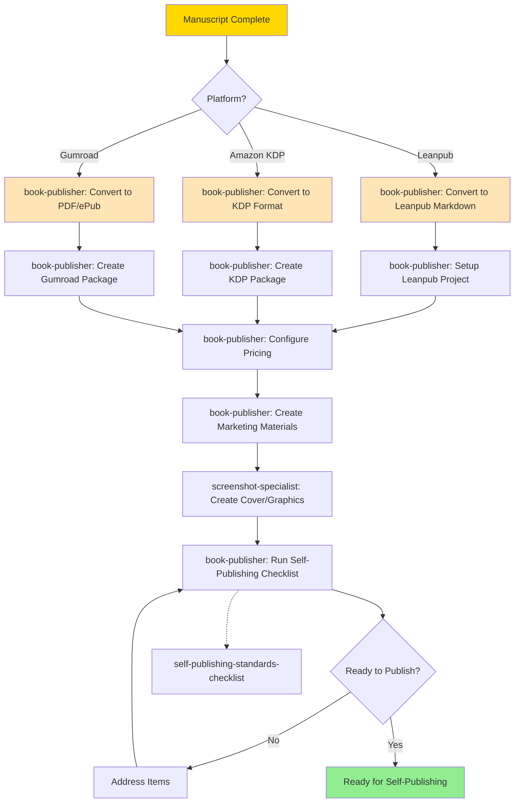

**Caption**: Self-publishing workflow supports multiple platforms with format conversion and marketing materials.

**Time Estimate**: 8-15 hours
**Agents Involved**: Book Publisher, Screenshot Specialist

#### How to Execute This Workflow

**Prerequisites**:

- All chapters finalized: `manuscript/chapters/chapter-{n}-final.md`
- Decision made on target platform (Leanpub, Amazon KDP, or Gumroad)
- Platform account created

**Step 1: Activate Book Publisher**

```bash
/bmad-tw:agents:book-publisher
```

**Step 2: Choose Platform and Convert Format**

**Option A - Leanpub**:

- **Task**: `tasks/self-publish-prep.md` (Leanpub variant)
- Convert chapters to Leanpub markdown format
- Create `manuscript/` directory structure
- Create `Book.txt` (chapter order file)
- Create `Sample.txt` (sample chapters file)
- **Output**: `publishing/leanpub/manuscript/`
- **Time**: 2-3 hours

**Option B - Amazon KDP**:

- **Task**: `tasks/self-publish-prep.md` (KDP variant)
- Convert to Microsoft Word or KDP-compatible format
- Apply KDP formatting requirements
- Add page breaks and styles
- **Output**: `publishing/kdp/manuscript.docx`
- **Time**: 3-4 hours

**Option C - Gumroad**:

- **Task**: `tasks/self-publish-prep.md` (Gumroad variant)
- Convert to PDF using Pandoc or similar tool
- Apply professional formatting
- Generate ePub version
- **Output**: `publishing/gumroad/book.pdf` and `book.epub`
- **Time**: 2-3 hours

**Step 3: Setup Platform Project**

**Leanpub**:

- Create new book on Leanpub
- Connect to Dropbox or GitHub
- Upload manuscript folder
- Configure book metadata

**Amazon KDP**:

- Create new title on KDP
- Upload manuscript file
- Configure book details (title, description, keywords)
- Set territories and pricing

**Gumroad**:

- Create new product on Gumroad
- Upload PDF and ePub files
- Write product description
- Set pricing and variants

**Output**: Platform project configured
**Time**: 1 hour

**Step 4: Configure Pricing**

- Research comparable books in your niche
- Set base price (consider $19-$49 for technical books)
- Configure discount options if desired
- Set up variable pricing (Leanpub) or multiple editions (KDP/Gumroad)
- **Output**: Pricing strategy documented
- **Time**: 30 minutes

**Step 5: Create Marketing Materials**

- Write compelling book description
- Create bullet points of what readers will learn
- Write author bio
- Gather testimonials or early reviews
- Create sample chapter or preview
- **Output**: `marketing/book-description.md`, `marketing/author-bio.md`
- **Time**: 2-3 hours

**Step 6: Switch to Screenshot Specialist**

```bash
/bmad-tw:agents:screenshot-specialist
```

- **Task**: `tasks/design-diagram-set.md` (marketing variant)
- Create professional book cover (or hire designer)
- Design promotional graphics for social media
- Create banner images for website
- **Output**: `marketing/graphics/cover.png`, `social-media-graphics/`
- **Time**: 3-5 hours (or budget for professional designer)

**Step 7: Back to Book Publisher - Run Checklist**

```bash
/bmad-tw:agents:book-publisher
```

- **Checklist**: Execute `tasks/execute-checklist.md` with `checklists/self-publishing-standards-checklist.md`
- Verify:
  - [ ] Manuscript formatted for chosen platform
  - [ ] Platform project configured
  - [ ] Pricing set
  - [ ] Book description compelling
  - [ ] Cover professionally designed
  - [ ] Author bio complete
  - [ ] Sample chapter available
  - [ ] Marketing graphics ready
  - [ ] All links tested
- **Output**: `self-publishing-checklist-results.md`
- **Time**: 30 minutes

**Step 8: Publish**

**Leanpub**:

- Preview book on Leanpub
- Publish to Leanpub store
- Set publish mode (published/unpublished)

**Amazon KDP**:

- Preview book with KDP previewer tool
- Submit for review
- Wait for approval (24-72 hours)
- Book goes live on Amazon

**Gumroad**:

- Preview product page
- Publish product
- Share product link

**Output**: Book published and live
**Time**: 30 minutes - 3 days (depending on platform)

**Step 9: Post-Launch Marketing**

- Share on social media
- Email announcement to mailing list
- Post on relevant communities (Reddit, HN, etc.)
- Reach out for reviews
- **Optional**: Set up launch promotions

**Success Criteria**:

- [ ] Book published on chosen platform
- [ ] Cover looks professional
- [ ] Description is compelling
- [ ] Pricing is competitive
- [ ] Sample chapter available
- [ ] Marketing materials ready
- [ ] Book is discoverable (SEO, keywords)

**File Outputs**:

- **Leanpub**: `publishing/leanpub/manuscript/` - Complete Leanpub project
- **Amazon KDP**: `publishing/kdp/manuscript.docx` - KDP-ready manuscript
- **Gumroad**: `publishing/gumroad/book.pdf`, `book.epub` - Digital files
- `marketing/` - Book description, author bio, sample chapter
- `marketing/graphics/` - Cover and promotional graphics
- `self-publishing-checklist-results.md` - Validation results

---

## Brownfield Workflows

### Book Edition Update Workflow

Systematic approach to 2nd/3rd edition updates.

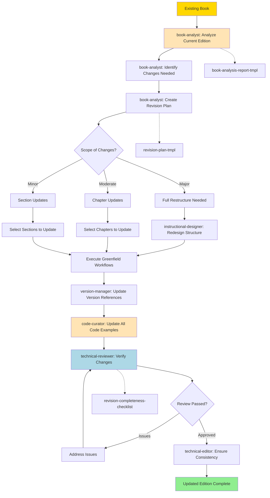

**Caption**: Book edition update workflow analyzes existing content and systematically applies updates for new edition.

**Time Estimate**: 40-120+ hours depending on scope
**Agents Involved**: Book Analyst, Instructional Designer, Code Curator, Version Manager, Technical Reviewer, Technical Editor

#### How to Execute This Workflow

**Prerequisites**:

- Existing book published (1st edition)
- Decision to create new edition
- Reasons for update identified (new version, outdated content, reader feedback)

**Step 1: Activate Book Analyst**

```bash
/bmad-tw:agents:book-analyst
```

**Step 2: Analyze Current Edition**

- **Task**: Execute `tasks/analyze-existing-book.md`
- Read complete current edition
- Note outdated sections, deprecated APIs, old versions
- Identify reader feedback and pain points
- Check market changes since publication
- **Output**: `book-analysis-report.md`
- **Time**: 4-8 hours

**Step 3: Identify Changes Needed**

- Review analysis report
- Categorize needed changes:
  - Content updates (new features, APIs, best practices)
  - Version bumps (framework/library updates)
  - Structural changes (reorganization, new chapters)
  - Corrections (errata, reader-reported issues)
- Prioritize changes by impact
- **Output**: `changes-needed.md` with categorized list
- **Time**: 2-3 hours

**Step 4: Create Revision Plan**

- **Task**: Execute `tasks/plan-book-revision.md`
- For each change, determine scope (major/moderate/minor)
- Estimate effort per change
- Create update timeline
- Determine which chapters need full rewrites vs. updates
- **Template**: Use `revision-plan-tmpl.yaml`
- **Output**: `revision-plan.md`
- **Time**: 3-5 hours

**Step 5: Determine Scope and Approach**

**Major Changes** (Full restructure needed):

- Switch to Instructional Designer
- Redesign book structure from scratch
- Follow Book Planning Workflow (greenfield)
- Reuse relevant content from 1st edition

**Moderate Changes** (Chapter updates):

- Select chapters to fully rewrite
- Select chapters to update partially
- Keep unchanged chapters as-is

**Minor Changes** (Section updates):

- Identify specific sections to update
- Update code examples and screenshots
- Add new content where needed

**Step 6: Execute Greenfield Workflows**

- For new/rewritten content, use standard development workflows:
  - Section Planning Workflow
  - Section Development Workflow
  - Chapter Assembly Workflow
- **Output**: Updated chapters
- **Time**: Varies by scope (10-80 hours)

**Step 7: Switch to Version Manager**

```bash
/bmad-tw:agents:version-manager
```

- **Task**: Execute `tasks/assess-version-impact.md` (Story 7.8)
- Update all version references throughout book
- Document version compatibility matrix
- Note breaking changes between versions
- **Output**: `version-update-report.md`
- **Time**: 2-4 hours

**Step 8: Switch to Code Curator**

```bash
/bmad-tw:agents:code-curator
```

- **Task**: Execute `tasks/update-chapter-for-version.md` or `update-dependencies.md`
- Update ALL code examples to new versions
- Test every example with updated dependencies
- Fix breaking changes
- Update screenshots if UI changed
- **Output**: Updated code repository
- **Time**: 10-30 hours (depending on extent of changes)

**Step 9: Switch to Technical Reviewer**

```bash
/bmad-tw:agents:technical-reviewer
```

- Review all changed chapters
- Verify technical accuracy of updates
- Test all updated code examples
- **Checklist**: `revision-completeness-checklist.md`
- Ensure nothing was missed in the update
- **Output**: `revision-review-report.md`
- **Time**: 8-15 hours

**Step 10: Address Review Issues**

- Fix all identified issues
- Re-test problematic code
- Re-review if needed

**Step 11: Switch to Technical Editor**

```bash
/bmad-tw:agents:technical-editor
```

- Ensure consistency across updated and unchanged chapters
- Verify terminology is consistent
- Check cross-references still work
- Update table of contents, index, glossary
- **Output**: Final edition manuscript
- **Time**: 5-10 hours

**Success Criteria**:

- [ ] All outdated content updated
- [ ] All code examples work with new versions
- [ ] Version references accurate throughout
- [ ] Technical review passed
- [ ] Consistency maintained across all chapters
- [ ] Index and cross-references updated
- [ ] Changelog documenting all changes

**File Outputs**:

- `book-analysis-report.md` - Analysis of current edition
- `changes-needed.md` - Categorized list of changes
- `revision-plan.md` - Complete revision plan
- `version-update-report.md` - Version compatibility notes
- Updated code repository
- `revision-review-report.md` - Technical review results
- `manuscript/chapters/` - Updated chapter files
- `CHANGELOG.md` - What's new in 2nd edition

---

### Add Chapter to Existing Book Workflow

Add new chapter to already-published book.

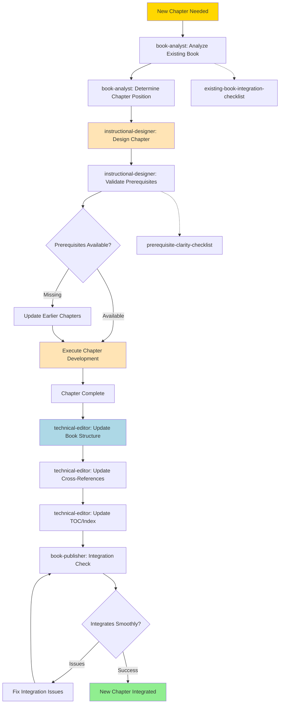

**Caption**: Add chapter workflow ensures new chapter integrates seamlessly with existing book structure and content.

**Time Estimate**: 20-40 hours
**Agents Involved**: Book Analyst, Instructional Designer, Tutorial Architect, Code Curator, Technical Editor, Book Publisher

#### How to Execute This Workflow

**Prerequisites**:

- Existing book published
- Decision to add new chapter
- Reason for new chapter identified (missing topic, reader requests, new feature)

**Step 1: Activate Book Analyst**

```bash
/bmad-tw:agents:book-analyst
```

**Step 2: Analyze Existing Book**

- **Task**: Execute `tasks/analyze-existing-book.md`
- Review current book structure
- Understand existing learning progression
- Identify where new chapter fits logically
- Check what prerequisites are established in earlier chapters
- **Output**: `book-structure-analysis.md`
- **Time**: 2-3 hours

**Step 3: Determine Chapter Position**

- Decide exact chapter number for new content
- Consider:
  - Does it build on existing chapters?
  - Is it a prerequisite for later chapters?
  - Does it fit the difficulty curve?
- Note impact: May require renumbering later chapters
- **Output**: `new-chapter-position.md`
- **Time**: 1 hour

**Step 4: Switch to Instructional Designer**

```bash
/bmad-tw:agents:instructional-designer
```

**Step 5: Design Chapter**

- **Task**: Execute `tasks/create-chapter-outline.md`
- Create chapter outline following existing book style
- Define learning objectives
- Plan section breakdown
- Identify code examples needed
- **Template**: Use `chapter-outline-tmpl.yaml`
- **Output**: `manuscript/outlines/chapter-{n}-outline.md`
- **Time**: 3-4 hours

**Step 6: Validate Prerequisites**

- **Task**: Execute `tasks/validate-learning-flow.md` (Story 7.4)
- Check: Does this chapter require concepts not yet introduced?
- Check: Does this chapter introduce concepts needed later?
- **Checklist**: `prerequisite-clarity-checklist.md`
- **Output**: `prerequisite-validation.md`
- **Time**: 1-2 hours

**Step 7: Handle Missing Prerequisites (if any)**

- If prerequisites missing, decide:
  - Add prerequisite sections to earlier chapters, OR
  - Reposition the new chapter later, OR
  - Add brief prerequisite refresher in chapter intro
- Update earlier chapters if needed
- **Time**: 2-6 hours (if prerequisites missing)

**Step 8: Execute Chapter Development**

- Use standard development workflows:
  - **Section Planning Workflow** to break chapter into sections
  - **Section Development Workflow** for each section
  - **Chapter Assembly Workflow** to merge sections
- **Output**: `manuscript/chapters/chapter-{n}-final.md`
- **Time**: 12-20 hours

**Step 9: Switch to Technical Editor**

```bash
/bmad-tw:agents:technical-editor
```

**Step 10: Update Book Structure**

- Renumber later chapters if needed
- Update all file names and references
- Adjust chapter numbering in existing chapters
- **Output**: Renumbered chapter files (if needed)
- **Time**: 1-2 hours

**Step 11: Update Cross-References**

- Find all cross-references in existing chapters
- Update chapter numbers in cross-references
- Add cross-references TO new chapter from relevant chapters
- Add cross-references FROM new chapter to related chapters
- **Task**: `tasks/validate-cross-references.md`
- **Time**: 2-3 hours

**Step 12: Update TOC/Index**

- Add new chapter to table of contents
- Update all page references (if print book)
- Add index entries for new chapter
- Update glossary if new terms introduced
- **Output**: Updated front/back matter
- **Time**: 1-2 hours

**Step 13: Switch to Book Publisher**

```bash
/bmad-tw:agents:book-publisher
```

**Step 14: Integration Check**

- **Checklist**: `existing-book-integration-checklist.md`
- Verify:
  - [ ] Chapter position makes sense
  - [ ] Prerequisites satisfied
  - [ ] Learning progression maintained
  - [ ] All cross-references updated
  - [ ] TOC updated
  - [ ] Index updated
  - [ ] Code repository updated with new examples
  - [ ] No orphaned references
  - [ ] Consistent style and voice
- **Output**: `integration-checklist-results.md`
- **Time**: 1 hour

**Step 15: Fix Integration Issues (if any)**

- Address any checklist failures
- Re-validate
- **Iterate** until all checks pass

**Success Criteria**:

- [ ] New chapter integrates seamlessly
- [ ] Prerequisites satisfied
- [ ] Learning flow maintained
- [ ] All cross-references correct
- [ ] TOC and index updated
- [ ] Consistent with existing chapters
- [ ] No broken references

**File Outputs**:

- `book-structure-analysis.md` - Analysis of existing structure
- `new-chapter-position.md` - Rationale for chapter placement
- `manuscript/outlines/chapter-{n}-outline.md` - New chapter outline
- `prerequisite-validation.md` - Prerequisite validation results
- `manuscript/chapters/chapter-{n}-final.md` - New chapter
- Updated existing chapters (if prerequisites added or cross-refs updated)
- Updated table of contents
- Updated index
- `integration-checklist-results.md` - Final validation

---

## Reference Materials

### Agent-Task-Command Mapping

Complete reference showing which agents execute which commands and tasks.

| Agent File                    | Command                       | Task File                                            | Purpose                       |
| ----------------------------- | ----------------------------- | ---------------------------------------------------- | ----------------------------- |
| **tutorial-architect.md**     | `*create-tutorial`            | `tasks/develop-tutorial.md`                          | Create standalone tutorial    |
|                               | `*outline-chapter`            | `tasks/create-chapter-outline.md`                    | Design chapter structure      |
|                               | `*write-walkthrough`          | `tasks/write-walkthrough.md` (Story 7.11)            | Create step-by-step guide     |
|                               | `*design-exercises`           | `tasks/design-exercises.md`                          | Create practice problems      |
|                               | `*write-summary`              | `tasks/write-summary.md`                             | Create chapter recap          |
|                               | `*create-doc`                 | `tasks/create-doc.md`                                | Universal document creation   |
| **code-curator.md**           | `*create-code-example`        | `tasks/create-code-example.md`                       | Develop code example          |
|                               | `*test-all-examples`          | `tasks/test-code-examples.md`                        | Test all code                 |
|                               | `*security-audit`             | `tasks/security-audit.md` (Story 7.3)                | Security vulnerability scan   |
|                               | `*cross-platform-test`        | `tasks/cross-platform-test.md` (Story 7.3)           | Test across platforms         |
|                               | `*version-check`              | `tasks/version-check.md` (Story 7.6)                 | Verify version compatibility  |
|                               | `*optimize-code`              | `tasks/optimize-code.md` (Story 7.6)                 | Improve example efficiency    |
| **instructional-designer.md** | `*create-book-outline`        | `tasks/design-book-outline.md`                       | Create book structure         |
|                               | `*create-learning-objectives` | `tasks/create-learning-objectives.md`                | Define learning goals         |
|                               | `*design-learning-path`       | `tasks/map-prerequisites.md`                         | Map prerequisite flow         |
|                               | `*analyze-difficulty-curve`   | `tasks/analyze-difficulty-curve.md` (Story 7.5)      | Check progression             |
| **technical-reviewer.md**     | `*review-chapter`             | `tasks/technical-review-chapter.md`                  | Full chapter review           |
|                               | _Execute tasks directly_      | `tasks/verify-accuracy.md` (Story 7.4)               | Verify technical accuracy     |
|                               |                               | `tasks/check-best-practices.md` (Story 7.4)          | Check code practices          |
|                               |                               | `tasks/test-code-examples.md`                        | Test all code                 |
|                               |                               | `tasks/security-audit.md` (Story 7.3)                | Security review               |
| **technical-editor.md**       | `*copy-edit`                  | `tasks/copy-edit-chapter.md`                         | Professional editing          |
|                               | `*review-outline`             | Editorial review                                     | Outline clarity review        |
| **book-publisher.md**         | `*create-proposal`            | `tasks/create-doc.md` with `book-proposal-tmpl.yaml` | Draft book proposal           |
|                               | _Format tasks_                | `tasks/format-for-packtpub.md` (Story 7.7)           | PacktPub formatting           |
|                               |                               | `tasks/format-for-oreilly.md` (Story 7.7)            | O'Reilly formatting           |
|                               |                               | `tasks/prepare-meap-chapter.md`                      | Manning MEAP prep             |
| **exercise-creator.md**       | `*design-exercises`           | `tasks/design-exercises.md`                          | Create practice exercises     |
| **book-analyst.md**           | `*analyze-book`               | `tasks/analyze-existing-book.md`                     | Analyze existing book         |
|                               | _Plan revision_               | `tasks/plan-book-revision.md`                        | Create revision plan          |
| **version-manager.md**        | _Assess impact_               | `tasks/assess-version-impact.md` (Story 7.8)         | Evaluate version changes      |
| **learning-path-designer.md** | `*validate-flow`              | `tasks/validate-learning-flow.md` (Story 7.4)        | Validate learning progression |

### File Path Conventions

Standard file paths for manuscript organization.

#### Planning Phase

- **Book Proposal**: `manuscript/planning/book-proposal.md`
- **Book Outline**: `manuscript/planning/book-outline.md`
- **Learning Path Validation**: `manuscript/planning/learning-path-validation.md`
- **Final Outline**: `manuscript/planning/book-outline-final.md`

#### Chapter Development

- **Chapter Outline**: `manuscript/outlines/chapter-{n}-outline.md`
- **Section Analysis**: `section-analysis.md` (working file)
- **Section List**: `manuscript/sections/chapter-{n}-section-list.md`
- **Section Plans**: `section-plans/section-{n}.md` (working files, 5-8 per chapter)

#### Section Development

- **Section Draft**: `manuscript/sections/chapter-{n}/section-{n}-draft.md`
- **Section Final**: `manuscript/sections/chapter-{n}/section-{n}-final.md`
- **Section Review Notes**: `section-{n}-review-notes.md` (working file)

#### Code Examples

- **Code Files**: `code/chapter-{n}/section-{n}/example-{name}.{ext}`
- **Tests**: `code/chapter-{n}/section-{n}/tests/`
- **README**: `code/chapter-{n}/README.md`

#### Chapter Assembly

- **Integrated Chapter**: `manuscript/chapters/chapter-{n}-integrated.md`
- **Learning Flow Validation**: `learning-flow-validation.md` (working file)
- **Technical Review**: `reviews/technical-review-chapter-{n}.md`
- **Edited Chapter**: `edited-chapter.md` (working file)
- **Final Chapter**: `manuscript/chapters/chapter-{n}-final.md`

#### Publication

- **Publisher-Specific Packages**: `publishing/{publisher}/`
- **Submission Packages**: `publishing/{publisher}/submission-package/`
- **Marketing Materials**: `marketing/`
- **Cover Graphics**: `marketing/graphics/`

#### Working Files (Not in Manuscript)

- **Analysis Documents**: Root or `analysis/` directory
- **Review Notes**: Root or `reviews/` directory
- **Validation Reports**: Root or `validation/` directory

### Checklist Reference

Quality gates and their associated checklists.

| Quality Gate            | Checklist File                               | Used By                          | Execute With           |
| ----------------------- | -------------------------------------------- | -------------------------------- | ---------------------- |
| Section Plan Complete   | `section-plan-tmpl.yaml` validates           | Tutorial Architect               | Template validation    |
| Learning Flow Validated | `learning-objectives-checklist.md`           | Instructional Designer           | `execute-checklist.md` |
|                         | `prerequisite-clarity-checklist.md`          | Instructional Designer           | `execute-checklist.md` |
| Code Quality            | `code-testing-checklist.md`                  | Code Curator                     | `execute-checklist.md` |
|                         | `code-quality-checklist.md`                  | Code Curator                     | `execute-checklist.md` |
| Security Review         | `security-best-practices-checklist.md`       | Code Curator, Technical Reviewer | `execute-checklist.md` |
| Cross-Platform          | `cross-platform-checklist.md`                | Code Curator                     | `execute-checklist.md` |
| Technical Accuracy      | `technical-accuracy-checklist.md`            | Technical Reviewer               | `execute-checklist.md` |
| Best Practices          | (checked via `check-best-practices.md` task) | Technical Reviewer               | Task execution         |
| Performance             | `performance-considerations-checklist.md`    | Technical Reviewer               | `execute-checklist.md` |
| Tutorial Effectiveness  | `tutorial-effectiveness-checklist.md`        | Code Curator                     | `execute-checklist.md` |
| Chapter Completeness    | `chapter-completeness-checklist.md`          | Tutorial Architect               | `execute-checklist.md` |
| Accessibility           | `accessibility-checklist.md`                 | Technical Editor                 | `execute-checklist.md` |
| PacktPub Submission     | `packtpub-submission-checklist.md`           | Book Publisher                   | `execute-checklist.md` |
| O'Reilly Format         | `oreilly-format-checklist.md`                | Book Publisher                   | `execute-checklist.md` |
| Manning MEAP            | `manning-meap-checklist.md`                  | Book Publisher                   | `execute-checklist.md` |

---

## Summary

These process flows visualize the complete technical book authoring system:

**High-Level Flows**:

- Book Authoring Lifecycle - Complete journey from concept to published book
- Agent Collaboration Map - How agents work together

**Planning**:

- Book Planning Workflow - Create pedagogically sound outline

**Development**:

- Section-Driven Development - Incremental chapter creation
- Section Development - Core content creation unit
- Chapter Assembly - Merge sections into chapters
- Tutorial Creation - Hands-on learning experiences
- Code Example Workflow - Quality code development

**Review**:

- Technical Review - Comprehensive accuracy validation
- Incorporate Feedback - Systematic issue resolution

**Publishing**:

- Publishing Decision Tree - Choose right workflow
- Publisher-Specific Workflows - PacktPub, O'Reilly, Manning, Self-Publishing

**Brownfield**:

- Edition Updates - Systematic revision process
- Add Chapters - Integrate new content

**Next Steps**:

- **Start writing**: Follow [Getting Started Tutorial](getting-started.md)
- **Deep dive on agents**: Read [Agent Reference](agent-reference.md)
- **Choose workflows**: See [Workflow Guide](workflow-guide.md)
- **See templates**: Explore [Template Gallery](template-gallery.md)

---

_Process Flows - Technical Writing Expansion Pack v1.1.0_
