# Process Flow Diagrams - Technical Writing Expansion Pack

Visual representations of all workflows, agent collaboration patterns, and the complete book authoring lifecycle.

## Table of Contents

- [How to Read These Diagrams](#how-to-read-these-diagrams)
- [High-Level Overview](#high-level-overview)
  - [Book Authoring Lifecycle](#book-authoring-lifecycle)
  - [Agent Collaboration Map](#agent-collaboration-map)
- [Planning Workflows](#planning-workflows)
  - [Book Planning Workflow](#book-planning-workflow)
- [Development Workflows](#development-workflows)
  - [Section-Driven Development Flow](#section-driven-development-flow)
  - [Section Development Workflow](#section-development-workflow)
  - [Chapter Assembly Workflow](#chapter-assembly-workflow)
  - [Tutorial Creation Workflow](#tutorial-creation-workflow)
  - [Code Example Workflow](#code-example-workflow)
- [Review Workflows](#review-workflows)
  - [Technical Review Workflow](#technical-review-workflow)
  - [Incorporate Review Feedback Workflow](#incorporate-review-feedback-workflow)
- [Publishing Workflows](#publishing-workflows)
  - [Publishing Decision Tree](#publishing-decision-tree)
  - [PacktPub Submission Workflow](#packtpub-submission-workflow)
  - [O'Reilly Submission Workflow](#oreilly-submission-workflow)
  - [Manning MEAP Workflow](#manning-meap-workflow)
  - [Self-Publishing Workflow](#self-publishing-workflow)
- [Brownfield Workflows](#brownfield-workflows)
  - [Book Edition Update Workflow](#book-edition-update-workflow)
  - [Add Chapter to Existing Book Workflow](#add-chapter-to-existing-book-workflow)

---

## How to Read These Diagrams

### Diagram Notation

**Node Colors**:
- 🟡 **Yellow (Planning)** - Initial planning and design activities
- 🟠 **Orange (Development)** - Content creation and code development
- 🔵 **Blue (Review)** - Quality assurance and validation activities
- 🟢 **Green (Complete)** - Finished deliverables and outcomes
- ⚪ **White (Decision)** - Decision points requiring evaluation

**Arrow Types**:
- **Solid arrows** → Required sequence (must follow this path)
- **Dotted arrows** -.-> Optional steps (can be included if needed)

**Agent Indicators**:
Each process step shows which agent performs the work:
- `agent-name: Action Description`

### Reading Flow

1. **Start at the top** - Entry point with prerequisites
2. **Follow solid arrows** - Required sequence of steps
3. **Check decision diamonds** - Branching based on outcomes
4. **Note agent handoffs** - Where one agent passes work to another
5. **End at green nodes** - Final deliverables

---

## High-Level Overview

### Book Authoring Lifecycle

Complete journey from book concept to published book.

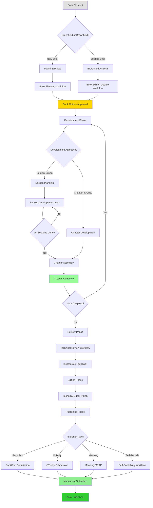

**Caption**: The complete book authoring lifecycle showing greenfield and brownfield paths, development approaches, and publishing options.

---

### Agent Collaboration Map

Shows which agents collaborate with which other agents throughout the workflow.

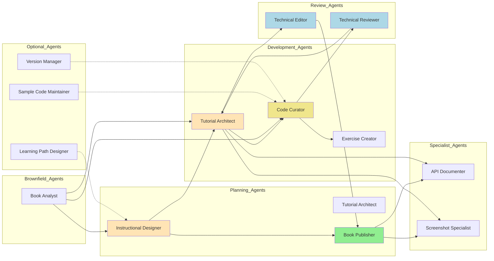

**Caption**: Agent collaboration patterns showing primary workflows (solid) and optional integrations (dotted).

**Key Collaborations**:
- **Instructional Designer → Tutorial Architect**: Passes learning objectives and chapter structure
- **Tutorial Architect → Code Curator**: Requests code examples for tutorials
- **Code Curator → Technical Reviewer**: Submits code for technical accuracy review
- **Technical Reviewer → Tutorial Architect**: Returns review feedback for revisions
- **Tutorial Architect → Technical Editor**: Passes completed content for polish
- **Technical Editor → Book Publisher**: Delivers polished manuscript for publication prep

---

## Planning Workflows

### Book Planning Workflow

Complete book planning from concept to approved outline.

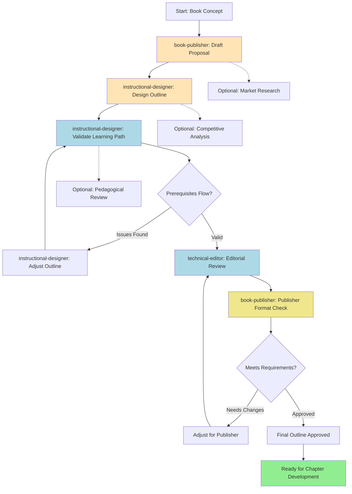

**Caption**: Book planning workflow coordinates Book Publisher, Instructional Designer, and Technical Editor to create pedagogically sound, publisher-compliant book outline.

**Time Estimate**: 20-33 hours
**Agents Involved**: Book Publisher, Instructional Designer, Technical Editor

**Key Steps**:
1. **Draft Proposal** - Book Publisher creates comprehensive proposal with market analysis
2. **Design Outline** - Instructional Designer creates detailed chapter structure with learning objectives
3. **Validate Learning Path** - Instructional Designer checks prerequisite flow and difficulty progression
4. **Editorial Review** - Technical Editor ensures clarity and consistency
5. **Publisher Check** - Book Publisher verifies format compliance
6. **Approval** - Final outline approved for development

**Quality Gates**:
- Proposal includes market analysis, target audience, competitive titles
- Outline has clear learning objectives and prerequisites for each chapter
- Learning path validated (no knowledge gaps)
- Editorial review passed (clarity, consistency)
- Publisher requirements met

---

## Development Workflows

### Section-Driven Development Flow

High-level overview of section-driven approach to chapter development.

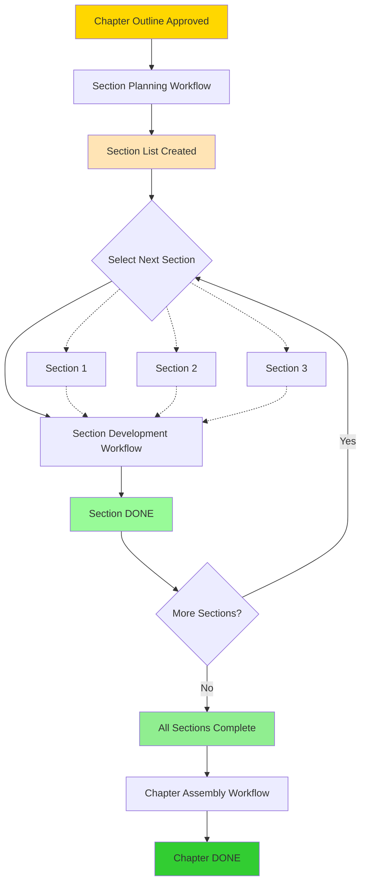

**Caption**: Section-driven development breaks chapters into 2-5 page sections that can be developed independently and in parallel.

**Why Section-Driven?**
- **Manageable scope**: Small sections easier to write
- **Parallel development**: Multiple sections can progress simultaneously
- **Incremental progress**: Each section completion is a milestone
- **Quality focus**: Easier to maintain quality in small chunks

**Typical Chapter**:
- 6-8 sections
- Each section: 2-5 pages
- Total chapter: 18-24 pages

---

### Section Development Workflow

Complete development of one section (the "story" unit of book writing).

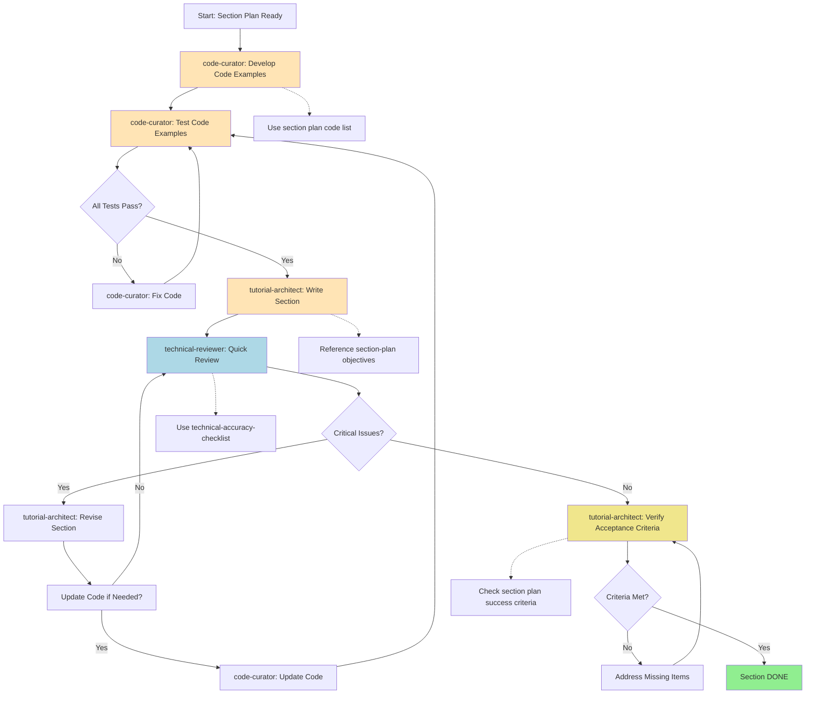

**Caption**: Section development workflow coordinates Code Curator and Tutorial Architect to create technically accurate, well-tested section content.

**Time Estimate**: 5.5-10.5 hours per section
**Agents Involved**: Code Curator, Tutorial Architect, Technical Reviewer

**Key Steps**:
1. **Develop Code** - Code Curator creates all code examples from section plan
2. **Test Code** - Code Curator runs tests, verifies output, handles edge cases
3. **Write Section** - Tutorial Architect writes 2-5 page section with code integrated
4. **Quick Review** - Technical Reviewer checks accuracy (focused, not full review)
5. **Revise** - Tutorial Architect incorporates feedback
6. **Verify** - Tutorial Architect confirms all acceptance criteria met
7. **Done** - Section marked complete and ready for chapter assembly

---

### Chapter Assembly Workflow

Merge completed sections into cohesive chapter.

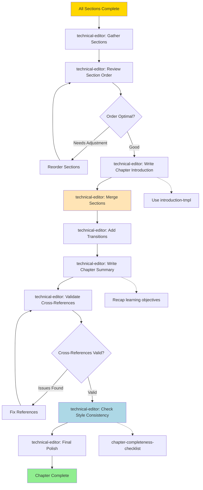

**Caption**: Chapter assembly workflow merges sections with smooth transitions, creating cohesive chapter with introduction and summary.

**Time Estimate**: 4-6 hours
**Agents Involved**: Technical Editor

**Key Activities**:
- Merge all sections in logical order
- Add smooth transitions between sections
- Write compelling chapter introduction
- Create comprehensive chapter summary
- Validate all cross-references
- Ensure consistent style and tone

---

### Tutorial Creation Workflow

Create comprehensive hands-on tutorials.

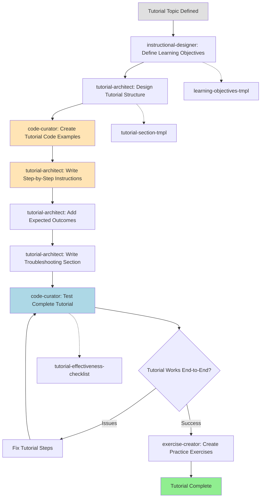

**Caption**: Tutorial creation workflow builds complete hands-on learning experiences with working code and practice exercises.

**Time Estimate**: 8-12 hours
**Agents Involved**: Instructional Designer, Tutorial Architect, Code Curator, Exercise Creator

---

### Code Example Workflow

Create, test, and document code examples.

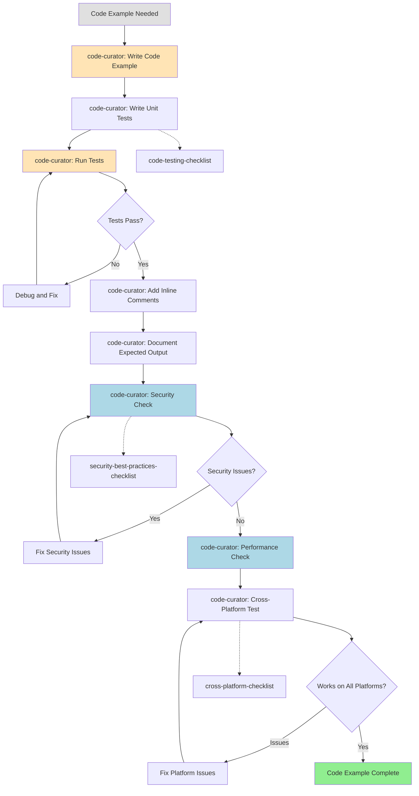

**Caption**: Code example workflow ensures all code is tested, secure, performant, and cross-platform compatible.

**Time Estimate**: 1-3 hours per example
**Agents Involved**: Code Curator

---

## Review Workflows

### Technical Review Workflow

Comprehensive technical accuracy verification.

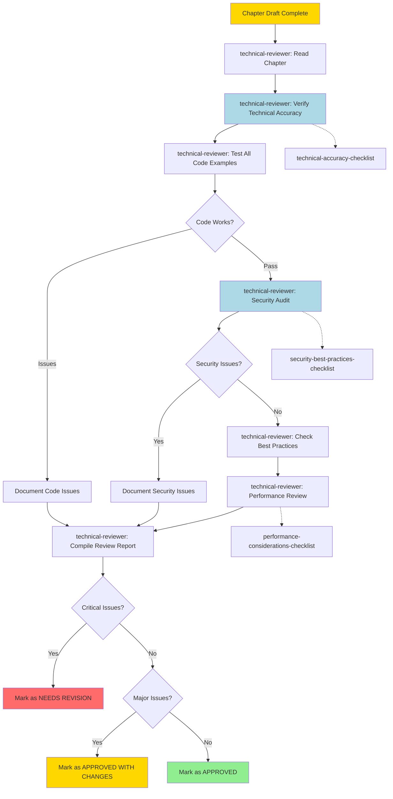

**Caption**: Technical review workflow performs comprehensive accuracy, security, and best practices validation.

**Time Estimate**: 3-6 hours per chapter
**Agents Involved**: Technical Reviewer

**Review Criteria**:
- Technical accuracy of all explanations
- Code correctness and testing
- Security vulnerabilities
- Performance considerations
- Best practices compliance
- Cross-platform compatibility

---

### Incorporate Review Feedback Workflow

Apply technical reviewer feedback systematically.

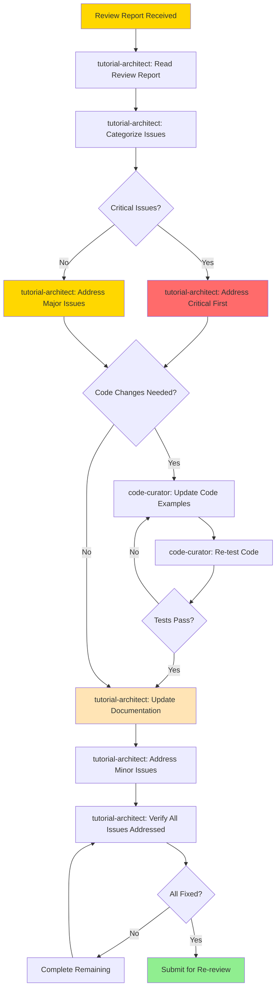

**Caption**: Feedback incorporation workflow ensures all review issues are systematically addressed and verified.

**Time Estimate**: 2-8 hours depending on issues
**Agents Involved**: Tutorial Architect, Code Curator

---

## Publishing Workflows

### Publishing Decision Tree

Choose the right publishing workflow based on your target publisher.

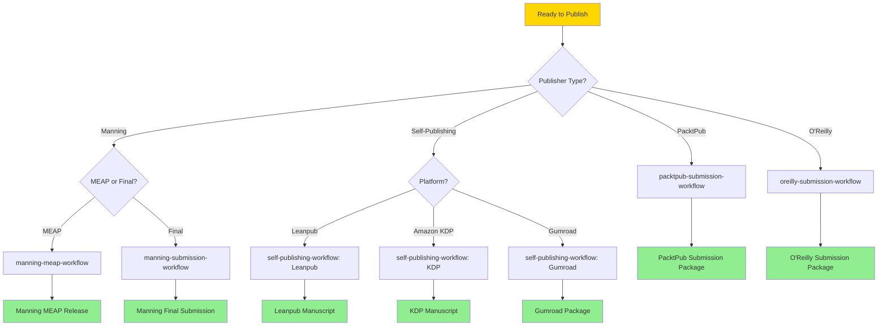

**Caption**: Publishing decision tree guides you to the correct submission workflow based on your publisher.

---

### PacktPub Submission Workflow

Prepare manuscript for PacktPub submission.

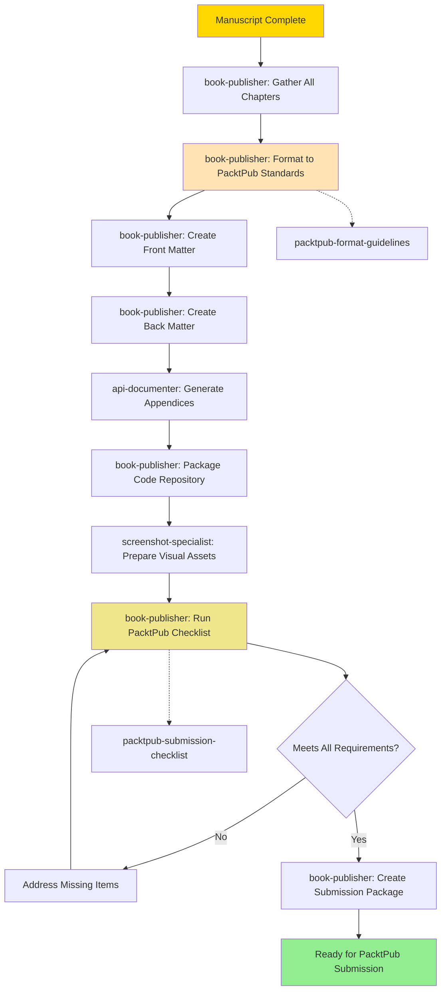

**Caption**: PacktPub submission workflow formats manuscript to publisher standards and creates complete submission package.

**Time Estimate**: 6-10 hours
**Agents Involved**: Book Publisher, API Documenter, Screenshot Specialist

---

### O'Reilly Submission Workflow

Prepare manuscript for O'Reilly submission.

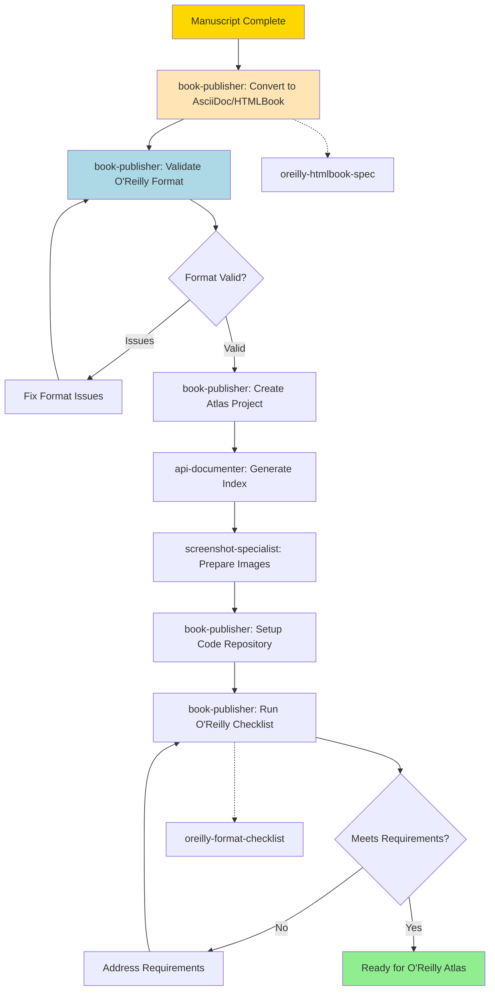

**Caption**: O'Reilly submission workflow converts to HTMLBook format and prepares Atlas-compatible project.

**Time Estimate**: 8-12 hours
**Agents Involved**: Book Publisher, API Documenter, Screenshot Specialist

---

### Manning MEAP Workflow

Prepare chapter for Manning Early Access Program (MEAP).

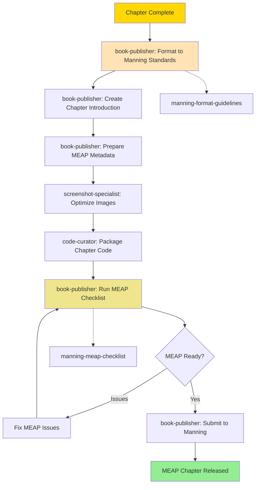

**Caption**: Manning MEAP workflow prepares individual chapters for early access release.

**Time Estimate**: 3-5 hours per chapter
**Agents Involved**: Book Publisher, Screenshot Specialist, Code Curator

---

### Self-Publishing Workflow

Prepare manuscript for self-publishing platforms.

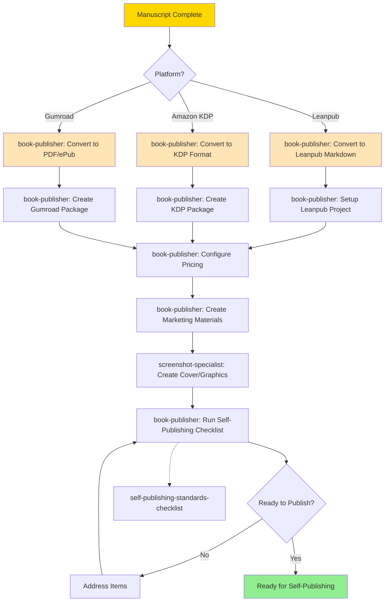

**Caption**: Self-publishing workflow supports multiple platforms with format conversion and marketing materials.

**Time Estimate**: 8-15 hours
**Agents Involved**: Book Publisher, Screenshot Specialist

---

## Brownfield Workflows

### Book Edition Update Workflow

Systematic approach to 2nd/3rd edition updates.

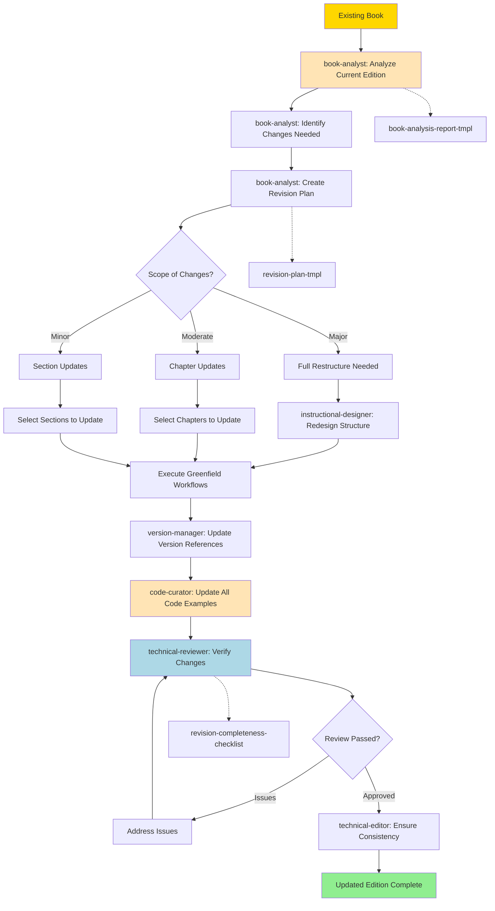

**Caption**: Book edition update workflow analyzes existing content and systematically applies updates for new edition.

**Time Estimate**: 40-120+ hours depending on scope
**Agents Involved**: Book Analyst, Instructional Designer, Code Curator, Version Manager, Technical Reviewer, Technical Editor

---

### Add Chapter to Existing Book Workflow

Add new chapter to already-published book.

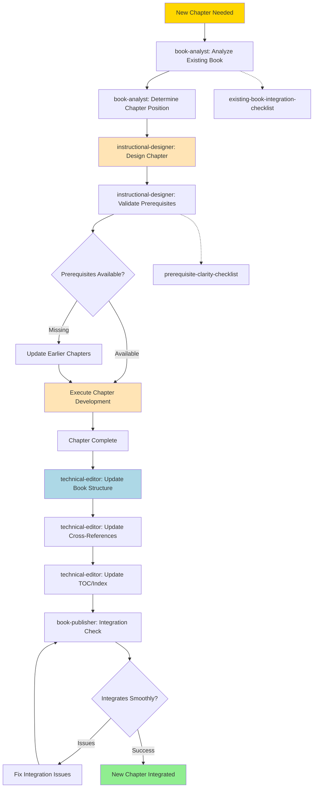

**Caption**: Add chapter workflow ensures new chapter integrates seamlessly with existing book structure and content.

**Time Estimate**: 20-40 hours
**Agents Involved**: Book Analyst, Instructional Designer, Tutorial Architect, Code Curator, Technical Editor, Book Publisher

---

## Summary

These process flows visualize the complete technical book authoring system:

**High-Level Flows**:
- Book Authoring Lifecycle - Complete journey from concept to published book
- Agent Collaboration Map - How agents work together

**Planning**:
- Book Planning Workflow - Create pedagogically sound outline

**Development**:
- Section-Driven Development - Incremental chapter creation
- Section Development - Core content creation unit
- Chapter Assembly - Merge sections into chapters
- Tutorial Creation - Hands-on learning experiences
- Code Example Workflow - Quality code development

**Review**:
- Technical Review - Comprehensive accuracy validation
- Incorporate Feedback - Systematic issue resolution

**Publishing**:
- Publishing Decision Tree - Choose right workflow
- Publisher-Specific Workflows - PacktPub, O'Reilly, Manning, Self-Publishing

**Brownfield**:
- Edition Updates - Systematic revision process
- Add Chapters - Integrate new content

**Next Steps**:
- **Start writing**: Follow [Getting Started Tutorial](getting-started.md)
- **Deep dive on agents**: Read [Agent Reference](agent-reference.md)
- **Choose workflows**: See [Workflow Guide](workflow-guide.md)
- **See templates**: Explore [Template Gallery](template-gallery.md)

---

*Process Flows - Technical Writing Expansion Pack v1.1.0*
