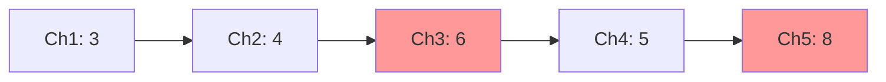
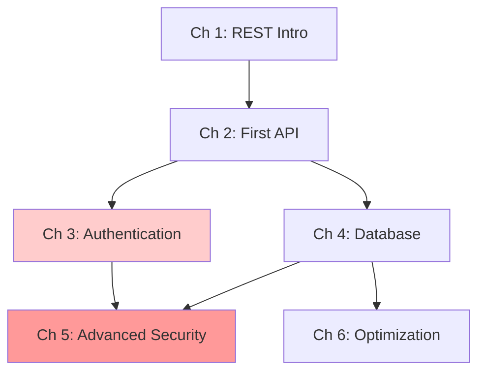

<!-- Powered by BMAD™ Core -->

# Analyze Difficulty Curve

---

task:
id: analyze-difficulty-curve
name: Analyze Difficulty Curve
description: Analyze learning progression and difficulty pacing across chapters or sections
persona_default: instructional-designer
inputs:
  - outline-path (path to book outline or chapter list)
  - target-audience-background (beginner/intermediate/advanced)
steps:
  - Load book outline or chapter list
  - For each chapter/section, assess difficulty level (1-10 scale)
  - Identify prerequisite concepts required per chapter
  - Plot difficulty progression curve (ASCII or Mermaid)
  - Detect difficulty spikes (jumps >2 levels between consecutive chapters)
  - Detect plateaus (3+ consecutive chapters at same difficulty)
  - Generate recommendations for smoothing curve
  - Create prerequisite flow diagram (Mermaid)
  - Document ideal vs actual progression
  - Run execute-checklist.md with difficulty-curve-checklist.md
output: Difficulty curve analysis report with visualizations and recommendations

---

## Purpose

This task helps you analyze the learning progression in your book to ensure smooth, appropriate difficulty pacing. A well-designed difficulty curve prevents reader frustration (spikes) and boredom (plateaus), maximizing learning effectiveness.

## Prerequisites

Before starting this task:

- Book outline or chapter list exists
- Target audience level defined (beginner/intermediate/advanced)
- Understanding of prerequisite concepts
- Access to book-structures.md for reference patterns

## Difficulty Rating Scale

Use this scale to rate chapter difficulty:

**1-2 (Introductory):**

- Basic terminology
- Simple concepts
- Minimal prerequisites
- Copy-paste examples

**3-4 (Beginner):**

- Core concepts explained
- Step-by-step tutorials
- Builds on introduction
- Guided practice

**5-6 (Intermediate):**

- Multiple concepts combined
- Independent implementation
- Moderate prerequisites
- Problem-solving required

**7-8 (Advanced):**

- Complex patterns
- Multiple dependencies
- Advanced techniques
- Critical thinking needed

**9-10 (Expert):**

- Cutting-edge topics
- Deep architectural understanding
- Integration of many concepts
- Original design work

## Workflow Steps

### 1. Load Book Structure

Review the book outline:

- Chapter titles and descriptions
- Section breakdown (if available)
- Stated prerequisites
- Learning objectives (if defined)

### 2. Rate Each Chapter Difficulty

For each chapter, assign difficulty (1-10):

**Consider:**

- Number of new concepts introduced
- Complexity of those concepts
- Prerequisites required
- Cognitive load
- Hands-on complexity

**Example Ratings:**

| Chapter | Title                     | Difficulty | Rationale                          |
| ------- | ------------------------- | ---------- | ---------------------------------- |
| 1       | Introduction to REST APIs | 3          | Basic HTTP, simple GET requests    |
| 2       | Building Your First API   | 4          | Express.js setup, routing basics   |
| 3       | Authentication with JWT   | 6          | Crypto concepts, token handling    |
| 4       | Database Integration      | 5          | SQL basics, connection management  |
| 5       | Advanced Security         | 8          | OAuth, encryption, threat modeling |

### 3. Identify Prerequisites per Chapter

For each chapter, list required prior knowledge:

**Example:**

```markdown
## Chapter 3: Authentication with JWT

Prerequisites:

- Understanding of HTTP request/response (Ch 1)
- Ability to create Express routes (Ch 2)
- Basic understanding of client-server architecture (Ch 1)
- Concept of sessions and state (Ch 2)
```

### 4. Plot Difficulty Progression

Create visual representation of difficulty curve:

**ASCII Chart:**

```
10 |                                    ██
 9 |                                  ██
 8 |                            ⚠️  ██
 7 |                          ██
 6 |              ██        ██
 5 |            ██  ██    ██
 4 |      ██  ██      ████          ⚠️ PLATEAU
 3 |  ████
 2 |
 1 |_________________________________
     1  2  3  4  5  6  7  8  9  10
        Chapter Number
```

**Mermaid Line Chart Alternative:**



### 5. Detect Difficulty Spikes

Identify jumps >2 levels between consecutive chapters:

**Spike Definition:** Difficulty increases by 3+ levels

**Example:**

```markdown
⚠️ DIFFICULTY SPIKE DETECTED

Chapter 2 → Chapter 3: Jump from 4 to 6 (Δ = +2) ✅ Acceptable
Chapter 4 → Chapter 5: Jump from 5 to 8 (Δ = +3) ⚠️ SPIKE!

Recommendation for Ch4→Ch5 spike:

- Add intermediate chapter on basic security concepts
- Move JWT authentication to new Ch5, advanced security to Ch6
- Add scaffolding exercises at end of Ch4 to prepare
```

### 6. Detect Plateaus

Identify 3+ consecutive chapters at same difficulty:

**Plateau Definition:** 3+ chapters within ±1 difficulty level

**Example:**

```markdown
⚠️ PLATEAU DETECTED

Chapters 6-7-8-9 all rated 5-6 (plateau of 4 chapters)

Recommendation:

- Increase difficulty in Ch8-9 by introducing advanced patterns
- Or reduce difficulty of Ch6-7 to solidify fundamentals
- Consider if mid-section consolidation chapter is needed
```

### 7. Generate Recommendations

Provide actionable guidance for smoothing the curve:

**Ideal Progression Patterns:**

**Beginner Book:**

```
Ch 1-3: Difficulty 2-4 (gentle introduction)
Ch 4-7: Difficulty 4-6 (core skills)
Ch 8-10: Difficulty 6-7 (application)
```

**Intermediate Book:**

```
Ch 1-2: Difficulty 4-5 (review + advance)
Ch 3-6: Difficulty 6-7 (deep dive)
Ch 7-10: Difficulty 7-9 (mastery)
```

**Advanced Book:**

```
Ch 1: Difficulty 6 (assumes knowledge)
Ch 2-5: Difficulty 7-8 (expert content)
Ch 6-8: Difficulty 9-10 (cutting edge)
```

### 8. Create Prerequisite Flow Diagram

Visualize chapter dependencies:

**Mermaid Diagram:**



**Legend:**

- Light red: Moderate difficulty
- Dark red: High difficulty
- Arrows: Prerequisite relationships

### 9. Document Ideal vs Actual Progression

Compare current curve to ideal:

**Analysis Report:**

```markdown
## Difficulty Curve Analysis

### Current Progression

Chapters 1-10: [3, 4, 6, 5, 8, 6, 6, 7, 9, 10]

### Ideal Progression (for intermediate audience)

Chapters 1-10: [4, 5, 6, 6, 7, 7, 8, 8, 9, 9]

### Variance Analysis

- Ch1: Too easy (-1) - Consider adding more depth
- Ch3: Spike (+1) - Add scaffolding
- Ch4: Dip (-1) - Reorder after Ch5 or increase difficulty
- Ch5: Major spike (+3) - ⚠️ Needs intervention
- Ch6-7: Plateau - Consider varying difficulty
```

### 10. Run Quality Checklist

Execute difficulty-curve-checklist.md (if available):

- [ ] All chapters rated on 1-10 scale
- [ ] Prerequisites identified for each chapter
- [ ] Difficulty progression visualized
- [ ] Spikes (Δ >2) identified and addressed
- [ ] Plateaus (3+ same level) identified and addressed
- [ ] Recommendations are actionable
- [ ] Prerequisite flow diagram created
- [ ] Analysis documented

## Success Criteria

Difficulty curve analysis is complete when:

- [ ] Every chapter has difficulty rating (1-10)
- [ ] Difficulty curve visualized (ASCII or Mermaid)
- [ ] Prerequisite dependencies mapped
- [ ] All spikes (Δ >2) identified with recommendations
- [ ] All plateaus (3+ chapters) identified with recommendations
- [ ] Ideal vs actual progression compared
- [ ] Actionable remediation plan provided
- [ ] Prerequisite flow diagram included

## Output Format

```markdown
# Difficulty Curve Analysis: [Book Title]

## Summary

- Target Audience: [Beginner/Intermediate/Advanced]
- Total Chapters: [N]
- Difficulty Range: [Min-Max]
- Issues Found: [Number of spikes + plateaus]

## Difficulty Progression

[ASCII or Mermaid chart]

## Chapter Ratings

| Chapter | Title | Difficulty | Prerequisites | Notes              |
| ------- | ----- | ---------- | ------------- | ------------------ |
| 1       | ...   | 3          | None          | Good intro         |
| 2       | ...   | 4          | Ch1           | Smooth progression |
| 3       | ...   | 6          | Ch1, Ch2      | ⚠️ Spike from Ch2  |

## Issues Detected

### Difficulty Spikes

[Details of each spike with recommendations]

### Plateaus

[Details of each plateau with recommendations]

## Prerequisite Flow

[Mermaid diagram showing chapter dependencies]

## Recommendations

### High Priority

1. [Action item with specific chapter/section]
2. [Action item with specific chapter/section]

### Medium Priority

[Additional recommendations]

### Optional Enhancements

[Nice-to-have improvements]

## Ideal vs Actual Comparison

[Comparison chart or table]
```

## Common Pitfalls to Avoid

**❌ Rating based on page count:**

- 50-page chapter ≠ automatically harder
- Focus on cognitive complexity, not length

**❌ Ignoring target audience:**

- "Difficult" is relative to audience background
- Always rate relative to stated prerequisite knowledge

**❌ Only looking at consecutive chapters:**

- Check for spikes across any dependency relationship
- Ch 2 → Ch 5 jump matters if Ch 5 depends on Ch 2

**❌ No actionable recommendations:**

- "Chapter 5 is too hard" (vague)
- "Add intermediate chapter on HTTP headers between Ch 4-5" (specific)

**❌ Forgetting about cumulative load:**

- Ch 10 difficulty includes all accumulated knowledge
- Later chapters naturally feel harder

## Examples

### Example 1: Beginner Book with Spike

**Book:** "JavaScript for Beginners"

**Difficulty Curve:**

```
Ch 1: Variables and Types (2/10)
Ch 2: Functions (3/10)
Ch 3: Arrays and Loops (4/10)
Ch 4: Asynchronous JavaScript (7/10) ⚠️ SPIKE
Ch 5: DOM Manipulation (5/10)
```

**Issue:** Ch 3 → Ch 4 jumps from 4 to 7 (Δ = +3)

**Recommendation:**

- Insert new chapter: "Callbacks and Basic Async" (5/10)
- Move advanced async (Promises, async/await) to later chapter
- Add scaffolding exercises at end of Ch 3

### Example 2: Book with Plateau

**Book:** "Advanced Node.js Patterns"

**Difficulty Curve:**

```
Ch 1: Event Loop Deep Dive (7/10)
Ch 2: Streams (7/10)
Ch 3: Worker Threads (7/10)
Ch 4: Native Addons (7/10) ⚠️ PLATEAU
Ch 5: Performance (8/10)
```

**Issue:** Chapters 1-4 all at difficulty 7

**Recommendation:**

- Move Ch 2 (Streams) earlier or simplify to difficulty 6
- Increase Ch 3-4 to difficulty 8 by going deeper
- Add cumulative project at end of Ch 4 to challenge readers

## Next Steps

After completing difficulty curve analysis:

1. Share with instructional-designer for review
2. Use recommendations to revise book outline
3. Add scaffolding content to smooth spikes
4. Vary content to eliminate plateaus
5. Re-run analysis after outline changes
6. Use map-prerequisites.md task for detailed dependency mapping
7. Update learning objectives to match revised difficulty progression
