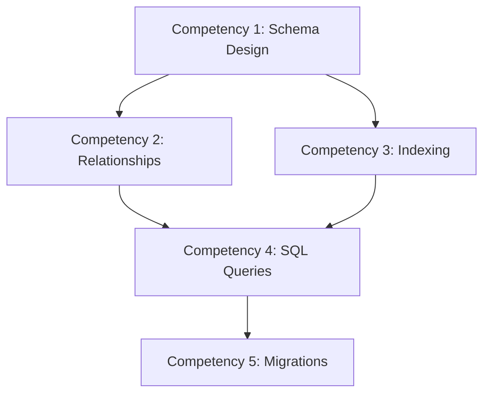

<!-- Powered by BMAD™ Core -->

# Apply Learning Framework

---

task:
id: apply-learning-framework
name: Apply Learning Framework
description: Apply pedagogical frameworks (Bloom's, scaffolding, mastery, cognitive load) to book content
persona_default: instructional-designer
inputs: - content-path (path to chapter, outline, or section) - framework-choice (blooms/scaffolding/mastery/cognitive-load/all) - target-audience (beginner/intermediate/advanced)
steps: - Load content to analyze - Select pedagogical framework to apply - Execute framework-specific analysis workflow - Generate framework application report - Provide specific recommendations for content improvement - Create framework templates or worksheets - Document framework rationale and decisions - Run execute-checklist.md with learning-framework-checklist.md
output: Framework application report with analysis, recommendations, and templates

---

## Purpose

This task helps you systematically apply pedagogical frameworks to your technical content, ensuring it follows research-backed learning principles. Each framework provides different lens for evaluating and improving content effectiveness.

## Prerequisites

Before starting this task:

- Content to analyze (chapter, outline, or section)
- Target audience level defined
- Access to learning-frameworks.md knowledge base
- Understanding of basic pedagogical principles

## Available Frameworks

This task supports five major learning frameworks:

1. **Bloom's Taxonomy** - Map objectives to cognitive skill levels
2. **Scaffolding** - Design support structures and gradual release
3. **Mastery Learning** - Define competencies and checkpoints
4. **Cognitive Load Theory** - Identify and reduce extraneous load
5. **All** - Apply all frameworks for comprehensive analysis

## Workflow Steps

### 1. Load and Review Content

Understand what you're analyzing:

- Chapter/section structure
- Learning objectives (if stated)
- Exercises and assessments
- Examples and code samples
- Prerequisites and dependencies

### 2. Select Framework

Choose based on analysis goals:

| Framework        | Use When                                   | Primary Output          |
| ---------------- | ------------------------------------------ | ----------------------- |
| Bloom's Taxonomy | Need to verify cognitive skill progression | Objective-level mapping |
| Scaffolding      | Complex topic needs support structure      | Scaffolding strategy    |
| Mastery Learning | Want checkpoint-based progression          | Competency checklist    |
| Cognitive Load   | Content feels overwhelming                 | Load reduction plan     |
| All              | Comprehensive instructional design review  | Multi-framework report  |

### 3. Apply Selected Framework

Execute framework-specific workflow (see sections below)

---

## Framework 1: Bloom's Taxonomy Application

### Purpose

Map learning objectives and content to Bloom's cognitive levels to ensure appropriate difficulty progression.

### Workflow

#### Step 1: Extract or Define Learning Objectives

If objectives exist, list them. If not, derive from content:

**Example Chapter:** "Building REST APIs"

**Extracted Objectives:**

1. "List the main HTTP methods used in REST APIs"
2. "Explain the difference between stateless and stateful architecture"
3. "Implement CRUD operations in Express.js"
4. "Analyze API performance using profiling tools"
5. "Design a scalable API architecture"

#### Step 2: Map Each Objective to Bloom's Level

Use action verb to determine level:

| Objective                     | Action Verb | Bloom's Level | Rationale                   |
| ----------------------------- | ----------- | ------------- | --------------------------- |
| List HTTP methods             | List        | Remember      | Recall of facts             |
| Explain stateless vs stateful | Explain     | Understand    | Concept explanation         |
| Implement CRUD operations     | Implement   | Apply         | Using knowledge in practice |
| Analyze API performance       | Analyze     | Analyze       | Examining components        |
| Design scalable architecture  | Design      | Create        | Producing original work     |

#### Step 3: Verify Progression Appropriateness

Check if levels match chapter position and audience:

**Early Chapter (1-3) - Target: Remember + Understand**

- ✅ Primarily Remember/Understand levels
- ⚠️ Analyze/Create may be too advanced

**Mid Chapter (4-7) - Target: Apply + Analyze**

- ✅ Focus on Apply with some Analyze
- ⚠️ Too much Remember/Understand = too easy
- ⚠️ Too much Evaluate/Create = too hard

**Late Chapter (8+) - Target: Analyze + Evaluate + Create**

- ✅ Higher-order thinking skills
- ⚠️ Should still build on previous Apply level work

#### Step 4: Verify Content Matches Objectives

Check if chapter content delivers what objectives promise:

**Example:**

```markdown
Objective: "Implement CRUD operations in Express.js" (Apply level)

Content Check:
✅ Shows working code examples
✅ Provides step-by-step tutorial
✅ Includes hands-on exercises
❌ Missing: Independent implementation challenge
❌ Missing: Error handling examples

Recommendation: Add section on error handling and
independent "build your own" exercise
```

#### Step 5: Generate Bloom's Report

**Output Template:**

```markdown
## Bloom's Taxonomy Analysis: [Chapter Name]

### Learning Objectives Mapped

| Objective     | Bloom's Level | Content Coverage     | Status     |
| ------------- | ------------- | -------------------- | ---------- |
| [Objective 1] | Remember      | ✅ Complete          | Pass       |
| [Objective 2] | Apply         | ⚠️ Missing exercises | Needs work |

### Bloom's Distribution

- Remember: 2 objectives (20%)
- Understand: 2 objectives (20%)
- Apply: 4 objectives (40%)
- Analyze: 1 objective (10%)
- Evaluate: 0 objectives (0%)
- Create: 1 objective (10%)

### Assessment

**Target Audience:** [Intermediate]
**Chapter Position:** [Chapter 5 of 10]

**Expected Distribution:** 10% Remember, 20% Understand, 40% Apply, 30% Analyze

**Variance:**

- ✅ Apply level appropriate (40% actual vs 40% expected)
- ⚠️ Too much Remember/Understand (40% actual vs 30% expected)
- ⚠️ Too little Analyze (10% actual vs 30% expected)

### Recommendations

1. **Reduce Remember-level content** - Move definitions to appendix or early chapter
2. **Add Analyze-level exercises** - Include debugging and comparison tasks
3. **Verify Create-level objective** - Ensure final project is appropriate for chapter 5
```

---

## Framework 2: Scaffolding Application

### Purpose

Design support structures that help learners achieve more than they could independently, with gradual release of responsibility.

### Workflow

#### Step 1: Identify Complex Concepts

Find topics that require scaffolding:

**Example Chapter:** "Asynchronous JavaScript"

**Complex Concepts:**

1. Event loop mechanism
2. Callback functions
3. Promises
4. Async/await syntax
5. Error handling in async code

#### Step 2: Design Concrete-to-Abstract Progression

For each concept, plan progression from concrete examples to abstract theory:

**Example: Promises**

```markdown
1. Concrete Example (Show first):
   - Working code with setTimeout and Promise
   - Visual result: "Task completed after 2 seconds"

2. Mechanism (How it works):
   - Explain .then() chaining
   - Show state transitions (pending → fulfilled → rejected)

3. Theory (Why it works):
   - Explain event loop scheduling
   - Discuss asynchronous execution model

4. Application (When to use):
   - Compare to callbacks
   - Discuss use cases
```

#### Step 3: Map Prior Knowledge Connections

Explicitly connect to what readers already know:

**Example:**

````markdown
Prerequisite Connection:
"In Chapter 3, you learned about callback functions:

```javascript
setTimeout(() => {
  console.log('Done');
}, 1000);
```
````

Promises are a more powerful way to handle the same asynchronous operations..."

````

#### Step 4: Plan Gradual Complexity Increase

Break complex topic into incremental steps:

**Example: Building an API**

```markdown
Step 1: Simple GET endpoint (no database)
Step 2: Add POST endpoint (in-memory data)
Step 3: Add database integration (SQLite)
Step 4: Add error handling
Step 5: Add authentication
Step 6: Add validation and logging
````

#### Step 5: Design Practice Progression

Plan guided → independent progression:

**Practice Levels:**

```markdown
Level 1: Guided Tutorial
"Follow these steps to create a Promise:

1. Declare: const myPromise = new Promise(...)
2. Add executor: (resolve, reject) => {...}
3. Call .then() to handle success"

Level 2: Partial Guidance
"Now create a Promise that fetches user data.
Use the same pattern, but modify for HTTP request."

Level 3: Independent Implementation
"Implement a function that fetches data from 3 APIs
using Promises. Handle errors appropriately."

Level 4: Challenge
"Build a Promise-based rate limiter that queues
API requests. Design the API yourself."
```

#### Step 6: Identify Support Structures Needed

Determine what scaffolding to provide:

**Support Types:**

- **Code templates** - Starter code with TODOs
- **Checklists** - Step-by-step implementation guides
- **Visual aids** - Diagrams showing flow
- **Debugging guides** - Common errors and solutions
- **Reference sheets** - Quick lookup for syntax
- **Worked examples** - Complete solutions with explanation

#### Step 7: Plan Support Removal (Fading)

Schedule gradual reduction of support:

**Example:**

```markdown
Chapter 5: Full code templates + step-by-step guide
Chapter 6: Partial templates + high-level guide
Chapter 7: No templates + reference sheet only
Chapter 8: Independent implementation
```

#### Step 8: Generate Scaffolding Report

**Output Template:**

```markdown
## Scaffolding Strategy: [Chapter Name]

### Complex Concepts Identified

1. [Concept Name]
   - Difficulty: [High/Medium/Low]
   - Prerequisites: [List]
   - Scaffolding needed: [Yes/No]

### Scaffolding Plan

#### [Concept 1]: Promises

**Concrete-to-Abstract Progression:**

1. Show working example with visible results
2. Explain mechanism (.then, .catch)
3. Discuss theory (event loop, async execution)
4. Apply to real scenarios

**Prior Knowledge Connections:**

- Links to: Chapter 3 (Callbacks), Chapter 2 (Functions)
- Activation: "Remember callback hell from Chapter 3?"

**Complexity Progression:**
[Detailed step-by-step build-up]

**Practice Progression:**

- Guided: [Description of tutorial]
- Partial: [Description of scaffolded exercise]
- Independent: [Description of challenge]

**Support Structures Provided:**

- ✅ Code template for Promise constructor
- ✅ Visual diagram of Promise states
- ✅ Common errors checklist
- ✅ Worked example with explanation

### Fading Strategy

| Chapter     | Support Level    | Details                           |
| ----------- | ---------------- | --------------------------------- |
| 5 (Current) | Full scaffolding | Templates, step-by-step, examples |
| 6           | Moderate         | Partial templates, guidelines     |
| 7           | Minimal          | Reference only                    |
| 8+          | Independent      | No scaffolding                    |

### Recommendations

1. [Specific recommendation with rationale]
2. [Specific recommendation with rationale]
```

---

## Framework 3: Mastery Learning Application

### Purpose

Define competencies and create checkpoint-based progression to ensure readers master fundamentals before advancing.

### Workflow

#### Step 1: Define Competencies

Break chapter content into discrete skills:

**Example Chapter:** "Database Design"

**Competencies:**

1. Design normalized database schemas
2. Define table relationships (1:1, 1:N, N:M)
3. Create indexes for query optimization
4. Write efficient SQL queries
5. Implement database migrations

#### Step 2: Specify Mastery Criteria

Define what "mastery" looks like for each competency:

**Example:**

```markdown
Competency: "Design normalized database schemas"

Mastery Criteria:
✅ Can identify normalization violations (1NF, 2NF, 3NF)
✅ Can refactor denormalized schema to 3NF
✅ Can justify when denormalization is appropriate
✅ Can complete schema design exercise in <20 minutes
✅ Achieves 90%+ accuracy on schema design quiz
```

#### Step 3: Create Checkpoint Assessments

Design checks that verify mastery before progression:

**Checkpoint Types:**

- **Knowledge Checks** - Quiz questions
- **Skill Demonstrations** - Complete a task
- **Problem Sets** - Multiple practice problems
- **Projects** - Build something demonstrating skill

**Example Checkpoint:**

```markdown
## Checkpoint 3.1: Database Normalization

Before proceeding to Section 3.2, verify mastery:

### Quiz (80% required to pass)

1. [Question about 1NF violation]
2. [Question about 2NF violation]
3. [Question about 3NF violation]

### Practical Exercise

Given this denormalized schema:
[Schema diagram]

Refactor to 3NF showing your work.

Success Criteria:

- All functional dependencies correctly identified
- Schema correctly normalized to 3NF
- No loss of information
```

#### Step 4: Design Deliberate Practice Exercises

Create exercises focused on specific skill development:

**Deliberate Practice Principles:**

- Focus on specific skill
- Immediate feedback
- Repetition with variation
- Progressive difficulty

**Example:**

```markdown
Practice: SQL JOIN Queries (Competency 4)

Exercise 1 (Easy): Simple INNER JOIN
Exercise 2 (Easy): INNER JOIN with WHERE
Exercise 3 (Medium): LEFT JOIN with NULL check
Exercise 4 (Medium): Multiple JOINs
Exercise 5 (Hard): Complex JOIN with subquery
Exercise 6 (Hard): JOIN optimization

Each exercise includes:

- Problem statement
- Expected output
- Solution
- Explanation of why solution works
```

#### Step 5: Create Remediation Paths

Define what happens if mastery not achieved:

**Remediation Options:**

```markdown
If checkpoint failed:

1. Review section material again
2. Complete additional practice problems (see Appendix A)
3. Watch supplementary video (link)
4. Try checkpoint again
5. If still struggling, skip to Chapter Summary and return later
```

#### Step 6: Map Competency Dependencies

Show which competencies are prerequisites for others:

**Mermaid Diagram:**



#### Step 7: Generate Mastery Learning Report

**Output Template:**

```markdown
## Mastery Learning Plan: [Chapter Name]

### Competencies Defined

1. [Competency Name]
   - Prerequisites: [List]
   - Mastery Criteria: [Detailed criteria]
   - Checkpoint: [Assessment type]

### Competency Dependency Map

[Mermaid diagram showing dependencies]

### Checkpoint Assessments

#### Checkpoint [N]: [Competency Name]

**Assessment Type:** [Quiz/Exercise/Project]
**Passing Score:** [Percentage or criteria]
**Time Estimate:** [Minutes]

**Content:**
[Quiz questions, exercise description, or project spec]

**Mastery Criteria:**

- [Specific criterion 1]
- [Specific criterion 2]

**Remediation Path:**
[What to do if failed]

### Deliberate Practice Exercises

[Detailed exercise progression for each competency]

### Recommendations

1. [Specific recommendation]
2. [Specific recommendation]
```

---

## Framework 4: Cognitive Load Theory Application

### Purpose

Identify and reduce extraneous cognitive load while maintaining appropriate intrinsic load and promoting germane load.

### Workflow

#### Step 1: Identify Cognitive Load Sources

Analyze content for three types of load:

**Example Chapter:** "React Hooks"

**Intrinsic Load (Content Difficulty - Cannot Reduce):**

- Understanding closure concept
- Managing component lifecycle
- Tracking state dependencies

**Extraneous Load (Poor Design - MUST Reduce):**

- Confusing code formatting
- Inconsistent terminology
- Missing context
- Unclear examples
- Too many concepts at once

**Germane Load (Learning Effort - Desirable):**

- Working through exercises
- Debugging practice
- Building mental models
- Connecting concepts

#### Step 2: Analyze Information Chunking

Check if content is broken into digestible pieces:

**Example Analysis:**

```markdown
Current Structure:
❌ Section 1: "React Hooks" (15 pages, 8 different hooks)

- Too much information in one section
- High cognitive load

Recommended Structure:
✅ Section 1: "Introduction to Hooks" (3 pages)
✅ Section 2: "useState Hook" (3 pages)
✅ Section 3: "useEffect Hook" (4 pages)
✅ Section 4: "Custom Hooks" (3 pages)
✅ Section 5: "Advanced Hooks" (2 pages)
```

#### Step 3: Evaluate Progressive Disclosure

Verify information is introduced when needed:

**Example:**

```markdown
❌ Current: All hook rules explained upfront

- Overwhelms before reader understands why hooks exist

✅ Recommended:

- Introduce useState first (simple case)
- Explain rules of useState specifically
- After useState mastered, introduce useEffect
- Explain additional rules that apply
- Generalize to all hooks at end
```

#### Step 4: Check Worked Examples Ratio

Ensure sufficient examples before practice:

**Cognitive Load Research:** 40% worked examples, 60% practice is optimal for novices

**Example Analysis:**

```markdown
Current Ratio:

- Worked examples: 10% (1 example)
- Practice problems: 90% (9 exercises)
- ⚠️ Too much practice, not enough examples (high cognitive load)

Recommended:

- Add 3 more worked examples with explanations
- Reduce practice problems to 5 core exercises
- Move advanced exercises to "challenge" section
```

#### Step 5: Evaluate Dual Coding

Check for appropriate text + visual combinations:

**Example:**

````markdown
Content: "useEffect runs after every render by default"

❌ Text only - requires mental visualization

✅ Text + Diagram:
[Diagram showing component lifecycle with useEffect timing]

✅ Text + Code + Console Output:

```javascript
useEffect(() => {
  console.log('Effect ran');
});
```
````

Console: "Effect ran" after each render

````

#### Step 6: Identify Extraneous Load Sources

Find and eliminate unnecessary cognitive effort:

**Common Sources:**

```markdown
1. Inconsistent Terminology
   ❌ "state variable", "stateful value", "useState value" (3 terms, same thing)
   ✅ Pick one: "state variable" (use consistently)

2. Unclear Code Examples
   ❌ `const [x, y] = useState(0);` (non-descriptive names)
   ✅ `const [count, setCount] = useState(0);` (clear intent)

3. Missing Context
   ❌ Shows code snippet without explaining where it goes
   ✅ "Add this inside your component function, before the return statement"

4. Cognitive Overload
   ❌ Introducing 5 new concepts in one section
   ✅ One concept at a time, with practice before next

5. Split Attention
   ❌ Code on page 12, explanation on page 15
   ✅ Code and explanation adjacent
````

#### Step 7: Generate Cognitive Load Report

**Output Template:**

```markdown
## Cognitive Load Analysis: [Chapter Name]

### Load Type Breakdown

**Intrinsic Load (Content Difficulty):**

- [Concept 1]: High - Complex topic requiring deep thought
- [Concept 2]: Medium - Builds on prior knowledge
- [Concept 3]: Low - Simple application of known pattern

**Assessment:** Intrinsic load appropriate for [target audience]

**Extraneous Load (Design Issues):**

- ⚠️ Issue 1: [Description of unnecessary cognitive effort]
- ⚠️ Issue 2: [Description of unnecessary cognitive effort]

**Assessment:** Extraneous load too high - needs reduction

**Germane Load (Desirable Effort):**

- ✅ Exercises promote schema building
- ✅ Practice problems appropriate difficulty
- ⚠️ Could add more metacognitive prompts

### Chunking Analysis

Current Structure: [Summary]
Issues: [List problems]
Recommended Structure: [Improved organization]

### Progressive Disclosure Check

[Analysis of information sequencing]

### Worked Example Ratio

- Current: [X%] worked examples, [Y%] practice
- Optimal: [Target based on audience]
- Recommendation: [Specific changes]

### Dual Coding Assessment

[Analysis of text + visual combinations]

### Extraneous Load Sources Identified

1. **[Issue Category]**: [Description]
   - Location: [Where in content]
   - Impact: [High/Medium/Low]
   - Fix: [Specific recommendation]

### Recommendations (Priority Order)

1. **High Priority**: [Recommendation addressing major extraneous load]
2. **Medium Priority**: [Recommendation for improvement]
3. **Low Priority**: [Nice-to-have enhancement]

### Cognitive Load Reduction Plan

[Detailed action plan with specific changes]
```

---

## Framework 5: Apply All Frameworks

When "all" selected as framework choice, run comprehensive analysis:

### Workflow

1. **Execute Bloom's Taxonomy Application** (Framework 1)
2. **Execute Scaffolding Application** (Framework 2)
3. **Execute Mastery Learning Application** (Framework 3)
4. **Execute Cognitive Load Application** (Framework 4)
5. **Generate Comprehensive Report**

### Comprehensive Report Template

```markdown
# Comprehensive Pedagogical Analysis: [Chapter Name]

## Executive Summary

- **Content:** [Brief description]
- **Target Audience:** [Level]
- **Frameworks Applied:** Bloom's, Scaffolding, Mastery Learning, Cognitive Load
- **Overall Assessment:** [Pass/Needs Work/Major Revision]

## 1. Bloom's Taxonomy Analysis

[Full Bloom's report from Framework 1]

## 2. Scaffolding Analysis

[Full scaffolding report from Framework 2]

## 3. Mastery Learning Analysis

[Full mastery report from Framework 3]

## 4. Cognitive Load Analysis

[Full cognitive load report from Framework 4]

## 5. Cross-Framework Insights

### Consistency Check

- Do Bloom's levels match scaffolding progression? [Y/N]
- Are mastery checkpoints aligned with cognitive load? [Y/N]
- Is difficulty curve appropriate across frameworks? [Y/N]

### Conflicts Identified

[Any contradictory recommendations between frameworks]

### Synergies Identified

[Places where multiple frameworks reinforce same recommendation]

## 6. Prioritized Recommendations

### Critical (Must Fix)

1. [Recommendation with impact and effort estimate]

### High Priority (Should Fix)

[List]

### Medium Priority (Nice to Fix)

[List]

### Optional Enhancements

[List]

## 7. Action Plan

[Specific, ordered steps to implement recommendations]
```

---

## Success Criteria

Framework application is complete when:

- [ ] Framework selected or "all" chosen for comprehensive analysis
- [ ] Framework-specific analysis completed following workflow
- [ ] Output report generated using appropriate template
- [ ] Recommendations are specific and actionable
- [ ] Analysis references learning-frameworks.md appropriately
- [ ] Templates or worksheets provided where applicable
- [ ] Quality checklist passed

## Common Pitfalls to Avoid

**❌ Applying framework mechanically:**

- Don't just check boxes
- Understand the "why" behind each framework principle

**❌ Ignoring target audience:**

- Scaffolding needs vary by audience level
- Advanced readers need less support

**❌ Over-optimizing for one framework:**

- Balance between frameworks
- Some recommendations may conflict - prioritize

**❌ Vague recommendations:**

- "Add more examples" (vague)
- "Add worked example of Promise chaining in Section 3.2" (specific)

**❌ Analysis without implementation plan:**

- Always include actionable next steps
- Prioritize by impact and effort

## Examples

### Example 1: Bloom's Applied to Chapter

**Chapter:** "Express.js Routing"

**Analysis:**

- 5 objectives identified
- 3 at Apply level (60%) ✅ Good for mid-book chapter
- 2 at Understand level (40%)
- 0 at Analyze+ levels ⚠️ Missing higher-order thinking

**Recommendation:**

- Add debugging exercise (Analyze level)
- Add architecture comparison (Evaluate level)

### Example 2: Cognitive Load Applied to Section

**Section:** "Async/Await Syntax" (5 pages, 12 concepts)

**Analysis:**

- Extraneous load: High ⚠️
- Issues: Too many concepts, inconsistent terms, missing diagrams

**Recommendations:**

1. Split into 2 sections (async/await separately)
2. Standardize terminology (pick "async function" not "async method")
3. Add 3 visual diagrams showing execution flow

## Next Steps

After applying learning framework:

1. Share report with content-developer or technical-editor
2. Prioritize recommendations by impact
3. Implement high-priority changes
4. Re-run analysis after revisions
5. Use design-assessment-strategy.md to align assessments with framework
6. Update learning objectives based on Bloom's analysis
