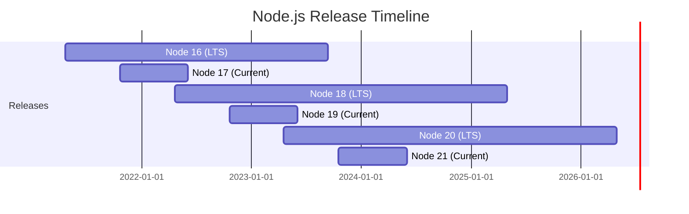
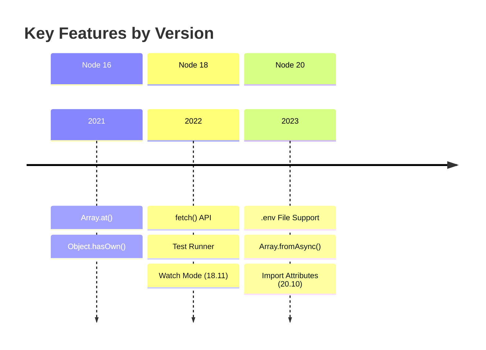

<!-- Powered by BMAD™ Core -->

# Create Version Matrix

---

task:
  id: create-version-matrix
  name: Create Version Matrix
  description: Build a comprehensive version compatibility matrix showing which features work with which versions
  persona_default: version-manager
  inputs:
    - technology (technology or library to analyze: node, python, react, etc.)
    - version-range (versions to cover: e.g., "16-20" for Node 16 through 20)
    - feature-list (optional: specific features to track)
  steps:
    - Research version release history and dates
    - Identify all version-dependent features in book/code
    - Map each feature to minimum required version
    - Create compatibility matrix table
    - Add migration notes between major versions
    - Document deprecated features per version
    - Generate testing requirements per version
    - Create visual timeline (optional Mermaid diagram)
  output: Version compatibility matrix document with feature mapping and testing guide

---

## Purpose

This task helps you create a clear version compatibility reference for technical books or documentation covering multiple versions of a technology. A well-crafted version matrix helps readers understand what features are available in their version and guides migration planning.

## Prerequisites

Before starting this task:

- Technology and version range identified
- Understanding of features used in book/code
- Access to official release notes and changelogs
- Target audience version usage data (if available)

## Version Matrix Components

### 1. Version Timeline

Shows when versions were released and their support status:

```markdown
## Version Timeline

| Version | Release Date | Status | End of Life |
|---------|--------------|--------|-------------|
| Node 16 | 2021-04-20 | Maintenance | 2023-09-11 |
| Node 18 | 2022-04-19 | Active LTS | 2025-04-30 |
| Node 20 | 2023-04-18 | Active LTS | 2026-04-30 |
| Node 21 | 2023-10-17 | Current | 2024-06-01 |
```

### 2. Feature Compatibility Matrix

Maps features to minimum versions:

```markdown
## Feature Compatibility

| Feature | Node 16 | Node 18 | Node 20 | Node 21 |
|---------|---------|---------|---------|---------|
| fetch API | ❌ | ✅ (18.0+) | ✅ | ✅ |
| Test Runner | ❌ | ✅ (18.0+) | ✅ | ✅ |
| Watch Mode | ❌ | ✅ (18.11+) | ✅ | ✅ |
| --env-file | ❌ | ❌ | ✅ (20.6+) | ✅ |
| Import Attributes | ❌ | ❌ | ✅ (20.10+) | ✅ |
```

Legend:
- ✅ Available
- ❌ Not available
- ⚠️ Experimental/unstable
- 🏁 Deprecated

### 3. Breaking Changes Summary

Documents incompatibilities between versions:

```markdown
## Breaking Changes

### Node 16 → Node 18
- OpenSSL 3.0 (may affect crypto code)
- V8 engine updated (some syntax changes)
- Minimum ICU version increased

### Node 18 → Node 20
- Default DNS resolution order changed
- Import assertions deprecated (use import attributes)
- Some deprecated APIs removed
```

### 4. Migration Path

Recommended upgrade sequence:

```markdown
## Recommended Migration Path

Node 16 → Node 18 → Node 20

**Skip Node 17, 19, 21** (odd-numbered releases are not LTS)
```

## Workflow Steps

### 1. Research Version Release History

**Gather official information:**

**Node.js example:**
- Releases: https://nodejs.org/en/about/previous-releases
- Changelog: https://github.com/nodejs/node/blob/main/CHANGELOG.md
- LTS schedule: https://github.com/nodejs/release#release-schedule

**Python example:**
- PEPs: https://peps.python.org/
- Release schedule: https://www.python.org/downloads/
- Changelog: https://docs.python.org/3/whatsnew/

**React example:**
- Changelog: https://github.com/facebook/react/blob/main/CHANGELOG.md
- Blog: https://react.dev/blog
- Upgrade guides: https://react.dev/learn/upgrade-guide

**Create version table:**

```markdown
## Version Research: Node.js 16-20

| Version | Release Date | EOL Date | Status | LTS Start |
|---------|--------------|----------|--------|-----------|
| 16.x | 2021-04-20 | 2023-09-11 | EOL | 2021-10-26 |
| 17.x | 2021-10-19 | 2022-06-01 | EOL | N/A (not LTS) |
| 18.x | 2022-04-19 | 2025-04-30 | Active LTS | 2022-10-25 |
| 19.x | 2022-10-18 | 2023-06-01 | EOL | N/A (not LTS) |
| 20.x | 2023-04-18 | 2026-04-30 | Active LTS | 2023-10-24 |
| 21.x | 2023-10-17 | 2024-06-01 | Current | N/A (not LTS) |
```

### 2. Identify Version-Dependent Features

**Review book content and code samples:**

**Example feature inventory:**

```markdown
## Features Used in Book

### Native Fetch API
- Introduced: Node 18.0.0
- Stabilized: Node 18.0.0 (unflagged)
- Chapter: Chapter 5 (HTTP Requests)
- Code samples: 12 examples

### Test Runner Module
- Introduced: Node 18.0.0 (experimental)
- Stabilized: Node 20.0.0
- Chapter: Chapter 9 (Testing)
- Code samples: 8 examples

### Watch Mode
- Introduced: Node 18.11.0
- Flag: --watch
- Chapter: Chapter 10 (Development Workflow)
- Code samples: 3 examples

### .env File Support
- Introduced: Node 20.6.0
- Flag: --env-file
- Chapter: Chapter 4 (Configuration)
- Code samples: 5 examples

### Import Attributes
- Introduced: Node 20.10.0 (experimental)
- Syntax: import json from './data.json' with { type: 'json' }
- Chapter: Chapter 3 (Modules)
- Code samples: 4 examples
```

### 3. Map Features to Minimum Versions

**Create feature-version mapping:**

```markdown
## Feature Minimum Versions

| Feature | Min Version | Status | Notes |
|---------|-------------|--------|-------|
| fetch() API | 18.0.0 | Stable | Replaces node-fetch |
| test() function | 18.0.0 | Stable | Built-in test runner |
| --watch flag | 18.11.0 | Stable | Auto-restart on changes |
| --env-file flag | 20.6.0 | Stable | Load .env files natively |
| Import attributes | 20.10.0 | Experimental | Replaces import assertions |
| Synchronous import.meta.resolve() | 20.6.0 | Stable | Module resolution |
| Array.fromAsync() | 20.0.0 | Stable | Async iterable to array |
| Default resolveDns | 20.0.0 | Changed | Now verbatim (not ipv4first) |
```

### 4. Create Compatibility Matrix

**Build comprehensive matrix:**

```markdown
## Compatibility Matrix: Node.js Features

| Feature | 16.x | 17.x | 18.0-18.10 | 18.11+ | 19.x | 20.0-20.5 | 20.6+ | 20.10+ | 21.x |
|---------|------|------|------------|--------|------|-----------|-------|--------|------|
| **HTTP & Network** |
| fetch() API | ❌ | ✅* | ✅ | ✅ | ✅ | ✅ | ✅ | ✅ | ✅ |
| WebSocket | ❌ | ❌ | ❌ | ❌ | ❌ | ❌ | ❌ | ✅ | ✅ |
| **Testing** |
| test() runner | ❌ | ❌ | ✅ | ✅ | ✅ | ✅ | ✅ | ✅ | ✅ |
| Coverage report | ❌ | ❌ | ❌ | ❌ | ✅ | ✅ | ✅ | ✅ | ✅ |
| Mocking | ❌ | ❌ | ❌ | ❌ | ❌ | ❌ | ✅ | ✅ | ✅ |
| **Development** |
| --watch mode | ❌ | ❌ | ❌ | ✅ | ✅ | ✅ | ✅ | ✅ | ✅ |
| --env-file | ❌ | ❌ | ❌ | ❌ | ❌ | ❌ | ✅ | ✅ | ✅ |
| **Modules** |
| Import attributes | ❌ | ❌ | ❌ | ❌ | ❌ | ❌ | ❌ | ✅* | ✅ |
| Top-level await | ✅ | ✅ | ✅ | ✅ | ✅ | ✅ | ✅ | ✅ | ✅ |
| **JavaScript Features** |
| Array.at() | ✅ | ✅ | ✅ | ✅ | ✅ | ✅ | ✅ | ✅ | ✅ |
| Array.fromAsync() | ❌ | ❌ | ❌ | ❌ | ❌ | ✅ | ✅ | ✅ | ✅ |
| Object.hasOwn() | ✅ | ✅ | ✅ | ✅ | ✅ | ✅ | ✅ | ✅ | ✅ |

Legend:
✅ Stable and available
✅* Experimental (use with caution)
❌ Not available
⚠️ Available but buggy
🏁 Deprecated (avoid)
```

### 5. Add Migration Notes

**Document upgrade considerations:**

```markdown
## Migration Notes

### Migrating from Node 16 to Node 18

**Required Code Changes:**

1. **Replace node-fetch with native fetch:**
   ```javascript
   // Node 16 (with node-fetch package)
   const fetch = require('node-fetch');

   // Node 18+ (built-in)
   // No import needed, fetch is global
   ```

2. **Update test framework:**
   ```javascript
   // Node 16 (using Jest or Mocha)
   const { test, expect } = require('jest');

   // Node 18+ (built-in test runner)
   const { test } = require('node:test');
   const assert = require('node:assert');
   ```

3. **OpenSSL 3.0 compatibility:**
   - Some older crypto algorithms deprecated
   - MD4 hash no longer available by default
   - Check legacy crypto code

**Breaking Changes:**
- DNS resolution order changed (may affect network code)
- V8 updated to 10.1 (some edge cases in regex, proxies)
- Minimum OpenSSL version: 3.0

**Recommended Steps:**
1. Update package.json: `"engines": { "node": ">=18.0.0" }`
2. Run test suite
3. Update CI/CD to Node 18
4. Remove node-fetch dependency
5. Migrate to built-in test runner (optional)

### Migrating from Node 18 to Node 20

**New Features to Adopt:**

1. **Native .env file support:**
   ```bash
   # Node 18 (requires dotenv package)
   node -r dotenv/config app.js

   # Node 20.6+ (built-in)
   node --env-file=.env app.js
   ```

2. **Improved test runner:**
   - Coverage reporting
   - Mocking support
   - Better watch mode

3. **Import attributes:**
   ```javascript
   // Node 18 (import assertions - deprecated)
   import data from './data.json' assert { type: 'json' };

   // Node 20.10+ (import attributes - new syntax)
   import data from './data.json' with { type: 'json' };
   ```

**Breaking Changes:**
- Default DNS resolution: changed from `ipv4first` to `verbatim`
- Import assertions syntax deprecated (use import attributes)
- Some experimental APIs removed

**Recommended Steps:**
1. Update package.json: `"engines": { "node": ">=20.6.0" }`
2. Replace dotenv with --env-file flag
3. Update import assertions to import attributes
4. Test DNS-dependent code
5. Update CI/CD to Node 20
```

### 6. Document Deprecated Features

**Track what's being phased out:**

```markdown
## Deprecated Features

### Node 18

**Deprecated in 18.x:**
- Import assertions (use import attributes in 20.10+)
- Legacy URL API (use WHATWG URL API)
- punycode module (use built-in TextEncoder/TextDecoder)

**Removed in 18.x:**
- Node.js 8 stream.Readable.wrap()
- process.binding() (use public APIs)
- crypto.createCredentials() (use tls.createSecureContext())

### Node 20

**Deprecated in 20.x:**
- --experimental-import-meta-resolve flag (now stable)
- Old import assertion syntax (use 'with' instead of 'assert')

**Removed in 20.x:**
- runtime deprecation warnings for old stream methods
- Some experimental V8 flags
```

### 7. Generate Testing Requirements

**Define testing strategy for version support:**

```markdown
## Testing Requirements

### Minimum Version Testing

**Required:** Test on minimum supported version (Node 18.0.0)
- Ensures all features work on oldest version
- Catches version-specific bugs early
- CI/CD: Run full test suite on Node 18.0.0

### LTS Version Testing

**Required:** Test on all active LTS versions
- Node 18.x (Active LTS)
- Node 20.x (Active LTS)
- CI/CD: Run tests on both LTS versions

### Current Version Testing

**Optional:** Test on current release (Node 21.x)
- Catch future compatibility issues
- Preview upcoming features
- CI/CD: Run tests on Node 21.x (allow failures)

### Testing Matrix

```yaml
# .github/workflows/test.yml
strategy:
  matrix:
    node-version: [18.0.0, 18.x, 20.x, 21.x]
    os: [ubuntu-latest, windows-latest, macos-latest]
```

### Feature Flag Testing

For experimental features:
- Test with and without feature flags
- Document flag requirements
- Warn users about stability
```

### 8. Create Visual Timeline

**Optional: Mermaid diagram showing version progression:**

```markdown
## Version Timeline Diagram



**Feature introduction timeline:**


```

## Success Criteria

Version matrix is complete when:

- [ ] All versions in range documented with release dates
- [ ] All book features mapped to minimum versions
- [ ] Compatibility matrix created with clear legend
- [ ] Migration notes provided for major version jumps
- [ ] Deprecated features documented
- [ ] Testing requirements specified
- [ ] Visual timeline created (optional)
- [ ] Matrix is easy to read and reference
- [ ] All claims verified against official documentation

## Output Format

```markdown
# Version Compatibility Matrix: [Technology Name]

## Overview

- **Technology:** [Name and link to official docs]
- **Versions Covered:** [X.x - Y.y]
- **Book Target Version:** [Recommended version for readers]
- **Minimum Supported Version:** [Oldest version that works]
- **Last Updated:** [Date]

## Version Timeline

[Table showing versions, release dates, EOL dates, status]

## Compatibility Matrix

[Comprehensive feature matrix table]

## Migration Guides

### [Version A] → [Version B]
[Migration notes]

### [Version B] → [Version C]
[Migration notes]

## Deprecated Features

[List of deprecated features per version]

## Testing Requirements

[Testing strategy and CI/CD recommendations]

## Visual Timeline

[Optional Mermaid diagram]

## Resources

- Official Changelog: [URL]
- Release Schedule: [URL]
- Migration Guide: [URL]
- Breaking Changes: [URL]
```

## Common Pitfalls to Avoid

**❌ Incomplete feature research:**
- Missing features that readers depend on
- Incorrect minimum version numbers

✅ **Verify against official sources:**
- Cross-reference changelog
- Test features on actual versions

**❌ Confusing experimental vs stable:**
- Recommending experimental features without warning

✅ **Clear stability indicators:**
- Use legend: ✅ (stable), ✅* (experimental)
- Document flag requirements

**❌ Ignoring odd-numbered releases:**
- Including Node 17, 19, 21 as recommended

✅ **Focus on LTS versions:**
- Recommend even-numbered (LTS) releases
- Note odd-numbered are short-lived

**❌ Not testing migration path:**
- Providing untested upgrade instructions

✅ **Test migrations:**
- Verify upgrade steps on real project
- Document actual issues encountered

## Examples

### Example 1: Python Version Matrix

```markdown
# Python 3.9-3.12 Compatibility Matrix

| Feature | 3.9 | 3.10 | 3.11 | 3.12 |
|---------|-----|------|------|------|
| Structural Pattern Matching | ❌ | ✅ | ✅ | ✅ |
| Union type operator (\|) | ❌ | ✅ | ✅ | ✅ |
| tomllib (TOML parsing) | ❌ | ❌ | ✅ | ✅ |
| f-string debugging (=) | ✅ | ✅ | ✅ | ✅ |
| Type hinting generics | ❌ | ❌ | ❌ | ✅ (PEP 695) |
| asyncio.TaskGroup | ❌ | ❌ | ✅ | ✅ |

**Recommendation:** Python 3.11+ for best performance (10-60% faster than 3.10)
```

### Example 2: React Version Matrix

```markdown
# React 16-18 Compatibility Matrix

| Feature | React 16 | React 17 | React 18 |
|---------|----------|----------|----------|
| Hooks | ✅ (16.8+) | ✅ | ✅ |
| Concurrent Mode | ❌ | ❌ | ✅ |
| Automatic Batching | ❌ | ❌ | ✅ |
| Suspense (SSR) | ⚠️ (experimental) | ⚠️ | ✅ |
| useTransition | ❌ | ❌ | ✅ |
| useDeferredValue | ❌ | ❌ | ✅ |
| useId | ❌ | ❌ | ✅ |
| New JSX Transform | ❌ | ✅ | ✅ |

**Migration:** React 16 → 17 → 18 (test thoroughly at each step)
```

## Next Steps

After creating version matrix:

1. Use `assess-version-impact.md` to analyze migration impact
2. Use `update-dependencies.md` for package updates
3. Run `execute-checklist.md` with `version-update-checklist.md`
4. Include matrix in book appendix or online documentation
5. Update matrix when new versions release
6. Test code samples against matrix
