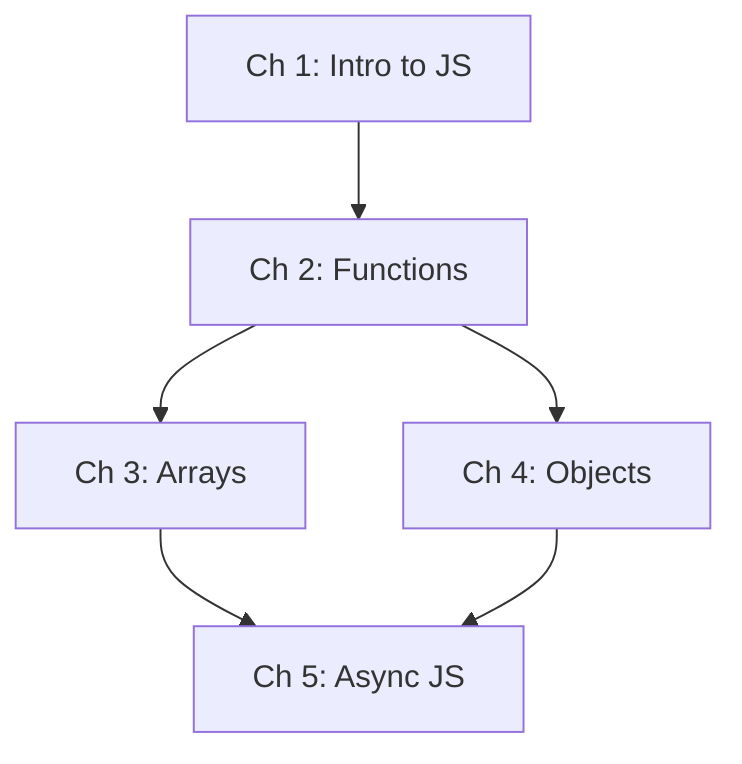
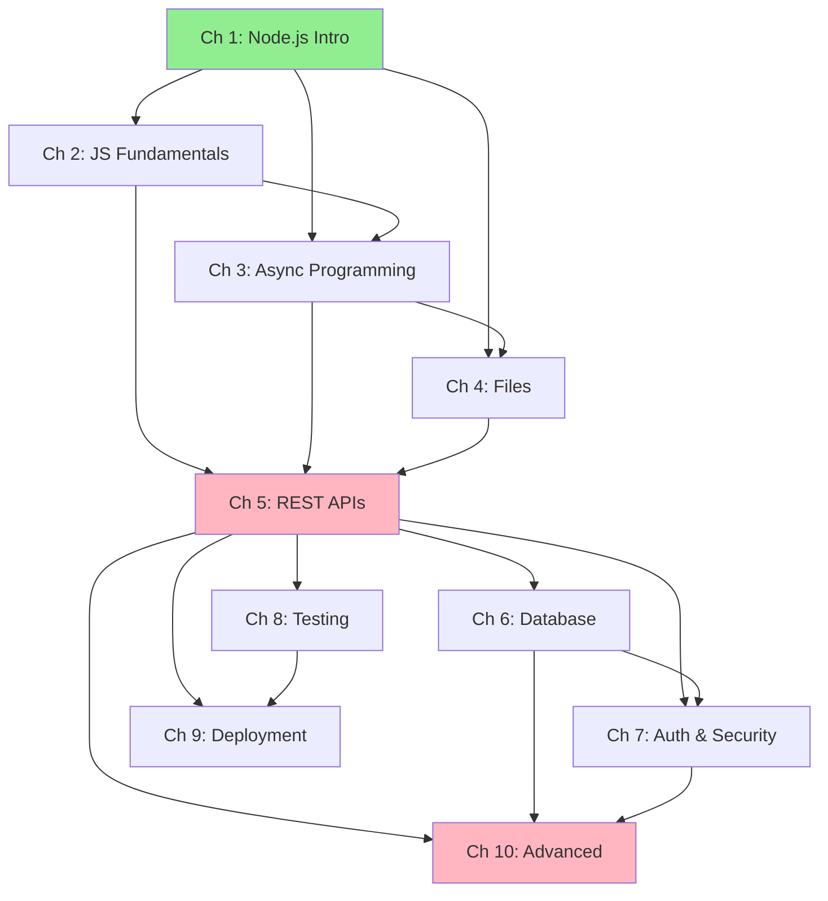
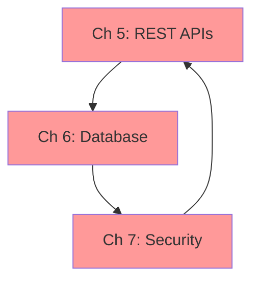
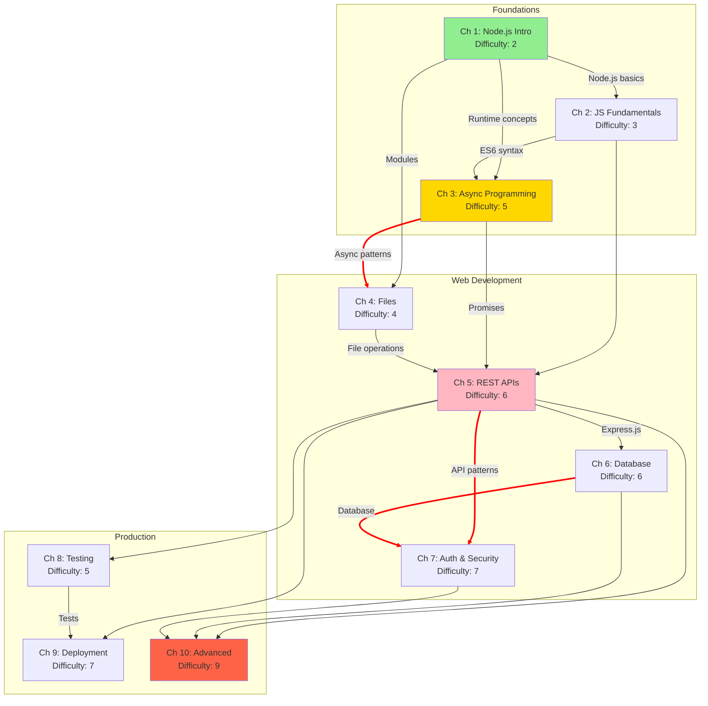
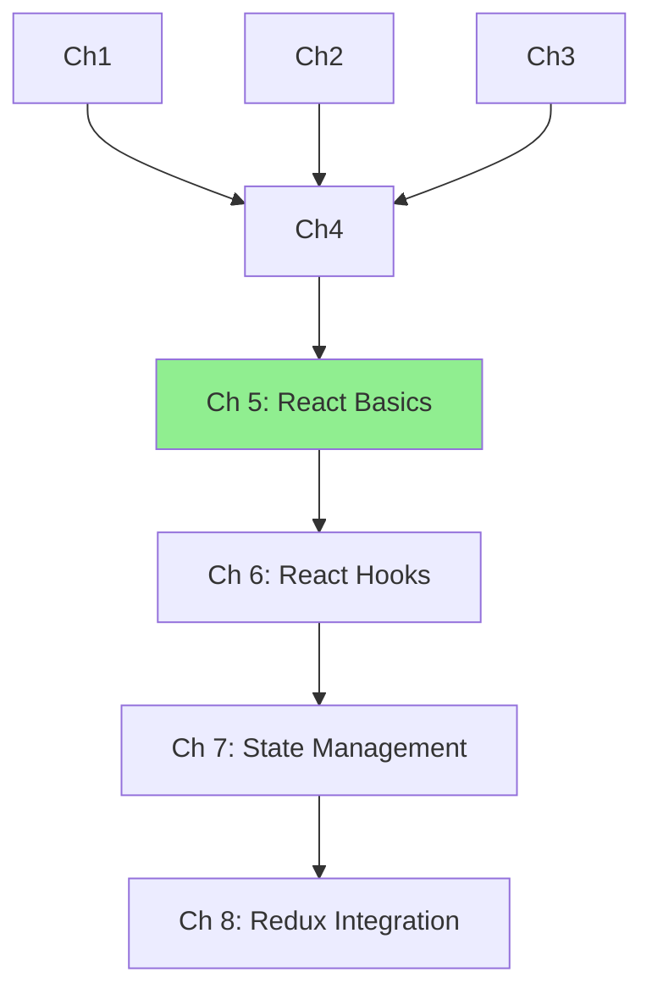
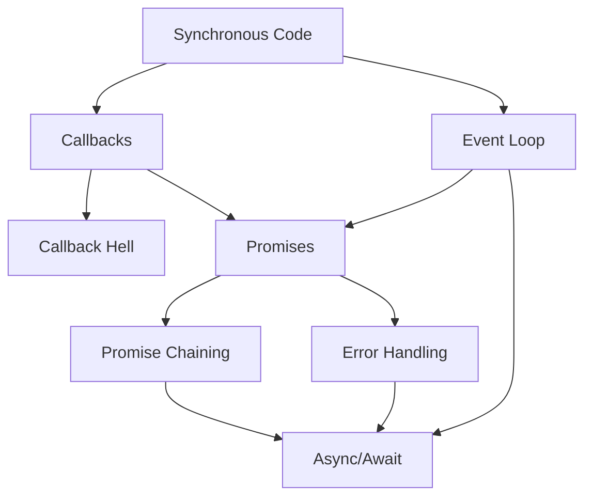

<!-- Powered by BMAD™ Core -->

# Map Prerequisites

---

task:
id: map-prerequisites
name: Map Prerequisites
description: Map concept dependencies and prerequisites across chapters to validate learning progression
persona_default: instructional-designer
inputs:

- outline-path (path to book outline or chapter list)
- granularity (chapter/section/concept)
  steps:
- Load book outline or content structure
- Extract concepts from each chapter/section
- Identify prerequisite relationships between concepts
- Build dependency graph
- Detect circular dependencies
- Identify orphaned concepts (no prerequisites defined)
- Validate topological ordering is possible
- Generate Mermaid flowchart of dependencies
- Highlight critical path through learning progression
- Document prerequisite gaps or issues
- Run execute-checklist.md with prerequisite-mapping-checklist.md
  output: Prerequisite dependency map (Mermaid diagram + analysis report)

---

## Purpose

This task helps you visualize and validate the prerequisite relationships across your book's content. A well-mapped prerequisite structure ensures readers always have necessary background before encountering new concepts, preventing frustration and learning gaps.

## Prerequisites

Before starting this task:

- Book outline or chapter list exists
- Concept list or learning objectives defined (if granularity=concept)
- Understanding of book's learning progression
- Familiarity with Mermaid diagram syntax (optional but helpful)

## Granularity Levels

Choose analysis granularity based on needs:

### Chapter-Level (Coarse)

**Use for:**

- High-level book structure validation
- Quick dependency overview
- Early planning stages

**Example:**



### Section-Level (Medium)

**Use for:**

- Detailed chapter organization
- Validating section ordering within chapters
- Moderate-detail analysis

**Example:**

```
Ch 3: Arrays
  3.1 Array Basics → 3.2 Array Methods → 3.3 Iteration → 3.4 Advanced Techniques
```

### Concept-Level (Fine)

**Use for:**

- Granular prerequisite analysis
- Identifying missing foundational concepts
- Expert instructional design review

**Example:**

```
Concepts:
- Variables (Ch1) → Functions (Ch2)
- Functions → Arrow Functions (Ch2)
- Functions → Callbacks (Ch3)
- Callbacks → Promises (Ch4)
- Promises → Async/Await (Ch4)
```

## Workflow Steps

### 1. Load Book Structure

Review outline to understand content:

**Example Book:** "Mastering Node.js"

```markdown
Chapter 1: Introduction to Node.js
Chapter 2: JavaScript Fundamentals
Chapter 3: Asynchronous Programming
Chapter 4: Working with Files
Chapter 5: Building REST APIs
Chapter 6: Database Integration
Chapter 7: Authentication & Security
Chapter 8: Testing
Chapter 9: Deployment
Chapter 10: Advanced Patterns
```

### 2. Extract Concepts per Chapter

List key concepts taught in each chapter/section:

**Example:**

| Chapter | Key Concepts                                             |
| ------- | -------------------------------------------------------- |
| Ch 1    | Node.js runtime, NPM, modules, REPL                      |
| Ch 2    | ES6 syntax, arrow functions, destructuring, async/await  |
| Ch 3    | Event loop, callbacks, promises, async patterns          |
| Ch 4    | fs module, streams, buffers, file operations             |
| Ch 5    | Express.js, routing, middleware, REST principles         |
| Ch 6    | Database drivers, ORMs, queries, migrations              |
| Ch 7    | JWT, OAuth, sessions, bcrypt, security best practices    |
| Ch 8    | Jest, mocking, test-driven development, coverage         |
| Ch 9    | Docker, CI/CD, cloud platforms, monitoring               |
| Ch 10   | Design patterns, microservices, performance optimization |

### 3. Identify Prerequisite Relationships

For each chapter, determine which prior chapters are required:

**Prerequisite Matrix:**

```markdown
Ch 1: (None) - Starting point
Ch 2: Requires Ch 1 (need Node.js basics)
Ch 3: Requires Ch 2 (need ES6 syntax, especially async/await)
Ch 4: Requires Ch 1, Ch 3 (need Node.js + async patterns)
Ch 5: Requires Ch 2, Ch 3, Ch 4 (need JS, async, files)
Ch 6: Requires Ch 5 (need Express basics for examples)
Ch 7: Requires Ch 5, Ch 6 (need API + database concepts)
Ch 8: Requires Ch 5 (need code to test)
Ch 9: Requires Ch 5, Ch 8 (need app + tests to deploy)
Ch 10: Requires Ch 5, Ch 6, Ch 7 (need full-stack foundation)
```

### 4. Build Dependency Graph

Create visual representation using Mermaid:

**Example: Chapter-Level Dependencies**



**Legend:**

- Green: Entry point (no prerequisites)
- Pink: High-dependency nodes (many prerequisites)
- Arrows: "requires" relationship

### 5. Detect Circular Dependencies

Check for circular prerequisite relationships:

**Circular Dependency Example (BAD):**



**Problem:** Ch 5 requires Ch 7, but Ch 7 requires Ch 6, which requires Ch 5. Impossible to order!

**Detection Algorithm:**

```markdown
1. Perform topological sort on dependency graph
2. If sort fails, circular dependency exists
3. Use cycle detection algorithm to find cycle
4. Report all nodes in cycle
```

**Resolution Strategies:**

```markdown
Option 1: Split Chapter

- Split Ch 7 into "Basic Security" (after Ch 5) and "Advanced Security" (after Ch 6)

Option 2: Remove Dependency

- Make Ch 7 fully independent, provide necessary context within chapter

Option 3: Reorder Content

- Move security concepts earlier in progression
```

### 6. Identify Orphaned Concepts

Find concepts with no clear prerequisites:

**Example:**

```markdown
Chapter 8: Testing
Concepts: Jest, Mocking, TDD, Coverage

⚠️ ORPHANED CONCEPT: "Mocking"

- No previous chapter explains what mocking is
- No previous chapter shows examples of mocks
- Readers encountering "mock" for first time in Ch 8

Resolution:

- Add "Mocking Basics" section to Ch 5 (REST APIs chapter)
- Or add prerequisite callout: "If unfamiliar with mocking, see Appendix B"
```

**Orphan Detection:**

```markdown
For each concept in chapter N:
Check if concept mentioned/taught in chapters 1 to N-1
If not found:
Mark as potential orphan
Verify if truly new concept or terminology gap
```

### 7. Validate Topological Ordering

Verify a valid reading order exists:

**Topological Sort Algorithm:**

```markdown
1. Find all chapters with no prerequisites (in-degree = 0)
2. Add to reading order
3. Remove from graph
4. Repeat until all chapters processed

If successful: Valid linear ordering exists
If graph still has nodes: Circular dependency exists
```

**Example Valid Ordering:**

```markdown
Valid Reading Orders:

1. Ch 1 → Ch 2 → Ch 3 → Ch 4 → Ch 5 → Ch 6 → Ch 7 → Ch 8 → Ch 9 → Ch 10 ✅
2. Ch 1 → Ch 2 → Ch 3 → Ch 4 → Ch 5 → Ch 8 → Ch 6 → Ch 7 → Ch 9 → Ch 10 ✅
   (Ch 8 can come before Ch 6 since both only depend on Ch 5)

Invalid Orders:

- Ch 5 → Ch 6 → Ch 7 → Ch 1 ❌ (Ch 5 requires Ch 1-4)
```

### 8. Generate Mermaid Diagram

Create comprehensive dependency visualization:

**Mermaid Features to Include:**

1. **Node Styling** - Color by difficulty or chapter type
2. **Edge Labels** - Show specific prerequisite concepts
3. **Subgraphs** - Group related chapters (e.g., "Foundations", "Web Dev", "Advanced")
4. **Critical Path Highlighting** - Show longest dependency chain

**Enhanced Example:**



**Legend:**

- Green: Entry point
- Yellow: Moderate difficulty with multiple dependencies
- Pink: High traffic node (many chapters depend on it)
- Red: Final/capstone chapter
- Bold red arrows: Critical path

### 9. Highlight Critical Path

Identify longest dependency chain (determines minimum read time):

**Critical Path Algorithm:**

```markdown
1. For each chapter, calculate "depth" (max distance from entry points)
2. Identify path(s) with maximum depth
3. This is the critical path - cannot be shortened
```

**Example:**

```markdown
Critical Path: Ch 1 → Ch 2 → Ch 3 → Ch 5 → Ch 6 → Ch 7 → Ch 10
Depth: 7 chapters

Analysis:

- Minimum sequential chapters to reach Ch 10: 7
- Ch 4, Ch 8, Ch 9 are "off critical path" - could be learned in parallel
- If Ch 10 is primary goal, focus optimization on critical path chapters

Implications:

- Can't further reduce prerequisites without removing content
- Could parallelize Ch 4 (Files) if not critical for target
```

### 10. Document Issues and Recommendations

Compile findings into report:

**Report Template:**

```markdown
# Prerequisite Mapping Analysis: [Book Title]

## Summary

- **Total Chapters:** [N]
- **Granularity Level:** [Chapter/Section/Concept]
- **Valid Topological Order:** [Yes/No]
- **Circular Dependencies:** [Count]
- **Orphaned Concepts:** [Count]
- **Critical Path Length:** [N chapters]

## Dependency Graph

[Mermaid diagram]

## Issues Detected

### Critical Issues (Must Fix)

#### Circular Dependency: [Description]

- **Nodes Involved:** [List]
- **Impact:** Impossible to determine valid reading order
- **Resolution:** [Specific recommendation]

#### Orphaned Concept: [Concept Name]

- **Location:** [Chapter/Section]
- **Issue:** No prerequisite coverage
- **Resolution:** [Specific recommendation]

### Warnings (Should Review)

[List of warnings with recommendations]

## Critical Path Analysis

**Longest Path:** [Ch X → Ch Y → ... → Ch Z]
**Length:** [N chapters]

**Implications:**

- [Analysis of what this means for learning progression]

**Optimization Opportunities:**

- [Recommendations for reducing critical path if needed]

## Valid Reading Orders

### Primary Recommended Order

[Ch 1 → Ch 2 → ...]

### Alternative Orders

[List any valid alternative orderings]

## Prerequisite Matrix

| Chapter | Direct Prerequisites | All Prerequisites (Transitive) |
| ------- | -------------------- | ------------------------------ |
| Ch 1    | None                 | None                           |
| Ch 2    | Ch 1                 | Ch 1                           |
| Ch 3    | Ch 1, Ch 2           | Ch 1, Ch 2                     |
| ...     | ...                  | ...                            |

## Recommendations

### High Priority

1. [Specific recommendation with rationale]

### Medium Priority

[List]

### Optional Enhancements

[List]
```

### 11. Run Quality Checklist

Execute prerequisite-mapping-checklist.md (if available):

- [ ] All chapters have prerequisites defined
- [ ] Dependency graph created
- [ ] No circular dependencies exist
- [ ] Orphaned concepts identified and addressed
- [ ] Valid topological order confirmed
- [ ] Critical path documented
- [ ] Mermaid diagram included
- [ ] Recommendations are actionable

## Success Criteria

Prerequisite mapping is complete when:

- [ ] Dependency graph visualized (Mermaid diagram)
- [ ] All prerequisite relationships documented
- [ ] Circular dependencies detected and resolved
- [ ] Orphaned concepts identified and addressed
- [ ] Valid reading order(s) confirmed
- [ ] Critical path highlighted and analyzed
- [ ] Issues documented with resolutions
- [ ] Report generated with recommendations

## Output Format

````markdown
# Prerequisite Map: [Book Title]

## Dependency Graph

```mermaid
[Full graph here]
```
````

## Analysis Summary

[Key findings]

## Issues & Resolutions

[Detailed issues with fixes]

## Valid Reading Orders

[List]

## Recommendations

[Actionable items]

```

## Common Pitfalls to Avoid

**❌ Missing implicit prerequisites:**
```

Ch 5: "Understanding of HTTP" assumed but never taught

```
Fix: Explicitly list all prerequisites, even "obvious" ones

**❌ Overly granular mapping:**
```

Mapping every single variable name as a concept

```
Fix: Choose appropriate granularity for goal

**❌ Ignoring optional vs required:**
```

All prerequisites marked as required

```
Fix: Distinguish "helpful to know" vs "must know"

**❌ Not validating with topological sort:**
```

Assuming order is valid without algorithmic check

```
Fix: Always validate ordering is mathematically possible

**❌ Circular dependencies accepted:**
```

"Readers can skip back and forth"

````
Fix: Break cycles - readers need clear progression

## Examples

### Example 1: Simple Linear Progression

**Book:** "Python Basics"

**Chapters:**
1. Variables & Types
2. Control Flow
3. Functions
4. Data Structures
5. Object-Oriented Programming

**Dependencies:**
```mermaid
graph LR
    Ch1 --> Ch2 --> Ch3 --> Ch4 --> Ch5
````

**Analysis:**

- ✅ Simple linear progression
- ✅ No circular dependencies
- ✅ Clear critical path
- No issues detected

### Example 2: Complex Web with Circular Dependency

**Book:** "Web Development"

**Chapters:**

1. HTML Basics
2. CSS Styling
3. JavaScript Fundamentals
4. DOM Manipulation
5. React Basics
6. State Management
7. React with Redux

**Initial Dependencies:**

```mermaid
graph TD
    Ch1 --> Ch4
    Ch2 --> Ch4
    Ch3 --> Ch4
    Ch4 --> Ch5
    Ch5 --> Ch6
    Ch6 --> Ch7
    Ch7 --> Ch5

    style Ch5 fill:#ff9999
    style Ch6 fill:#ff9999
    style Ch7 fill:#ff9999
```

**Issue:** Ch 5 → Ch 6 → Ch 7 → Ch 5 (circular!)

**Resolution:**



Fixed by:

- Renaming Ch 6 to "React Hooks" (extends React, doesn't require Redux)
- Renaming Ch 7 to "State Management" (general concepts)
- Adding Ch 8 "Redux Integration" (combines Ch 5-7)

### Example 3: Concept-Level Mapping

**Chapter:** "Async JavaScript"

**Concepts:**



**Analysis:**

- ✅ Clear progression from sync to async
- ✅ Callback Hell motivates Promises
- ✅ Promise foundation before async/await
- Critical path: A → B → E → F → H (5 concepts)

## Next Steps

After completing prerequisite mapping:

1. Resolve any circular dependencies
2. Address orphaned concepts
3. Share diagram with technical-editor
4. Use analyze-difficulty-curve.md to verify difficulty matches prerequisites
5. Update book outline based on findings
6. Re-map prerequisites after changes
7. Include diagram in book's introduction or learning path guide
