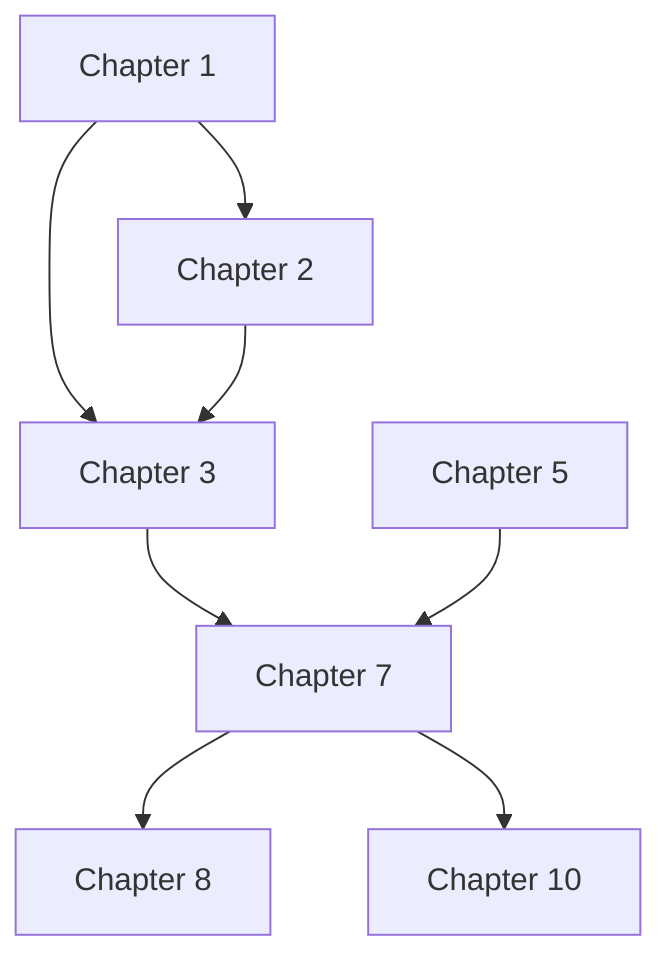

<!-- Powered by BMAD™ Core -->

# Shard Book Outline

---

task:
id: shard-book-outline
name: Shard Book Outline
description: Break massive book outline into per-chapter planning documents for parallel development
persona_default: instructional-designer
inputs: - book-outline-file - output-directory
steps: - Analyze book outline structure and chapter organization - Extract per-chapter outline sections with metadata - Create individual chapter outline files - Generate master book outline index - Preserve book-level information separately - Validate all chapters extracted correctly - Document chapter dependencies
output: Individual chapter outline files in outlines/ directory with master index

---

## Purpose

This task breaks massive book outlines (100+ pages, 20+ chapters) into individual per-chapter planning documents to:

- Work on one chapter outline at a time (context management)
- Enable parallel chapter development by multiple writers
- Simplify version control with granular chapter files
- Allow independent chapter planning and iteration
- Reduce cognitive overhead from massive monolithic outlines

## When to Use This Task

**Shard a book outline when:**

- Outline exceeds 20 chapters
- Outline file is 100+ pages
- Multiple writers developing different chapters
- Context window limits hit during outline work
- Need to focus on specific chapter planning without full book context

**Don't shard when:**

- Book has fewer than 15 chapters
- Outline is under 50 pages
- Single author working sequentially
- Tight integration between all chapters requires full context

## Prerequisites

Before sharding the outline:

- Complete book outline exists
- Outline follows structured format with clear chapter sections
- Each chapter has outline content (not just title)
- Book-level information (objectives, audience, etc.) documented
- Outline saved and backed up

## Workflow Steps

### 1. Analyze Book Outline

Understand the outline's structure:

**Identify organizational pattern:**

Pattern A - Flat chapter list:

```markdown
# Book Title

## Chapter 1: Introduction

[outline content...]

## Chapter 2: Getting Started

[outline content...]
```

Pattern B - Part-based organization:

```markdown
# Book Title

## Part 1: Foundations

### Chapter 1: Introduction

[outline content...]

### Chapter 2: Prerequisites

[outline content...]

## Part 2: Core Concepts

### Chapter 3: Fundamentals

[outline content...]
```

Pattern C - Hierarchical sections:

```markdown
# Book Title

## Front Matter

### Preface

### Introduction

## Main Content

### Chapter 1: First Topic

### Chapter 2: Second Topic

## Back Matter

### Appendix A

### Glossary
```

**Extract key information:**

- Total number of chapters
- Part/section organization (if any)
- Chapter numbering scheme
- Book-level content (intro, preface, etc.)
- Appendices and back matter

**Document findings:**

```
Outline Analysis:
- Total Chapters: 25
- Parts: 5 (5 chapters each)
- Pattern: Part-based with ### chapter headings
- Book-level content: Preface, Introduction, Conclusion
- Back matter: 3 appendices, Glossary, Index
- Outline pages: ~120
```

### 2. Extract Book-Level Information

Preserve content that applies to entire book:

**Book-level sections to extract:**

- Book title and subtitle
- Author(s) and target audience
- Overall learning objectives
- Book prerequisites
- Preface/Introduction (if not chapter-specific)
- Overall book structure/flow explanation
- Target page count
- Publication timeline

**Create `book-level-info.md`:**

```markdown
# Book-Level Information

**Book Title**: Mastering PostgreSQL for Modern Applications
**Subtitle**: A Comprehensive Guide to Advanced Database Programming
**Author**: Jane Developer
**Target Audience**: Intermediate to advanced developers

## Book Objectives

By the end of this book, readers will be able to:

1. Design and implement complex PostgreSQL database schemas
2. Write optimized queries for high-performance applications
3. Implement advanced features like full-text search, JSONB, and replication
4. Manage and scale PostgreSQL in production environments

## Prerequisites

Readers should have:

- Basic SQL knowledge (SELECT, INSERT, UPDATE, DELETE)
- Understanding of relational database concepts
- Familiarity with command-line tools
- Basic programming experience (any language)

## Book Structure

This book is organized into 5 parts with 25 chapters:

**Part 1: Foundations (Chapters 1-5)** - PostgreSQL basics and environment setup
**Part 2: Query Mastery (Chapters 6-10)** - Advanced SQL and query optimization
**Part 3: Advanced Features (Chapters 11-15)** - JSONB, full-text search, extensions
**Part 4: Administration (Chapters 16-20)** - Backup, replication, monitoring
**Part 5: Production (Chapters 21-25)** - Scaling, security, best practices

## Target Specifications

- Total Pages: ~500
- Average Chapter Length: 20 pages
- Code Examples: 200+ working examples
- Exercises: 100+ practice problems
- Diagrams: 50+ technical illustrations

## Publication Timeline

- Outline Complete: 2025-08
- Draft Complete: 2025-12
- Technical Review: 2026-01
- Publication: 2026-03
```

**Save location:** `manuscript/book-level-info.md`

### 3. Extract Per-Chapter Outlines

For each chapter in the book outline:

**Extraction process:**

1. **Identify chapter boundary:**
   - Start: Chapter heading (## Chapter N or ### Chapter N)
   - End: Next chapter heading or section boundary

2. **Extract complete chapter section:**
   - Chapter number and title
   - Chapter learning objectives
   - Chapter prerequisites
   - Main section breakdown
   - Estimated page count
   - Code examples planned
   - Exercises planned
   - All notes and metadata

3. **Preserve all content:**
   - Keep outline formatting exactly
   - Include all subsections
   - Preserve code snippets/examples
   - Keep diagrams and visual notes
   - Maintain cross-references

**Example extraction:**

From book outline:

```markdown
## Part 2: Query Mastery

### Chapter 7: Advanced PostgreSQL Queries

**Learning Objectives:**

- Master complex JOIN operations
- Write efficient subqueries and CTEs
- Use window functions effectively

**Prerequisites:**

- Chapter 3: Basic SQL
- Chapter 5: Database Design

**Sections:**

1. Introduction (2 pages)
2. Complex Joins (6 pages)
   - Inner, Outer, Cross Joins
   - Self Joins
   - Join Performance
3. Subqueries and CTEs (5 pages)
   ...
```

Becomes `chapter-7-outline.md`:

```markdown
# Chapter 7: Advanced PostgreSQL Queries

**Part**: Part 2 - Query Mastery
**Chapter Number**: 7
**Estimated Pages**: 20

## Learning Objectives

- Master complex JOIN operations
- Write efficient subqueries and CTEs
- Use window functions effectively

## Prerequisites

**Previous Chapters:**

- Chapter 3: Basic SQL
- Chapter 5: Database Design

**External Knowledge:**

- Understanding of set theory basics
- Familiarity with SQL query execution order

## Sections

### 1. Introduction (2 pages)

- Why advanced queries matter
- Real-world use cases
- Chapter roadmap

### 2. Complex Joins (6 pages)

#### Inner, Outer, Cross Joins

- INNER JOIN mechanics
- LEFT/RIGHT/FULL OUTER JOIN
- CROSS JOIN use cases

#### Self Joins

- Hierarchical data queries
- Recursive relationships

#### Join Performance

- Query planning
- Index usage
  ...
```

### 4. Create Individual Chapter Files

Generate separate outline file for each chapter:

**Filename convention:**

- Pattern: `chapter-{number}-outline.md`
- Examples: `chapter-1-outline.md`, `chapter-2-outline.md`
- Zero-pad if needed: `chapter-01-outline.md` (for sorting)

**File structure:**

```markdown
# Chapter {N}: {Title}

**Part**: {Part Name}
**Chapter Number**: {N}
**Estimated Pages**: {count}
**Difficulty**: {Beginner|Intermediate|Advanced}
**Reading Time**: {hours}

## Learning Objectives

[3-5 specific objectives]

## Prerequisites

**Previous Chapters:**

- [List]

**External Knowledge:**

- [List]

**Software/Tools:**

- [List with versions]

## Sections

[Detailed section breakdown from book outline]

## Code Examples

[List of planned code files and examples]

## Exercises

[Planned practice exercises]

## Notes

[Any additional planning notes for this chapter]
```

**Preserve all outline content:**

- Don't modify or summarize
- Keep all planning details
- Maintain formatting
- Include all metadata

### 5. Create Master Book Outline Index

Create navigation and reference document:

**Filename:** `book-outline-index.md`

**Content structure:**

```markdown
# Book Outline Index

**Book**: Mastering PostgreSQL for Modern Applications
**Total Chapters**: 25
**Parts**: 5
**Sharding Date**: 2025-10-26
**Outline Status**: Sharded for parallel development

## Purpose

This book outline has been sharded into individual chapter outline files to enable:

- Parallel chapter development by multiple writers
- Focused planning without full 120-page context
- Granular version control per chapter
- Independent chapter iteration

## How to Use

1. Review `book-level-info.md` for overall book context
2. Work on individual chapter outline files as needed
3. Refer to this index for chapter dependencies
4. Update chapter outlines independently
5. Reassemble if full book outline needed

## Book Structure

### Part 1: Foundations (Chapters 1-5)

**Chapter 1: Introduction to PostgreSQL** (`chapter-1-outline.md`)

- Pages: 18
- Difficulty: Beginner
- Focus: Installation, basic concepts, first queries
- Dependencies: None

**Chapter 2: Database Design Fundamentals** (`chapter-2-outline.md`)

- Pages: 22
- Difficulty: Beginner
- Focus: Tables, schemas, normalization
- Dependencies: Chapter 1

**Chapter 3: Basic SQL Operations** (`chapter-3-outline.md`)

- Pages: 20
- Difficulty: Beginner
- Focus: CRUD operations, filtering, sorting
- Dependencies: Chapters 1, 2

**Chapter 4: Data Types and Constraints** (`chapter-4-outline.md`)

- Pages: 18
- Difficulty: Intermediate
- Focus: PostgreSQL data types, constraints, validation
- Dependencies: Chapters 2, 3

**Chapter 5: Indexes and Performance Basics** (`chapter-5-outline.md`)

- Pages: 24
- Difficulty: Intermediate
- Focus: Index types, query planning, basic optimization
- Dependencies: Chapter 3

### Part 2: Query Mastery (Chapters 6-10)

**Chapter 6: Aggregation and Grouping** (`chapter-6-outline.md`)

- Pages: 19
- Difficulty: Intermediate
- Focus: GROUP BY, aggregate functions, HAVING
- Dependencies: Chapter 3

**Chapter 7: Advanced Queries** (`chapter-7-outline.md`)

- Pages: 20
- Difficulty: Intermediate
- Focus: Joins, subqueries, CTEs, window functions
- Dependencies: Chapters 3, 5

**Chapter 8: Query Optimization** (`chapter-8-outline.md`)

- Pages: 26
- Difficulty: Advanced
- Focus: EXPLAIN, optimization techniques, performance tuning
- Dependencies: Chapters 5, 7

**Chapter 9: Transactions and Concurrency** (`chapter-9-outline.md`)

- Pages: 22
- Difficulty: Advanced
- Focus: ACID, isolation levels, locks, MVCC
- Dependencies: Chapter 3

**Chapter 10: Stored Procedures and Functions** (`chapter-10-outline.md`)

- Pages: 21
- Difficulty: Advanced
- Focus: PL/pgSQL, custom functions, triggers
- Dependencies: Chapter 7

### Part 3: Advanced Features (Chapters 11-15)

[Continue for all parts and chapters...]

### Part 4: Administration (Chapters 16-20)

[Continue...]

### Part 5: Production (Chapters 21-25)

[Continue...]

## Chapter Dependencies

### Critical Path

Chapters that many others depend on:

- Chapter 1: Required by all
- Chapter 3: Required by 15 chapters
- Chapter 5: Required by 8 chapters
- Chapter 7: Required by 6 chapters

### Independent Chapters

Can be developed in parallel:

- Chapters 11, 12, 13 (Advanced features, mostly independent)
- Chapters 16, 17, 18 (Administration topics)
- Appendices A, B, C

### Sequential Dependencies

Must be developed in order:

- Chapters 1 → 2 → 3 (foundation sequence)
- Chapters 8 → 22 (optimization builds on tuning)

## Development Strategy

**Phase 1: Foundations (Months 1-2)**

- Develop Chapters 1-5 sequentially
- Foundational content needed for later chapters

**Phase 2: Parallel Development (Months 3-5)**

- Team A: Chapters 6-10 (Query Mastery)
- Team B: Chapters 11-15 (Advanced Features)
- Team C: Chapters 16-20 (Administration)

**Phase 3: Production & Polish (Months 6-7)**

- Chapters 21-25 (Production)
- Appendices
- Integration and cross-reference validation

## File Locations

**Chapter Outlines**: `manuscript/outlines/chapter-{N}-outline.md`
**Book-Level Info**: `manuscript/book-level-info.md`
**This Index**: `manuscript/book-outline-index.md`

## Status Tracking

| Chapter | Outline Status | Draft Status | Review Status |
| ------- | -------------- | ------------ | ------------- |
| 1       | Complete       | Not Started  | -             |
| 2       | Complete       | Not Started  | -             |
| ...     | ...            | ...          | ...           |

## Reassembly

To reassemble full book outline:

1. Concatenate all chapter outlines in order
2. Add book-level information at beginning
3. Organize by parts
4. Add table of contents

Or keep sharded for ongoing development (recommended).
```

### 6. Validate Sharding

Ensure all content preserved:

**Completeness check:**

- [ ] All chapters extracted (count matches original)
- [ ] All parts/sections accounted for
- [ ] Book-level info captured
- [ ] Appendices and back matter included
- [ ] No content lost during extraction

**File check:**

- [ ] All chapter outline files created
- [ ] Consistent naming convention used
- [ ] Files in correct directory
- [ ] book-outline-index.md complete
- [ ] book-level-info.md created

**Content validation:**

For each chapter outline file:

- [ ] Chapter number and title present
- [ ] Learning objectives included
- [ ] Prerequisites documented
- [ ] Section breakdown complete
- [ ] All notes and metadata preserved

**Cross-reference check:**

- [ ] Chapter dependencies documented in index
- [ ] Part organization preserved
- [ ] Sequential relationships noted
- [ ] Critical path identified

### 7. Document Chapter Dependencies

Map relationships between chapters:

**Dependency types:**

**Prerequisites (hard dependencies):**

```
Chapter 7 requires:
- Chapter 3: Basic SQL (for query foundation)
- Chapter 5: Indexes (for performance context)
```

**References (soft dependencies):**

```
Chapter 12 references:
- Chapter 8: Optimization concepts (helpful but not required)
```

**Build-upon relationships:**

```
Chapter 22 builds on:
- Chapter 8: Basic optimization
- Chapter 16: Administration fundamentals
```

**Add to index file:**

```markdown
## Chapter Dependencies

### Chapter 7: Advanced Queries

**Prerequisites:**

- Chapter 3: Basic SQL Operations
- Chapter 5: Indexes and Performance Basics

**Referenced By:**

- Chapter 8: Query Optimization
- Chapter 10: Stored Procedures
- Chapter 22: Production Optimization

**Builds Upon:**

- Chapter 3 query fundamentals
- Chapter 5 performance concepts
```

**Dependency graph (optional):**



## Output

The sharded book outline produces:

**Individual chapter outline files:**

- Format: Markdown (.md)
- Location: `manuscript/outlines/`
- Naming: `chapter-{N}-outline.md`
- Count: One per chapter (e.g., 25 files)
- Content: Complete chapter outline with metadata

**Master index file:**

- Filename: `book-outline-index.md`
- Location: `manuscript/`
- Content: Full book structure, dependencies, navigation

**Book-level information:**

- Filename: `book-level-info.md`
- Location: `manuscript/`
- Content: Book objectives, audience, structure, timeline

## Quality Standards

Well-sharded book outline has:

✓ Individual file per chapter
✓ Comprehensive master index
✓ Book-level info preserved separately
✓ All outline content extracted
✓ Chapter dependencies documented
✓ Consistent naming convention
✓ Complete metadata in each file
✓ No content lost from original outline

## Benefits of Sharded Outlines

**Context Management:**

- Work on 2-page chapter outline vs. 120-page book outline
- Reduce cognitive load
- Focus on single chapter planning

**Parallel Development:**

- Multiple writers plan different chapters simultaneously
- No merge conflicts from monolithic file
- Independent iteration per chapter

**Version Control:**

- Granular commits per chapter
- See chapter-specific changes clearly
- Easy to revert individual chapter changes

**Organization:**

- Clear chapter structure
- Easy navigation
- Simple to find specific chapter

**Flexibility:**

- Update chapter outline without loading full book context
- Rearrange chapter order by renaming files
- Add/remove chapters easily

## Common Pitfalls

Avoid these mistakes:

❌ **Losing book-level content** - Extract to book-level-info.md first
❌ **Incomplete extraction** - Verify all chapter content included
❌ **Missing dependencies** - Document chapter relationships
❌ **Inconsistent naming** - Use standard chapter-N-outline.md format
❌ **No index file** - Index essential for navigation
❌ **Modifying content** - Extract exactly, don't edit during sharding
❌ **Forgetting appendices** - Extract back matter chapters too

## Best Practices

**Planning:**

- Review entire book outline before sharding
- Identify parts and organizational structure
- Map chapter dependencies before extracting

**Execution:**

- Extract book-level info first
- Process chapters in order
- Use consistent file naming
- Preserve all metadata and notes

**Validation:**

- Check chapter count matches original
- Verify all content extracted
- Review index for completeness
- Test dependencies documented correctly

**Organization:**

- Create dedicated outlines/ directory
- Keep original outline as backup
- Store index and book-level info at root level

## Next Steps

After sharding the book outline:

1. Review master index for accuracy
2. Assign chapters to writers for development
3. Work on individual chapter outlines independently
4. Use create-chapter-outline.md to expand chapters
5. Begin chapter drafting using write-chapter-draft.md
6. Update chapter outline files as chapters evolve
7. Track progress in index status table

## Related Resources

- Task: design-book-outline.md - Creating initial book outline
- Task: create-chapter-outline.md - Developing individual chapter outlines
- Task: write-chapter-draft.md - Writing chapter from outline
- Task: manage-large-document.md - Strategies for large book projects
- Core: shard-doc.md - General document sharding
