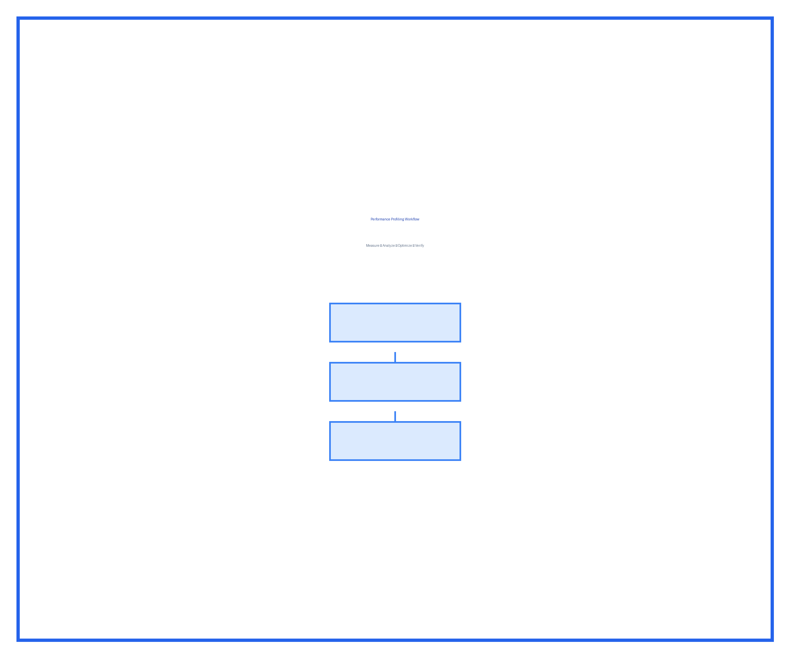

# Chapter 3: Advanced React Patterns

In this chapter, we'll explore advanced React patterns combining hooks, state management, and performance optimization techniques. You'll learn how to build scalable applications using modern React best practices.

In this chapter, you will learn about:

- Understanding React rendering behavior and optimization strategies
- Implementing advanced hook patterns for complex state management
- Choosing the right state management solution for your application
- Performance profiling and optimization techniques
- Building reusable custom hooks

## Introduction

Modern React applications require careful consideration of performance, state management, and code organization. This chapter provides comprehensive guidance on advanced patterns that will help you build production-ready applications.

## React Rendering Optimization

Understanding how React renders components is crucial for building performant applications. The following diagram illustrates the component rendering lifecycle:


Figure 3.1: React component rendering lifecycle and optimization points

### Rendering Behavior Comparison

Different React features have varying impacts on rendering performance. The following table compares common optimization techniques:

Table 3.1: React rendering optimization techniques comparison

| Technique         | Use Case                   | Performance Impact               | Complexity |
| ----------------- | -------------------------- | -------------------------------- | ---------- |
| React.memo        | Pure functional components | High (prevents re-renders)       | Low        |
| useMemo           | Expensive calculations     | Medium (caches values)           | Medium     |
| useCallback       | Callback prop optimization | Medium (prevents recreation)     | Medium     |
| Code splitting    | Large applications         | High (reduces bundle size)       | High       |
| Virtual scrolling | Long lists                 | Very High (only renders visible) | High       |

## Custom Hooks Architecture

Custom hooks allow you to encapsulate and reuse stateful logic across components. The architecture diagram below shows the relationship between components and custom hooks:


Figure 3.2: Custom hooks architecture pattern

### Hook Pattern Comparison

Table 3.2: Custom hook pattern comparison

| Pattern            | Best For                  | Reusability | Testing  |
| ------------------ | ------------------------- | ----------- | -------- |
| useState wrapper   | Simple state logic        | High        | Easy     |
| useReducer wrapper | Complex state transitions | High        | Easy     |
| useEffect wrapper  | Side effects              | Medium      | Moderate |
| Compound hooks     | Multiple concerns         | Medium      | Complex  |

## State Management Solutions

Choosing the right state management solution depends on your application's complexity and requirements:

Table 3.3: State management solution comparison

| Solution      | Learning Curve | Bundle Size | DevTools       | Best For                  |
| ------------- | -------------- | ----------- | -------------- | ------------------------- |
| useState      | Easy           | 0 KB        | React DevTools | Local state               |
| useReducer    | Easy           | 0 KB        | React DevTools | Complex local state       |
| Context API   | Easy           | 0 KB        | React DevTools | Prop drilling avoidance   |
| Redux Toolkit | Moderate       | 12 KB       | Redux DevTools | Global state, time-travel |
| Zustand       | Easy           | 3 KB        | Redux DevTools | Simple global state       |
| Jotai         | Easy           | 5 KB        | Basic          | Atomic state              |
| Recoil        | Moderate       | 21 KB       | Excellent      | Derived state graphs      |

### State Management Decision Tree

The following flowchart helps you choose the appropriate state management solution:


Figure 3.3: State management selection decision tree

## Performance Profiling

Understanding your application's performance characteristics is essential for optimization. The following table outlines key performance metrics:

Table 3.4: React performance metrics and thresholds

| Metric                    | Good     | Acceptable | Poor     | Tool                    |
| ------------------------- | -------- | ---------- | -------- | ----------------------- |
| Initial Load (FCP)        | < 1s     | 1-2s       | > 2s     | Lighthouse              |
| Time to Interactive (TTI) | < 2s     | 2-4s       | > 4s     | Lighthouse              |
| Component Render Time     | < 16ms   | 16-50ms    | > 50ms   | React DevTools Profiler |
| Bundle Size (gzipped)     | < 100 KB | 100-200 KB | > 200 KB | webpack-bundle-analyzer |
| Re-render Count           | < 3      | 3-5        | > 5      | React DevTools Profiler |

### Profiling Workflow

The diagram below illustrates the recommended workflow for performance profiling:



Figure 3.4: React performance profiling workflow

## Code Examples

### Example 1: Optimized Component with Memoization

```javascript
import React, { memo, useMemo, useCallback } from 'react';

const ExpensiveList = memo(({ items, onItemClick }) => {
  const sortedItems = useMemo(() => {
    return items.sort((a, b) => a.value - b.value);
  }, [items]);

  const handleClick = useCallback(
    (id) => {
      onItemClick(id);
    },
    [onItemClick],
  );

  return (
    <ul>
      {sortedItems.map((item) => (
        <li key={item.id} onClick={() => handleClick(item.id)}>
          {item.name}
        </li>
      ))}
    </ul>
  );
});
```

### Example 2: Custom Hook for Data Fetching

```javascript
import { useState, useEffect } from 'react';

function useDataFetch(url) {
  const [data, setData] = useState(null);
  const [loading, setLoading] = useState(true);
  const [error, setError] = useState(null);

  useEffect(() => {
    fetch(url)
      .then((res) => res.json())
      .then((json) => {
        setData(json);
        setLoading(false);
      })
      .catch((err) => {
        setError(err);
        setLoading(false);
      });
  }, [url]);

  return { data, loading, error };
}
```

## Implementation Checklist

Before implementing advanced React patterns, ensure you have the following prerequisites:

- Node.js 18+ installed
- React 18+ in your project
- Understanding of basic React hooks
- Familiarity with JavaScript ES6+ syntax
- Development environment with React DevTools

### Step-by-Step Implementation Guide

Follow these steps to implement performance optimization in your React application:

1. **Profile your application** using React DevTools Profiler
2. **Identify performance bottlenecks** by analyzing render times
3. **Apply appropriate optimization techniques** based on the bottleneck type
4. **Measure the impact** of your optimizations
5. **Iterate** if performance goals are not met

### Common Optimization Mistakes to Avoid

Be aware of these common pitfalls when optimizing React applications:

- Over-optimizing components that render infrequently
- Using useMemo/useCallback without measuring benefit
- Creating too many custom hooks leading to abstraction complexity
- Ignoring bundle size while focusing only on render performance
- Applying optimizations before profiling

## Best Practices Summary

The following table summarizes the key best practices covered in this chapter:

Table 3.5: React best practices summary

| Category    | Best Practice                           | Why It Matters                            |
| ----------- | --------------------------------------- | ----------------------------------------- |
| Rendering   | Use React.memo for expensive components | Prevents unnecessary re-renders           |
| State       | Keep state as local as possible         | Reduces complexity and re-renders         |
| Effects     | Clean up side effects properly          | Prevents memory leaks                     |
| Hooks       | Extract reusable logic to custom hooks  | Improves code reusability                 |
| Performance | Profile before optimizing               | Ensures optimization efforts are targeted |
| Bundle Size | Use code splitting for large apps       | Improves initial load time                |

## Summary

This chapter covered advanced React patterns for building performant, scalable applications:

- React rendering optimization techniques and when to use them
- Custom hooks architecture and patterns for code reusability
- Comprehensive comparison of state management solutions
- Performance profiling workflow and key metrics
- Best practices for production React applications

In the next chapter, we'll explore testing strategies for React applications, including unit tests, integration tests, and end-to-end testing.

## Questions and Answers

1. **When should I use React.memo versus useMemo?**
   - React.memo prevents component re-renders, while useMemo caches computed values within a component.

2. **How do I choose between Context API and Redux?**
   - Use Context API for simple prop drilling avoidance; use Redux for complex global state with time-travel debugging needs.

3. **What is the 16ms render time threshold?**
   - 16ms allows 60 frames per second (1000ms / 60fps = 16.67ms), ensuring smooth user experience.

4. **Should I always optimize my components?**
   - No, profile first. Premature optimization adds complexity without measurable benefit.

5. **How many custom hooks is too many?**
   - Focus on reusability and single responsibility; there's no hard limit, but excessive hooks may indicate over-abstraction.
