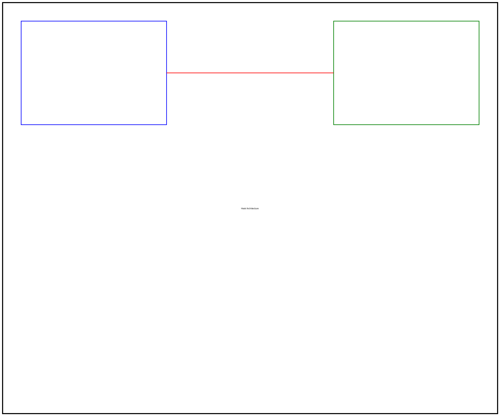

# Chapter 1: Getting Started with React Hooks

React Hooks revolutionized how we write React components by allowing us to use state and lifecycle features in functional components. In this chapter, we'll explore the fundamentals of React Hooks and build practical examples.

In this chapter, you will learn about:

- Understanding React Hooks and their benefits
- Using useState for component state management
- Implementing side effects with useEffect
- Creating custom hooks for reusable logic
- Following best practices and hook rules

## Introduction

React Hooks are functions that let you "hook into" React state and lifecycle features from functional components. Before hooks, these features were only available in class components, requiring you to convert functional components to classes when state or lifecycle methods were needed.

**Learning Objectives:**

By the end of this chapter, you will be able to:

- Understand the purpose and benefits of React Hooks
- Implement useState and useEffect hooks in functional components
- Create custom hooks for reusable logic
- Follow best practices for hook usage

## What Are React Hooks?

React Hooks are functions that let you "hook into" React state and lifecycle features from functional components. Before hooks, these features were only available in class components.

The useState hook is the most fundamental hook. Here's a simple counter example:

```javascript
import React, { useState } from 'react';

function Counter() {
  const [count, setCount] = useState(0);

  return (
    <div>
      <p>You clicked {count} times</p>
      <button onClick={() => setCount(count + 1)}>Click me</button>
    </div>
  );
}
```

### Hook Architecture

The following diagram illustrates how hooks connect functional components to React's internal state management:



As shown in the diagram, hooks act as a bridge between your functional component code and React's internal state and lifecycle systems.

## The useEffect Hook

The useEffect hook lets you perform side effects in functional components. It serves the same purpose as componentDidMount, componentDidUpdate, and componentWillUnmount in class components.

Here's an example that updates the document title:

```javascript
import React, { useState, useEffect } from 'react';

function TitleUpdater() {
  const [count, setCount] = useState(0);

  useEffect(() => {
    document.title = `You clicked ${count} times`;
  });

  return (
    <div>
      <p>Check your browser tab title!</p>
      <button onClick={() => setCount(count + 1)}>Click me</button>
    </div>
  );
}
```

### Effect Dependencies

The useEffect hook accepts a dependency array as its second argument. This controls when the effect runs:


The diagram above shows how different dependency configurations affect when effects execute.

## Creating Custom Hooks

Custom hooks let you extract component logic into reusable functions. A custom hook is a JavaScript function whose name starts with "use" and may call other hooks.

Here's a custom hook for managing form input:

```javascript
import { useState } from 'react';

function useFormInput(initialValue) {
  const [value, setValue] = useState(initialValue);

  const handleChange = (e) => {
    setValue(e.target.value);
  };

  return {
    value,
    onChange: handleChange,
  };
}
```

You can use this custom hook in multiple components:

```javascript
function SignupForm() {
  const email = useFormInput('');
  const password = useFormInput('');

  const handleSubmit = (e) => {
    e.preventDefault();
    console.log('Email:', email.value);
    console.log('Password:', password.value);
  };

  return (
    <form onSubmit={handleSubmit}>
      <input type="email" {...email} />
      <input type="password" {...password} />
      <button type="submit">Sign Up</button>
    </form>
  );
}
```

## Best Practices

When working with React Hooks, follow these essential guidelines:

- **Only call hooks at the top level** - Don't call hooks inside loops, conditions, or nested functions
- **Only call hooks from React functions** - Call hooks from functional components or custom hooks
- **Use the ESLint plugin** - Install eslint-plugin-react-hooks to enforce rules
- **Name custom hooks with "use" prefix** - This helps identify hooks and enables linting

The following diagram shows the recommended project structure for hook-based applications:


## Summary

In this chapter, we covered the fundamentals of React Hooks:

- React Hooks enable state and lifecycle features in functional components
- useState manages component state
- useEffect handles side effects and lifecycle events
- Custom hooks extract reusable component logic
- Following hook rules ensures predictable behavior

In the next chapter, we'll dive deeper into advanced hook patterns and explore hooks like useContext, useReducer, and useMemo.

## Exercises

Try these exercises to reinforce your learning:

1. **Counter with Reset**: Modify the counter example to include a reset button
2. **Dark Mode Toggle**: Create a custom hook for managing dark mode state
3. **Data Fetching**: Build a custom hook that fetches data from an API using useEffect
4. **Form Validation**: Extend the useFormInput hook to include validation logic
5. **Local Storage**: Create a hook that syncs state with localStorage

## Further Reading

- React Hooks Documentation: https://react.dev/reference/react
- Rules of Hooks: https://react.dev/warnings/invalid-hook-call-warning
- Building Your Own Hooks: https://react.dev/learn/reusing-logic-with-custom-hooks
